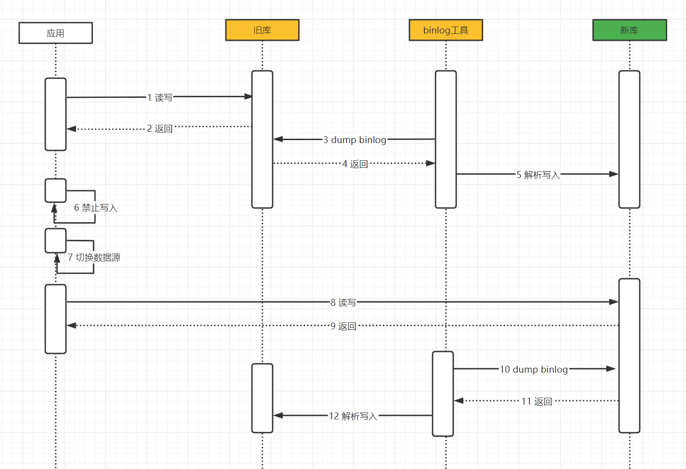

# 数据迁移方案思考
## 一、迁移需求
### 1.不停服务
### 2.数据的一致性
### 3.回滚通道与灵活性
- 新旧库都要有一份完整数据，一般只有建立双向或反向同步后新旧库才能拥有完整数据，才具备随时回滚的条件
- 如果数据不一致的量级小、能够接收一段时间不一致，则通过人工/程序兜底处理
### 4.数据灰度
按单表数据分批次，如用户等，降低出问题的影响范围（暂不考虑）
- 采取用户维度来划分，依据可能是名单、规则
- 一份表的数据由不同源写入，灰度运行有问题，需要进行回滚，也就是意味着旧库必须具备一份完整数据，关联第3点的双向同步。需要维护灰度策略规则及数据能否灵活划分，复杂度、可行性？
### 5.批次策略
按表维度分批次，如事务相关一组表，降低出问题的影响范围

## 二、迁移方案 - 秒级停写
### 1.整体流程
无需要修改业务代码程序、缺点就是停写窗口
- 开启存量数据和增量数据同步至新库（一般采取数据迁移工具：canal、云厂商DTS）
- 判断同步差距几乎为0时，秒级切换（旧库停写开启、结束同步、切换新数据源）
- 增量反向同步至旧库

### 2.问题与说明

**2.1  不完全满足不停服务要求，秒级停写切换的时间最长多长？ 能几乎接近主备切换的时间？**

时间消耗主要是在结束同步环节，上面流程也提到了判断同步差距几乎为0时才切换，并低峰时期切换能够极大降低出错影响范围

切换停写、结束同步、切换数据源源能否做到一键操作？极可能缩短操作时间，做到接近主备切换时间

**2.2  如何控制停写**

手段：业务层处理拦截写接口、应用数据源组件拦截CUD、数据库层面控制
拦截后异常处理：需要控制单库事务一致性、对重要业务进行异常重试机制或人工补偿、异构系统交互（如消费MQ写数据库等）

**2.3  切换数据源方式**

考虑尽可能缩短停写时间窗口，采取动态切换，即数据源组件支持在线切换数据源功能；

**2.4  数据一致性**

由于牺牲了停写窗口，所以这部分的压力主要在迁移数据的校验程序上；
如果迁移工具由我们自己搭建则需要建立数据校验程序，如果采取云厂商DTS，这部分则有DTS一并处理掉，我们可以进行简单数据检验，比如数量等。

**2.5  反向同步至旧库的时机与约束**

由于中间有停写步骤，意味着瞬间只会有一个地方写入，则一开始就可以建立双向同步通道，待切换数据源则自动进行反向同步，数据回流旧库（关联2.6）
 
 
**双向同步问题**

循环复制问题：MySQL 在 binlog 中记录了当前 MySQL 的 server-id（开启GTID）

主键冲突：自增ID采取单双号 或者 全局UUID

双写带来的数据一致性冲突： 不允许两个master写一条数据， 当无法区分时则指定一个master来写？

数据唯一性：数据需要唯一的，建立唯一主键

**2.6  回滚策略与灵活性**

切换前：随时暂停回滚

切换后：关联2.5，由于建立反向同步机制，所以一旦出问题则按反流程秒级切换即可

**2.7  迁移工具**

关联2.4，建议考虑云厂商DTS

腾讯云MySQL/MariaDB/Percona 同步至 MySQL

https://cloud.tencent.com/document/product/571/56516

腾讯云 MySQL/MariaDB/Percona 到 TDSQL MySQL 的数据同步

https://cloud.tencent.com/document/product/571/71739

构建双向同步数据结构

https://cloud.tencent.com/document/product/571/60956

## 三、迁移方案 - 不停机切换（补偿工具）
### 1.整体流程
- 开启增量和存量数据同步
- 数据校验、数据修复程序使新旧库数据几乎一致（存量数据和新库写失败数据，均以旧库为准）
- 切换数据源（备份旧库、旧库binlog、新库备份、新库binlog）
- 建立反向同步

### 2.问题与说明
**2.1  切换数据源组件及数据源配置**

如果采取灰度放量策略，数据源组件结合灰度规则进行数据源路由。

**2.2  切换数据源后的数据不一致**

由于极限情况下会出现新旧库数据不一致，此方案仅适合能够忍受数据不一致的，后台进行程序补偿。

现场保留：旧库备份、旧库binlog、新库备份、新库binlog

数据修复工具：解析binlog、分析补偿

如何确保差异尽可能少？

**2.3  回滚策略与灵活性**

切换前：随时暂停回滚

切换后：关联2.4，由于建立反向同步机制，所以一旦出问题则按反流程秒级切换即可

**2.4  建立反向同步时机及约束**

一开始就可以建立双向同步通道，待切换数据源则自动进行反向同步，数据回流旧库（关联2.3）

可能出现同步冲突：以新库为准并记录异常日志。
 
 
**双向同步问题**

循环复制问题：MySQL 在 binlog 中记录了当前 MySQL 的 server-id（开启GTID）

主键冲突：自增ID采取单双号 或者 全局UUID

双写带来的数据一致性冲突： 不允许两个master写一条数据， 当无法区分时则指定一个master来写？

数据唯一性：数据需要唯一的，建立唯一主键

## 四、迁移方案 - 业务双写
- 如何抉择数据一致性
- 对业务入侵性巨大，业务改造工作量巨大
- 对业务的稳定性、性能有着极大挑战

## 五、模拟演练

稳定性保障，迁库是大事，改造过程中，稳定性重中之重

### 1.测试阶段演练
- 系统压测：主要针对新库进行性能测，防止新库有意外情况。

- 故障演练：通过注入一些人为故障，如写新库失败，新库逻辑有问题，及时的演练回滚策略。

- 线上流量回放：通过引入线上数据在测试环境回放，可以尽可能的发现问题，保证改造后的稳定性。

## 六、其他事项
### 1.低峰时期操作
### 2.迁移源库的内存等资源使用率（数据库配置）
### 3.腾讯云DTS
双向同步最多仅支持在一个方向进行 DDL，同步链路不能形成环路（正向同步、反向同步只能选择一个进行 DDL）。

