# 注册中心迁移实践

## 一、方案选型

### 1、客户端方向 - 双注册双订阅

**1.1 开发工作量较大**

Nacos、Eureka SDK双注册双订阅的功能研发，一般由SDK 或者 Javaagent 统一提供双注册双订阅能力，但针对一次性的迁移需求来讲，工作量较大

**1.2 流程繁琐**

*   样机冗余部署，否则出现单点问题
    
*   先下旧版消费者，再旧版提供者
    
*   discovery client生效问题，顺序决定

### 2、服务端方向 - 迁移工具NacoSync

**2.1 介绍**

*   高性能：使用了高效的事件异步驱动模型, 支持多种自定义事件,使得同步任务处理的延时控制在3s，8C16G的单机能够支持6K的同步任务；
    
*   高可用：NacosSync除了单机部署，也提供了高可用的集群部署模式，NacosSync是无状态设计，将任务等状态数据迁移到了数据库，使得集群扩展非常方便；（分析每个实例都有全量任务同步）
    
*   可扩展：抽象出了Sync组件核心接口,通过注解对同步类型进行区分,使得开发者可以很容易的根据自己需求,去扩展不同注册中心,目前已支持的同步类型：Nacos、Eureka、Zookeeper、Consul
    
*   可视化操作：提供了精简Web操作控制台

**2.2 使用场景**

*   多个网络互通的Region之间服务共享，打破Region之间的服务调用限制
    

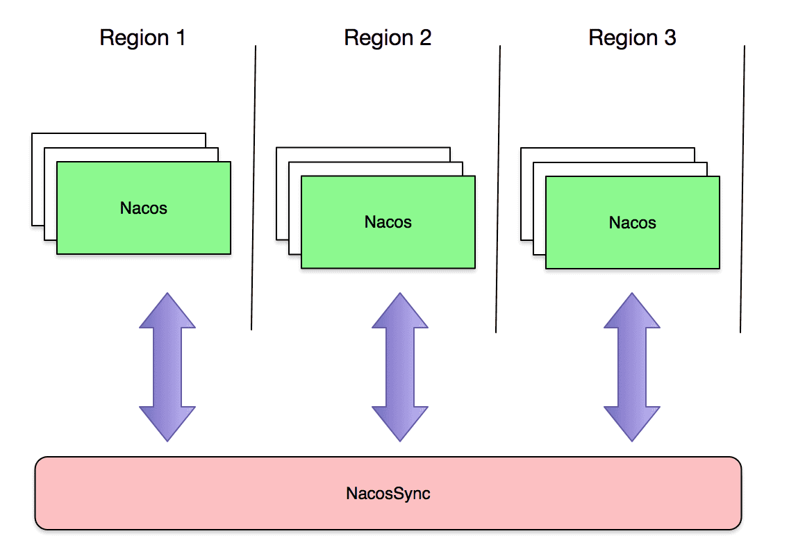

*   双向同步功能，比如支持Dubbo+Zookeeper服务平滑迁移到Dubbo+Nacos，享受Nacos更加优质的服务
    

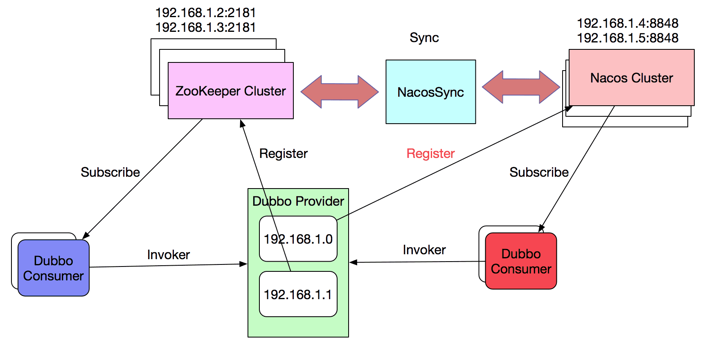

## 二、Nacos-Sync关键代码

### 1、Eureka -> Nacos 同步逻辑

从数据库获取任务后，在内存状态维护3s定时任务

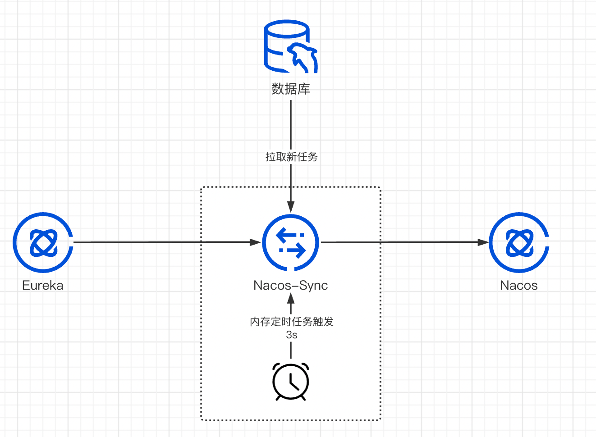

关键代码：EurekaSyncToNacosServiceImpl

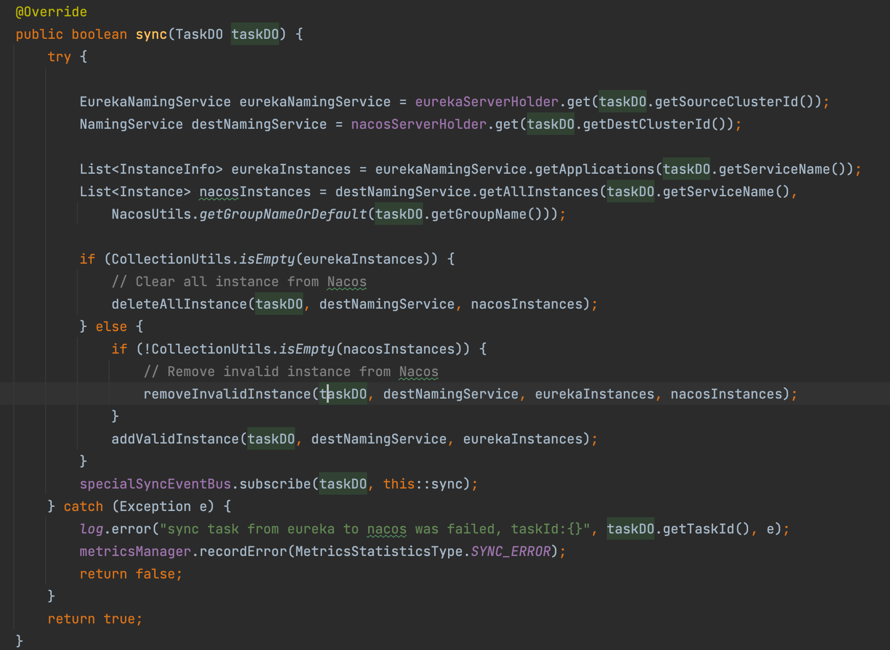

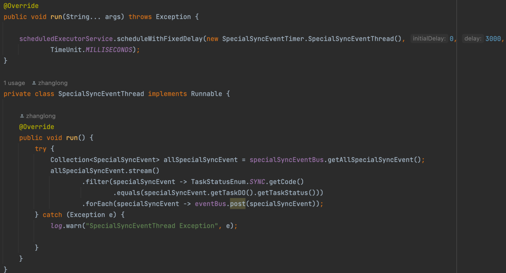

### 2、Nacos -> Eureka 同步逻辑

从数据库获取任务后，利用Nacos Client机制订阅服务变更事件

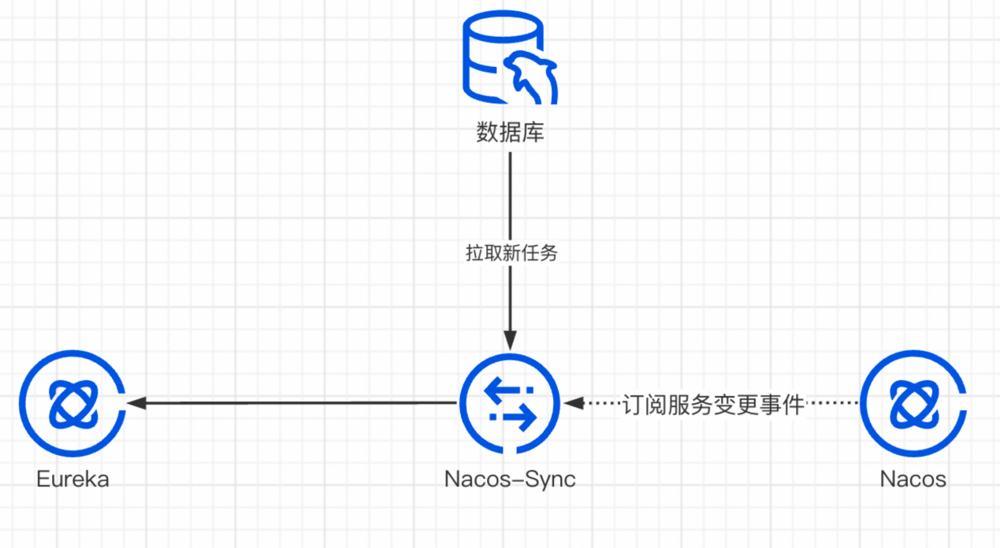

关键代码：NacosSyncToEurekaServiceImpl

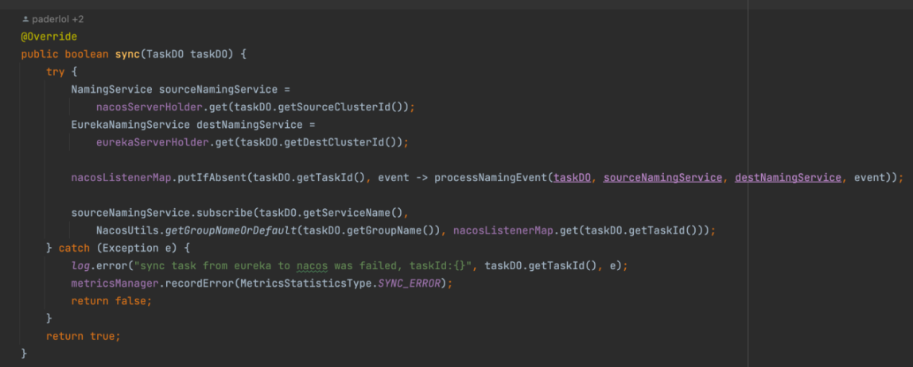

### 3、双向同步如何确保不会循环同步

针对从其他注册中心同步过来的实例元数据携带着syncSource、destclusterId、sourceClusterId

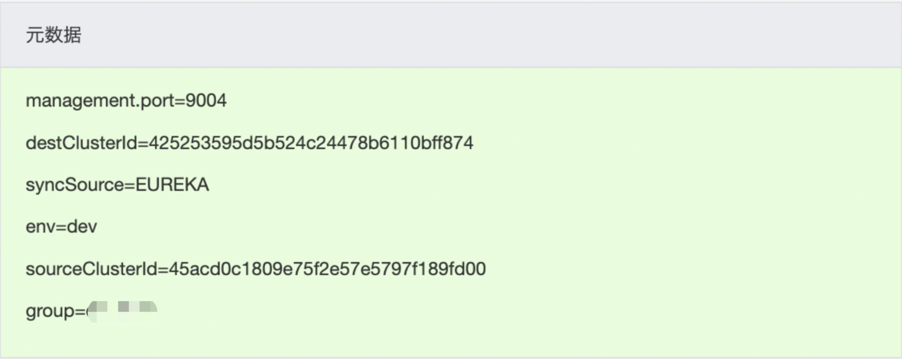

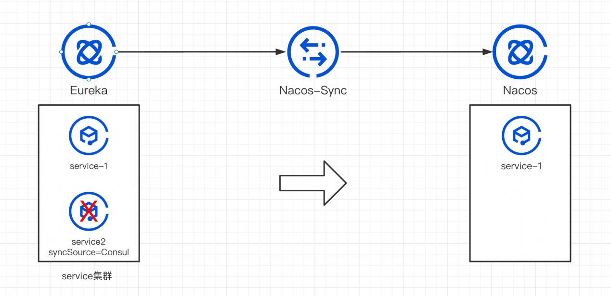

## 三、迁移过程

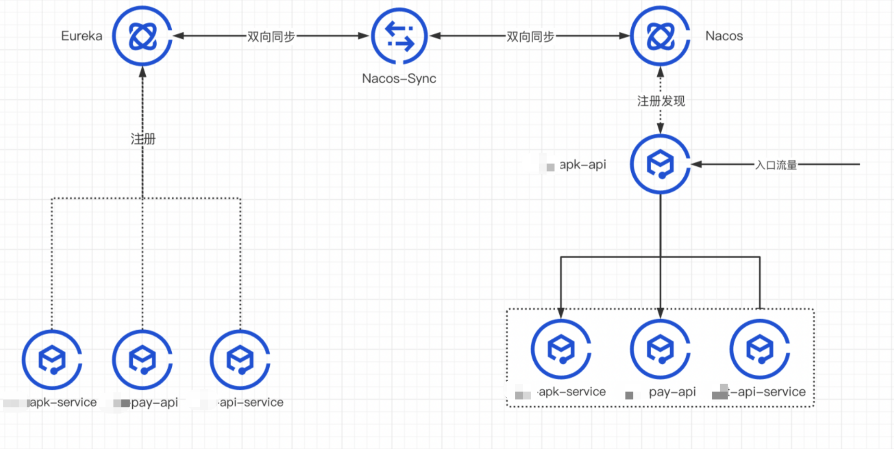

### 1、应用改造兼容

**1.1 同步阶段**

埋堆堆服务治理（Lily） 默认做了group级别的隔离，Eureka实例元数据配置添加group信息

**1.2 代码改造**

移除Eureka、接入Nacos

**1.3 迁移阶段如何本地联调**

方式一：代码保留Eureka分支

方式二：搭建一套完整的环境，Nacos + Eureka + Nacos-Sync

方式三：@FeignClient指定服务地址

方式四：RibbonClient指定服务配置

参考ConfigurationBasedServerList，自定义NacosConfigurationBasedServerList，手动配置各服务实例地址，基本满足本地开
发联调需求

**1.4 Eureka注册中心存在本地实例无法访问**

原因分析：nacos注册中心有 Lily 服务治理，已添加规则禁止感知本地实例，所以将本地实例注册到Nacos不会影响使用；

如何解决：在没有改造Eureka Client的情况下，最直接的方式就是不要让本地实例同步至Eureka；

为本地开发配置指定元数据syncSource信息，Nacos-Sync默认不处理。

**1.5 两套测试环境的灵活配置**

目前两套环境在Nacos上同一个namespace，通过maven环境变量打包时指定服务元数据group。

### 2、发布模式及问题

**2.1 场景一：提供者均注册到EUREKA，调用者从EUREKA拉取提供者服务并调用**

或者 提供者均注册到NACOS，NACOS-SYNC将其同步至EUREKA，调用者从EUREKA拉取提供者服务并调用

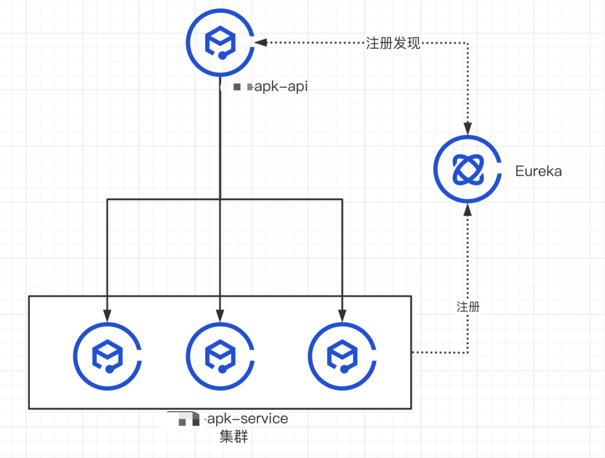

**2.1.1 压测报告**

    summary = 826878 in 00:04:03 = 3399.2/s Avg: 134 Min: 1 Max: 1315 Err: 52649 (6.37%)
    summary = 895094 in 00:04:03 = 3682.4/s Avg: 1 Min: 1 Max: 1003 Err: 29 (0.00%)

**2.1.2 结果分析**

为什么会出现相差巨大的结果
 
 
**情况一**

Eureka Server实例移除周期

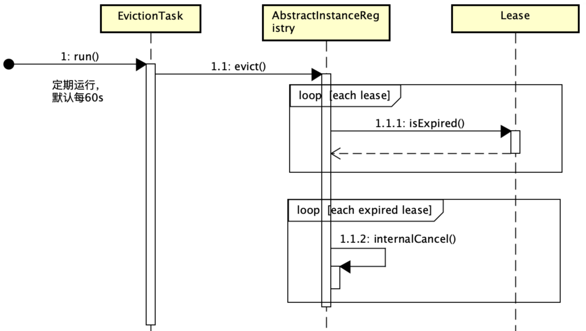

其中检查是否续约过期，包括判断是否开启自我保护模式

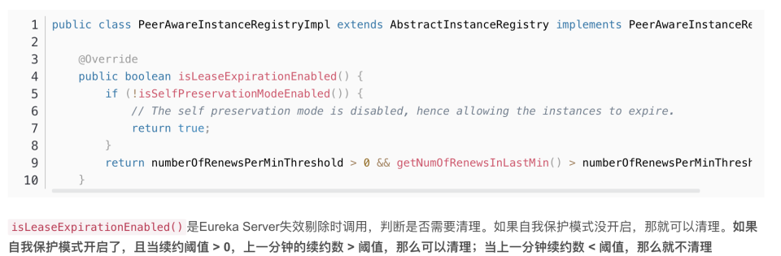

Eureka自我保护触发机制：Renews (last min) < Renews threshold

Renews threshold：Eureka Server期望每分钟收到客户端实例续约的阈值

Renews (last min)：Eureka Server最后1分钟收到客户端实例续约的总数

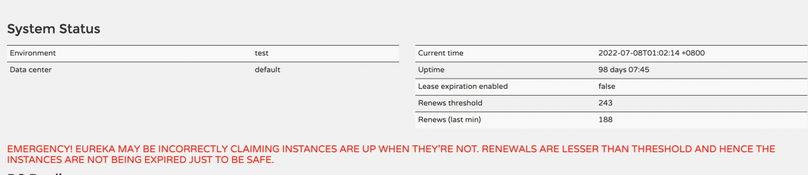

AvailabilityPredicate：过滤熔断状态下的服务以及并发连接过多的服务，代码如下

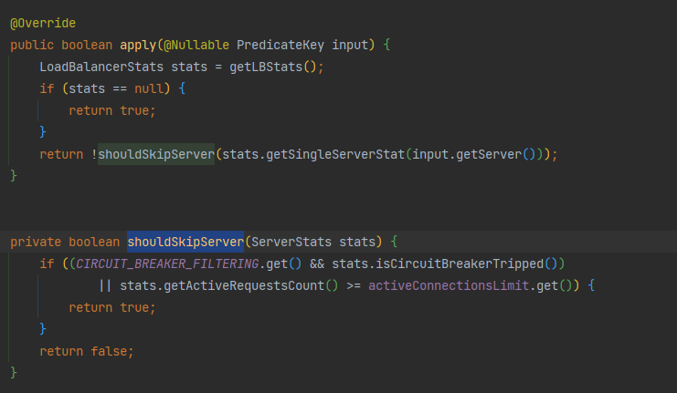

ServerStats：如何计算是否开启实例熔断

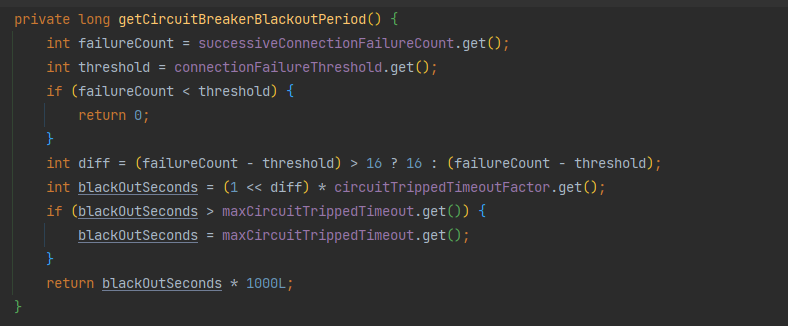

在滚动发布过程中，提供者未从EUREKA摘除过（实例移除周期、自我保护的作用下导致），在第一个实例启动前，消费者刚好尝试请求该实例，失败了此时该实例又被关"小黑屋"30s，此时发布第二个实例且总共只有两个实例的话，此时会出现服务不可用状态

处理方案：滚动间隔至少30s
 
 
**情况二**

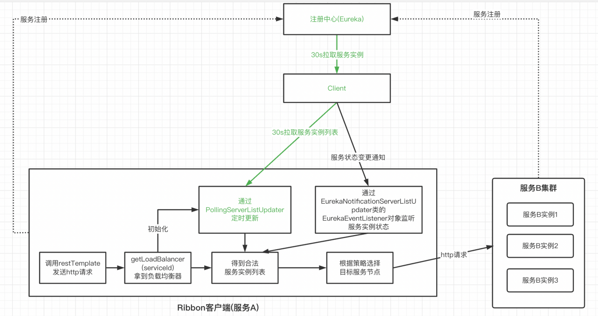

实例注册到EUREKA后，消费者的ribbon的实例列表更新周期长，eureka client默认30s拉取一次服务实例，ribbon默认30s更新一次服务实例，意味着最长间隔60s

处理方案：滚动间隔至少60s
 
 

**2.2 场景二：提供者均注册到EUREKA，NACOS-SYNC将其同步至NACOS，调用者从NACOS拉取提供者服务并调用（ Lily 服务治理）**

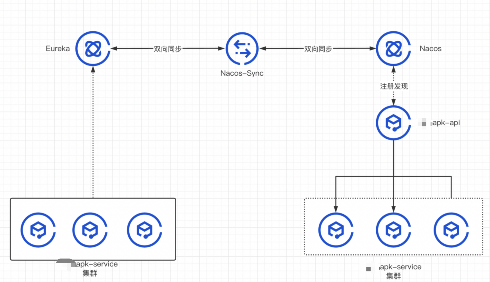

**2.2.1 压测报告**

summary = 783825 in 00:04:03 = 3224.9/s Avg: 2 Min: 1 Max: 493 Err: 4 (0.00%)

**2.2.2 结果分析**

为什么 Lily 服务服务治理下还会有错误呢？

在滚动发布过程中，提供者未从EUREKA摘除过（实例移除周期、自我保护的作用下导致），意味着在NACOS上也是一直保持健康状态。启动完进程后进行实例健康探测（查询NACOS的注册状态），实例可能仍未启动起来，但从NACOS查询仍是健康的，此时放行流量会导致少量错误（关"小黑屋"）

处理方案：应用提供就绪探针 或 滚动间隔至少30s
 
 

**2.3 场景三：样机情况下，调用者从NACOS拉取提供者服务并调用（ Lily 服务治理）** 

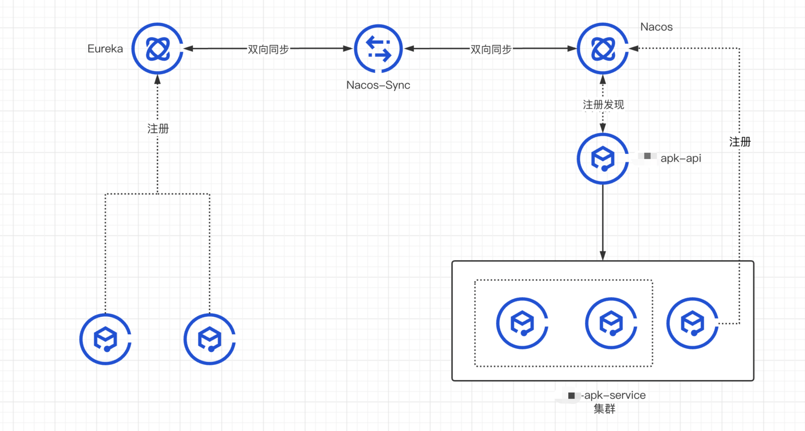

**2.3.1 压测报告**

    summary = 886299 in 00:04:03 = 3644.1/s Avg: 123 Min: 1 Max: 3218 Err: 102846 (11.60%)

**2.3.2 结果分析**

为什么 Lily 服务服务治理下还会有错误呢？

ZoneAffinityServerListFilter

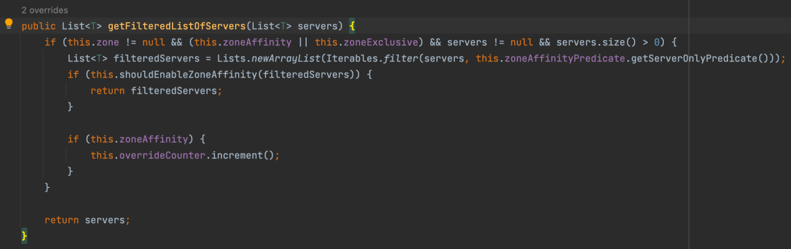

消费者的ribbon LoadBalancer会进行区域亲和性划分，如果提供者存在与消费者实例同区域的话则仅访问这部分同区域实例，在未进行区域划分下导致实例浪费，如果同区域只有一个实例则会导致流量有损

处理方案：在不分区架构下，始终保持集群实例的zone保持一致，注册到EUREKA的元数据也配置zone:default。

理应兼容目前的情况，比如nacos版本实例的zone设定为defaultZone(loadBalancer Zone默认值) 或者手动关闭。
 
 

**2.4 场景四：提供者均注册到NACOS，调用者从NACOS拉取提供者服务并调用（ Lily 服务治理）**

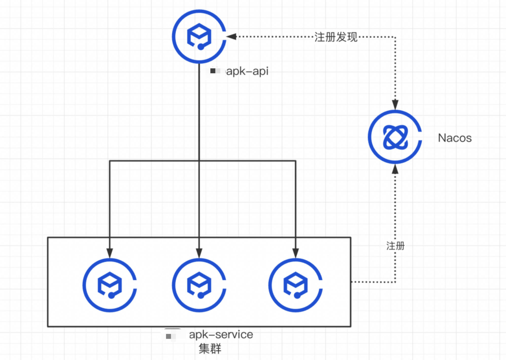

**2.4.1 压测数据**

流量无损
 
 

**2.5 综合以上问题，新发布流程**

*   通过console摘除实例流量
    
*   实例发版/重启
    
*   调用实例健康探针是否正常调用，失败则重试且设定重试周期与最大次数（实例接口http://host:port/actuator，保证实例健康）
    
*   循环调用console检测实例是否注册到注册中心，失败则重试且设定重试周期与最大次数，成功时再等待11s（保证消费者拉取到该实例）
    
*   通过console挂载实例流量
    
*   等待间隔60s（目前存在eureka类型的消费者，最长需要间隔60s保证消费者拉取到该实例）
    
*   继续下一个实例发布

### 3、遇到问题

**3.1 升级为Nacos版本实例但服务元数据不变，甚至会导致服务抖动**

问题剖析：升级版本注册到Nacos Server，此时Nacos-Sync还能继续往Nacos上同步实例（Eureka Server自我保护、移除周期、Nacos-Sync定时任务周期因素），在这种情况下实例的元数据则继续保留Eureka实例元数据

解决方案：实例下线、主动/等待实例从Eureka Server下线、实例上线

**3.2 zone切换故障**

参考发布场景三

## 四、参考资料

[阿里云-应用迁移](https://help.aliyun.com/zh/mse/use-cases/application-migration/?spm=a2c4g.11186623.help-menu-123350.d_3_0_0.104a4a6cXnzKK0&scm=20140722.H_294431._.OR_help-V_1)

[Nacos Sync](https://nacos.io/zh-cn/docs/nacos-sync.html)