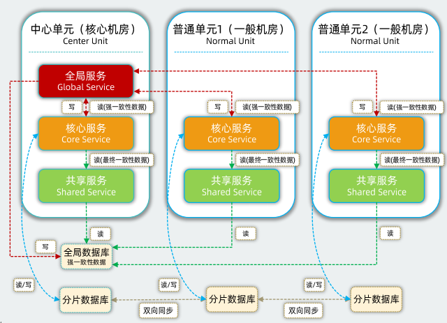
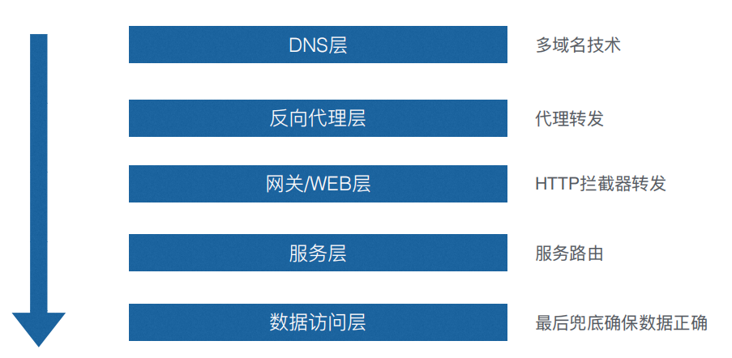

### 多云

本文先介绍常用的多云落地方案，再基于Mdd业务，重点讨论异地多活+单元化的落地场景。

#### 容灾

常用的多云方案包括：同城双活、两地三中心、异地多活，其中同城双活、两地三中心均为CP模式的容灾，能解决城市级单点等问题，但由于单向同步的问题，故障时期，可用性无法得到保障，本文重点关注**异地多活的AP模式**。

**容灾指标**

| 典型架构 | 容灾模式 | 衡量指标               |
| -------- | -------- | ---------------------- |
| 同城双活 | CP模式   | RPO=0，RTO分钟级别     |
| 异地多活 | AP模式   | RPO≈0，RTO秒或分钟级别 |
| 异地多活 | CP模式   | RPO=0，RTO分钟级别     |

##### 容灾目标

容灾目标主要满足机房级和应用级的故障，实现快速切换

##### 故障场景

针对不同的故障场景，管控中心统一切流，满足机房级和应用级切流粒度，将故障机房流量切到正常机房，应用多活场景覆盖的故障场景：

- 公网网络故障
- 接入网关故障
- 业务应用故障
- 数据库等中间件故障
- 两个机房间网络故障 
- 整个机房大面积故障

#### 单元化

##### 划分

异地多活，以单元化为主的实施思路，在异地多活AP模式下，为解决数据一致性问题，核心思路是对数据进行分片，通过自上而下的流量路由，让特定分片的数据到特定中心完成读写。按阿里的实践，这个可供水平扩展的逻辑中心成为“单元（Unit）“。

单元分为两种类型，中心单元与普通单元。单元内部署的业务分为三种类型，全局业务、核心业务、共享业务。中心单元只有一个，部署全局业务、核心业务、共享业务。普通单元部署核心业务、共享业务，普通单元具备水平的扩展能力，可以任意复制。

- 全局业务：强一致性的业务，在中心单元写，在中心单元读。
- 核心业务：做单元化拆分的业务，在普通单元写，在普通单元读。
- 共享业务：被核心业务高频依赖的全局业务读服务，在中心单元写，在普通单元读。

##### 形态

##### 设计原则

- 核心业务单元化
- 保证核心业务单元分片均衡
- 核心业务尽量自包含（调研封闭）
- 面向逻辑分区设计，而不是物理部署

##### 流量管控

#### 参考链接

《异地多活单元化架构下的微服务体系》 - 时晖

