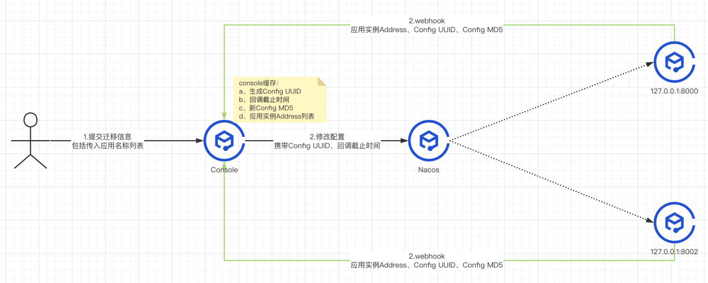
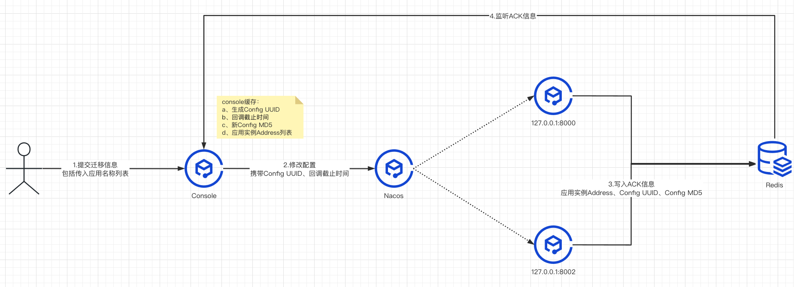

# Nacos Config ACK增强
## 一、现状
Nacos Config 基于 Http Long polling 机制通知 Config 变更，存在一定延迟，原因如下：

1.深挖源码发现 往某个 Nacos Server 提交配置且落库后再通过 Http 方式通知其他Nacos Server 节点，在各个 Nacos Server 知晓 Config 变更后通知其对应客户端

2.客户端接收到 Config 变更后，需要解析 Config 才能让新规则生效

## 二、应对方案
### 1.方案一：预留一定时间

在 Config 变更能够被通知到各个客户端且能够正确解析的前提下，数据迁移工具在修改 Config 后预留一定时间，目的是新规则能够生效才进行后续步骤

### 2.方案二：建设Config ACK机制

Nacos Config 只保证配置最终送达，但无法确保及时送达、无法跟进应用解析配置的结果。

目前单靠 Nacos Server 配置的客户端Listener携带的MD5，不足以反映配置解析完了（一般采取异步处理），不足以反映业务解析成功

ack通知形式：http webhook

ack通知形式：redis （目前采取此种方式，减少链路）

**通用ACK机制说明：**
 
 
**Console Config ACK机制**

确定Config消费者应用的实例Address：请求参数传入应用名称，console从服务发现拉取对应实例Address列表

本次操作信息落库且缓存在内存中：生成Config UUID、回调截止时间、新Config MD5、应用实例Address列表

向Nacos Server提交新配置：携带Config UUID、回调截止时间

在设定一定时间期限内轮询/等待本次执行结果，参考下面的发起ACK和接受ACK机制

如果失败则进行配置回滚，并利用ACK机制检查结果；如果失败则需要人工介入，恢复为原本的配置内容
 
 
**Config 客户端如何发起ACK**

规定一份config则只会发起一个ACK，否则不具备通用性；一个配置可能有多处handler解析，需要统一汇总最终结果

根据下发的config中回调截止时间信息，如果超出config的回调时间范围则丢弃
 
 
**Console 接受客户端 Config ACK请求**

客户端ACK请求：应用实例Address、Config UUID、Config MD5

Console接受ACK请求往Redis写（异步落库，用于后续历史查询）

接受请求的时间超出规定时间范围则不处理
 
 
**问题**

一份config可能存在多个地方解析，如何汇总再发出ACK

如何保证客户端解析代码是一致的

console的稳定性