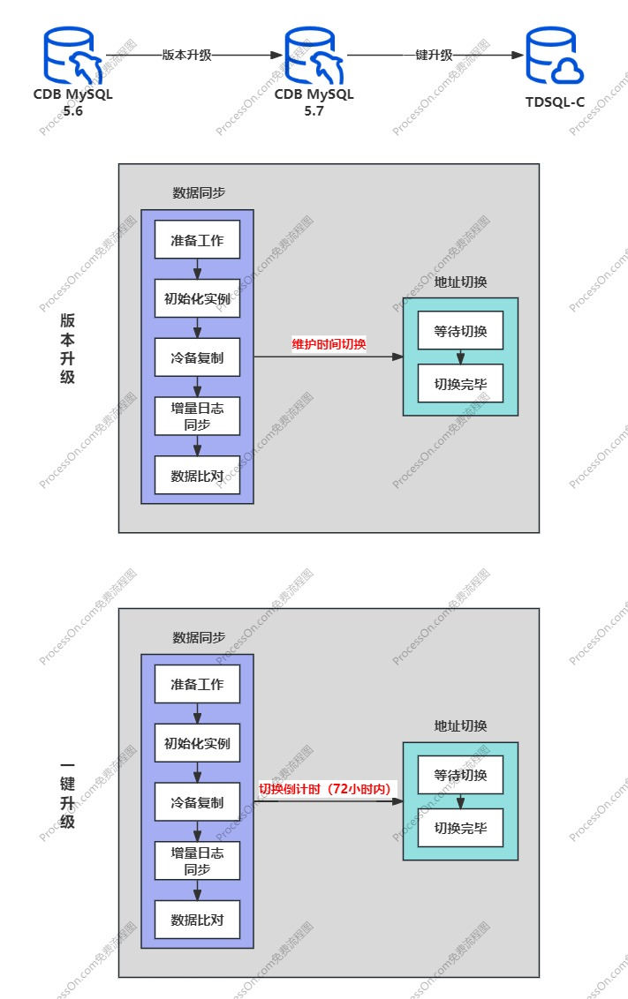
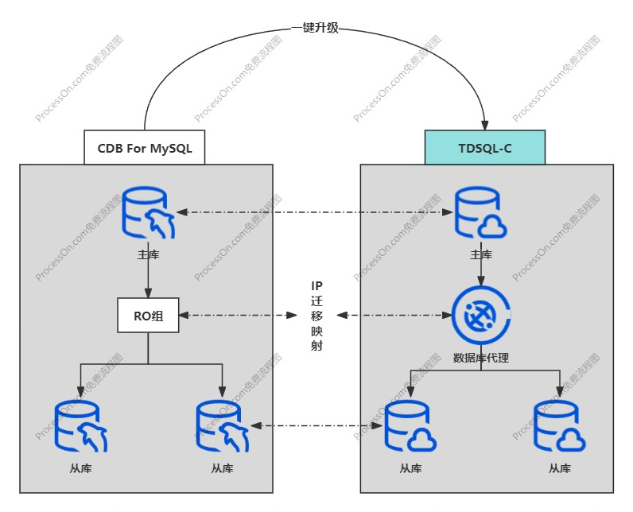

### CDB迁移云原生数据库实践

#### 迁移流程图

#### 迁移IP视图

#### 迁移注意点

CDB For MySQL5.6迁移到TDSQL-C需要先进行版本升级和一键升级两个阶段，两个阶段大致包含数据同步和地址切换两个步骤，其中地址切换会造成应用**断线重连**引起应用较大波动，切换期间需选择业务低峰操作。以下主要记录迁移过程两个阶段的需要重点的注意点和限制条件，以免造成应用波动或流程卡住的问题。

##### 版本升级

1. **切换时间**统一选择**维护时间内**

##### 一键升级

1. 删除非Innodb库表，比如DTS的__tencent_db__
2. 主从库分布在不同的子网，需要迁移前调整网络配置，会卡住迁移流程（腾讯云预计9月初发布修复）
3. 压缩表的体积膨胀超过磁盘规格，比如大量的大value的压缩ROW_FORMAT格式(CDB会压缩)，需要先扩容硬盘，否则会卡住迁移流程
4. 中文的库表，会卡住迁移流程
4. 数据库**开放公网**，需要先解决域名的问题

#### 迁移后处理

1. 主库规格独享型修改为通用型，注意会造成应用**断线重连**
2. 数据库代理的节点修改为至少2个以上，默认为1个代理节点
3. 单可用区修改为高可用区，默认为单可用区

