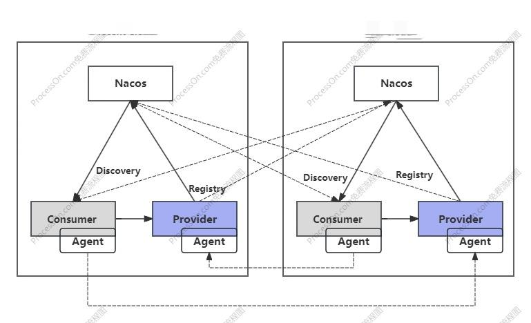
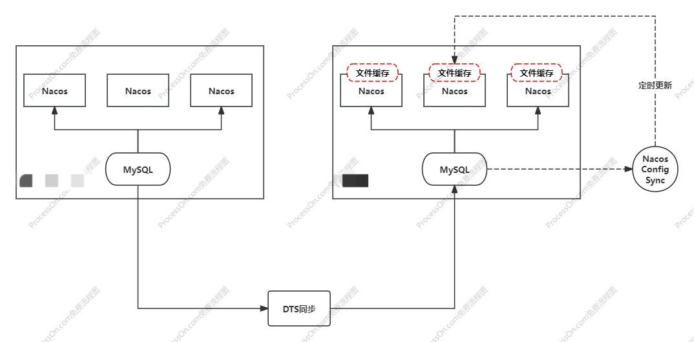

## Nacos多活容灾

Nacos多活容灾主要用于跨云部署，实现在不同云部署主备集群。在兼顾高可用、稳定性和地域延迟，本文主要讨论Nacos多活容灾与就近访问的方案，以提供不同云跨集群之间的应用访问。

#### 注册中心：双注册

采用java agent的形式，在不改变业务代码的情况下，通过agent实现服务的双注册和发现，以此提供服务不同集群的路由访问。

- 双注册

- 就近访问

  

#### 配置中心：数据同步

- dts数据同步

- 文件缓存同步

  

#### 落地实施：

- 注册中心：双注册和就近访问
- 配置中心：主+备，依靠故障时读取外部存储（mysql、redis等）的切换开关进行主备切换