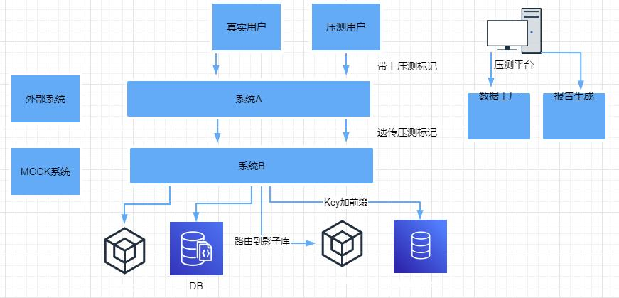
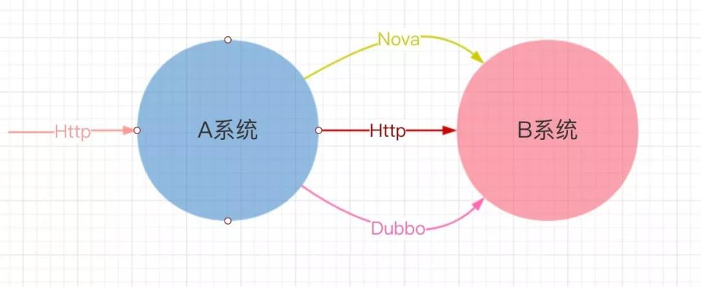
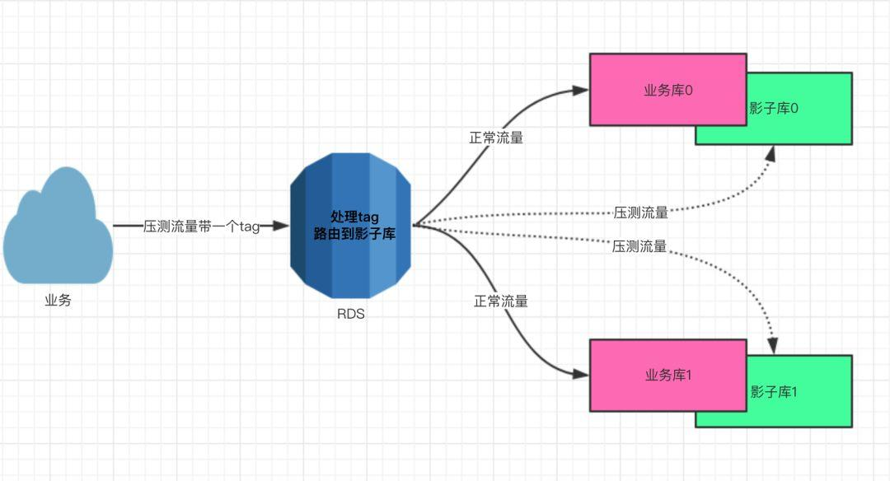
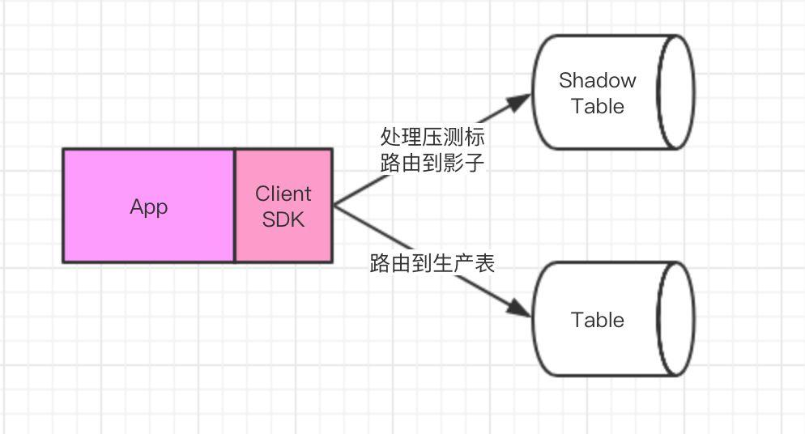
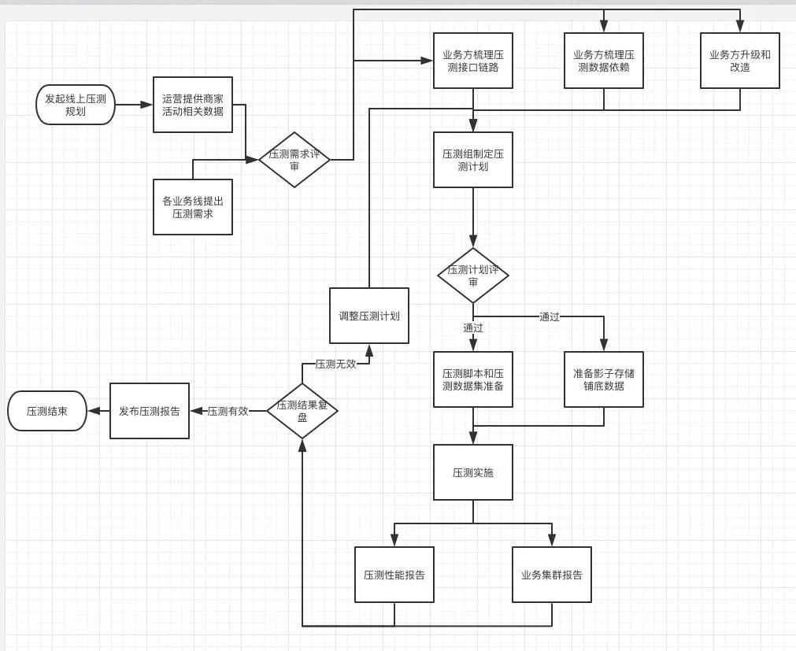
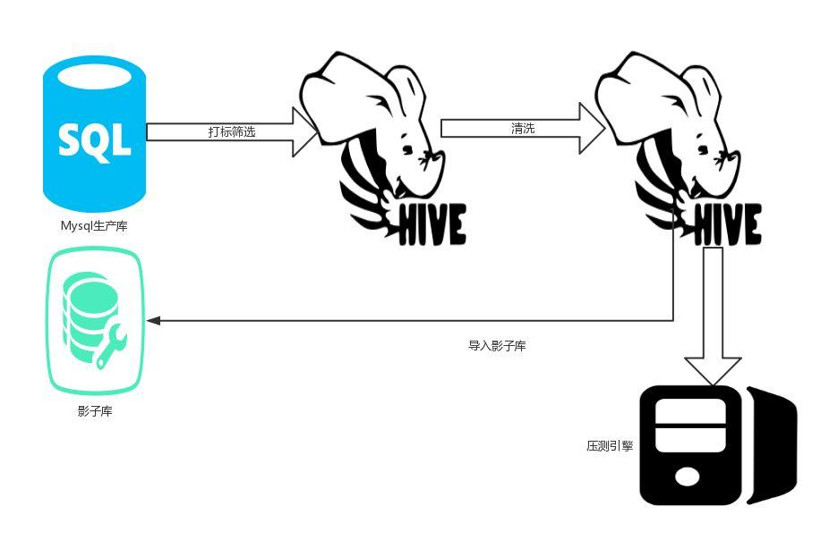

# 背景说明

通过全链路压测，模拟真实流量高峰，串联线上全部系统，让核心系统同时达到流量峰值：

- 验证大促峰值流量下系统稳定性
- 容量规划
- 进行强弱依赖的划分
- 降级、报警、容灾、限流等演练
  …

通过全链路压测这一手段，对线上系统进行最真实的促销、抢购、暴击演练，获取系统在大压力时的表现情况，进而准确评估线上整个系统集群的性能和容量水平，保障系统的稳定性。

性能测试主要有线下单系统单接口、线上单系统以及线上全链路压测等手段。通过不同维度和颗粒度对接口、系统、集群层面进行性能测试，最终保障系统的稳定性。本篇主要是全链路压测的相关设计和具体的实施。

# 全链路压测的相关设计

全链路压测，主要就是压测流量的制造、压测数据的构造、压测流量的识别以及压测数据流向的处理。

整体方案设计如下：


大流量下发器： 其实就是模拟海量的用户去使用我们的系统，提供压测的流量，产生大并发的场景和流量；
数据工厂： 构造压测链路中用户请求的数据，以及压测铺底的数据、数据清洗、脱敏等工作。

步骤：
1、压测平台负责管理压测脚本和压测请求数据，从数据工厂获取压测数据集，分发到每一个压测 agent 机器上。
2、agent 根据压测脚本和压力目标对测试机器（测试环境、预发布、生产环境）发起请求流量，模拟用户的全链路操作行为（如：查看商品-添加购物车-下单-支付-查看订单详情）。
3、被测服务集群识别出压测的流量，对于存储的读写走影子存储。
PS.线上压测很重要的一点就是不能污染线上的数据，因此需要能够隔离出压测的流量，存储也需要识别出压测的数据。

以下，介绍压测流量和压测数据存储的隔离方案。

# 流量识别

要想压测的流量和数据不影响线上真实的生产数据，就需要线上的集群能识别出压测的流量，只要能识别出压测请求的流量，那么流量触发的读写操作就很好统一去做隔离了。

压测流量的识别如下：

## 同步请求


全链路压测发起的都是Http的请求，只需要在请求头上添加统一的压测请求头，具体表现形式为:

```
Header Name:X-Service-Chain;
Header Value:{"test": true}
```

- 1
- 2

Dubbo协议的服务调用，通过隐式参数在服务消费方和提供方进行参数的隐式传递，表现形式为：

```
Attachments:X-Service-Chain;
Attachments Value:{"test": true}
```

- 1
- 2

通过在请求协议中添加压测请求的标识，在不同服务的相互调用时，一路透传下去，这样每一个服务都能识别出压测的请求流量，这样做的好处是与业务完全的解耦，只需要应用框架进行感知，对业务方代码无侵入。

## 中间件

NSQ:通过NSQMessage中添加jsonExtHeader的KV拓展信息，让消息可以从Producer透传到Consumer端，具体表现形式为：`Key:test;Value:true`

Wagon:对来自影子库的binlog通过拓展消息命令(PUBEXT)带上压测标记`{"test": true}`

## 异步线程

异步调用标识透传问题，可以自行定制 Runnable 或者定制线程池再或者业务方自行定制实现。

# 数据隔离

通过流量识别的改造，各个服务都已经能够识别出压测的请求流量了，那么如何做到压测数据不污染线上数据，对于不同的存储做到压测数据和真实的隔离呢，主要有客户端 Client 和 Proxy 访问代理的方式实现，以下是数据隔离方案：

## PROXY 访问代理隔离

针对业务方和数据存储服务间已有 Proxy 代理的情况，可以直接升级改造 Proxy 层，存储使用方完全无感知，无侵入，下面已 MySQL 为例，说明 Proxy 访问代理对于压测数据隔离的方案；


业务方应用读写 DB 时，统一与 RDS-Proxy(介于 MySQL 服务器与 MySQLClient 之间的中间件)交互，调用 RDS-Proxy 时会透传压测的标记，RDS 识别出压测请求后，读写 DB 表时，自动替换成对应的影子表，达到压测数据和真实的生产数据隔离的目的。

ElasticSearch、KV 对于压测的支持也是通过 Proxy 访问代理的方式实现的。

## 客户端 SDK 隔离


业务应用通过 Client 调用存储服务时，Client 会识别出压测的流量，将需要读写的 Table 自动替换为影子表，这样就可以达到影子流量，读写到影子存储的目的。

Hbase、Redis等采用此方案实现。

## 数据偏移隔离

推动框架、中间件升级、业务方改造，难免会有遗漏之处，所以需要对于压测的数据统一做偏移，确保买卖家 ID 与线上已有数据隔离开，这样即使压测数据由于某种原因写入了真实的生产库，也不会影响到线上买卖家相关的数据，让用户无感知；

问题：
特殊的周期扫表应用的改造，周期性扫表应用由于没有外部触发，所有无法扫描影子表的数据，如何让这样的 job 集群整体来看既扫描生产库，也扫描影子库呢？
解决思路：
部署一些新的 job 实例，它们只扫描影子库，消息处理逻辑不变；老的 job 实例保持不变（只扫生产库）。

# 压测平台

压测平台目前主要负责压测脚本管理、压测数据集管理、压测 job 管理和调度等。

# 压测实施流程

全链路压测的执行流程如下：


## 压测计划制定

1、首先需要确认的就是压测场景
根据运营报备的商家大促活动的计划，制定大促的压测场景（比如秒杀、抽奖等），再结合近七天线上流量的场景情况，综合确定压测的场景。
2、确认压测链路，压测的目录.
如：购买行为链路：购买行为主要是店铺首页-商品详情页-下单-支付-支付成功。
3、确认压测的流量漏斗模型
线上真实的场景案例是，100 个人进入了商家的店铺首页，可能有 50 个人直接退出了，有 50 个人最终点击进入了商品详情页面，最终只有 10 个人下了单，5 个人真正付款了，这就是压测链路的漏斗模型，也就是不同的接口的真实调用比例；实际的模型制定会根据近7天线上真实用户的行为数据分型分析建模，以及往期同类型活动线上的流量分布情况，构建压测链路的漏斗模型。
4、确定压测的目标
根据运营的预估的PV和转换率情况，结合去年同期线上流量情况和公司业务的增长速率，取大值作为压测的目标。

## 数据工厂

压测数据工厂主要负责，压测铺底数据的准备、压测请求数据块的生成。

## 铺底数据准备

由于方案采用的是影子库的设计，因此对于铺底数据准备需要处理影子库的数据。
铺底数据准备的流程图：

步骤：

- 数据导入 从生产数据库按需过滤，导入压测铺底需要的数据到大数据集群的hive表中。
- 数据处理 在hive表中，对导入的数据进行脱敏和清洗，清洗的目的是保证压测的数据可用性，比如保证铺底商品库存最大、营销活动时间无限、店铺正常营业等。
- 数据导出 对hive标中已经处理完成的数据，导出到已经创建好的影子库中，需要注意的是同一实例写入数据的控制（因为影子库和生产库同实例），写入数据的binlog过滤。

PS.
1、压测数据的准备，有大数据平台的基于大数据平台准备数据。
2、有条件的话，可以实现数据准备的自动化，可维护数据准备job。

## 压测请求数据数据集

- 从各个业务线的表中获取压测场景整个链路所以接口请求需要的参数字段，存到一张创建好的压测数据源宽表中。
- 编写MapReduce任务代码，读取压测数据源宽表数据，按压测的接口请求参数情况，生成目标json格式的压测请求数据块文件到HDFS。
- 压测时，压测引擎自动从HDFS上拉取压测的请求数据块。

## 压测脚本准备

### 梳理压测请求和参数

采用统一的 RESTful 风格规范，让各个业务方的人员提交压测接口的 API 文档，这样压测脚本编写人员就能根据这份 API 快速写出压测的脚本，以及接口的预期结果等。

### 控制漏斗转化率

### 不同场景的配比

对不同的压测场景链路按模块编写压测脚本，这样的好处就是需要不同场景混合压测时，只需要在 setUp 时，按需把不同的场景组合到一起即可；需要单独压测某一个场景时，setUp 中只留一个场景就好，做到一次编写，处处可压。

## 压测执行

1、可以通过压测平台执行
2、可以借助工具执行（如：Jmeter、loadrunner、ab等）

 