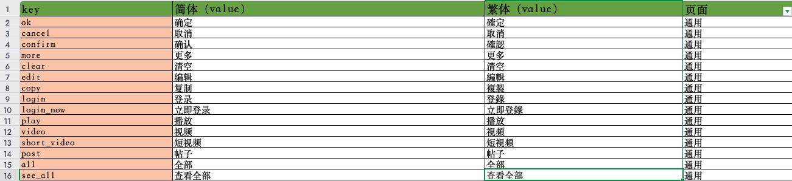

# 客户端多语言文字资源XML生成方案

## 概述
埋堆堆APP为了更好的支持香港地区人士的使用，需要在APP内支持繁体内容。
APP内现存在大量硬编码的文字内容，包括：按钮文案、提示信息、功能说明等。因为历史原因，此部分的文字内容并为使用文字资源的形式进行管理。
为了使这些固定文字内容支持简体中文和繁体中文，从而制定了本方案。

方案的原则:
1.  文字资源需要统一维护，既要考虑安卓和iOS开发人员使用，也需要便于运营、产品等其他部分同事进行更新及修正。
2. 自动化配置，减少人工操作。
3. 支持灵活定制，适配安卓和iOS的系统差异

### 一、解决方案
#### 方案概述
客户端的多语言文字资源配置文件生成方案，安卓和iOS都使用一套解决方案：  

1. 两端使用同一个 [埋堆堆本地简体转繁体对照表](https://www.kdocs.cn/l/ckBR5JS0jFiC)，配置所有的文字资源。  
2. 基于GitHub的开源库[Localizable.strings2Excel](https://github.com/CatchZeng/Localizable.strings2Excel) 进行xls文档到本地资源文件的生成。  
3. 两端根据多语言文字资源共享文档的格式，定制Python脚本，进行文档的转换

#### 1、使用在线文档管理文字资源
为了让不同岗位可以对文字资源的进行及时和便携的维护，我们最终确定使用在线共享文档进行文字资源的维护。
运营人员可以在版本过程中对固定文字内容的繁体翻译进行及时的维护
开发人员在迭代中可以随时增删文字内容，快递导出表格，进行资源文件生成

文字资源共享文档: [埋堆堆本地简体转繁体对照表](https://www.kdocs.cn/l/ckBR5JS0jFiC)



#### 2、从表格生成本地资源文件

有了[埋堆堆本地简体转繁体对照表](https://www.kdocs.cn/l/ckBR5JS0jFiC )后，解决了资源的管理和维护的问题。  
但此文档在APP内并无法进行直接的使用，且安卓和iOS系统都因为各自开放平台的原因，对文字资源的格式都有对应的要求。  
为了快速的实现把共享文档中的资源内容，快速的转变成各开发平台可以使用的文字资源。  
我们经过调研，最终选择GitHub的开源库: [Localizable.strings2Excel](https://github.com/CatchZeng/Localizable.strings2Excel)  ，通过这个库的脚本实现把XLS表格转换成各平台对应的文字资源配置文件

**Localizable.strings2Excel** 仓库地址: [https://github.com/CatchZeng/Localizable.strings2Excel](https://github.com/CatchZeng/Localizable.strings2Excel) 

#### 3、定制转换脚本
**问题:**  
[Localizable.strings2Excel](https://github.com/CatchZeng/Localizable.strings2Excel) 的脚本可以实现资源文件的转换，但对限制了XLS表格的格式，需要维护安卓和iOS两份表格。这种方式既不利于我们的日常维护，也保证两端资源的统一，增大人为因素的导致的失误.  

**解决方案:**     
为了解决这些问题，方便我们开发的操作，在[Localizable.strings2Excel](https://github.com/CatchZeng/Localizable.strings2Excel) 原有脚本的基础上，我们根据[埋堆堆本地简体转繁体对照表](https://www.kdocs.cn/l/ckBR5JS0jFiC )的表格格式，使用Python开发了适配我们表格格式的转换脚本。  
实现一个表格，就可以生成安卓和iOS的文字资源文件

安卓的资源文件生成脚本:

``` python
# -*- coding:utf-8 -*-

from optparse import OptionParser
from XlsFileUtil import XlsFileUtil
from XmlFileUtil import XmlFileUtil
from StringsFileUtil import StringsFileUtil
from Log import Log
import os
import time


def addParser():
parser = OptionParser()

parser.add_option("-f", "--xlsFile",
                  help="Xls files.",
                  metavar="xlsFile")

parser.add_option("-t", "--targetDir",
                  help="The directory where the xml files will be saved.",
                  metavar="targetDir")

parser.add_option("-a", "--additional",
                  help="additional info.",
                  metavar="additional")

(options, args) = parser.parse_args()
Log.info("options: %s, args: %s" % (options, args))

return options


def convertFromSingleForm(options, xlsFile, targetDir):
xlsFileUtil = XlsFileUtil(xlsFile)
table = xlsFileUtil.getTableByIndex(0)
firstRow = table.row_values(0)

keys = table.col_values(0)
zhrCNValues = table.col_values(1)
zhrHKValues = table.col_values(2)

del keys[0]
del zhrCNValues[0]
del zhrHKValues[0]

defaultFilePath = targetDir + "/values/"
zhrCHFilePath = targetDir + "/values-zh-rCN/"
zhrHKFilePath = targetDir + "/values-zh-rHK/"

xmlFileName = "strings_biz.xml"

XmlFileUtil.writeToFile(
        keys, zhrCNValues, defaultFilePath, xmlFileName, options.additional)

XmlFileUtil.writeToFile(
        keys, zhrCNValues, zhrCHFilePath, xmlFileName, options.additional)

XmlFileUtil.writeToFile(
        keys, zhrHKValues, zhrHKFilePath, xmlFileName, options.additional)
    
print "Convert %s successfully! you can xml files in %s" % (xlsFile, targetDir)

def startConvert(options):
xlsFile = options.xlsFile
targetDir = options.targetDir

print "Start converting"

if xlsFile is None:
    print "xls files can not be empty! try -h for help."
    return

if targetDir is None:
    print "Target file path can not be empty! try -h for help."
    return

targetDir = targetDir + "/xls-files-to-xml_" + \
    time.strftime("%Y%m%d_%H%M%S")
if not os.path.exists(targetDir):
    os.makedirs(targetDir)

convertFromSingleForm(options, xlsFile, targetDir)


def main():
options = addParser()
startConvert(options)


main()

```


### 二、安卓端的文字资源XML生成步骤
##### 1、安装运行环境
1. Clone 开源库
2. 安装 Python 环境
3. 安装 pyexcelerator和 xlrd

> 注意：  
>  Localizable.strings2Excel 只支持Python 2.x

具体安装教程可以查看[Localizable.strings2Excel](https://github.com/CatchZeng/Localizable.strings2Excel) 的GitHub首页

##### 2、下载多语言文字资源Excel表格
直接通过 [埋堆堆本地简体转繁体对照表](https://www.kdocs.cn/l/ckBR5JS0jFiC) 导出Excel文件，用于转化。

> 注意：   
> xml生成生成脚本，目前只支持xls文件，转换时切记不用误选xlsx格式

##### 3、创建生成资源XML文件的Python脚本

拷贝脚本代码，代码具体见：  [3、定制转换脚本](#3、定制转换脚本)  
保证到本地，命名为MddXls2Xml.py

##### 4、生成XML资源文件

1. 执行脚本
`python2 {脚本目录}/MddXls2Xml.py -f {资源文件目录}/多语言文字资源.xls -t {XML输出目录}`

2. 拷贝 values、values-zh-rCN、values-zh-rHK 文件到安卓的lib_language_resources库的res目录下

> 注意：
> 埋堆堆定制的脚本调用时传递的参数和Localizable.strings2Excel的脚本的参数不一样，使用时需要特别注意


**针对只有python3又不想折腾环境的同学, 可以参考[Excel2iOSString](https://github.com/justinjcode/Excel2iOSString)这个项目, 该项目基于原[Localizable.strings2Excel](https://github.com/CatchZeng/Localizable.strings2Excel)项目进行了python3以及xlsx格式的适配和支持**
