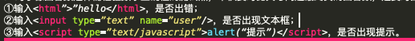
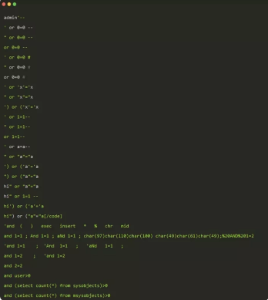
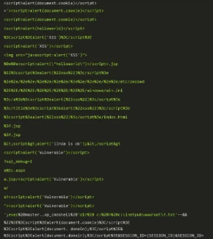

**1.接口安全性设计原则**

1.接口类型尽量使用https带SSL证书模式；
2.接口参数使用签名（非对称加密算法）；
3.接口参数需要校验；
4.每次请求需要用户命令；
5.多次失败后需要有锁定机制；
6.接口对应用户权限，用户只能调用有权限的接口；
7.系统接口做过负荷机制用来保护系统安全

2.**接口安全性用例设计**

1.输入验证：

客户端验证服务器端验证(禁用脚本调试，禁用Cookies)
1.输入很大的数（如72932398579857），输入很小的数(负数)；
2.输入超长字符,如对输入文字长度有限制,则尝试超过限制,刚好到达限制字数时有何反应；
3.输入特殊字符,如:~!@#$%^&*()_+<>:”{}|；
4.输入中英文空格，输入字符串中间含空格，输入首尾空格；
5.输入特殊字符串NULL,null，0x0d 0x0a；
6.输入正常字符串；
7.输入与要求不同类型的字符，如: 要求输入数字则检查正值,负值,零值（正零，负零）,小数,字母,空值; 要求输入字母则检查输入数字；
8.输入html和javascript代码；
9.对于像回答数这样需检验数字正确性的测试点，不仅要对比其与问题最终页的回答数，还要对回答进行添加删除等操作后查看变化，例如：


2.用户名和密码

1.输入密码是否直接显示在输入栏；
2.是否有密码最小长度限制（密码强度）；
3.用户名和密码中是否支持输入空格或回车；
4.是否允许密码和用户名一致；
5.防恶意注册：可否用自动填表工具自动注册用户；
6.有无缺省的超级用户（admin等，关键字需屏蔽）；
7.有无超级密码；
8.是否有校验码；
9.密码错误次数有无限制；
10.是否大小写敏感；
11.密码是否以明码显示在输出设备上；
12.强制修改的时间间隔限制（初始默认密码）；
13.token的唯一性限制（需求是否需要）；
14.token过期失效后，是否可以不登录而直接浏览某个页面；
15.哪些页面或者文件需要登录后才能访问/下载；
16.cookie中或隐藏变量中是否含有用户名、密码、userid等关键信息；

3.文件上传和下载

1.上传文件是否有格式限制，是否可以上传exe文件；
2.上传文件是否有大小限制，上传太大的文件是否会导致异常错误；
3.通过修改扩展名的方式是否可以绕过格式限制，是否可以通过压包方式绕过格式限制；
4.是否有上传空间的限制，是否可以超过空间所限制的大小；
5.上传0K的文件是否会导致异常错误；

6.上传是否有成功的判断，上传过程中中断，程序是否判断上传是否成功；

7.对于文件名中带有中文字符，特殊字符等的文件上传；

8.上传并不存在的文件是否会导致异常错误

4.URL校验

1.某些需登录后或特殊用户才能进入的页面，是否可以通过直接输入URL的方式进入；
2.对于带参数的网址，恶意修改其参数(若为数字,则输入字母,或很大的数字,或输入特殊字符等)，打开网址是否出错，是否可以非法进入某些页面；
3.搜索页面URL中含有关键字，输入html代码或JavaScript看是否在页面中显示或执行

5.越权访问

在一个产品中，用户A通常只能够编辑自己的信息，他人的信息无法查看或者只能查看已有权限的部分，但是由于程序不校验用户的身份，A用户更改自己的id值就进入了B用户的主页，可以查看、修改B用户的信息，这种漏洞称之为越权漏洞。

举例：用户登录app成功，系统记录用户id，例如userid为1。

安全风险：此时用户通过工具校验发送消息将userid设置为2后是否登录成功，及用户是否可以通过修改userid来访问其它用户资源，引发严重问题。

6.防SQL注入
```sql
①sql拼接：jdbc/obdc连接链接数据库

select * from userInfo where userId=1

sql = sql + condition
```

②三方组件，比如java里面的hibernate,ibatis,jpa通过各种sql查询业务信息，甚至破坏系统表；

**示例**：在文件框中输入，在参数值中输入如下。



7.跨站脚本攻击（XSS）


**原理**：利用XSS的攻击者进行攻击时会向页面插入恶意Script代码，当用户浏览该页面时，嵌入在页面里的Script代码会被执行，从而达到攻击用户的目的。同样会造成用户的认证信息被获取，仿冒用户登录，造成用户信息泄露等危害。


**安全风险**：文字中可以输入js脚本，例如
```html
<script src=‘wrong URL’></script>
```
这种有安全性的脚本，其它用户进入后可以获取该用户的cookie信息，即可以对该用户资源进行操作。


**示例**：在输入框中输入，这些脚本如果有对应的反馈就是有问题。



8.跨站请求伪造（CSRF）

CSRF是一种对网站的恶意利用，过伪装来自受信任用户的请求来利用受信任的网站。

**举例**：在APP上打开某个网站时，突然弹出您已经中奖的提示和链接。

**安全风险**：点开链接后会跳转到对应异常界面，并且用户本地信息可能已经被获取，如果在跳出界面进行相关操作，比如银行相关操作会引起更大的安全问题和严重损失。

**安全防护**：使用post，不使用get修改信息；验证码，所有表单的提交建议需要验证码；在表单中预先植入一些加密信息，验证请求是此表单发送。


接口安全性测试用例与一般测试用例的区别如下。

**相同点**：基本的用例设计方法，参照相同的需求和业务；

**不同点**：不受界面限制，逻辑性更重，存在隐藏内容，特殊值更多，传输格式种类繁多。