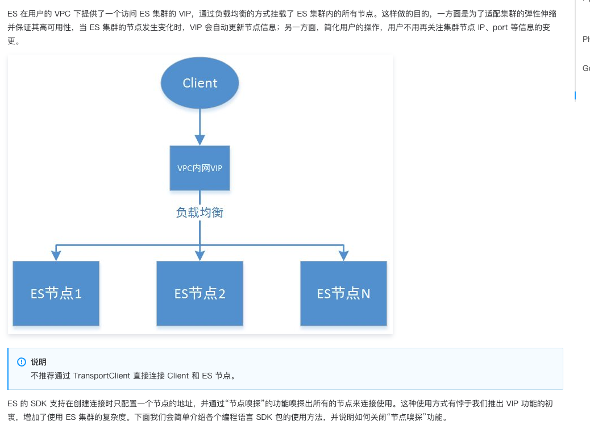

# ES版本升级遇到的问题
本文章记录的是ES版本从 6.3.2 升级 6.8.2 遇到的问题

## 1、客户端由TCP转为HTTP

https://cloud.tencent.com/document/product/845/19538

**解决方案**

使用rest-client

## 2、自建 ES 的 ik分词导致插入失败，腾讯云 ES 未出现问题

社区：https://github.com/infinilabs/analysis-ik/issues/662

看了代码，修复是从7.0.0开始的

bug代码是从6.7.0引进的，影响一直持续到6.8.4

**解决方案**

基于6.8.2代码移除问题代码

## 3、spring-data-elasticsearch 3.1以后jackson序列化丢失字段

社区：
https://github.com/spring-projects/spring-data-elasticsearch/issues/1126

**解决方案**

覆盖EntityMapper

## 4、注解自动生成的Mapping不一致
在旧版本中不会生成主字段的analyer、searchAnalyer，（当然两者一样则只会保留analyer、如果都是默认standard则会都不显示指定）

在新版版中会生成主字段的analyer、searchAnalyer，所以导致所用的分词器不对，导致搜索逻辑不通。

**解决方案**

恢复旧版本，去除主字段的analyer、searchAnalyer

如果内容一样，修改mapping后 其实可以reindex的，这样就无需重跑字段了