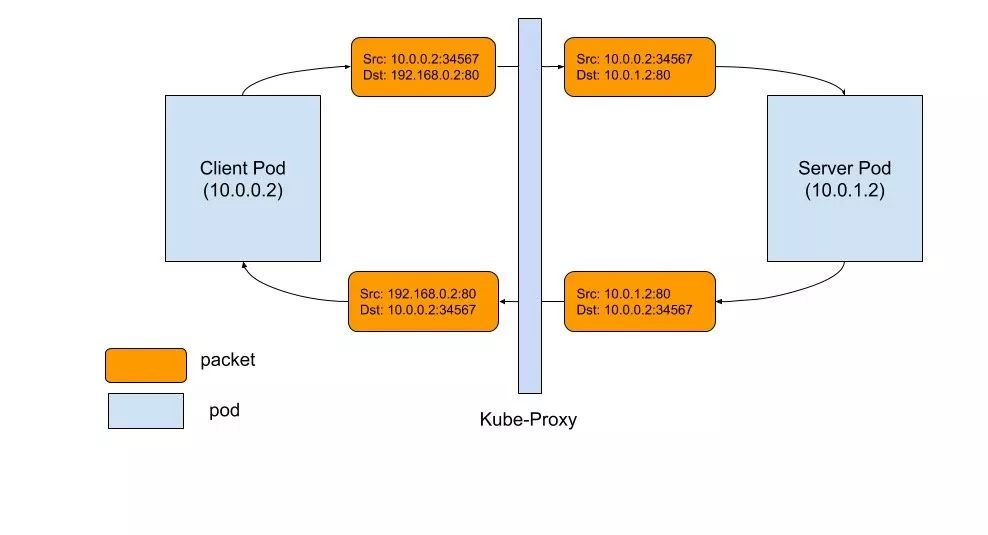
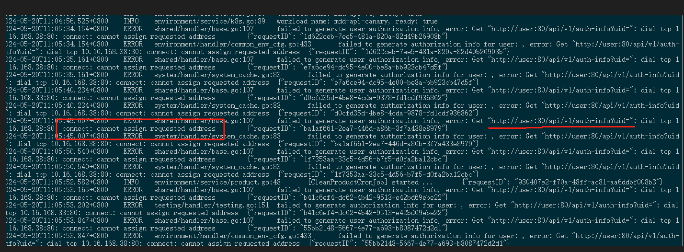
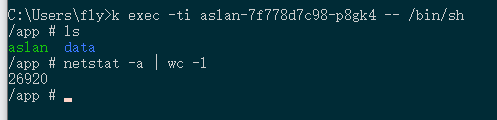
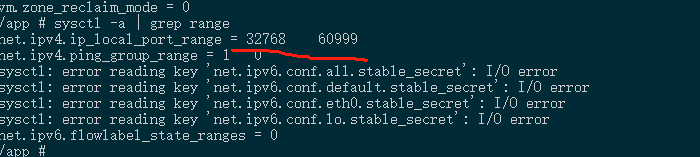
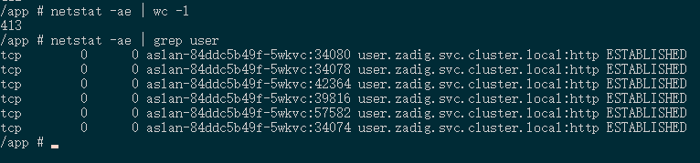
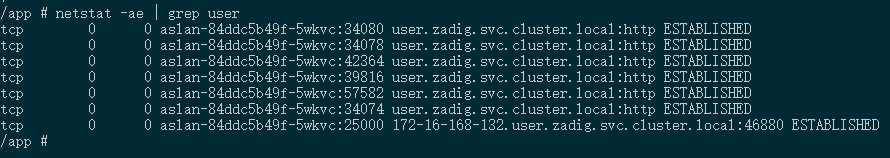

### 记一次Go的http连接池调优

Zadig在使用过程中，经常会出现aslan服务连接user鉴权时出现自身端口耗尽卡住无法操作，影响发布。本文记录Go的http的连接池调优的过程，以备后续遇到相同场景下适用。

#### 架构图



#### 错误







#### 分析

通过上述日志查看源代码发现aslan连接user鉴权失败，由于几乎没有请求都需要鉴权，请求数会比较多，导致出现cannot assign requested address（端口耗尽），通过错误现场定位发现客户端有大量（如图抓到一次高达26920个连接）的TIME_WAIT的tcp连接出现，导致aslan入口卡死，最终zadig无法对外提供服务。

##### 代码片段

- server（user）

  ```go
  // server使用go的net/http库，均为默认配置
  engine := rest.NewEngine()
  server := &http.Server{
      Addr:    ":80",
      Handler: engine,
      //IdleTimeout: 90 * time.Second,
  }
  ```

- client（aslan）

  ```go
  // 鉴权代码：
  //1. user.New()将会每次请求均创建http client
  //2. 系统无TIME_WAIT重用和销毁重用，使用系统默认配置导致回收不及时，导致端口耗尽
  func New() *Client {
  	host := config.UserServiceAddress()
  
  	c := httpclient.New(
  		httpclient.SetHostURL(host + "/api/v1"),
  	)
  
  	return &Client{
  		Client: c,
  		host:   host,
  	}
  }
  ```

#### 配置

- 思路

  至于如何复用http11连接池，我们采用JAVA微服务同样的思路，主要处理两个方面：

  1. 连接保活：采用http11的keep-alive，并对齐idle timeout时长，实现tcp层面保活复用，尽最大可能减少建连
  2. 池化：原理同所有的缓存机制一样，go中是通过配置net/http的transport实现

- 原理

  

代码片段

- server(user)

  ```go
  // server使用go的net/http库，均为默认配置
  engine := rest.NewEngine()
  server := &http.Server{
      Addr:    ":80",
      Handler: engine,
      //IdleTimeout: 90 * time.Second,
  }
  ```

- client(aslan)

  ```go
  // 池化
  // 1. MaxIdleConns: 最大闲置为100
  // 2. MaxIldeConnsPerHost = MaxConnsPerHost均为20
  // 3. IdleConnTimeout暂不配置（高qps不推荐）
  // 4. 考虑是后台发布系统（资源消耗不高），如果配置idle timeout，由于qps不高，经常会出现idle connection被回收殆尽，首次触发需要重建的情形影响体验
  // 5. 综上采用下面参数先试运行
  var PoolHttpClient *Client
  func New() *Client {
  	if PoolHttpClient == nil {
  		host := config.UserServiceAddress()
  		c := httpclient.New(
  			httpclient.SetHostURL(host + "/api/v1"),
  		)
  		// 设置连接池
  		c.Client.SetTransport(&http.Transport{
  			MaxConnsPerHost:     20,
  			MaxIdleConnsPerHost: 20,
  			MaxIdleConns:        100,
  			//IdleConnTimeout:     90 * time.Second,
  		})
  		PoolHttpClient = &Client{
  			Client: c,
  			host:   host,
  		}
  	}
  	return PoolHttpClient
  }
  ```

#### 效果展示





打包重启后，aslan到user的连接立马大幅下降并稳定到10以内，页面访问速度也得到提升

#### 参考链接

[当kube-proxy遇到连接重置](https://icloudnative.io/posts/kube-proxy-subtleties-debugging-an-intermittent-connection-reset/)