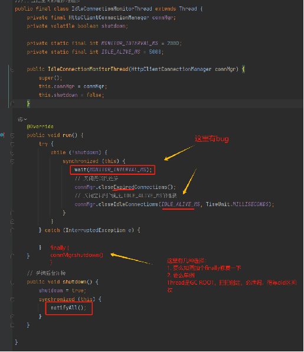

### 记一次Too Many Open Files的报错

应用服务突然出现大量的error报错，查看error日志主要抛出大量Too many open files的异常，以及由此引发了UnknownHostException异常，造成服务的cos模块无法使用，影响功能。本文主要记录异常的定位和优化手段，以备后续用到，特此记录。

#### 分析

通过上述错误日志和截图，发现有大量的`CLOSE_WAIT`，经`TCP`四元组提取分析均为腾讯`COS`的连接，导致`too many open files`报错，最终造成jvm进程卡住无法使用。回顾`TCP`的挥手过程，猜测腾讯云`SDK`持有`httpclient`，出现大量`CLOSE_WAIT`可能是业务`connection`泄漏导致，需进一步分析代码定位。

#### 代码片段

- SDK

  ```java
  //用于监控空闲的连接池连接
  public final class IdleConnectionMonitorThread extends Thread {
   private final HttpClientConnectionManager connMgr;
   private volatile boolean shutdown;
  
   private static final int MONITOR_INTERVAL_MS = 2000;
   private static final int IDLE_ALIVE_MS = 5000;
  
   public IdleConnectionMonitorThread(HttpClientConnectionManager connMgr) {
       super();
       this.connMgr = connMgr;
       this.shutdown = false;
   }
  
   @Override
   public void run() {
       try {
           while (!shutdown) {
               synchronized (this) {
                   wait(MONITOR_INTERVAL_MS);
                   // 关闭无效的连接
                   connMgr.closeExpiredConnections();
                   // 关闭空闲时间超过IDLE_ALIVE_MS的连接
                   connMgr.closeIdleConnections(IDLE_ALIVE_MS, TimeUnit.MILLISECONDS);
               }
           }
       } catch (InterruptedException e) {
  
       }
   }
  
   // 关闭后台连接
   public void shutdown() {
       shutdown = true;
       synchronized (this) {
           notifyAll();
       }
   }
  
  }
  ```

- 业务使用

  ```java
  /**
       * 分块上传,当需要上传大于5G文件,使用此种上传方式
       * @return
       */
  public static UploadResult transferFile(File file,String cloudName,String bucketName,String region){
  
  
      TransferManager transferManager = createTransferManager(region);
      PutObjectRequest putObjectRequest = new PutObjectRequest(bucketName, cloudName, file);
  
      //若需要设置对象的自定义 Headers 可参照下列代码,若不需要可省略下面这几行,对象自定义 Headers 的详细信息可参考https://cloud.tencent.com/document/product/436/13361
      // ObjectMetadata objectMetadata = new ObjectMetadata();
      //若设置Content-Type、Cache-Control、Content-Disposition、Content-Encoding、Expires这五个字自定义 Headers，推荐采用objectMetadata.setHeader()
      //objectMetadata.setHeader(key, value);
      //若要设置 “x-cos-meta-[自定义后缀]” 这样的自定义 Header，推荐采用
      //Map<String, String> userMeta = new HashMap<String, String>();
      //userMeta.put("x-cos-meta-[自定义后缀]", "value");
      //objectMetadata.setUserMetadata(userMeta);
      //putObjectRequest.withMetadata(objectMetadata);
      UploadResult uploadResult = null;
      try {
          // 高级接口会返回一个异步结果Upload
          // 可同步地调用 waitForUploadResult 方法等待上传完成，成功返回UploadResult, 失败抛出异常
          Upload upload = transferManager.upload(putObjectRequest);
          uploadResult = upload.waitForUploadResult();
      } catch (CosServiceException e) {
          throw new TencentException(e.getErrorCode(),e.getErrorMessage());
      } catch (CosClientException e) {
          throw e;
      } catch (InterruptedException e) {
          log.error("transferFile error,fileName:{},cause:",file.getName(),e);
          return null;
      }finally {
          transferManager.shutdownNow(true);
      }
      return uploadResult;
  }
  
  // 创建 TransferManager 实例，这个实例用来后续调用高级接口
  private static TransferManager createTransferManager(String region) {
      // 创建一个 COSClient 实例，这是访问 COS 服务的基础实例。
      // 详细代码参见本页: 简单操作 -> 创建 COSClient
      COSClient cosClient = new COSClient(new BasicCOSCredentials(TxTranscodeConstant.SECRET_ID, TxTranscodeConstant.SECRET_KEY),new ClientConfig(new Region(region)));
  
  
      // 自定义线程池大小，建议在客户端与 COS 网络充足（例如使用腾讯云的 CVM，同地域上传 COS）的情况下，设置成16或32即可，可较充分的利用网络资源
      // 对于使用公网传输且网络带宽质量不高的情况，建议减小该值，避免因网速过慢，造成请求超时。
      ExecutorService threadPool = Executors.newFixedThreadPool(32);
  
      // 传入一个 threadpool, 若不传入线程池，默认 TransferManager 中会生成一个单线程的线程池。
      TransferManager transferManager = new TransferManager(cosClient, threadPool);
  
      // 设置高级接口的配置项
      // 分块上传阈值和分块大小分别为 5MB 和 1MB
      TransferManagerConfiguration transferManagerConfiguration = new TransferManagerConfiguration();
      transferManagerConfiguration.setMultipartUploadThreshold(5*1024*1024);
      transferManagerConfiguration.setMinimumUploadPartSize(1*1024*1024);
      transferManager.setConfiguration(transferManagerConfiguration);
  
      return transferManager;
  }
  ```
  

#### 调优

通过关键代码分析定位结合业务使用情况，可能是释放`connection`有`bug`，导致`active connection`未能释放，被`Thread`一直持有并带入`Old`区，导致`fd`耗尽，出现`too many open files`的报错。

###### 临时调优

- 调高系统的`max files`上限参数
- 主动触发`FGC`先让业务跑起来，临时通过监控`fd`值触发`FGC`主动发起脚本

###### 后续调优

- 调整业务代码使用方式，修改为单例模式
- 修复`SDK bug`

#### 修复方式

```java
/**
IdeleConnectionMonitorThread.java
添加 connMgr.shutdonw()释放connection
**/
public final class IdleConnectionMonitorThread {
    @Override
    public void run() {
        try {
            // do something
            // xxxx
        } catch(InterruptedException ignore){
        } finally {
            connMgr.shutdown()
        }
    }
}
```

