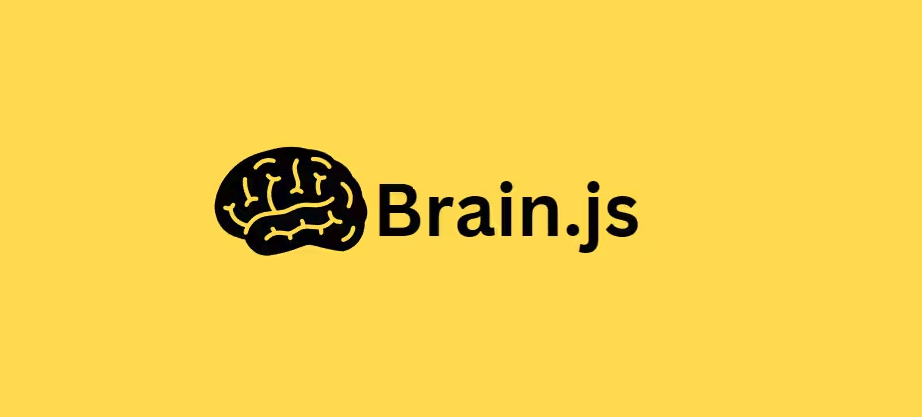
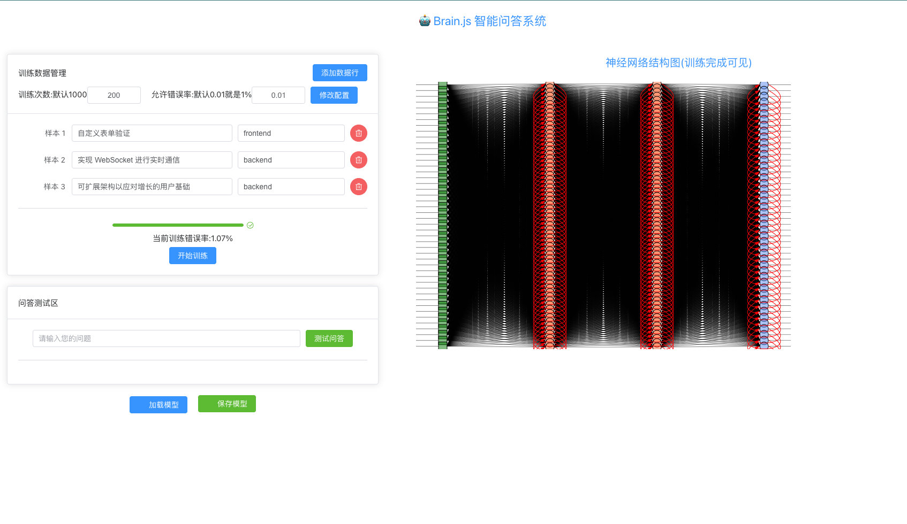

# brainJS初体验

## 前言
近期DeepSeek的迅速崛起在人工智能领域掀起了新一轮技术热潮，这种行业动态激发了我对AI技术体系深入探索的强烈兴趣。在体验其功能的过程中，我逐渐形成了对AI技术体系的系统性思考：作为技术探索者，究竟需要构建怎样的知识图谱才能真正理解智能模型的运行机理？由于缺乏人工智能领域的系统知识储备，对机器学习模型训练等核心概念尚未建立清晰认知，这种知识断层促使我开启了一场结构化学习之旅。

基于技术人员的思维惯性，我选择以前端AI工具库作为认知切入点。通过系统梳理Brain.js、TensorFlow.js、ONNX.js等主流前端推理框架的技术特性，结合计算机视觉、自然语言处理等典型应用场景的实践验证，逐步构建从模型部署到推理优化的完整知识框架。


## 大纲目录(你可以了解到的知识)
* Brain.js概述
* 核心功能与重点分析(⭐核心部分⭐️)
* 应用场景
* 性能与局限
* 参数说明
* demo体验与代码分享,优化分享
* 常见避坑指南

## Brain.js概述(一句话概括:前端入门级AI库)

1.定义与定位
* JavaScript神经网络库
* 浏览器/Node.js双端兼容
* 面向快速原型开发与简单AI任务

2.核心特性
* 无需深度学习背景
* 基于反向传播算法
* 支持JSON模型持久化

## 核心功能与重点分析(⭐核心部分⭐️)
该部分仅说明其中几个网络类型,更多的网络类型大家可以到官网文档查看
[Brain.js](https://www.npmjs.com/package/brain.js?activeTab=readme#for-training-with-rnn-lstm-and-gru)

### 1️⃣ 基础前馈神经网络（brain.NeuralNetwork）
* 特点：
  * 单向传播：数据从输入层→隐藏层→输出层单向流动，无循环连接。 
  * 静态处理：每次输入独立处理，无记忆功能。 
  * 结构简单：仅需定义隐藏层数和节点数即可构建。
* 适用场景：
  1. 模式分类
     * 示例:垃圾邮件检测(输入为词频想了,输出为二分类)
     * 代码片段
  ```js
  net.train([
    { input: { "free": 1, "win": 1 }, output: { spam: 1 } },
    { input: { "meeting": 1, "report": 1 }, output: { normal: 1 } }
  ]);
   
  ```
  2. 数值回归
      * 如房价预测(输入为面积、房间数,输出为价格)
  3. 简单逻辑问题
     * 经典案例：解决XOR非线性问题（输入[0,0]→0, [0,1]→1等）
* 局限:无法处理序列数据(如对话、时间序列),输入必须为固定维度

---

### 2️⃣ 递归神经网络（brain.recurrent.RNN）
* 特点：
  * 时序记忆：通过隐藏状态传递历史信息。
  * 循环结构：每个时间步共享权重，处理变长输入。
  * 轻量级：参数量小于LSTM，训练速度更快。
* 适用场景：
  1. 短文本生成
    * 示例：自动生成诗歌（输入为字符序列）
    * 代码片段
  ```js
    const rnn = new brain.recurrent.RNN();
    rnn.train([
      { input: "春", output: "眠不觉晓" },
      { input: "举头", output: "望明月" }
    ]);
   ```
  2.  简单时间序列预测
    * 示例：预测次日天气（基于过去3天数据）
  3. 词性标注
    * 输入：单词序列 → 输出：对应词性标签

* 局限:长期依赖处理能力弱，对话超过5轮后可能丢失关键信息。

---
### 3️⃣ 长短期记忆网络（brain.recurrent.LSTM）
* 特点：
  * 门控机制：通过遗忘门、输入门、输出门控制信息流。
  * 长期记忆：可记住数百步前的关键信息。
  * 复杂结构：参数量是RNN的4倍，需更多训练数据。
* 适用场景：
  1. 对话系统（客服机器人）
  * 为何选择LSTM：
    * 用户提问：“我要退货，上周买的商品”
    * 需记忆“退货”意图+“上周”时间信息，LSTM可跨多轮对话保持上下文
  ```js
    const lstm = new brain.recurrent.LSTM();
    lstm.train([
    { input: "如何退货", output: "请提供订单号" },
    { input: "订单号是123", output: "已处理退货申请" }
    ]);
  ```
  2.  机器翻译
  * 示例：中译英时需保持主谓宾顺序一致性
  3. 情感分析（上下文相关）
  * 例句：“虽然慢但质量好”需结合转折词理解真实情感

* 局限:性能消耗较高,内存占用高。

---

## 应用场景

1. 模式识别
   * 图像、数据简单分类(图像需预处理为像素图像)
2. 自然语言处理
   * 情感分析(词频统计+特征向量)
   * 自动补全预测
3. 游戏AI
   * 决策树简化实现
   * 非玩家角色行为预测
4. 时序预测
   * 股票趋势分析(需结合LSTM)
   * 设备故障预警

## 性能与局限
1. 优势
   * 开发效率高（5行代码实现基础网络） 
   * 浏览器端实时推理 
   * 模型轻量化（JSON格式<100KB）
2. 局限 
   * 不支持GPU加速 
   * 单线程训练 
   * 输入维度限制（建议<1000个特征） 
   * 无预训练模型支持

## 参数说明(⭐核心部分⭐️)

这里有两组特别重要的训练参数,会直接影响训练的效果,所以我们要提前了解,后续我们也会在实际项目当中运用

### 一、创建神经网络时的配置参数（决定大脑结构）
就像搭积木一样，这些参数决定了神经网络的"身体结构"

```js
const config = {
  // 二分类阈值（0-1），输出>=该值视为true
  binaryThresh: 0.5,  

  // 隐藏层结构，如[5,5]表示两个隐藏层每层5个神经元
  hiddenLayers: [3],  

  // 激活函数类型（核心数学变换）
  activation: 'sigmoid',  // 可选: sigmoid/relu/leaky-relu/tanh

  // Leaky ReLU的负区间斜率（仅activation='leaky-relu'时生效）
  leakyReluAlpha: 0.01   
};
```

#### 1. `binaryThresh: 0.5` - 及格分数线
- **作用**：  
  当输出结果是`0`或`1`的二分类问题时，这个值相当于及格线。  
  比如设置`0.6`，神经网络输出`0.7`时算及格（判定为1），输出`0.59`算不及格（判定为0）

- **类比**：  
  考试60分及格，这个参数就是调整及格线到50分还是70分

- **怎么调**：  
  如果发现神经网络太容易说"是"，就调高这个值（比如0.7）让它更严格

#### 2. `hiddenLayers: [3]` - 隐藏层设置
- **作用**：  
  决定神经网络有多少层"思考层"，每层有多少"脑细胞"  
  `[3]`表示有1层隐藏层，这层有3个神经元  
  `[5, 3]`表示有2层，第一层5个神经元，第二层3个

- **类比**：  
  就像建房子：
  - `[3]` → 平房，3个房间
  - `[5,3]` → 二层小楼，一楼5个房间，二楼3个房间

- **新手建议**：  
  先从简单的`[3]`开始，效果不好再加层数和神经元

#### 3. `activation: 'sigmoid'` - 激活函数（脑细胞的工作方式）
- **作用**：  
  决定每个"脑细胞"如何处理接收到的信息，就像不同工种的人有不同的工作方式

- **常见类型**：

| 类型         | 特点                       | 适用场景          |
|--------------|-----------------------------|---------------|
| `sigmoid`    | 把结果压缩到0-1之间           | 二分类问题（最常用|
| `relu`       | 处理正数很积极，负数直接忽略  | 图像识别          |
| `tanh`       | 把结果压缩到-1到1之间         | 需要区分正负的场景 |
| `leaky-relu` | 对负数也稍微处理一下          | 防止某些神经元罢工 |

- **新手选择**：  
  如果不确定，先用`sigmoid`，效果不好再换其他试试

#### 4. `leakyReluAlpha: 0.01` - 漏水的阀门
- **作用**：  
  只有当使用`leaky-relu`激活函数时才有用！控制处理负数时的"漏水程度"

- **类比**：  
  就像水龙头关不严：
  - 值设为0.01 → 每秒钟漏1滴水
  - 值设为0.1 → 每秒钟漏10滴水

- **新手建议**：  
  保持默认值0.01就好，不需要特别调整

---

### 二、训练时的参数（决定学习方式）
就像上学时的课程表，这些参数决定了神经网络怎么学习

```js
net.train(data, {
  iterations: 20000,    // 最大迭代次数
  errorThresh: 0.005,   // 目标误差阈值（达到则提前终止）
  log: true,            // 是否输出训练日志
  logPeriod: 100,       // 每隔多少迭代输出一次日志
  learningRate: 0.01    // 权重更新步长（最核心参数）
});
```
#### 1. `iterations: 20000` - 最大学习次数
- **作用**：  
  设定最多学多少遍，就像"这道题最多做2万遍，不会就算了"

- **常见问题**：
  - 设太小 → 还没学会就停止（学渣行为）
  - 设太大 → 浪费时间和计算资源（书呆子）

- **调试技巧**：  
  配合`errorThresh`使用，看到误差不再下降就可以提前停止

#### 2. `errorThresh: 0.005` - 及格分数线
- **作用**：  
  当预测误差小于这个值时就提前毕业，比如：
  - 设0.01 → 允许有1%的误差
  - 设0.001 → 要求误差小于0.1%

- **类比**：  
  考试95分算优秀，可以提前交卷

- **新手建议**：  
  先从0.01开始，慢慢往低调

#### 3. `log: true` - 学习报告
- **作用**：  
  是否在控制台打印学习进度，就像学习时要不要写日记

- **推荐设置**：  
  训练时一定要打开，可以看到误差是不是在下降

#### 4. `logPeriod: 100` - 报告频率
- **作用**：  
  每隔多少遍学习打印一次进度，就像：
  - 设100 → 每学习100遍报告一次
  - 设10 → 每10遍就报告一次

- **建议值**：  
  数据量大时设大点（500），数据少可以设小点（50）

#### 5. `learningRate: 0.01` - 学习速度
- **最重要参数**！就像学习时迈的步子大小：
  - 值太大 → 步子太大容易错过正确答案（在正确答案附近晃悠）
  - 值太小 → 步子太小学得太慢（蜗牛速度）

- **黄金法则**：
  ```text
  0.1 → 适用于简单问题
  0.01 → 大多数情况的起点
  0.001 → 复杂问题或深层网络

## demo体验与代码分享,优化分享(部署在github上,无法打开则需要梯子🪜)



[demo体验地址](https://jerryq1.github.io/brain/#/)

[源码地址](https://github.com/jerryq1/brain/)


### 核心代码
* modelstore.js
* worker.js

#### modelstore.js
```js
import {defineStore} from 'pinia';
import {recurrent} from 'brain.js';
import {ElMessage} from 'element-plus'


export const useModelStore = defineStore('model', {
  state: () => ({
    net: new recurrent.LSTM(
      {
        hiddenLayers: [64, 64],  // 双隐藏层增强表达能力
        learningRate: 0.01
      }
    ), // 神经网络实例
    trainingData: [
      {"input": "自定义表单验证", "output": "frontend"}, // 前端任务
      {"input": "实现 WebSocket 进行实时通信", "output": "backend"}, // 后端任务
      {"input": "视差滚动效果", "output": "frontend"}, // 前端任务
      {"input": "安全存储用户密码", "output": "backend"}, // 后端任务
      {"input": "创建主题切换器（深色/浅色模式)", "output": "frontend"}, // 前端任务
      {"input": "高流量负载均衡", "output": "backend"}, // 后端任务
      {"input": "为残疾用户提供的无障碍功能", "output": "frontend"}, // 前端任务
      {"input": "可扩展架构以应对增长的用户基础", "output": "backend"} // 后端任务 ];

  
    ],         // 训练数据
    isTraining: false,        // 是否正在训练
    trainingProgress: 0,      // 训练进度
    iterations: 1000,
    errorThresh: 0.01,
    worker: null, // 添加 worker 引用
    errorThreshNow: null

  }),
  actions: {
    // 初始化 Worker
    initWorker() {
      if (!this.worker) {
        this.worker = new Worker(new URL('./model/worker.js', import.meta.url), {
          type: 'module'
        });

        this.worker.onmessage = (e) => {

          console.log(e, 'eee');
          const msg = e.data;
          switch (msg.type) {
            case 'progress':
              if (msg.progress) this.trainingProgress = msg.progress;
              if (msg.errorThreshNow) this.errorThreshNow = msg.errorThreshNow
              break;
            case 'complete':
              this.net.fromJSON(msg.model);
              this.isTraining = false;
              this.trainingProgress = 100;
              ElMessage.success(`训练完成！`);
              break;
            case 'error':
              this.isTraining = false;
              ElMessage.error(`训练失败: ${msg.error}`);
              break;
            case 'svg':
              document.getElementById('networkVisualization').innerHTML = msg.svg;
              break;
          }
        };
      }
    },
    // 修改后的训练方法
    async trainModel() {
      if (!this.worker) this.initWorker();

      this.isTraining = true;
      this.trainingProgress = 0;

      this.worker.postMessage({
        trainingData: JSON.parse(JSON.stringify(this.trainingData)),
        iterations: this.iterations,
        errorThresh: this.errorThresh
      });
    },

    // 销毁 Worker 防止内存泄漏
    cleanup() {
      if (this.worker) {
        this.worker.terminate();
        this.worker = null;
      }
    },

    // 添加训练数据
    addTrainingData(input, output) {
      this.trainingData.push({input, output});
    },
    changeOptions(iterations, errorThresh) {
      this.errorThresh = errorThresh
      this.iterations = iterations
      ElMessage.success('修改配置成功！')
      console.log(this);
    },
    // 训练模型 
    // 若是直接在主线程训练,则会导致页面主线程阻塞,页面卡顿无法渲染
    // async trainModel() {
    //   console.log('执行');
    //   this.isTraining = true;
    //   console.log(this.isTraining, 'isTraining');
    //   this.net.train(this.trainingData, {
    //     iterations: this.iterations,
    //     errorThresh: this.errorThresh, // the acceptable error percentage from training data --> number between 0 and 1
    //     log: true,
    //     learningRate: 0.3, //随着delta的缩放以影响训练率-->介于0和1之间的数字动量
    //     logPeriod: 100,
    //     callbackPeriod: 100,
    //     callback: () => {
    //       console.log('callback');
    //       this.trainingProgress += 1
    //       console.log(this.trainingProgress, 'this.trainingProgress');
    //     }
    //   });
    //   this.isTraining = false;
    //   this.trainingProgress = 100
    //   console.log(this.isTraining, 'isTraining');
    //
    //   console.log(this.trainingProgress, 'this.trainingProgress');
    //
    // },
    // 测试模型
    testModel(input) {
      return this.net.run(input);
    },
    // 保存模型
    saveModel() {
      const modelJson = this.net.toJSON();
      const blob = new Blob([JSON.stringify(modelJson)], {type: 'application/json'});
      const url = URL.createObjectURL(blob);
      const a = document.createElement('a');
      a.href = url;
      a.download = 'model.json';
      a.click();
    },
    // 加载模型
    loadModel(file) {
      const reader = new FileReader();
      reader.onload = (e) => {
        const modelJson = JSON.parse(e.target.result);
        this.net.fromJSON(modelJson);
      };
      reader.readAsText(file);
    },
  },
});
```

#### worker.js
```js
// model.worker.js
import {recurrent,utilities} from 'brain.js';

self.addEventListener('message', async (e) => {
  const {trainingData, iterations, errorThresh} = e.data;

  // 创建独立网络实例
  const net = new recurrent.LSTM({
    hiddenLayers: [64, 64],  // 双隐藏层增强表达能力
    learningRate: 0.01
  });

  try {
    self.postMessage('进入worker');
    const model = net.train(trainingData, {
      iterations,
      errorThresh,
      log: true,
      learningRate: 0.01,
      logPeriod: 100,
      callbackPeriod: 100,
      callback: (status) => {
        // 发送训练进度
        if ( status && typeof status.iterations === "number" && status.iterations < iterations) {
          self.postMessage({
            type: 'progress',
            progress: (status.iterations / iterations * 100),
            errorThreshNow:status.error
          });
        }

      }
    });

    // 训练完成发送结果
    
    // 下面这行必须要,否则会因为训练成果序列化(net.toJSON())报错
    net.trainOpts.callback = null
    self.postMessage({
      type: 'complete',
      model: net.toJSON(),
    });
    const svg = utilities.toSVG(net,{
      width:800,
      height:500
    });
    self.postMessage({
      type: 'svg',
      svg
    });

  } catch (error) {
    self.postMessage({
      type: 'error',
      error: error.message
    });
  }
});

```

### 优化
* 数据分批训练（mini-batch）
* WebWorker 多线程处理(上述案例就使用了WebWorker去处理,否则主页面会因为训练占用主线程导致页面卡死)

## 常见错误避坑指南

### ❌错误1:学习率太大

```js
// 症状：输出误差出现NaN（不是数字）
learningRate: 0.1 // 对于复杂问题太大
// 修正：改为0.01或更小
```

官方文档默认0.3,然后我使用这个参数训练了一个**智障**,直到我理解了每一个参数的意义

### ❌错误2:隐藏层太多

```js
// 症状：训练结果随机乱猜
hiddenLayers: [100, 50, 30] // 数据量小时容易过拟合
// 修正：改为[5]或[3,3]
```

### ❌错误3:不看训练日志

```js
// 症状：不知道训练是否有效
log: false // 关闭日志就像蒙眼开车
// 修正：一定要打开log并观察误差是否下降
```


### 总结

1. 先定结构：从hiddenLayers: [3]和sigmoid开始

2. 快速试跑：用默认学习率(0.01)训练1000次看误差趋势

3. 精细调整：
   * 误差下降慢 → 增大学习率/增加迭代次数

   * 误差震荡 → 减小学习率

   * 误差不降 → 简化网络结构或检查数据

记住：调参就像炒菜，火候（学习率）和食材（网络结构）要配合才能做出好菜！
