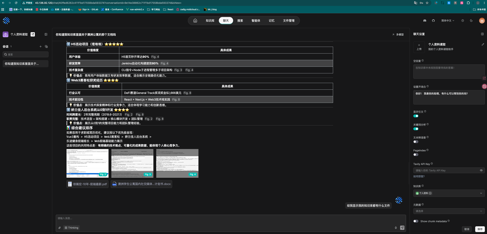
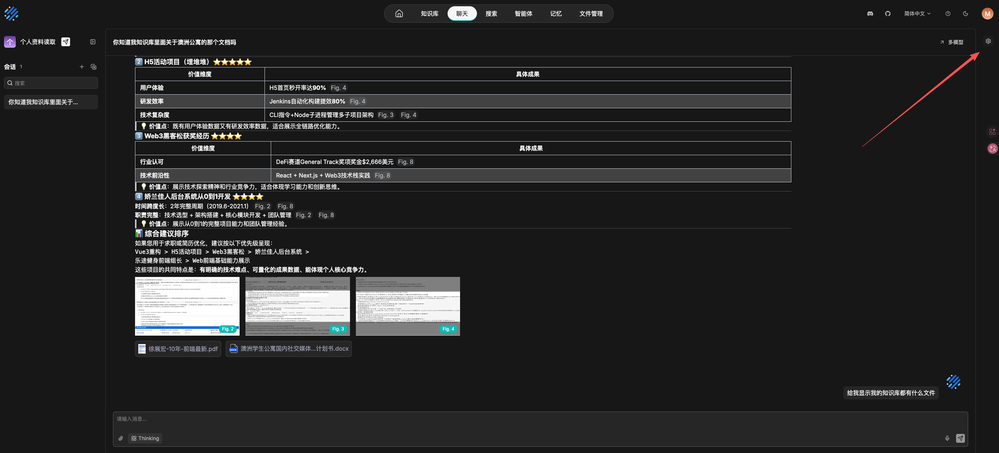

# RAGFlow 安装部署文档（Ubuntu 24.04 + Docker）

## 效果展示

**安装成功**:



**聊天设置在右上角**:

* 需要关联知识库才能实现RAG知识库



## 注意事项

## 一、环境要求

| 项目 | 要求 |
|------|------|
| 操作系统 | Ubuntu 22.04 / 24.04 |
| CPU | 2核+（推荐4核） |
| 内存 | 8GB+（推荐16GB） |
| 硬盘 | 50GB+ |
| 网络 | 能访问 Docker Hub（国内需配置镜像加速） |

## 二、安装 Docker 和 Docker Compose

```bash
# 更新系统
sudo apt update && sudo apt upgrade -y

# 安装依赖
sudo apt install -y ca-certificates curl gnupg lsb-release git

# 添加 Docker 官方 GPG 密钥
sudo mkdir -p /etc/apt/keyrings
curl -fsSL https://download.docker.com/linux/ubuntu/gpg | sudo gpg --dearmor -o /etc/apt/keyrings/docker.gpg

# 添加 Docker 仓库
echo "deb [arch=$(dpkg --print-architecture) signed-by=/etc/apt/keyrings/docker.gpg] https://download.docker.com/linux/ubuntu $(lsb_release -cs) stable" | sudo tee /etc/apt/docker.list > /dev/null

# 安装 Docker
sudo apt update
sudo apt install -y docker-ce docker-ce-cli containerd.io docker-compose-plugin

# 启动 Docker 并设置开机自启
sudo systemctl start docker
sudo systemctl enable docker

# 验证安装
docker --version
docker compose version
```

## 三、配置 Docker 镜像加速（国内服务器必须）

```bash
# 配置镜像加速器
sudo mkdir -p /etc/docker
sudo tee /etc/docker/daemon.json <<-'EOF'
{
  "registry-mirrors": [
    "https://docker.m.daocloud.io",
    "https://docker.unsee.tech",
    "https://docker.1panel.live",
    "https://hub.rat.dev"
  ]
}
EOF

# 重启 Docker
sudo systemctl daemon-reload
sudo systemctl restart docker
```

## 四、克隆 RAGFlow 代码

```bash
# 创建项目目录
sudo mkdir -p /opt/ragflow
cd /opt/ragflow

# 克隆代码
sudo git clone https://github.com/infiniflow/ragflow.git .

# 进入 docker 目录
cd docker
```

## 五、配置系统参数（必须）

```bash
# 设置 Elasticsearch 所需的内存映射限制
sudo sysctl -w vm.max_map_count=262144

# 使配置永久生效
echo "vm.max_map_count=262144" | sudo tee -a /etc/sysctl.conf
```

## 六、（可选）限制 Elasticsearch 内存

在内存较小的服务器（如8GB）上，建议限制 Elasticsearch 的内存使用：

```bash
# 在 elasticsearch 配置段中添加内存限制
sudo sed -i '/es01:/,/image:/ s/mem_limit:.*/mem_limit: 2g/' /opt/ragflow/docker/docker-compose-base.yml
```

## 七、启动 RAGFlow 并执行修复

```bash
# 启动所有服务（首次启动会自动拉取镜像）
sudo docker compose up -d

# 【关键修复】等待10秒后，主动修复可能存在的数据库初始化问题
echo "等待服务启动并进行预防性修复..."
sleep 10
sudo docker exec docker-ragflow-cpu-1 bash -c "mkdir -p /ragflow/tools/scripts && touch /ragflow/tools/scripts/mysql_migration.py" 2>/dev/null

# 等待所有服务完全启动
echo "等待服务完全启动 (约30秒)..."
sleep 30
```

## 八、验证服务状态

```bash
# 查看容器运行状态
sudo docker ps

# 测试本地服务端口（使用重试机制）
curl --retry 5 --retry-delay 2 --retry-connrefused -s -o /dev/null -w "HTTP状态码: %{http_code}\n" http://localhost:80

# 查看日志（如遇问题）
sudo docker compose logs --tail 50
```

## 九、访问 RAGFlow

启动成功后，通过浏览器访问：
```
http://<服务器IP>
```

首次访问需要：
1. 注册账号（第一个注册的账号自动成为管理员）
2. 登录后即可使用

## 十、常见问题及解决方案

### 10.1 镜像拉取失败 / 超时

**问题**：`Error response from daemon: failed to resolve reference... i/o timeout`

**解决**：已配置镜像加速器，如仍失败，尝试手动拉取：
```bash
sudo docker pull infiniflow/ragflow:v0.25.6
sudo docker pull mysql:8.0.39
sudo docker pull valkey/valkey:8
sudo docker pull elasticsearch:8.11.3
sudo docker pull pgsty/minio:RELEASE.2026-03-25T00-00-00Z
```

### 10.2 容器不断重启 / `mysql_migration.py` 文件不存在

**问题**：日志显示 `python3: can't open file '/ragflow/tools/scripts/mysql_migration.py'`

**解决**：手动进入容器创建空文件
```bash
# 方法1：直接创建
sudo docker exec docker-ragflow-cpu-1 bash -c "mkdir -p /ragflow/tools/scripts && touch /ragflow/tools/scripts/mysql_migration.py"

# 方法2：循环尝试（适用于容器不断重启的情况）
while ! sudo docker exec -it docker-ragflow-cpu-1 bash -c "mkdir -p /ragflow/tools/scripts && touch /ragflow/tools/scripts/mysql_migration.py && echo 'File created'"; do
    echo "Waiting for container..."
    sleep 1
done
```

### 10.3 无法访问 Web 界面

**问题**：浏览器打不开 `http://<服务器IP>`

**排查步骤**：
```bash
# 1. 检查容器是否运行
sudo docker ps | grep ragflow

# 2. 测试本地端口
curl -I http://localhost:80

# 3. 检查 Ubuntu 防火墙
sudo ufw status

# 4. 检查云服务器安全组（腾讯云/阿里云）
# 需要放行 TCP:80 端口，来源 0.0.0.0/0
```

### 10.4 响应速度慢

**问题**：问答响应时间很长（如 80+ 秒）

**原因**：
- Top N 或 Top-K 值设置过大（应设为 8-30）
- 系统提示词要求"详细列举"导致 Token 爆炸
- Rerank 模型开启
- 服务器内存不足

**解决**：
```bash
# 检查服务器内存
free -h

# 如果内存不足，考虑升级或关闭不必要的功能
# 在聊天助手配置中：
# - Top N 设置为 8-30（不要设 1024）
# - Rerank 模型选择"无"
# - 系统提示词避免"详细列举"等要求
```

### 10.5 创建聊天时无知识库选项

**问题**：点击"创建聊天"只弹出名称输入框，没有知识库绑定选项

**原因**：未配置模型提供商

**解决**：
1. 点击右上角用户头像 → **模型提供商**
2. 添加可用的**对话模型**（如 Qwen、DeepSeek 等）
3. 添加可用的**嵌入模型**（如 bge-m3、bge-large-zh 等）
4. 配置完成后刷新页面

### 10.6 回答显示"思考过程"（很奇怪的内容）

**问题**：回答前面显示一大段"Thinking..."分析过程

**原因**：使用了 DeepSeek R1 等推理模型，或开启了"推理"模式

**解决**：
- 方案一：更换为普通对话模型（如 qwen-turbo）
- 方案二：在系统提示词末尾加上"不要输出思考过程，直接回答"
- 方案三：在提示引擎配置中关闭"推理"开关

## 十一、常用管理命令

```bash
cd /opt/ragflow/docker

# 停止所有服务
sudo docker compose down

# 重启所有服务
sudo docker compose restart

# 查看日志
sudo docker compose logs -f

# 查看特定容器日志
sudo docker logs docker-ragflow-cpu-1 --tail 50

# 进入 RAGFlow 容器
sudo docker exec -it docker-ragflow-cpu-1 bash

# 更新代码和镜像
cd /opt/ragflow
sudo git pull
sudo docker compose down
sudo docker compose up -d

# 重新执行修复（更新后可能需要）
sleep 10
sudo docker exec docker-ragflow-cpu-1 bash -c "mkdir -p /ragflow/tools/scripts && touch /ragflow/tools/scripts/mysql_migration.py" 2>/dev/null
```

## 十二、卸载清理

```bash
cd /opt/ragflow/docker

# 停止并删除所有容器、网络、卷
sudo docker compose down -v

# 删除代码目录
sudo rm -rf /opt/ragflow

# （可选）删除 Docker 镜像
sudo docker rmi infiniflow/ragflow:v0.25.6 mysql:8.0.39 valkey/valkey:8 elasticsearch:8.11.3 pgsty/minio:RELEASE.2026-03-25T00-00-00Z
```

## 十三、一键安装脚本

以下是一键安装脚本，可直接复制执行：

```bash
#!/bin/bash
set -e

echo "=== RAGFlow 一键安装脚本 ==="

# 1. 设置系统参数
sudo sysctl -w vm.max_map_count=262144
echo "vm.max_map_count=262144" | sudo tee -a /etc/sysctl.conf

# 2. 克隆代码
sudo mkdir -p /opt/ragflow
cd /opt/ragflow
sudo git clone https://github.com/infiniflow/ragflow.git .

# 3. 启动服务
cd docker
sudo docker compose up -d

# 4. 修复数据库初始化问题
echo "等待服务启动并进行修复..."
sleep 10
sudo docker exec docker-ragflow-cpu-1 bash -c "mkdir -p /ragflow/tools/scripts && touch /ragflow/tools/scripts/mysql_migration.py" 2>/dev/null

# 5. 等待服务完全启动
sleep 30

# 6. 验证
echo "=== 验证服务状态 ==="
sudo docker ps
curl --retry 5 --retry-delay 2 --retry-connrefused -s -o /dev/null -w "HTTP状态码: %{http_code}\n" http://localhost:80

echo "=== 安装完成 ==="
echo "请访问 http://$(curl -s ifconfig.me) 进行注册"
```

