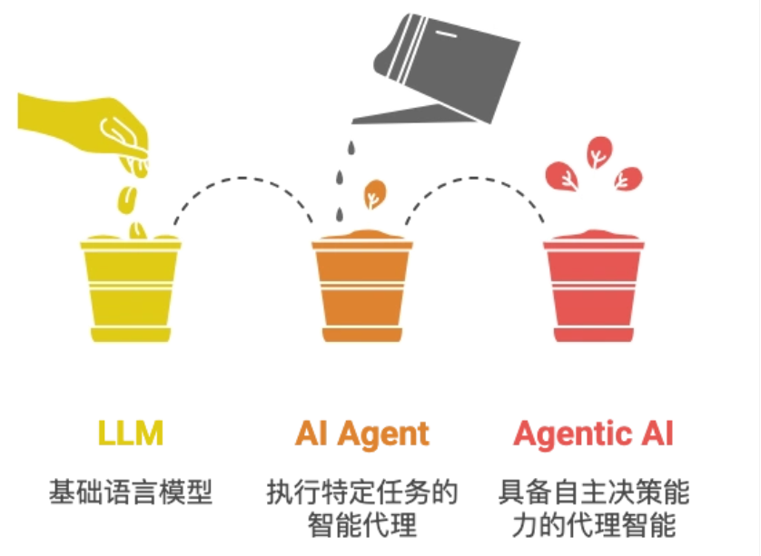
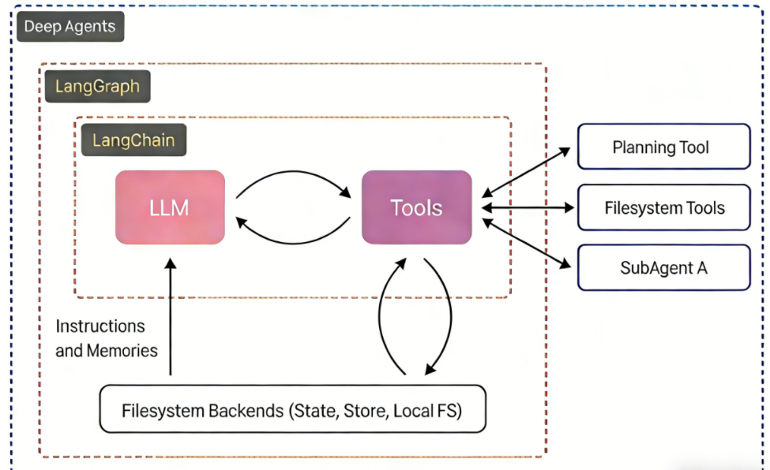
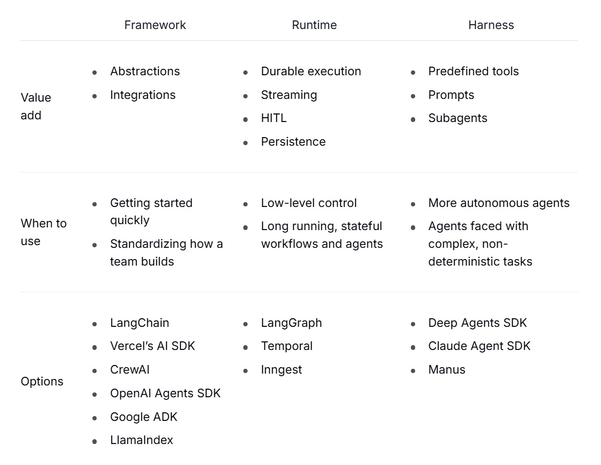

# DeepAgents初识与介绍

**开篇引入**

在过去短短数年间，人工智能的形态正经历一场层层递进的深刻演化。它从最初仅能 “响应问题” 的大型语言模型（LLM），逐步迭代为具备 “调用工具、落地执行” 能力的 AI Agent，如今更朝着拥有协作意识、可驾驭复杂工作流的 Agentic AI 加速迈进。这条演进路径绝非简单的功能叠加，而是一条从 “语言理解能力” 到 “自主行动能力”，再到 “智能组织与协作能力” 的质变之路 —— 几乎构筑起未来智能应用的核心主轴。

为突破现有技术瓶颈，两个关键概念在研究与实践领域迅速崛起并成为核心驱动力 —— **深度代理（Deep Agents）** 与 **高阶提示（Higher-Order Prompts, HOPs）**。

在深度代理的架构中，模型不再是 “一次性输出答案” 的黑盒，而是化身具备 “规划 - 执行 - 反馈 - 迭代” 闭环能力的智能主体：

- 面对复杂任务时，先将其拆解为可落地的子目标；
- 为每个子目标匹配专属的子代理（sub-agent），实现专业化分工；
- 执行过程中实时监控各步骤产出，精准识别偏离目标的异常；
- 基于执行结果动态调整计划、替换策略，或生成新的子任务以补全链路；
- 当出现错误时，通过反思（reflection）机制回溯问题根源，修正执行路径。

而高阶提示（HOPs）则聚焦于 “教会模型如何思考”：如果说深度代理是智能系统的 “组织架构师”，负责搭建任务执行的骨架，那么高阶提示就是 “认知规范师”，定义思考与推理的底层逻辑。

- **传统提示**：告诉我 **做什么**。
  > 分析下面这条用户评论，判断情绪是正面、负面还是中性，并给出改进建议。
  >
  > 评论：“这个软件经常卡顿，打开要等很久，界面也不好看，用起来很烦躁。”

- **高阶提示**：告诉我 **怎么想、按什么步骤、用什么逻辑**。
  > 请按以下 **固定思考流程** 分析用户评论：
  >
  > 1. 先逐句提取事实：用户提到了哪些具体问题？
  > 2. 再判断情绪：根据关键词判断是正面 / 负面 / 中性，并给出理由。
  > 3. 按问题严重程度排序：从最影响体验到最轻。
  > 4. 每条问题对应给出 **可落地** 的建议，不要空泛。
  > 5. 最后用一句话总结核心痛点。
  >
  > 评论：“这个软件经常卡顿，打开要等很久，界面也不好看，用起来很烦躁。”

传统提示偏向 “直接下达结果指令”，而高阶提示则更进一步，它向模型传递的是 “思考框架与推理范式”—— 明确告知模型该如何分析问题、如何拆解逻辑、如何组织思考过程，从根源上提升决策的精准度与执行的可靠性。

## 1.1 DeepAgents 介绍与定位

> 构建能够规划、使用子代理并利用文件系统处理复杂任务的代理（深度智能体）
>
> https://docs.langchain.com/oss/python/deepagents/overview

> **langchain、langgraph、deepAgents家族框架对比：**
> https://docs.langchain.com/oss/python/concepts/products
>
> 三者并非单向引用，有时会出现循环调用场景！！

**DeepAgents** 是一个独立库，建立在 LangChain 生态之上。它内置了任务规划、文件系统管理、子代理生成和长期记忆等能力，让开发者能够快速构建可自主处理复杂任务的深度智能体。

**生态架构图：**

**功能横向对比：**

**LangChain 生态三层架构：**

三者并非平级竞争关系，而是不同层面的分工与配合：

| 维度 | LangChain | LangGraph | DeepAgents |
| :--- | :--- | :--- | :--- |
| **核心定位** | 基础组件库 | 流程编排引擎 | 深度智能体工具包 |
| **当前角色** | LLM应用的标准库（模型/工具/解析器） | 代理执行的运行时（状态/图/持久化） | 开箱即用的复杂代理方案 |
| **类比** | 编程语言的**标准库** | **工作流引擎** | **预制脚手架** |
| **主要职责** | 提供可复用的抽象构件 | 管理执行流程与状态转换 | 内置规划/文件系统/子代理 |
| **能否独立** | 可独立使用 | 依赖 LangChain Core | 依赖 LangChain Core + LangGraph |
| **典型场景** | 单次调用、工具封装、简单链式 | 多步骤、循环、分支、人工介入 | 自主规划、长程任务、代理团队 |

> **💡 注意**：在实际项目开发中，**LangGraph + DeepAgents** 的搭配正逐渐成为复杂代理开发的主流模式。LangChain Core 作为底层支撑提供基础构件，LangGraph 负责流程编排，DeepAgents 提供高阶能力封装。

**使用场景选择指南：**

| 你的需求 | 推荐选择 |
| :--- | :--- |
| 统一模型接口、封装工具、单次简单调用 | **LangChain** |
| 有状态的多步骤任务、循环、分支、需要人工介入 | **LangGraph**（当前主力推荐） |
| 开箱即用的深度代理能力，不想自己实现规划与文件系统 | **DeepAgents** |
| 长程运行、自主规划、代理团队协作 | **LangGraph + DeepAgents**（最佳组合） |

## 1.2 DeepAgents 核心能力

#### 核心能力一：智能规划与任务分解（最核心的智能协调体现）

DeepAgents 内置 `write_todos` 工具，使代理能够：
- 将复杂任务分解为离散的执行步骤
- 实时跟踪任务执行进度
- 根据新信息动态调整执行计划

> **生活类比**：就像你要 “办一场生日派对”，DeepAgent 不会上来就瞎忙活，而是先帮你列个清晰的待办清单：
>
> 1. 确定派对时间/地点 → 2. 邀请朋友 → 3. 买食材/蛋糕 → 4. 布置场地 → 5. 准备游戏
>
> 执行过程中，它还会实时标记 “已完成/未完成”。比如发现蛋糕店没开门，会自动把 “买蛋糕” 改成 “换一家店”，甚至新增 “订外卖蛋糕” 的步骤 —— 完全像个有经验的策划师。

> **💡 技术提示：Todo 管理工具集**
> - `write_todos`：创建待办清单
> - `read_todos`：读取当前进度
> - `update_todos`：动态调整步骤
> - `delete_todos`：移除已完成或冗余项

#### 核心能力二：高效上下文管理（最实用的 “内存扩容” 方案）

DeepAgents 内置文件系统工具集（`ls`、`read_file`、`write_file`、`edit_file`），使代理能够：
- 将大型上下文信息卸载到外部存储
- 有效防止上下文窗口溢出问题
- 处理可变长度的工具执行结果

> **生活类比**：就像你要 “整理 100 页的年度工作总结”，你的大脑（代理的上下文窗口）只能同时记住 10 页内容。DeepAgent 会帮你准备一个 “专属文件柜”：
>
> 1. 先把 100 页总结拆成 10 个文件存在柜里
> 2. 看第 1-10 页时，只把这 10 页拿在手里
> 3. 看完后放回，再取 11-20 页
> 4. 整理出的要点先写在草稿纸（临时文件）里，最后汇总成最终版本

> **💡 技术提示：文件系统工具集**
> - `ls`：列出当前存储的文件
> - `read_file`：精准调取所需内容
> - `write_file`：将信息存入外部存储
> - `edit_file`：修改已有文件内容

#### 核心能力三：子代理生成机制（最灵活的 “分工协作” 模式）

DeepAgents 内置 `task` 工具，使代理能够：
- 选择对应的子代理处理特定任务
- 实现上下文隔离，保持主代理环境整洁
- 深入执行复杂的子任务流程

> **生活类比**：就像你要 “装修一套房子”，你（主代理）不会既当设计师、又当瓦工，而是找专业的人干专业的事：
>
> 1. 派 “设计子代理” 出装修图纸
> 2. 派 “施工子代理” 按图纸砌墙/铺砖
> 3. 派 “水电子代理” 装水管/电路
> 4. 你只负责统筹进度、汇总结果

> **💡 技术提示**：子代理独立工作，互不干扰。例如设计子代理只关注风格与尺寸，施工子代理遇到的问题（如墙面不平）仅在其内部调整，不会影响主代理与其他子代理的工作。

#### 核心能力四：长期记忆能力（最持久的 “记忆存储” 系统）

DeepAgents 利用 LangGraph 的 Store 功能，使代理能够：
- 为代理扩展跨线程（协程）持久内存
- 保存和检索历史对话信息
- 支持多会话间的知识共享

> **生活类比**：就像你要 “持续跟进一个客户的需求”，你不会每次都从头问起，而是有一个 “客户档案本”：
>
> 1. 第一次聊天记录客户需求 → 存进档案本
> 2. 一周后聊天，先翻档案本记住之前的需求
> 3. 新聊的内容也补充进去
> 4. 同事跟进时也能查看同一档案本

> **💡 技术提示**：持久记忆支持跨设备、跨代理共享。无论换设备登录，还是多个代理协作跟进同一实体，都能访问统一的历史记忆。

---

