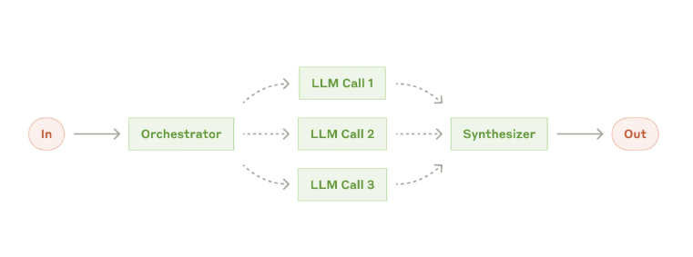
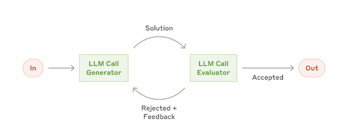

# 子代理 (Subagents) 和多智能体

## 1.5 子代理 (Subagents) 和多智能体

> 指南：https://www.anthropic.com/engineering/building-effective-agents

### 开胃菜：为什么要聊多智能体？

想象一下这些场景：
- **一个人全包**：让一个医生同时做法律咨询、金融分析和工程设计——结果可想而知，样样稀松。
- **专业团队**：让医生看病、律师审合同、分析师看财报、工程师做设计——各司其职，效率翻倍。

**多智能体系统**就是AI世界里的“专业敏捷团队”。它把一个复杂任务拆解成多个子任务，分发给不同的专家Agent处理，最后汇总结果。本质上就是经典的**分而治之**策略！

> 💡 **一句话总结**：单Agent像“全能但精力有限”的个体户，多Agent像“分工明确、各显神通”的精英团队。

---

### 1.5.1 多智能体理解

多Agent系统（Multi-Agent System, MAS）是由多个具备**自主性、反应性、目标导向性**的智能体（Agent）组成的协作体系，通过标准化通信与协同机制，共同完成单一智能体无法独立应对的复杂任务。

简单解释，就是将复杂任务拆解成多个子任务，分发给有专长的Agent进行处理，最后综合结果！本质**分而治之**！

| 维度 | 单体模型（注意力稀释法则） | 多智能体（分而治之的极效） |
| :--- | :--- | :--- |
| **核心问题** | 同一个模型需处理多领域知识（如医学+法律），不同领域信息互相污染，推理能力断崖式下跌 | 将任务物理拆解，由专业Agent分别处理独立并行子任务，多方处理独立任务，性能优势极大提升！ |
| **组织类比** | 一人全栈（精力分散、专业度不足） | 专业敏捷团队（分工明确、各司其职） |
| **核心逻辑** | 注意力资源被多领域任务稀释，导致认知过载 | 分布式算力 + 专业化分工，突破单体模型的物理天花板 |

---

### 1.5.2 多智能体弊端

多智能体系统在实现**分而治之的性能飞跃**的同时，必然伴随两大**灾难级代价**，成为落地的核心阻碍：

**代价一：Token消耗的指数级失控——就像“电话会议中的复读机”**

单体模型仅需承担自身推理的Token成本，而多Agent系统的核心交互逻辑是**Agent间的上下文互通**。想象一下：多个Agent为了完成协同任务，频繁互传长文本上下文、进行多轮循环复读——就像电话会议里每个人都在重复别人的话，导致电话费（Token成本）账单爆炸。

更致命的是，无约束的群聊式交互可能在极短时间内爆API额度，直接导致**成本失控**，甚至成为中小团队落地多Agent的核心经济门槛。

**应对底线**：建立**拦截基准线**——对简单任务直接拒绝多Agent协作，强制使用单Agent或者标准图流程，从源头控制交互规模。

**代价二：调试成为噩梦——就像“没有监控的罗生门”**

多Agent系统的“涌现性”同时带来了**不可控性**：Agent间的交互是非线性的，系统崩溃并非单一节点故障，而是像城市交通连环撞车一样，由多步交互的连锁反应引发，且难以复现。

更糟糕的是，崩溃后每个Agent都说是对方的错，因为没有“监控录像”（全链路追踪），你永远不知道真相是什么。传统的单Agent日志调试方式完全失效。

**应对底线**：若未搭建**全链路追踪（Tracing）** 体系，出现问题时既无法定位根因，也无法复盘交互过程。“不建全链路追踪录像，绝不上线”成为多Agent落地的**硬性底线**！

| 代价类型 | 核心问题 | 具体表现 | 风险阈值/特征 | 应对底线/策略 |
| :--- | :--- | :--- | :--- | :--- |
| **账单被击穿** | Token消耗失控 | Agent间频繁互传长文本上下文，Token消耗呈**指数级增长**，无节制的交互对话极易快速耗尽API额度 | 短时间内激增 | 建立拦截基准线，简单任务严禁触发多智能体流程，控制交互文本长度 |
| **调试成为噩梦** | 系统非确定性与不可追溯 | 群智网络伴随“非确定性”，系统崩溃场景复杂且无规律，难以定位根因，如同城市红绿灯瘫痪引发连环事故 | 多Agent交互出现不可复现的异常、全链路无日志追踪 | 不建全链路追踪录像（Tracing）绝不上线，强制记录交互日志 |

---

### 1.5.3 用多智能体的三条铁律

这三条铁律本质上是**多智能体系统的“入场许可”**。只有满足其中至少一条，才值得我们承担多Agent带来的成本与复杂度代价：

| 铁律名称 | 核心场景 | 详细说明 |
| :--- | :--- | :--- |
| **问题极度开放** | 高复杂度、无固定路径任务 | 问题复杂度过高，无法事前硬编码死路径，需要在执行过程中灵活转向、探索旁支 |
| **存在领域冲突** | 多领域混杂任务 | 当混淆领域达到两个以上时，单体模型会因注意力稀释导致表现下滑，必须物理隔离不同领域专家的推理上下文 |
| **需要多方向并行** | 天然可拆解为独立路径的任务 | 任务天然要求沿多条独立路径同时并行推进，采用多体架构并行处理可带来极显著的性能耗时收益 |

只有符合这些条件时，多智能体才是“宝贝”；否则，强行使用只会让系统陷入“毒药”般的成本与调试困境。

---

### 1.5.4 多智能体适用性决策树

在决定使用多智能体之前，建议先问自己这几个问题：

```
第1步：任务是否简单到一步就能完成？
    ├─ 是 → ✅ 严禁使用多智能体，直接单Agent解决
    └─ 否 → 继续判断

第2步：任务是否符合“三条铁律”中的至少一条？
    ├─ 否 → ✅ 尝试优化单Agent的提示词或工作流，不要轻易上多智能体
    └─ 是 → ✅ 可以考虑使用多智能体架构
```

> 💡 **经验法则**：能用单Agent解决的，绝不上多Agent。多智能体是“核武器”，不是“日常工具”。

---

### 1.5.5 多智能体两种架构模式

#### 模式一：层级工作流 (Hierarchical / Orchestrator-Workers)

> **别名**：指挥官模式、主从模式
> **核心逻辑**：**中央集权**。有一个“大脑”负责思考和分派任务，其他Agent只是干活的“手”。

**运作方式**：
1. **输入**：用户给出一个复杂任务（比如“写一份新产品的上市策划案”）
2. **主脑 (Orchestrator)**：主管Agent收到任务，它不直接干活，而是分析任务，把它拆解成子任务（市场调研、创意设计、文案撰写）
3. **分发**：主管把子任务分发给对应的垂直领域专家Agent (Worker)
4. **执行**：Worker Agent并行或串行工作，产出结果返还给主管
5. **整合**：主管汇总所有结果，整合成最终报告输出

**优点**：
- 可控性强：主脑掌控全局，知道进度，方便纠错
- 逻辑清晰：上下级关系明确，就像传统的公司组织架构

**缺点**：
- 单点故障：主脑如果挂了或判断失误，整个任务就崩了
- 通信瓶颈：所有信息都要经过主脑中转





#### 模式二：协作工作流 (Collaborative / Network)

> **别名**：网状模式、专家会诊模式
> **核心逻辑**：**去中心化**。没有绝对的领导，大家都是平等的专家，坐在一起开会讨论，互相交换信息。

**运作方式**：
1. **输入**：用户给出一个开放性问题（比如“评估这家公司的投资价值”）
2. **共享**：任务被扔到一个“共享会议室”（Shared State/Context）
3. **自组织**：不同的专家Agent（定价、产品、财务、合规）根据自己的专长，从“会议室”里拿取信息进行分析
4. **交互**：Agent之间可以直接交流。比如财务Agent算出成本太高，直接告诉定价Agent调整价格，不需要经过领导批准
5. **收敛**：最后通过一个评估者 (Evaluator) 或规则来决定什么时候讨论结束，输出最终方案

**优点**：
- 灵活性极高：适合解决极其复杂、没有标准答案的问题
- 涌现能力：不同的专家碰撞可能产生意想不到的创新解法

**缺点**：
- 容易失控：Agent之间可能陷入无休止的争论（死循环）
- 难以调试：很难追踪到底是谁做出的关键决策




#### 主流框架对比

**DeepAgents** 是典型的**层级/指挥官模式**，而 **AutoGen** 是典型的**去中心化/网状协作模式**（像群聊头脑风暴），**CrewAI**可以构建任意一种模式。

| 框架 | 核心模式 | 协作形态 | 适用场景 | 复杂度 |
| :--- | :--- | :--- | :--- | :--- |
| **DeepAgents (MetaGPT)** | **层级工作流** | **流水线**：角色分工明确，按预定义顺序（如：PM→架构师→工程师）传递任务 | **标准化流程**：如软件开发全流程、长篇报告撰写 | 中等 |
| **AutoGen** | **协作工作流** | **群聊/网状**：所有Agent在一个群里，根据上下文自动接话，自由交互 | **开放性探索**：多角色头脑风暴、复杂问题求解、代码自动修正 | 低（开箱即用） |
| **CrewAI** | **混合模式** | **层级+委派**：主要是层级任务，但允许Agent自主委派子任务给别人 | **通用任务**：既有流程控制，又需要一点灵活性的场景 | 低 |

---

### 1.5.6 DeepAgents子代理入门

> 📖 官方文档：https://docs.langchain.com/oss/python/deepagents/subagents#configuration

**DeepAgents** 是**层级/指挥官模式**的典型代表。深度代理可以创建子代理来委派工作。你可以在`子代理`参数中指定自定义子代理。

#### 核心价值：解决上下文膨胀问题

当代理使用输出较大的工具（如网页搜索、文件读取、数据库查询）时，上下文窗口会迅速被中间结果填满。**子代理**将这些详细工作隔离开来——主代理只接收最终结果，而非产生该结果的数十个工具调用。


#### 什么时候使用子代理 (Subagent)？

✅ **推荐使用**：
- 多步骤任务会让主代理的上下文变得杂乱
- 有需要“专业技能/专属工具”的环节（比如主代理做“股票分析”，其中“基本面分析”需要财务工具、“技术面分析”需要K线工具，给这两个环节配专属子代理）
- 需要不同模型能力的任务（多模态）
- 当你想让主Agent专注于高层协调时

❌ **不推荐使用**：
- 任务简单，一步就能干完
- 需要中间信息连贯，不能拆（比如“读一篇文章，然后总结核心观点”，拆给子代理读、再拆给另一个子代理总结会丢上下文）
- 运营费用超过收益时

#### Subagent配置方式

`子代理`配置有两种方案：**字典**或**`CompiledSubAgent`**对象。

将子代理定义为包含以下字段的字典：

| 字段名 | 类型 | 必填/可选 | 核心描述 | 继承规则（与主代理的关系） |
| :--- | :--- | :--- | :--- | :--- |
| `name` | str | 必填 | 子代理的唯一标识；主代理调用`task()`工具时会使用该名称 | -（无继承，需自定义） |
| `description` | str | 必填 | 子代理的职能描述（需具体、以行动为导向）；主代理根据此信息判断是否委派任务 | -（无继承，需自定义） |
| `system_prompt` | str | 可选 | 子代理的执行指令，需包含工具使用指导、输出格式要求等核心规则 | 不继承主代理的，需自定义 |
| `tools` | list[Callable] | 可选 | 子代理可使用的工具列表；建议极简配置，仅保留必要工具 | 不继承主代理的，需自定义 |
| `model` | str \| BaseChatModel | 可选 | 子代理使用的模型。省略则使用主代理的模型 | 默认继承主代理的模型，自定义会覆盖 |
| `middleware` | list[Middleware] | 可选 | 自定义中间件，用于实现日志记录、速率限制等功能 | 不继承主代理的，需自定义 |
| `interrupt_on` | dict[str, bool] | 可选 | 为特定工具配置“人机协作流程（HITL）”；需搭配检查点使用 | - |
| `skills` | list[str] | 可选 | 技能文件的来源路径，用于加载子代理专属技能 | - |

#### 特别注意：上下文隔离

⚠️ **重要**：主-子Agent之间**上下文默认隔离**，体现在三个方面：

1. **独立Prompt**：每个Agent都有自己独立的`system_prompt`，定义了它是谁、负责什么
2. **独立工具集**：子Agent只能使用分配给自己的工具，通常不能直接调用父Agent的工具
3. **独立记忆**：子Agent执行任务时产生的临时对话历史、变量状态，通常只在自己的生命周期内有效

**设计目的**：
- **专注**：防止上下文污染（负责写代码的Agent不需要知道写文案的Agent的具体指令）
- **安全**：限制工具权限（只有顶层Agent能批准发布，底层Agent只能提交代码）
- **模块化**：方便独立测试和复用子Agent

> **⚠️ 常见陷阱**：
> 不要试图让子Agent直接访问主Agent的对话历史或变量。子Agent完成任务后，**只应返回一个结构化的最终结果**。如果需要上下文连贯（如多轮对话），应在主Agent层面维护记忆，而不是让子Agent带着海量上下文往返。

#### 基础示例：创建一个全能管家

**场景**：创建一个主智能体，拥有三个助手：
1. **天气助手**：查询天气
2. **计算助手**：处理数学问题
3. **翻译助手**：负责中英互译

**代码实现**：

```python
from langchain.chat_models import init_chat_model
from deepagents import create_deep_agent
import os
from dotenv import load_dotenv, find_dotenv

load_dotenv(find_dotenv())

# 极简初始化（自动读取OPENAI环境变量）
llm = init_chat_model(
    model=os.getenv("LLM_QWEN_MAX"),
    temperature=0.1,  # 更严谨的回答
    model_provider="openai"
)

# 1. 定义子智能体：天气助手
weather_agent = {
    "name": "weather_helper",
    "description": "用于查询天气信息。当用户询问天气时，请调用此助手。",
    "system_prompt": "你是一个天气助手。无论用户问哪个城市的天气，你都统一回答：'今日天气晴朗，气温 25 度，适合出游。'",
    "tools": []  # 这里不需要额外工具，仅靠prompt回复
}

# 2. 定义子智能体：计算助手
math_agent = {
    "name": "math_helper",
    "description": "用于处理数学计算问题。",
    "system_prompt": "你是一个严谨的数学助手。请帮助用户计算数学问题。",
    "tools": []
}

# 3. 定义子智能体：翻译助手
translate_agent = {
    "name": "translator",
    "description": "用于中英互译任务。",
    "system_prompt": "你是一个翻译助手。如果是中文请翻译成英文，如果是英文请翻译成中文。",
    "tools": []
}

# 4. 创建主智能体，并注册子智能体
main_agent = create_deep_agent(
    model=llm,
    tools=[],  # 主智能体本身不带工具，依靠子智能体
    subagents=[weather_agent, math_agent, translate_agent],
    system_prompt="你是一个全能管家。你会根据用户的需求，调度不同的助手来解决问题。"
)

# 5. 可视化运行 (Stream)
def test_stream(query):
    print(f"\n>>> 提问: {query}")
    for chunk in main_agent.stream({"messages": [{"role": "user", "content": query}]}):
        for node_name, state in chunk.items():
            if not state or "messages" not in state: 
                continue
            messages = state["messages"]
            if messages and isinstance(messages, list):
                last_msg = messages[-1]
                
                # 模型节点：决定下一步行动
                if node_name == "model":
                    if last_msg.tool_calls:
                        for tool_call in last_msg.tool_calls:
                            if tool_call['name'] == 'task':
                                sub_agent = tool_call['args'].get('subagent_type')
                                print(f"[模型决策] 呼叫子智能体: {sub_agent}")
                            else:
                                print(f"[模型决策] 调用工具: {tool_call['name']}, 参数: {tool_call['args']}")
                    elif last_msg.content:
                        print(f"[最终回复] {last_msg.content}")
                
                # 工具节点：显示工具/子智能体的执行结果
                elif node_name == "tools":
                    content_preview = last_msg.content[:100] + "..." if len(last_msg.content) > 100 else last_msg.content
                    print(f"[执行结果] {content_preview}")

# 测试
test_stream("北京今天天气怎么样？")
test_stream("100 + 256 等于多少？")
```

**预期输出示例**：
```text
>>> 提问: 北京今天天气怎么样？
[模型决策] 呼叫子智能体: weather_helper
[执行结果] 今日天气晴朗，气温 25 度，适合出游。
[最终回复] 北京的天气是晴朗的，气温25度，适合出游。

>>> 提问: 100 + 256 等于多少？
[模型决策] 呼叫子智能体: math_helper
[执行结果] 100 + 256 = 356
[最终回复] 100加256的结果是356。
```

**原理解析**：

- `subagents` 参数接收一个列表，每个元素是一个字典，定义了子智能体的配置。
- `description` 非常关键：主智能体通过这段描述来判断何时调用该子智能体。
- 当主智能体发现用户意图匹配某个子智能体的 `description` 时，会自动生成一个 `task` 工具调用，将任务分发下去。

> 💡 **关键点**：`description`非常重要！主智能体通过这段描述来判断何时调用该子智能体。描述要具体、以行动为导向。

---

### 1.5.7 进阶：异步调用与并发

**适用场景**：
1. **高并发服务**：用FastAPI/Starlette做接口时，`astream()` + 异步能同时处理成百上千个用户请求
2. **批量处理任务**：需要同时调用智能体处理多个查询，`astream()`并发执行耗时≈最长单个任务
3. **非阻塞主线程**：在GUI程序、定时任务中调用智能体，`astream()`异步执行不会让界面卡死

```python
from langchain.chat_models import init_chat_model
from deepagents import create_deep_agent
import os
import asyncio
from dotenv import load_dotenv, find_dotenv

load_dotenv(find_dotenv())

llm = init_chat_model(
    model=os.getenv("LLM_QWEN_MAX"),
    temperature=0.1,
    model_provider="openai"
)

# 定义子智能体（同上例）
weather_agent = {
    "name": "weather_helper",
    "description": "用于查询天气信息。",
    "system_prompt": "你是一个天气助手。无论用户问哪个城市的天气，你都统一回答：'今日天气晴朗，气温 25 度。'",
    "tools": []
}

math_agent = {
    "name": "math_helper",
    "description": "用于处理数学计算问题。",
    "system_prompt": "你是一个严谨的数学助手。请帮助用户计算数学问题。",
    "tools": []
}

translate_agent = {
    "name": "translator",
    "description": "用于中英互译任务。",
    "system_prompt": "你是一个翻译助手。如果是中文请翻译成英文，如果是英文请翻译成中文。",
    "tools": []
}

main_agent = create_deep_agent(
    model=llm,
    tools=[],
    subagents=[weather_agent, math_agent, translate_agent],
    system_prompt="你是一个全能管家。你会根据用户的需求，调度不同的助手来解决问题。"
)

# 异步版本
async def test_astream(query):
    print(f"\n>>> 提问: {query}")
    async for chunk in main_agent.astream({"messages": [{"role": "user", "content": query}]}):
        for node_name, state in chunk.items():
            if not state or "messages" not in state:
                continue
            messages = state["messages"]
            if messages and isinstance(messages, list):
                last_msg = messages[-1]
                
                if node_name == "model":
                    if last_msg.tool_calls:
                        for tool_call in last_msg.tool_calls:
                            if tool_call['name'] == 'task':
                                sub_agent = tool_call['args'].get('subagent_type')
                                print(f"[模型决策] 呼叫子智能体: {sub_agent}")
                    elif last_msg.content:
                        print(f"[最终回复] {last_msg.content}")
                
                elif node_name == "tools":
                    content_preview = last_msg.content[:100] + "..." if len(last_msg.content) > 100 else last_msg.content
                    print(f"[执行结果] {content_preview}")

# 并发执行多个查询
if __name__ == "__main__":
    async def batch_run():
        task1 = test_astream("北京今天天气怎么样？")
        task2 = test_astream("100 + 256 等于多少？")
        task3 = test_astream("将'你好'翻译成英文")
        await asyncio.gather(task1, task2, task3)
    
    asyncio.run(batch_run())
```

---

### 1.5.8 进阶：子代理的层级嵌套

DeepAgents框架支持配置子代理的嵌套，即子代理可以拥有自己的子代理。

**特点**：
1. **无限嵌套结构**：Agent → Subagent A → Subagent B，理论上支持多层
2. **配置方式**：在定义子代理时，同样配置它的`subagents`参数

**示例：公司层级代理系统**（CEO → CTO → 工程师）

```python
import os
from langchain.chat_models import init_chat_model
from deepagents import create_deep_agent
from dotenv import load_dotenv, find_dotenv

load_dotenv(find_dotenv())

llm = init_chat_model(
    model=os.getenv("LLM_QWEN_MAX"),
    model_provider="openai"
)

# 1. 底层 Coder 配置
coder_config = {
    "name": "Coder",
    "description": "高级Python工程师，他是唯一有权限编写具体代码的人。",
    "system_prompt": "你是一个高级Python工程师。你的职责是接收具体的编码任务并实现它。请使用 write_file 工具编写代码。",
    "tools": [],  # Coder拥有默认的文件操作工具
}

# 2. 中间层 CTO 配置
cto_config = {
    "name": "CTO",
    "description": "技术总监，负责将战略需求转化为技术任务并分配给工程师。",
    "system_prompt": """你是技术总监。
    注意：你没有编写代码的权限！
    你的职责是：
    1. 分析CEO的需求
    2. 设计技术方案
    3. 调用 'Coder' 子代理来完成具体的代码编写工作
    """,
    "tools": [],
    "subagents": [coder_config]  # CTO拥有自己的子代理
}

# 3. 顶层 CEO 配置
ceo_agent = create_deep_agent(
    model=llm,
    name="CEO",
    system_prompt="""你是CEO，负责公司战略决策。
    注意：你严禁直接编写代码或操作文件！
    你必须将所有技术相关的开发任务委派给 'CTO' 处理。
    你的工作是验收CTO提交的结果。
    """,
    subagents=[cto_config]  # CEO拥有CTO作为子代理
)

# 运行CEO代理
print(">>> 开始执行任务链...")
stream = ceo_agent.stream({
    "messages": [
        {"role": "user", "content": "帮我开发一个贪吃蛇游戏，要求用Python实现"}
    ]
})

for chunk in stream:
    print(chunk)
```

> 💡 **注意事项**：虽然支持无限嵌套，但层级过深会导致调试困难和延迟增加。一般建议**2-3层**即可满足业务需求。

