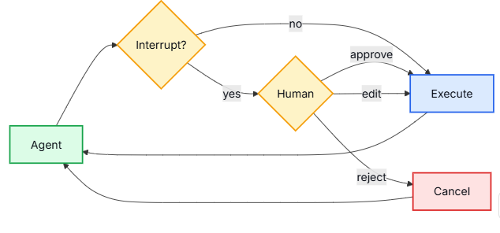
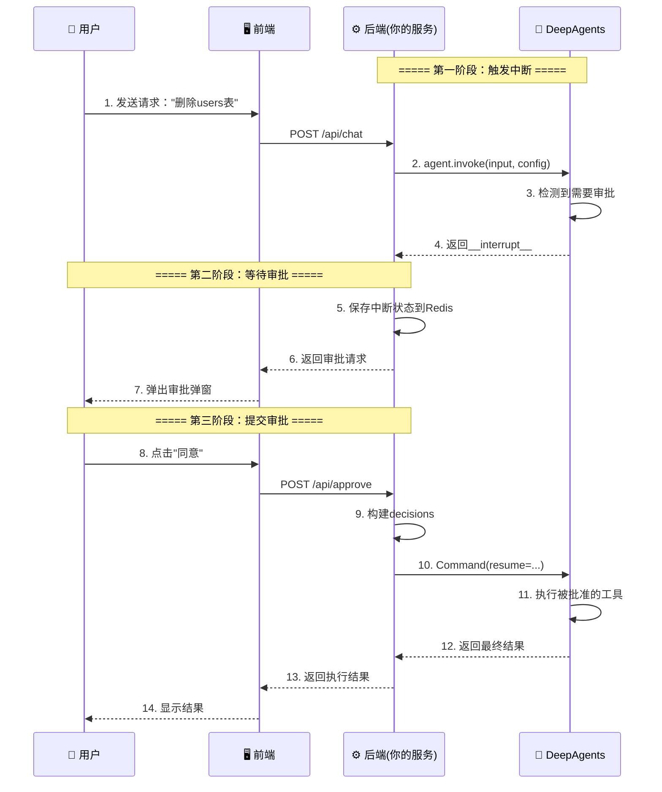

# 流程人机交互 (HITL)

## 1.7 流程人机交互 (HITL)

> 📖 官方文档：https://docs.langchain.com/oss/python/deepagents/human-in-the-loop





### 开篇引言：为什么要有人机交互？

想象一下这些场景：

- **你让AI帮你删除一个数据库表**——万一删错了呢？
- **你让AI发送一封重要邮件**——万一发给错的人了呢？
- **你让AI执行一笔转账**——万一金额不对呢？

**现实世界中，高危操作都需要“二次确认”**。银行转账要输验证码，删除文件要弹窗确认，发布系统要主管审批。

人机交互（Human-In-The-Loop，简称HITL）就是AI世界的**安全刹车系统**——让AI在执行敏感操作前**暂停下来，请示人类**，得到批准后再继续执行。

> 💡 **生活比喻**：
> HITL就像银行的“大额转账审批流程”。
> - 你发起一笔100万的转账（AI调用高危工具）
> - 系统自动拦截，弹出审批页面（中断触发）
> - 银行柜员审核：同意/拒绝/修改金额（人工决策）
> - 审核通过后，转账才真正执行（恢复执行）

---

### 📖 本章导览

| 小节 | 内容 | 适合读者 |
| :--- | :--- | :--- |
| 1.7.1 交互步骤说明 | 4步上手HITL，理解核心配置 | 初学者 |
| 1.7.2 基础审批 | approve/reject决策示例 | 快速上手 |
| 1.7.3 进阶审批 | edit参数编辑示例 | 高级场景 |
| **1.7.4 生产环境实战** | **前后端分离的完整实现** | **生产部署** |

---

### 1.7.1 交互步骤说明

有些工具操作比较敏感，需要人工批准才能执行。深度代理通过 LangGraph 的中断功能支持人机参与的工作流程。您可以使用 `interrupt_on` 参数配置哪些工具需要批准。


#### 步骤1：设置工具是否进行人工互动

根据不同工具的风险等级配置：

```python
# create_deep_agent的属性，配置工具是否需要人工互动
deep_agent = create_deep_agent(
    model="",
    tools=[a, b, c, d],
    subagents=[],
    interrupt_on={
        # 方式1：简写True → 允许approve和reject
        "delete_database": True,
        
        # 方式2：完整配置 → 自定义允许的决策类型
        "delete_file": {"allowed_decisions": ["approve", "edit", "reject"]},
        
        # 方式3：高风险操作 → 只允许approve和reject
        "send_email": {"allowed_decisions": ["approve", "reject"]},
        
        # 方式4：False或不配置 → 无需中断，直接执行
        "read_file": False,
    }
)
```

> **风险等级配置建议**：
>
> | 风险等级 | 工具示例 | 推荐配置 | 说明 |
> | :--- | :--- | :--- | :--- |
> | 🔴 极高风险 | `delete_database`, `drop_table` | `["approve", "edit", "reject"]` | 必须人工确认，且允许修改参数 |
> | 🟡 高风险 | `send_email`, `delete_file` | `["approve", "reject"]` | 必须人工确认，但不建议修改参数 |
> | 🟢 中风险 | `write_file`, `update_record` | `True` | 需要确认，但无需编辑 |
> | ⚪ 低风险 | `read_file`, `search` | `False` 或不配置 | 无需中断，直接执行 |

#### 步骤2：配置检查点

人工互动需要一个检查点，在中断和恢复之间保持代理状态：

```python
from langgraph.checkpoint.memory import MemorySaver

checkpointer = MemorySaver()  # 测试用
# 🚨 生产环境请使用 RedisCheckpointer 或 PostgresCheckpointer

agent = create_deep_agent(
    tools=[...],
    interrupt_on={...},
    checkpointer=checkpointer  # 必须，否则无法中断恢复！
)
```

#### 步骤3：使用相同的 thread_id

恢复时，必须使用相同的配置和相同的 `thread_id`：

```python
# 第一次调用，会检测是否有中断（但不立即执行需要审批的工具）
config = {"configurable": {"thread_id": "my-thread"}}
result = agent.invoke(input, config=config)

# 第二次调用，配置相同的线程id以及审批行为，最终执行
# 必须是相同的线程id才能确保同一个agent线程状态执行
result = agent.invoke(Command(resume={...}), config=config)
```

#### 步骤4：行动决策配置

决策列表必须与 `action_requests` 数量一致、顺序相同：

```python
# 获取结果中是否存在打断状态
if result.get("__interrupt__"):
    interrupts = result["__interrupt__"][0].value
    action_requests = interrupts["action_requests"]

    # 根据tool顺序，处理设置决策
    decisions = []
    for action in action_requests:
        decision = get_user_decision(action)  # 需要实现的逻辑方法
        decisions.append(decision)

    result = agent.invoke(
        Command(resume={"decisions": decisions}),
        config=config
    )
```

**字段说明**：

| 字段 | 含义 | 示例值 |
| :--- | :--- | :--- |
| `action_requests` | 需要审批的操作列表，包含操作名、参数、风险描述 | `[{'name': 'delete_table', 'args': {'tablename': 'users'}, 'description': '删除用户表'}]` |
| `allowed_decisions` | 允许的审批操作（`approve`同意 / `reject`拒绝 / `edit`编辑参数） | `["approve", "edit", "reject"]` |
| `id` | 中断会话唯一标识（确保恢复时匹配同一个会话） | `"3f7a9e2b-..."` |

> **原理说明**：为什么需要批量处理中断？
>
> 如果每个工具调用都单独中断一次，用户会被频繁打断，体验极差。DeepAgents将一次对话中的所有高危操作**打包成一个审批单**，用户一次性审批完所有操作，一次恢复全部执行。

---

### 1.7.2 基础审批：approve/reject决策

当代理调用多个需要批准的工具时，所有中断都会被批量处理成一个中断。必须按顺序为每个动作提供决策。

```python
# -*- coding: utf-8 -*-
"""
DeepAgents 中断审批机制示例
核心功能：演示高危工具调用前的人工审批流程，支持删除数据库表/文件的审批控制
"""
import os
from langchain.chat_models import init_chat_model
from langchain.tools import tool
from deepagents import create_deep_agent
from langgraph.checkpoint.memory import InMemorySaver
from langgraph.types import Command
from dotenv import load_dotenv, find_dotenv

load_dotenv(find_dotenv())


# ======================== 1. 定义工具函数 ========================
@tool
def delete_database(table_name: str):
    """高危操作：删除数据库表"""
    print(f"[工具执行] 删除表: {table_name}")
    return f"已成功删除表: {table_name}"


@tool
def select_data(table_name: str):
    """普通操作：查询指定表名的数据（无需审批）"""
    print(f"[工具执行] 查询指定表名数据: {table_name}")
    return f"查询数据成功：{table_name}"


@tool
def delete_file(file_name: str):
    """高危操作：删除文件"""
    print(f"[工具执行] 删除文件: {file_name}")
    return f"已成功删除文件: {file_name}"


# ======================== 2. 核心配置 ========================
# 配置检查点（必须）：保存Agent中断时的状态
# 🚨 InMemorySaver仅用于测试，生产环境请使用RedisCheckpointer
checkpointer = InMemorySaver()

llm = init_chat_model(
    model=os.getenv("LLM_QWEN_MAX"),
    model_provider="openai"
)

deep_agent = create_deep_agent(
    model=llm,
    tools=[delete_database, delete_file, select_data],
    interrupt_on={"delete_database": True, "delete_file": True},  # 高危操作触发审批
    checkpointer=checkpointer,
    system_prompt="所有的回答都使用中文！！"
)

# ======================== 3. 执行流程 ========================
thread_config = {"configurable": {"thread_id": "safe_thread_1"}}

print("\n=== 第一阶段：触发工具调用（规划阶段）===")
result_1 = deep_agent.invoke(
    {
        "messages": [
            {
                "role": "user",
                "content": "先把用户表(users)删了！再查询product表数据！最后把 user.txt 文件也删除了！"
            }
        ]
    },
    config=thread_config
)
print("当前状态：智能体已暂停，等待人工确认。")

# 提取中断信息
interrupts = result_1.get("__interrupt__")

if interrupts:
    action_requests = interrupts[0].value['action_requests']
    print(f"需要审核动作数量{len(action_requests)}，输出结果: {[action['name'] for action in action_requests]}")

    # 模拟人工审批决策（生产环境需替换为前后端交互）
    decisions = [
        {"type": "approve"},  # 同意删除数据库表
        {"type": "reject"}    # 拒绝删除文件
    ]

    # 恢复执行
    result = deep_agent.invoke(
        Command(resume={"decisions": decisions}),
        config=thread_config
    )

    print("\n=== 执行结果 ===")
    print(result["messages"][-1].content)
```

**预期输出示例**：
```text
=== 第一阶段：触发工具调用（规划阶段）===
当前状态：智能体已暂停，等待人工确认。
需要审核动作数量2，输出结果: ['delete_database', 'delete_file']

[工具执行] 删除表: users        # delete_database被批准，执行
# delete_file被拒绝，不执行

=== 执行结果 ===
已成功删除表: users
（delete_file操作因被拒绝而跳过）
```

---

### 1.7.3 进阶审批：edit参数编辑

结合删库/删文件场景，展示编辑参数的完整流程：

```python
# -*- coding: utf-8 -*-
"""
DeepAgents 中断审批-EDIT操作示例
核心功能：演示人工编辑工具参数后恢复执行的完整流程
"""
import os
from langchain.chat_models import init_chat_model
from langchain.tools import tool
from deepagents import create_deep_agent
from langgraph.checkpoint.memory import InMemorySaver
from langgraph.types import Command
from dotenv import load_dotenv, find_dotenv

load_dotenv(find_dotenv())


# ======================== 1. 定义工具函数 ========================
@tool
def delete_database(table_name: str):
    """危险操作：删除数据库表"""
    print(f"[工具执行] 删除表: {table_name}")
    return f"已成功删除表: {table_name}"


@tool
def select_data(table_name: str):
    """查询指定表名的数据"""
    print(f"[工具执行] 查询指定表名数据: {table_name}")
    return f"查询数据成功：{table_name}"


@tool
def delete_file(file_name: str):
    """危险操作：删除文件"""
    print(f"[工具执行] 删除文件: {file_name}")
    return f"已成功删除文件: {file_name}"


# ======================== 2. 核心配置 ========================
checkpointer = InMemorySaver()

llm = init_chat_model(
    model=os.getenv("LLM_QWEN_MAX"),
    model_provider="openai"
)

deep_agent = create_deep_agent(
    model=llm,
    tools=[delete_database, delete_file, select_data],
    interrupt_on={"delete_database": True, "delete_file": True},
    checkpointer=checkpointer,
    system_prompt="所有的回答都使用中文！严格按照审批后的参数执行工具操作！"
)

# ======================== 3. EDIT审批核心逻辑 ========================
thread_config = {"configurable": {"thread_id": "edit_safe_thread_1"}}

print("\n=== 第一阶段：触发中断（获取原始操作参数）===")
result = deep_agent.invoke(
    {
        "messages": [
            {
                "role": "user",
                "content": "删除users表！删除/user.txt文件！"
            }
        ]
    },
    config=thread_config
)

if result.get("__interrupt__"):
    interrupts = result["__interrupt__"][0].value
    action_requests = interrupts["action_requests"]

    print(f"\n=== 待审批操作列表 ===")
    for idx, action in enumerate(action_requests):
        print(f"操作{idx + 1} - 工具名: {action['name']}, 原始参数: {action['args']}")

    # 模拟人工编辑参数
    decisions = []
    for action in action_requests:
        if action["name"] == "delete_database":
            # 编辑删库参数：删除测试表而非正式表
            decisions.append({
                "type": "edit",
                "edited_action": {
                    "name": action["name"],
                    "args": {"table_name": "test_users"}  # 编辑后的参数
                }
            })
        elif action["name"] == "delete_file":
            # 编辑删文件参数：删除临时文件
            decisions.append({
                "type": "edit",
                "edited_action": {
                    "name": action["name"],
                    "args": {"file_name": "/tmp/test.txt"}
                }
            })

    print(f"\n=== 人工编辑后的审批决策 ===")
    print(f"审批结果: {decisions}")

    # 恢复执行
    print("\n=== 第二阶段：恢复执行（使用编辑后的参数）===")
    result = deep_agent.invoke(
        Command(resume={"decisions": decisions}),
        config=thread_config
    )

    print("\n=== 执行完成 ===")
    print(f"Agent最终回复: {result['messages'][-1].content}")
else:
    print("无需要审批的操作，执行结果:", result["messages"][-1].content)
```

**预期输出示例**：
```text
=== 第一阶段：触发中断（获取原始操作参数）===

=== 待审批操作列表 ===
操作1 - 工具名: delete_database, 原始参数: {'table_name': 'users'}
操作2 - 工具名: delete_file, 原始参数: {'file_name': '/user.txt'}

=== 人工编辑后的审批决策 ===
审批结果: [{'type': 'edit', 'edited_action': {'name': 'delete_database', 'args': {'table_name': 'test_users'}}}, {'type': 'edit', 'edited_action': {'name': 'delete_file', 'args': {'file_name': '/tmp/test.txt'}}}]

=== 第二阶段：恢复执行（使用编辑后的参数）===
[工具执行] 删除表: test_users
[工具执行] 删除文件: /tmp/test.txt

=== 执行完成 ===
Agent最终回复: 已成功删除表test_users，已成功删除文件/tmp/test.txt
```

---

### 1.7.4 生产环境实战：前后端分离的HITL实现

#### 核心原理图解



#### 后端完整代码（Flask示例）

```python
# -*- coding: utf-8 -*-
"""
DeepAgents HITL 生产环境示例
核心功能：前后端分离的人工审批流程
"""
import os
import uuid
from flask import Flask, request, jsonify
from langchain.chat_models import init_chat_model
from langchain.tools import tool
from deepagents import create_deep_agent
from langgraph.checkpoint.memory import InMemorySaver  # 测试用
# 🚨 生产环境请使用：from langgraph.checkpoint.redis import RedisCheckpointer
from langgraph.types import Command
from dotenv import load_dotenv, find_dotenv

load_dotenv(find_dotenv())

app = Flask(__name__)

# 🚨🚨🚨 生产环境强制要求 🚨🚨🚨
# 1. 必须使用 RedisCheckpointer 或 PostgresCheckpointer（不是InMemorySaver）
# 2. pending_approvals 内存字典仅用于演示，多进程部署会失效
# 3. 生产环境请将 pending_approvals 替换为 Redis 存储

# 存储会话的中断状态（演示用，生产环境请用Redis）
pending_approvals = {}  # 🚨 仅开发测试使用！

# ======================== 1. 定义工具函数 ========================
@tool
def delete_database(table_name: str):
    """高危操作：删除数据库表"""
    print(f"[工具执行] 删除表: {table_name}")
    return f"已成功删除表: {table_name}"

@tool
def delete_file(file_name: str):
    """高危操作：删除文件"""
    print(f"[工具执行] 删除文件: {file_name}")
    return f"已成功删除文件: {file_name}"

@tool
def select_data(table_name: str):
    """普通操作：查询数据"""
    print(f"[工具执行] 查询表: {table_name}")
    return f"查询成功: {table_name}"

# ======================== 2. 初始化Agent ========================
checkpointer = InMemorySaver()  # 🚨 生产环境请替换为RedisCheckpointer

llm = init_chat_model(
    model=os.getenv("LLM_QWEN_MAX"),
    model_provider="openai"
)

deep_agent = create_deep_agent(
    model=llm,
    tools=[delete_database, delete_file, select_data],
    interrupt_on={
        "delete_database": {"allowed_decisions": ["approve", "edit", "reject"]},
        "delete_file": {"allowed_decisions": ["approve", "reject"]}
    },
    checkpointer=checkpointer,
    system_prompt="所有的回答都使用中文！"
)

# ======================== 3. API接口 ========================
@app.route("/api/chat", methods=["POST"])
def chat():
    """接口1：发起对话，遇到中断则返回审批请求"""
    data = request.json
    user_input = data.get("message")
    session_id = data.get("session_id", str(uuid.uuid4()))
    
    config = {"configurable": {"thread_id": session_id}}
    
    # 调用Agent
    result = deep_agent.invoke(
        {"messages": [{"role": "user", "content": user_input}]},
        config=config
    )
    
    # 检查是否需要人工审批
    if result.get("__interrupt__"):
        interrupts = result["__interrupt__"][0].value
        action_requests = interrupts["action_requests"]
        
        # 保存中断状态，等待用户审批
        pending_approvals[session_id] = {
            "config": config,
            "action_requests": action_requests
        }
        
        # 返回审批请求给前端
        return jsonify({
            "status": "need_approval",
            "session_id": session_id,
            "approvals": [
                {
                    "id": idx,
                    "tool": action["name"],
                    "args": action["args"],
                    "description": action.get("description", "")
                }
                for idx, action in enumerate(action_requests)
            ]
        })
    
    # 没有中断，直接返回结果
    return jsonify({
        "status": "completed",
        "response": result["messages"][-1].content
    })


@app.route("/api/approve", methods=["POST"])
def approve():
    """接口2：接收前端审批结果，恢复执行"""
    data = request.json
    session_id = data.get("session_id")
    decisions_data = data.get("decisions")  # 前端传来的审批结果
    
    # 获取之前保存的中断状态
    pending = pending_approvals.get(session_id)
    if not pending:
        return jsonify({"error": "Session not found or expired"}), 404
    
    # ========== 核心代码：构建decisions并恢复执行 ==========
    # 注意：Command是LangGraph提供的恢复指令，必须携带resume参数
    # resume中的decisions顺序和数量必须与action_requests完全一致
    decisions = []
    for decision in decisions_data:
        if decision["type"] == "approve":
            decisions.append({"type": "approve"})
        elif decision["type"] == "reject":
            decisions.append({"type": "reject"})
        elif decision["type"] == "edit":
            decisions.append({
                "type": "edit",
                "edited_action": {
                    "name": decision["tool_name"],
                    "args": decision["edited_args"]
                }
            })
    
    # 恢复执行（这就是HITL的核心衔接点）
    result = deep_agent.invoke(
        Command(resume={"decisions": decisions}),
        config=pending["config"]
    )
    # ========== 核心代码结束 ==========
    
    # 清理临时状态
    del pending_approvals[session_id]
    
    # 返回最终结果
    return jsonify({
        "status": "completed",
        "response": result["messages"][-1].content
    })


if __name__ == "__main__":
    app.run(debug=True, port=5000)
```

#### 前端代码示例（React + TypeScript）

```typescript
// ========== 前端代码示例（React + TypeScript） ==========
import React, { useState } from 'react';

interface Approval {
  id: number;
  tool: string;
  args: Record<string, any>;
  description: string;
}

interface Decision {
  type: 'approve' | 'reject' | 'edit';
  tool_name?: string;
  edited_args?: Record<string, any>;
}

function ChatComponent() {
  const [sessionId, setSessionId] = useState<string | null>(null);
  const [response, setResponse] = useState('');
  const [approvals, setApprovals] = useState<Approval[]>([]);
  const [showDialog, setShowDialog] = useState(false);
  const [isLoading, setIsLoading] = useState(false);  // 防止重复提交

  // 发送消息
  const sendMessage = async (message: string) => {
    if (isLoading) return;
    setIsLoading(true);
    
    try {
      const res = await fetch('/api/chat', {
        method: 'POST',
        headers: { 'Content-Type': 'application/json' },
        body: JSON.stringify({ message, session_id: sessionId })
      });
      const data = await res.json();
      
      if (data.status === 'need_approval') {
        setSessionId(data.session_id);
        setApprovals(data.approvals);
        setShowDialog(true);
      } else {
        setResponse(data.response);
      }
    } finally {
      setIsLoading(false);
    }
  };
  
  // 提交审批（关键：必须按顺序为每个操作提供决策）
  const submitApproval = async (decisions: Decision[]) => {
    if (isLoading) return;
    setIsLoading(true);
    
    try {
      const res = await fetch('/api/approve', {
        method: 'POST',
        headers: { 'Content-Type': 'application/json' },
        body: JSON.stringify({ 
          session_id: sessionId, 
          decisions: decisions  // decisions长度必须等于approvals长度
        })
      });
      const data = await res.json();
      setResponse(data.response);
      setShowDialog(false);
    } finally {
      setIsLoading(false);
    }
  };
  
  // 全部同意
  const approveAll = () => {
    const allDecisions: Decision[] = approvals.map(() => ({ type: 'approve' }));
    submitApproval(allDecisions);
  };
  
  // 全部拒绝
  const rejectAll = () => {
    const allDecisions: Decision[] = approvals.map(() => ({ type: 'reject' }));
    submitApproval(allDecisions);
  };
  
  // 单个编辑
  const editOne = (index: number, originalArgs: Record<string, any>) => {
    const newArgsStr = prompt('请输入新参数（JSON格式）:', JSON.stringify(originalArgs));
    if (newArgsStr) {
      try {
        const newArgs = JSON.parse(newArgsStr);
        const decisions: Decision[] = approvals.map((_, idx) => 
          idx === index 
            ? { type: 'edit', tool_name: approvals[index].tool, edited_args: newArgs }
            : { type: 'reject' }  // 未编辑的默认拒绝
        );
        submitApproval(decisions);
      } catch (e) {
        alert('JSON格式错误，请重新输入');
      }
    }
  };
  
  // 审批弹窗组件
  const ApprovalDialog = () => (
    <div className="modal" style={{ position: 'fixed', top: '50%', left: '50%', transform: 'translate(-50%, -50%)', background: 'white', padding: '20px', border: '1px solid #ccc', zIndex: 1000 }}>
      <h3>⚠️ 高危操作需要审批</h3>
      {approvals.map((approval, idx) => (
        <div key={approval.id} style={{ borderBottom: '1px solid #eee', marginBottom: '10px', paddingBottom: '10px' }}>
          <p><strong>操作 {idx + 1}</strong></p>
          <p>工具: {approval.tool}</p>
          <p>参数: {JSON.stringify(approval.args)}</p>
          <p>描述: {approval.description}</p>
          <div style={{ display: 'flex', gap: '10px' }}>
            <button onClick={() => {
              const decisions = approvals.map((_, i) => ({ type: i === idx ? 'approve' : 'reject' } as Decision));
              submitApproval(decisions);
            }}>✓ 同意此项</button>
            <button onClick={() => {
              const decisions = approvals.map((_, i) => ({ type: i === idx ? 'reject' : 'reject' } as Decision));
              submitApproval(decisions);
            }}>✗ 拒绝此项</button>
            <button onClick={() => editOne(idx, approval.args)}>✎ 编辑参数</button>
          </div>
        </div>
      ))}
      <div style={{ display: 'flex', gap: '10px', marginTop: '15px' }}>
        <button onClick={approveAll}>✓ 全部同意</button>
        <button onClick={rejectAll}>✗ 全部拒绝</button>
        <button onClick={() => setShowDialog(false)}>取消</button>
      </div>
    </div>
  );
  
  return (
    <div>
      <input 
        type="text" 
        disabled={isLoading}
        onKeyPress={(e) => e.key === 'Enter' && sendMessage(e.currentTarget.value)} 
        placeholder="输入消息..."
      />
      {isLoading && <div>处理中...</div>}
      <div>回复: {response}</div>
      {showDialog && <ApprovalDialog />}
      {showDialog && <div style={{ position: 'fixed', top: 0, left: 0, right: 0, bottom: 0, background: 'rgba(0,0,0,0.5)' }} onClick={() => setShowDialog(false)} />}
    </div>
  );
}
```

#### 关键注意事项

> **⚠️ 生产环境警告**：
> - `InMemorySaver` 仅在测试环境使用！服务重启后中断状态会丢失
> - 生产环境请使用 `RedisCheckpointer` 或 `PostgresCheckpointer`
>
> **⚠️ 恢复执行失败常见原因**：
> 1. `thread_id`不一致 → 报错找不到中断状态
> 2. `decisions`数量与`action_requests`不一致 → 恢复失败
> 3. 编辑参数时`edited_action`缺少`name`字段 → 执行时报错
> 4. 检查点丢失 → 无法恢复，需重新发起对话

---

