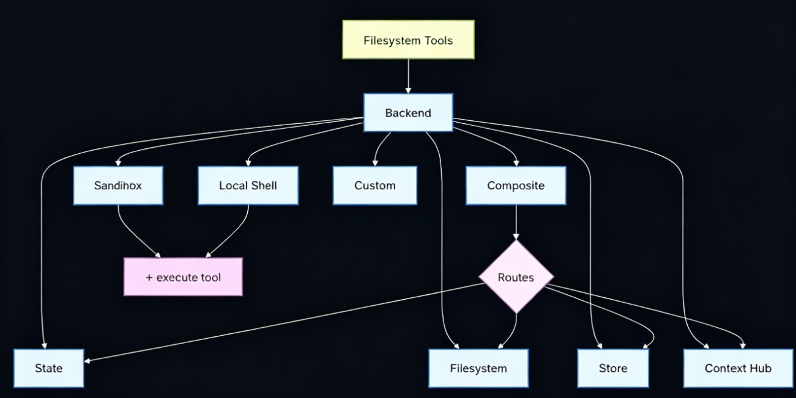

# 后端存储 (Backends)


## 1.8 后端存储 (Backends)

> 📖 官方文档：https://docs.langchain.com/oss/python/deepagents/backends

### 开篇引言：为什么需要 Backend？

想象一下这些场景：

- **你让 Agent 写了一份报告，关掉对话后文件就消失了**——白写了
- **你告诉 Agent 你的偏好（比如“我喜欢简洁的回答”），下次它又忘了**——每次都要重复说
- **你希望 Agent 在不同会话间共享知识**——比如 Thread A 学到了用户偏好，Thread B 也能用

**问题根源**：Agent 默认只有短期记忆（对话上下文），关掉会话就清空了。

**解决方案**：Backend 就是 Agent 的“硬盘”——解决持久化存储问题！

> 💡 **生活比喻**：
> Backend 就像是给 Agent 配了一个“云盘+本地硬盘”的混合文件系统。
> - Agent 眼中的“虚拟路径”（如 `/report.txt`）就像你电脑里的“桌面”、“文档”文件夹
> - Backend 负责把这些虚拟路径“翻译”成真实的物理位置——可能在你电脑 C 盘（本地存储）、可能在云端（数据库存储）、也可能在 Git 仓库（版本化存储）
> - 这样 Agent 只需要说“保存 report.txt”，不用关心文件到底存在哪里

---

### 📖 本章导览

| 小节                            | 内容                           | 适合读者      |
|:------------------------------|:-----------------------------|:----------|
| 1.8.1 核心机制                    | Backend 的工作原理                | 理解概念      |
| 1.8.2 后端类型概览                  | 五种后端对比 + 选型决策树               | 快速选型      |
| 1.8.3 StateBackend            | 默认内存存储                       | 开发测试      |
| 1.8.4 FilesystemBackend       | 本地文件系统                       | 本地调试      |
| 1.8.5 StoreBackend            | 数据库/键值存储                     | 生产环境      |
| 1.8.6 ContextHubBackend       | LangSmith Hub 版本化存储（含国内替代方案） | 生产环境最佳实践  |
| 1.8.7 CompositeBackend        | 混合存储策略                       | 生产环境推荐    |
| 1.8.8 Backend vs Checkpointer | 区别与联系                        | 概念辨析      |
| 1.8.9 生产环境选型指南                | 完整选型建议                       | 架构设计      |
| 补充附录 DeepAgents长期记忆实现指南       | 完整选型建议                       | 概念辨析      |
---

### 1.8.1 核心机制





DeepAgents 的 **Backend** 系统是为 Agent 构建的“虚拟文件系统”，核心作用是定义 Agent 生成文件的最终存储位置，也是实现跨线程数据共享、落地长期记忆能力的核心载体。


**核心机制：**

1. **被动触发逻辑**：Backend 仅在 Agent 主动调用文件操作工具（如 `write_file`、`edit_file`、`read_file`）时才会被激活。需注意的是，Agent 的思考过程、对话上下文等临时状态仅存储在内存（State）中，不会自动写入 Backend，只有显式执行文件操作的内容才会进入该系统。

2. **路径映射规则**：Agent 操作的所有文件均基于“虚拟路径”（如 `/report.txt`、`/store/memory.txt`），Backend 会按照预设规则将这些虚拟路径映射到实际物理存储介质——比如本地硬盘、Redis 数据库、LangSmith Hub 等，实现“虚拟路径”到“物理存储”的无感转换。

**存储行为对照表：**

| 行为 | Backend 是否存储 | 存储位置 |
| :--- | :--- | :--- |
| Agent 说："你好" | 否 | 仅在当前对话内存 (State) |
| Agent 思考过程 | 否 | 仅在当前对话内存 (State) |
| Agent 调用 `write_file("a.txt", "内容")` | 是 | **Backend** (硬盘/数据库/Hub) |

> **💡 一句话总结**：Backend 只存 Agent“主动保存”的文件，不存对话内容。

---

### 1.8.2 后端类型概览

DeepAgents 提供了五种标准的后端实现，适用于不同的开发和生产场景：

| 后端类型 | 存储介质 | 适用场景 | 核心特性 | 类比 |
| :--- | :--- | :--- | :--- | :--- |
| **StateBackend** (默认) | 内存 (State) | 临时文件、中间运算结果。会话结束即销毁 | 零配置、最快读写 | 浏览器的“无痕模式” |
| **FilesystemBackend** | 本地硬盘 | 本地开发、调试、需要直接查看生成文件的场景 | 直观可见、支持沙箱隔离 | 电脑的本地磁盘 |
| **StoreBackend** | 数据库 (KV Store) | 生产环境、跨 Agent 共享数据、持久化记忆 | 持久化、跨线程共享 | 云盘 (iCloud/OneDrive) |
| **ContextHubBackend** | LangSmith Hub | 生产环境最佳实践、团队协作、Agent 自我进化（⚠️ 国内需注意网络） | 版本化存储、Git-like 历史 | GitHub + 云盘 |
| **CompositeBackend** | 混合存储 | 生产环境最佳实践。区分“临时文件”和“重要记忆” | 灵活路由、按路径分发 | 系统盘 + 数据盘 |

#### 快速选型决策树

```
第1步：你需要文件在对话结束后保留吗？
    ├─ 否 → ✅ StateBackend（临时存储）
    └─ 是 → 继续判断

第2步：你需要版本控制（历史追溯）吗？
    ├─ 是 → ✅ ContextHubBackend（版本化存储）但需评估国内网络
    └─ 否 → 继续判断

第3步：你是本地开发还是生产环境？
    ├─ 本地开发 → ✅ FilesystemBackend（方便查看）
    └─ 生产环境 → 继续判断

第4步：你需要跨线程/跨Agent共享数据吗？
    ├─ 是 → ✅ StoreBackend 或 ContextHubBackend
    └─ 否 → ✅ FilesystemBackend

第5步（终极推荐）：用 CompositeBackend 组合使用！
    - 临时文件 → StateBackend
    - 重要数据 → StoreBackend / ContextHubBackend
```

> **💡 一句话总结**：测试用 StateBackend，本地调试用 FilesystemBackend，生产共享用 StoreBackend，需要版本控制评估网络后用 ContextHubBackend，最佳实践用 CompositeBackend。

---

### 1.8.3 StateBackend（默认内存存储）

**场景描述：**
当你不配置任何 backend 时，DeepAgents 默认使用 StateBackend。所有文件操作都存储在对话的内存 State 中，会话结束即销毁。

**适用场景：**
- 临时文件、中间运算结果
- 测试环境、快速原型
- 不需要持久化的场景

**特点：**
- ✅ 零配置，开箱即用
- ✅ 读写速度最快（纯内存）
- ❌ 会话结束后数据丢失
- ❌ 无法跨线程共享

```python
# 不配置 backend，默认使用 StateBackend
from deepagents import create_deep_agent
from langchain.chat_models import init_chat_model
from dotenv import load_dotenv, find_dotenv
import os

load_dotenv(find_dotenv())

llm = init_chat_model(
    model=os.getenv("LLM_QWEN_MAX"),
    model_provider="openai"
)

# 默认使用 StateBackend
agent = create_deep_agent(
    model=llm,
    system_prompt="你是一个智能助手，可以读写文件。"
)

# 写入文件（仅存在于当前会话内存中）
result = agent.invoke({
    "messages": [{"role": "user", "content": "保存一个临时文件 temp.txt，内容'临时数据'"}]
})

# 会话结束后，temp.txt 就消失了
```

> **💡 一句话总结**：StateBackend 就像浏览器的“无痕模式”——关掉就没了。

---

### 1.8.4 FilesystemBackend（本地文件系统）

**场景描述：**
在本地开发或调试时，我们希望 Agent 生成的文件直接出现在项目文件夹中，方便开发者查看和验证。`FilesystemBackend` 将 Agent 的虚拟路径直接映射到宿主机的物理文件系统。

**功能特点：**
- **直观可见**：生成的文件可以直接在 IDE 或文件管理器中打开
- **安全隔离**：推荐开启 `virtual_mode=True`，将 Agent 限制在指定的工作目录（`root_dir`）内，防止越权访问系统敏感文件

> **⚠️ 安全警告**：
> 关闭 `virtual_mode=True` 时，Agent 可以访问你电脑上的任何文件（包括系统文件）！
> 生产环境或沙箱环境中，**必须开启 `virtual_mode=True`**，将 Agent 限制在指定目录内。

**代码示例：**

```python
from pathlib import Path
from deepagents import create_deep_agent
from deepagents.backends import FilesystemBackend
from langchain.chat_models import init_chat_model
from dotenv import load_dotenv, find_dotenv
import os

load_dotenv(find_dotenv())

# ========== 1. 准备本地工作目录 ==========
workspace_dir = Path("./agent_workspace").resolve()
if not workspace_dir.exists():
    workspace_dir.mkdir(parents=True, exist_ok=True)

print(f"Agent 的工作目录已设置为: {workspace_dir}")

# ========== 2. 配置本地文件系统后端 ==========
# virtual_mode=True 开启安全沙箱模式，限制 Agent 只能访问 workspace_dir
backend = FilesystemBackend(root_dir=workspace_dir, virtual_mode=True)

llm = init_chat_model(
    model=os.getenv("LLM_QWEN_MAX"),
    model_provider="openai"
)

# ========== 3. 创建 Agent ==========
agent = create_deep_agent(
    model=llm,
    backend=backend,
    system_prompt="你是一个智能助手。你可以使用文件工具来读写文件，但只有在用户明确要求时才创建文件。"
)

# ========== 4. 运行并验证 ==========
print("\n=== Case 1: 普通问答（不应该生成文件） ===")
result1 = agent.invoke({"messages": [{"role": "user", "content": "请告诉我 Python 是什么时候发明的？"}]})
print("Agent 回复:", result1["messages"][-1].content)

# 验证没有生成文件
files = list(workspace_dir.iterdir())
if not files:
    print("Case 1 成功：目录下没有生成任何文件。")
else:
    file_names = [f.name for f in files]
    print(f"Case 1 失败：目录下生成了文件: {file_names}")

print("\n=== Case 2: 明确要求生成文件 ===")
result2 = agent.invoke({"messages": [{"role": "user", "content": "帮我写一份关于 Java 的简短介绍，并保存为 java_intro.md"}]})
print("Agent 回复:", result2["messages"][-1].content)

# 验证文件是否真实存在
file_path = workspace_dir / "java_intro.md"
if file_path.exists():
    print(f"\nCase 2 成功！文件已生成在: {file_path}")
    with open(file_path, "r", encoding="utf-8") as f:
        print(f"文件内容预览:\n{f.read()[:100]}...")
else:
    print("\nCase 2 失败：文件未生成。")
```

**预期输出示例：**
```text
Agent 的工作目录已设置为: /Users/xxx/agent_workspace

=== Case 1: 普通问答（不应该生成文件） ===
Agent 回复: Python 是由 Guido van Rossum 于 1991 年首次发布的...
Case 1 成功：目录下没有生成任何文件。

=== Case 2: 明确要求生成文件 ===
Agent 回复: 已为您创建 java_intro.md 文件。

Case 2 成功！文件已生成在: /Users/xxx/agent_workspace/java_intro.md
文件内容预览:
# Java 简介

Java 是由 Sun Microsystems 公司于 1995 年推出的高级编程语言...
```

> **💡 一句话总结**：FilesystemBackend 让 Agent 像人一样在电脑硬盘上存文件。

---

### 1.8.5 StoreBackend（数据库/键值存储）

**场景描述：**
在生产环境或分布式系统中，文件不适合存储在本地磁盘。`StoreBackend` 利用 LangGraph 的 Store 机制，将文件内容作为 Key-Value 数据存储在数据库（如 Redis、Postgres）或内存中。这对于实现**跨线程记忆共享**至关重要。

**功能特点：**
- **持久化**：配合 RedisStore 可实现数据持久保存
- **共享性**：不同线程（Thread）甚至不同 Agent 可以通过访问同一个 Store 来共享数据
- **适配器模式**：`StoreBackend` 充当适配器，将文件操作转换为 KV 存储操作

> **原理**：不同的 `thread_id` 就像不同的人在使用同一个云盘。Thread A 上传了一个文件，Thread B 可以下载同一个文件。StoreBackend 就是这块“共享云盘”。

**代码示例：**

```python
from deepagents import create_deep_agent
from deepagents.backends import StoreBackend
from langgraph.store.memory import InMemoryStore
from dotenv import load_dotenv, find_dotenv
from langchain.chat_models import init_chat_model
import os

load_dotenv(find_dotenv())

# 🚨 生产环境建议使用: from langgraph.store.redis import RedisStore
# store = RedisStore(redis_url=os.getenv("REDIS_URL"))

# ========== 1. 准备 Store (模拟数据库) ==========
# InMemoryStore 是轻量级内存存储，重启后数据丢失
store = InMemoryStore()

llm = init_chat_model(
    model=os.getenv("LLM_QWEN_MAX"),
    model_provider="openai"
)

# ========== 2. 创建 Agent（使用 StoreBackend） ==========
# runtime 参数由 DeepAgents 自动传入，无需手动传递
def create_store_backend(runtime):
    return StoreBackend(runtime)

agent = create_deep_agent(
    model=llm,
    store=store,                    # 传入数据仓库
    backend=create_store_backend,   # 传入工厂函数
    system_prompt="你是一个智能助手，可以将重要信息保存到文件中。"
)

# ========== 3. Thread A - 写入记忆 ==========
print("\n=== 写入记忆 (Thread A) ===")
config_a = {"configurable": {"thread_id": "thread_a"}}
result_a = agent.invoke({
    "messages": [{"role": "user", "content": "我叫大风子，我的幸运数字是 7。请保存到 user_profile.txt"}]
}, config=config_a)
print("Agent 回复:", result_a["messages"][-1].content)

# ========== 4. Thread B - 跨线程读取 ==========
print("\n=== 读取记忆 (Thread B) ===")
# 使用不同的 thread_id，模拟另一个会话
# Store 是共享的，Thread B 可以读取 Thread A 写入的数据
config_b = {"configurable": {"thread_id": "thread_b"}}
result_b = agent.invoke({
    "messages": [{"role": "user", "content": "请读取 user_profile.txt 告诉我，我叫什么名字？我的幸运数字是多少？"}]
}, config=config_b)
print("Agent (Thread B) 回复:", result_b["messages"][-1].content)

# ========== 5. 验证 Store 数据 ==========
print("\n=== 验证 Store 数据 ===")
# StoreBackend 存储文件的 key 格式为 ("filesystem", filename)
# 例如 user_profile.txt 的 key 就是 ("filesystem", "user_profile.txt")
items = store.search(("filesystem",))
for item in items:
    print(f"Key: {item.key}")
    print(f"Value: {item.value}")
```

**预期输出示例：**
```text
=== 写入记忆 (Thread A) ===
Agent 回复: 已保存您的信息到 user_profile.txt。

=== 读取记忆 (Thread B) ===
Agent (Thread B) 回复: 根据 user_profile.txt，您叫大风子，幸运数字是 7。

=== 验证 Store 数据 ===
Key: ('filesystem', 'user_profile.txt')
Value: {'content': '我叫大风子，我的幸运数字是 7。', 'created_at': '...'}
```

> **💡 一句话总结**：StoreBackend 让不同会话的 Agent 可以共享记忆，就像共用同一个云盘。

---

### 1.8.6 ContextHubBackend（LangSmith Hub 版本化存储）

> **⚠️ 国内用户注意事项**：
>
> `ContextHubBackend` 依赖 LangSmith Hub 服务。LangSmith 的服务器部署在海外（美国、欧盟），国内网络环境直接访问可能存在**延迟较高、连接不稳定、甚至无法访问**的问题。
>
> **国内替代方案**：
> - 如需类似的可观测性功能，推荐使用 **Langfuse**（开源、支持私有化部署），LangSmith 代码可平移到 Langfuse，几乎无需改动
> - 如仅需跨线程持久化存储，使用 **StoreBackend**（Redis/Postgres）即可满足需求
> - 生产环境建议评估网络条件后再决定是否使用 ContextHubBackend

**场景描述：**
在生产环境中，我们希望 Agent 能够“学会”东西——用户偏好、项目知识、操作流程等，并且在下次运行时还能记住。`ContextHubBackend` 利用 LangSmith Hub 提供**版本化**的持久存储，每次写入都会产生一个 commit，支持 diff、review 和环境标签。

**核心价值：**
- **版本控制**：Agent 修改的文件会产生历史版本，可追溯、可回滚
- **跨运行持久化**：Agent 在本次运行中学到的知识，下次运行可以继续使用
- **团队协作**：多个 Agent 或多人可以共享同一个 Hub 仓库
- **Agent 自我进化**：结合 LangSmith Engine，Agent 可以回顾对话、学习经验、自动更新 Context Hub 中的文件

**功能特点：**
- 读取从缓存中提供，写入提交到 Hub 仓库
- 仓库不存在时，首次写入会自动创建
- 支持 Git-like 的 diff、review、环境标签（staging → production）

**与 StoreBackend 对比：**

| 维度 | StoreBackend | ContextHubBackend |
| :--- | :--- | :--- |
| 存储位置 | 数据库 (Redis/Postgres) | LangSmith Hub（海外服务器） |
| 版本控制 | ❌ 不支持 | ✅ 支持 |
| 国内网络延迟 | ✅ 可控（自建/云服务） | ⚠️ 较高（跨国访问） |
| 私有化部署 | ✅ 支持 | ❌ 不支持（需依赖 LangSmith 云服务） |
| 跨线程共享 | ✅ 支持 | ✅ 支持 |
| 跨运行持久化 | ✅ 支持 | ✅ 支持 |
| 适用场景 | 高频读写、大容量存储 | 需要版本追踪的配置/知识（需评估网络） |

**代码示例：**

```python
from deepagents import create_deep_agent
from deepagents.backends import ContextHubBackend
from langchain.chat_models import init_chat_model
from dotenv import load_dotenv, find_dotenv
import os

load_dotenv(find_dotenv())

# 🚨 需要设置 LangSmith API Key
# export LANGSMITH_API_KEY="your-api-key"
# 或写在 .env 文件中
# 
# 🚨 国内用户注意：确保网络可访问 LangSmith 服务
# 如无法访问，推荐使用 Langfuse 或 StoreBackend 替代

llm = init_chat_model(
    model=os.getenv("LLM_QWEN_MAX"),
    model_provider="openai"
)

# ========== 1. 单独使用 ContextHubBackend ==========
# runtime 参数由 DeepAgents 自动传入，无需手动传递
def create_hub_backend(runtime):
    return ContextHubBackend("my-agent", runtime)

agent = create_deep_agent(
    model=llm,
    backend=create_hub_backend,    # 传入工厂函数
    system_prompt="你是一个智能助手，可以保存和读取记忆。"
)

# ========== 2. 写入记忆（会自动创建 commit） ==========
print("\n=== 写入记忆 ===")
result1 = agent.invoke({
    "messages": [{"role": "user", "content": "记住，我叫张三，我的员工ID是12345。保存到 /memories/profile.txt"}]
})
print("Agent 回复:", result1["messages"][-1].content)

# ========== 3. 下次运行时读取记忆 ==========
print("\n=== 读取记忆（新会话） ===")
# 即使重启程序，数据仍然存在（存在 LangSmith Hub 中）
result2 = agent.invoke({
    "messages": [{"role": "user", "content": "读取 /memories/profile.txt，我叫什么名字？"}]
})
print("Agent 回复:", result2["messages"][-1].content)
```

**预期输出示例：**
```text
=== 写入记忆 ===
Agent 回复: 已记住您的信息。已提交到 Hub 仓库 (commit: abc1234)。

=== 读取记忆（新会话） ===
Agent 回复: 根据 /memories/profile.txt，您叫张三，员工ID是12345。
```

#### 国内替代方案：Langfuse

如果希望获得类似 LangSmith 的可观测性和版本控制能力，但受限于网络环境，推荐使用 **Langfuse**：

**核心优势**：
- 开源、支持私有化部署，数据不出境
- 功能与 LangSmith 高度对齐，学习成本低
- LangSmith 代码可直接平移到 Langfuse，仅需调整环境变量和导入包

**基本使用**：
```python
# Langfuse 配置（替代 LangSmith）
from langfuse.callback import CallbackHandler

handler = CallbackHandler(
    secret_key="your-secret-key",
    public_key="your-public-key",
    host="https://your-selfhosted-langfuse.com"  # 自托管地址
)

# 在 Agent 调用中传入回调
result = agent.invoke(
    {"messages": [...]},
    config={"callbacks": [handler]}
)
```

> **💡 一句话总结**：ContextHubBackend 就像给 Agent 配了一个 GitHub 仓库——每次保存都有历史记录。但国内用户需注意网络问题，推荐优先考虑 Langfuse 或 StoreBackend。

---

### 1.8.7 CompositeBackend（混合存储策略）

**场景描述：**
这是最灵活且推荐的生产环境配置。`CompositeBackend` 允许你根据**文件路径的前缀**，将文件路由到不同的后端。例如，将临时文件存内存，将重要记忆存数据库或 Hub。

**配置逻辑：**
- **默认路由 (Default)**：处理普通路径，通常映射到 `StateBackend`（临时）或 `FilesystemBackend`（本地）
- **特定路由 (Routes)**：处理特定前缀路径（如 `/store/`、`/memories/`），映射到 `StoreBackend` 或 `ContextHubBackend`

> **路由匹配规则**：
> - 如果文件路径以 `/store/` 开头 → 走 StoreBackend（数据库）
> - 如果文件路径以 `/memories/` 开头 → 走 ContextHubBackend（Hub）
> - 否则 → 走 default（如 StateBackend）
> - 支持多个路由规则，按添加顺序匹配

**代码示例：**

```python
from deepagents import create_deep_agent
from deepagents.backends import (
    ContextHubBackend,
    StoreBackend,
    StateBackend,
    CompositeBackend
)
from langgraph.store.memory import InMemoryStore
from dotenv import load_dotenv, find_dotenv
from langchain.chat_models import init_chat_model
import os

load_dotenv(find_dotenv())

# ========== 1. 准备共享 Store ==========
store = InMemoryStore()

# ========== 2. 配置 LLM ==========
llm = init_chat_model(
    model=os.getenv("LLM_QWEN_MAX"),
    model_provider="openai"
)

# ========== 3. 定义混合后端 ==========
# runtime 参数由 DeepAgents 自动传入，无需手动传递
def create_composite_backend(runtime):
    # 后端 A: 临时存储（内存）
    temp_backend = StateBackend()
    
    # 后端 B: 数据库存储（用于重要数据）
    store_backend = StoreBackend(runtime)
    
    # 后端 C: Hub 版本化存储（用于记忆）
    # 国内用户可替换为 StoreBackend 或 Langfuse 方案
    hub_backend = ContextHubBackend("my-agent", runtime)
    
    # 组合后端：配置路由规则
    return CompositeBackend(
        runtime=runtime,        # 必须传递 runtime
        default=temp_backend,   # 默认走内存（临时文件）
        routes={
            "/store/": store_backend,    # 以 /store/ 开头走数据库
            "/memories/": hub_backend,   # 以 /memories/ 开头走 Hub
        }
    )

# ========== 4. 创建 Agent ==========
agent = create_deep_agent(
    model=llm,
    store=store,                        # 用于 StoreBackend
    backend=create_composite_backend,   # 传入工厂函数
    system_prompt="""你是一个智能助手。
    - 临时文件：直接写入文件名（如 `temp.txt`），只存在于当前会话。
    - 重要数据：写入 `/store/` 目录（如 `/store/profile.txt`），持久化到数据库。
    - 重要记忆：写入 `/memories/` 目录（如 `/memories/rules.txt`），版本化存储到 Hub。
    """
)

# ========== 5. 运行 Agent ==========
print("\n=== 测试混合存储 ===")
config = {"configurable": {"thread_id": "thread_composite"}}

user_input = """
1. 创建临时文件 temp.txt，内容'临时数据'（不要前缀）
2. 创建持久文件 /store/profile.txt，内容'用户偏好：喜欢简洁'
3. 创建记忆文件 /memories/rules.txt，内容'安全规则：不能删除系统文件'
"""
print(f"用户指令: {user_input}")

result = agent.invoke({
    "messages": [{"role": "user", "content": user_input}]
}, config=config)

print("Agent 回复:", result["messages"][-1].content)

print("\n=== 验证结果 ===")
print("temp.txt -> StateBackend（仅当前会话内存）")
print("/store/profile.txt -> StoreBackend（数据库持久化）")
print("/memories/rules.txt -> ContextHubBackend（Hub 版本化存储）")
```

**预期输出示例：**
```text
=== 测试混合存储 ===
用户指令: 1. 创建临时文件 temp.txt...
Agent 回复: 已创建三个文件：temp.txt（临时）、/store/profile.txt（持久）、/memories/rules.txt（版本化）。

=== 验证结果 ===
temp.txt -> StateBackend（仅当前会话内存）
/store/profile.txt -> StoreBackend（数据库持久化）
/memories/rules.txt -> ContextHubBackend（Hub 版本化存储）
```

> **💡 一句话总结**：CompositeBackend 让不同用途的文件去不同的地方——临时文件存内存，重要数据存数据库，关键记忆存版本化 Hub（国内用户可调整路由配置）。

---

### 1.8.8 Backend vs Checkpointer：区别与联系

很多读者容易混淆 Backend（存储文件）和 Checkpointer（存储对话状态）。以下是详细对比：

| 维度 | Backend | Checkpointer |
| :--- | :--- | :--- |
| **存储内容** | Agent 主动保存的文件（通过 `write_file` 等工具） | Agent 的对话状态、消息历史、中断点 |
| **触发方式** | 仅当 Agent 调用文件操作工具时 | 每次 Agent 执行步骤后自动触发 |
| **生命周期** | 由配置的后端决定（可持久化、跨线程） | 通常与 thread_id 绑定，支持中断恢复 |
| **典型用途** | 长期记忆、知识库、生成的文件 | 多轮对话恢复、HITL 审批状态 |
| **生活类比** | 电脑硬盘（存文件） | 浏览器历史记录（存浏览状态） |

**实际场景说明：**

```python
# 两者通常配合使用
from deepagents import create_deep_agent
from langgraph.checkpoint.memory import MemorySaver
from deepagents.backends import FilesystemBackend

# 🚨 MemorySaver 只在内存中保存对话状态，服务重启会丢失
# 生产环境请使用 RedisCheckpointer 或 PostgresCheckpointer
checkpointer = MemorySaver()      # 保存对话状态（临时）
backend = FilesystemBackend(...)  # 保存文件（持久化）

agent = create_deep_agent(
    model=llm,
    backend=backend,           # 文件存在硬盘
    checkpointer=checkpointer  # 状态存在内存（服务重启丢失）
)
```

> **💡 一句话总结**：Backend 存的是“文件”，Checkpointer 存的是“对话进度”。一个管内容，一个管流程。

---

### 1.8.9 生产环境选型指南

| 场景 | 推荐 Backend | 推荐 Checkpointer | 说明 |
| :--- | :--- | :--- | :--- |
| **本地开发测试** | `StateBackend` 或 `FilesystemBackend` | `MemorySaver` | 简单快速，文件可直接查看 |
| **生产环境（单机）** | `CompositeBackend`（`StateBackend` + `FilesystemBackend`） | `RedisCheckpointer` | 临时文件存内存，重要文件存硬盘 |
| **生产环境（分布式）** | `CompositeBackend`（`StateBackend` + `StoreBackend`） | `PostgresCheckpointer` | 共享存储，多实例部署 |
| **需要版本控制（海外/可访问）** | `CompositeBackend`（`StateBackend` + `ContextHubBackend`） | 任意持久化 Checkpointer | 重要记忆存 Hub，可追溯历史 |
| **需要版本控制（国内）** | `CompositeBackend`（`StateBackend` + `StoreBackend`）+ Langfuse 可观测 | 任意持久化 Checkpointer | 使用 StoreBackend 存储 + Langfuse 做追踪 |
| **极致性能** | `StateBackend` | `MemorySaver` | 纯内存，最快但数据易失 |

**生产环境完整配置示例（国内推荐版）：**

```python
# 生产环境推荐配置（国内优化版）
from deepagents import create_deep_agent
from deepagents.backends import CompositeBackend, StateBackend, StoreBackend
from langgraph.checkpoint.redis import RedisCheckpointer
from langgraph.store.redis import RedisStore
import os

# 持久化 Checkpointer（存对话状态）
checkpointer = RedisCheckpointer(redis_url=os.getenv("REDIS_URL"))

# 持久化 Store（存共享数据）
store = RedisStore(redis_url=os.getenv("REDIS_URL"))

# 混合 Backend（避免使用 ContextHubBackend 以降低网络延迟）
def create_backend(runtime):
    return CompositeBackend(
        runtime=runtime,
        default=StateBackend(),                    # 临时文件走内存
        routes={
            "/store/": StoreBackend(runtime),      # 重要数据走 Redis
            "/memories/": StoreBackend(runtime),   # 重要记忆也走 Redis
        }
    )

agent = create_deep_agent(
    model="...",
    store=store,
    backend=create_backend,
    checkpointer=checkpointer,
)

# 可选：配合 Langfuse 做可观测性追踪（替代 LangSmith）
from langfuse.callback import CallbackHandler
handler = CallbackHandler(
    secret_key=os.getenv("LANGFUSE_SECRET_KEY"),
    public_key=os.getenv("LANGFUSE_PUBLIC_KEY"),
    host=os.getenv("LANGFUSE_HOST")  # 自托管地址或默认云服务
)
# 在调用时传入 callbacks
result = agent.invoke(
    {"messages": [...]},
    config={"callbacks": [handler]}
)
```

> **💡 一句话总结**：国内生产环境推荐 CompositeBackend + Redis/Postgres + Langfuse 可观测，避免依赖海外 LangSmith 服务。


### 附录：DeepAgents 长期记忆实现指南

#### 问题背景

在实际项目中，我们经常需要让 Agent 记住用户的信息、偏好和历史对话。核心问题是：**如何告诉 Agent 哪些内容需要长期记忆？**

> 💡 **核心答案**：在 Prompt 中定义规则，让大模型自主决策 + 通过路径约定自动路由到持久化存储。

---

#### 一、核心原理：Prompt 驱动 + 路径约定

DeepAgents 的设计理念是：**让 Agent 自己决定什么该记住**，开发者只需要告诉它规则。

```
┌─────────────────────────────────────────────────────────────┐
│                     用户输入                                 │
│   "我叫张三，我喜欢简洁的回答"                               │
└─────────────────────────────────────────────────────────────┘
                              │
                              ▼
┌─────────────────────────────────────────────────────────────┐
│                   Agent 决策（基于 Prompt）                   │
│                                                             │
│   "用户提供了个人信息和偏好 → 需要长期记忆"                   │
│   → 调用 write_file("/memories/user.txt", "姓名：张三...")   │
└─────────────────────────────────────────────────────────────┘
                              │
                              ▼
┌─────────────────────────────────────────────────────────────┐
│                    CompositeBackend                         │
│                                                             │
│   "/memories/" 路径 → StoreBackend（数据库持久化）           │
└─────────────────────────────────────────────────────────────┘
```

---

#### 二、方案一：纯 Prompt 规则定义（最常用）

在系统提示词中明确告诉 Agent：什么内容需要长期记忆，存到哪里。

```python
system_prompt = """
你是一个智能助手，具备长期记忆能力。

## 记忆规则
当用户提到以下内容时，你需要保存到长期记忆：
1. 个人信息：姓名、年龄、职业、联系方式、偏好、习惯
2. 重要事实：用户明确说"记住"、"不要忘记"的内容
3. 项目上下文：当前项目的关键决策、已完成的任务
4. 用户指令：用户设定的规则（如"以后回答要简洁"）

## 存储路径约定
- 用户信息 → /memories/user_profile.txt
- 项目记录 → /memories/project_{project_id}.txt  
- 用户偏好 → /memories/preferences.txt

## 示例
用户说："我叫张三，我喜欢简洁的回答"
→ 你应该调用 write_file("/memories/user_profile.txt", "姓名：张三，偏好：简洁回答")

用户说："帮我查一下天气"（没有记忆需求）
→ 直接回答，不调用 write_file
"""
```

**优点**：简单灵活，大模型自主决策
**缺点**：依赖模型理解能力，可能遗漏

---

#### 三、方案二：路径约定 + 语义路由（更精准）

利用 `CompositeBackend` 的路径路由，让不同路径对应不同存储策略：

```python
from deepagents.backends import CompositeBackend, StoreBackend, StateBackend

def create_backend(runtime):
    return CompositeBackend(
        runtime=runtime,
        default=StateBackend(),                      # 临时文件走内存
        routes={
            "/memories/": StoreBackend(runtime),     # 长期记忆走数据库
            "/temp/": StateBackend(),                # 临时文件走内存
        }
    )
```

在 Prompt 中约定：
- 存到 `/memories/` → 长期保存，会跨会话共享
- 存到 `/temp/` → 临时保存，会话结束就消失

> **原理**：Agent 不需要知道底层存储是什么，只需要知道"把重要内容写到 `/memories/` 目录下"。

---

#### 四、完整示例：实现长期记忆的 Agent

```python
from deepagents import create_deep_agent
from deepagents.backends import CompositeBackend, StoreBackend, StateBackend
from langgraph.checkpoint.memory import MemorySaver
from langgraph.store.memory import InMemoryStore
from langchain.chat_models import init_chat_model
from dotenv import load_dotenv, find_dotenv
import os

load_dotenv(find_dotenv())

# ========== 1. 配置存储 ==========
store = InMemoryStore()  # 生产环境用 RedisStore

def create_backend(runtime):
    return CompositeBackend(
        runtime=runtime,
        default=StateBackend(),                     # 默认临时
        routes={
            "/memories/": StoreBackend(runtime),    # /memories/ → 持久化
        }
    )

# ========== 2. 配置模型 ==========
llm = init_chat_model(
    model=os.getenv("LLM_QWEN_MAX"),
    model_provider="openai"
)

# ========== 3. 定义系统 Prompt（核心） ==========
system_prompt = """
你是一个智能助手，具备长期记忆能力。

## 【重要】记忆规则
当用户提到以下信息时，你必须调用 write_file 保存到 /memories/ 目录：
1. 个人信息：姓名、年龄、职业、生日、联系方式
2. 用户偏好：喜欢的回答风格、讨厌的内容、常用设置
3. 重要事实：用户明确说"记住"的内容
4. 上下文信息：当前项目的关键决策

## 存储格式
保存时使用以下格式：
- 文件路径：/memories/{类别}.txt
- 内容格式：key: value 或 自然语言描述

## 示例
用户："我叫张三，今年25岁，喜欢简洁的回答"
→ write_file("/memories/user_profile.txt", "姓名：张三，年龄：25，偏好：简洁回答")

用户："帮我查一下北京天气"（无记忆需求）
→ 直接回答，不调用 write_file

用户："记住，我的项目ID是PROJ-001"
→ write_file("/memories/project_context.txt", "项目ID：PROJ-001")

## 读取记忆
当用户询问个人信息、偏好或之前的上下文时，你应该先读取 /memories/ 下的相关文件。
"""

# ========== 4. 创建 Agent ==========
agent = create_deep_agent(
    model=llm,
    store=store,
    backend=create_backend,
    checkpointer=MemorySaver(),
    system_prompt=system_prompt,
)

# ========== 5. 测试 ==========
config = {"configurable": {"thread_id": "user_123"}}

# 第一轮：用户提供信息，Agent 应自动保存
print("=== 第一轮对话 ===")
result1 = agent.invoke({
    "messages": [{"role": "user", "content": "我叫李明，今年30岁，我喜欢用中文回答。另外请记住，我的公司是AI科技。"}]
}, config=config)
print("Agent:", result1["messages"][-1].content)

# 第二轮：新会话，但使用同一个 thread_id（或 store 共享）
print("\n=== 第二轮对话（读取记忆） ===")
result2 = agent.invoke({
    "messages": [{"role": "user", "content": "我叫什么名字？我多大？我有什么偏好？"}]
}, config=config)
print("Agent:", result2["messages"][-1].content)

# 验证存储的内容
print("\n=== 验证存储 ===")
items = store.search(("filesystem",))
for item in items:
    print(f"文件: {item.key}, 内容: {item.value}")
```

**预期输出**：
```text
=== 第一轮对话 ===
Agent: 已记住您的信息：您叫李明，30岁，偏好中文回答，公司在AI科技。

=== 第二轮对话（读取记忆） ===
Agent: 根据记忆，您叫李明，今年30岁，您偏好使用中文回答。

=== 验证存储 ===
文件: ('filesystem', '/memories/user_profile.txt'), 内容: {'content': '姓名：李明，年龄：30，偏好：中文回答，公司：AI科技'}
```

---

#### 五、增强方案：结构化存储 + 自动分类

如果需要更精细的控制，可以让 Agent 按类别分开存储：

```python
system_prompt = """
## 记忆存储规则（按类别分类）

| 信息类型 | 存储路径 | 示例内容 |
|---------|---------|---------|
| 个人信息 | /memories/profile.txt | 姓名、年龄、生日、职业 |
| 用户偏好 | /memories/preferences.txt | 回答风格、语言偏好、主题偏好 |
| 项目上下文 | /memories/project.txt | 项目ID、进度、关键决策 |
| 任务列表 | /memories/tasks.txt | 待办事项、已完成任务 |
| 知识库 | /memories/knowledge.txt | 用户提供的重要事实或规则 |

## 读取规则
当用户询问相关信息时：
1. 先判断问题类型
2. 读取对应的记忆文件
3. 结合文件内容回答

## 示例
用户："我的生日是5月20日"
→ write_file("/memories/profile.txt", "生日：5月20日")

用户："帮我看看还有哪些任务没做"
→ read_file("/memories/tasks.txt") 然后回答
"""
```

---

#### 六、方案对比总结

| 方案 | 优点 | 缺点 | 适用场景 |
|:---|:---|:---|:---|
| **纯 Prompt 规则** | 简单灵活，大模型自主决策 | 依赖模型理解能力，可能遗漏 | 通用场景 |
| **路径约定 + 语义路由** | 自动路由，无需模型判断存储介质 | 需要模型正确使用路径 | **生产推荐** |
| **结构化分类存储** | 精确可控，便于检索 | Prompt 较长 | 高精度要求 |
| **混合方案** | 平衡灵活性和可控性 | 配置稍复杂 | **最佳实践** |

> **💡 最佳实践**：使用 **Prompt 规则 + 路径约定** 的组合。在 Prompt 中定义清晰规则，让 Agent 自主决定何时保存，同时通过路径约定（如 `/memories/`）自动路由到持久化存储。

---

#### 七、常见问题 Q&A

##### Q1：大模型会忘记保存吗？如何提高准确性？

**A**：可以采取以下措施：
1. 在 Prompt 中增加更多示例（few-shot）
2. 使用更强大的模型
3. 结合后处理验证（检查是否有该记没记的内容）
4. 在 Prompt 开头强调"这是最重要的规则"

```python
system_prompt = """
【最高优先级规则】
你必须在每次回答前思考：用户是否提供了需要长期记忆的信息？
如果是，必须先调用 write_file 保存，再回答问题。

... 其他规则 ...
"""
```

##### Q2：如何区分不同用户的记忆？

**A**：有两种方式：
1. **使用 thread_id**：不同用户使用不同的 `thread_id`，结合 `StoreBackend` 会自动隔离
2. **在文件路径中包含用户ID**：`/memories/user_{user_id}/profile.txt`

```python
# 方案1：thread_id 隔离
config = {"configurable": {"thread_id": f"user_{user_id}"}}

# 方案2：路径包含用户ID
# Agent 在保存时自动加上用户标识
# 需要在 Prompt 中告知 Agent 当前用户ID
```

##### Q3：记忆太多会影响性能吗？

**A**：建议采用以下策略：
1. **按类别分开存储**，避免单个文件过大
2. **定期清理**：通过 Agent 工具或定时任务删除过期记忆
3. **使用摘要**：当文件过大时，让 Agent 生成摘要替换原始内容

```python
# 示例：让 Agent 自动管理记忆大小
system_prompt += """
## 记忆管理规则
- 当 /memories/ 下的文件超过 5000 字符时，生成摘要替换原内容
- 超过 30 天的记忆自动标记为"可能过期"，提醒用户确认
"""
```

##### Q4：如何让 Agent 在回答时主动利用记忆？

**A**：在 Prompt 中明确要求：

```python
system_prompt += """
## 回答规则
1. 回答用户问题前，先检查 /memories/ 下是否有相关记忆
2. 如果有，优先使用记忆中的信息
3. 如果记忆与用户当前说法矛盾，礼貌地询问用户确认
"""
```

---

#### 八、国内生产环境推荐配置

考虑到国内网络环境，推荐使用 `StoreBackend` + Redis/Postgres 替代 `ContextHubBackend`：

```python
# 国内生产环境推荐配置
from deepagents import create_deep_agent
from deepagents.backends import CompositeBackend, StoreBackend, StateBackend
from langgraph.checkpoint.redis import RedisCheckpointer
from langgraph.store.redis import RedisStore
import os

# 持久化 Checkpointer
checkpointer = RedisCheckpointer(redis_url=os.getenv("REDIS_URL"))

# 持久化 Store（共享记忆）
store = RedisStore(redis_url=os.getenv("REDIS_URL"))

# 混合 Backend
def create_backend(runtime):
    return CompositeBackend(
        runtime=runtime,
        default=StateBackend(),                    # 临时文件走内存
        routes={
            "/memories/": StoreBackend(runtime),   # 长期记忆走 Redis
        }
    )

# 创建 Agent
agent = create_deep_agent(
    model=llm,
    store=store,
    backend=create_backend,
    checkpointer=checkpointer,
    system_prompt=system_prompt,  # 包含记忆规则的 Prompt
)
```

---
