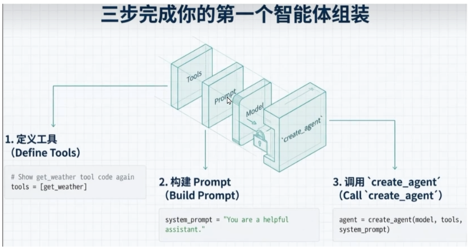
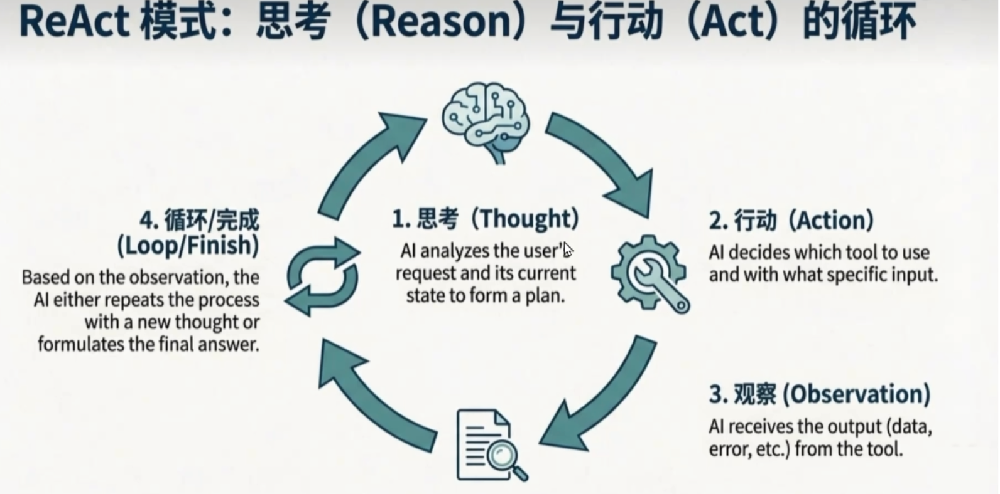

# Agent vs Tool：大模型的“手”与“脑”




## 一、一句话理解核心区别

| 概念 | 一句话 | 角色 |
|------|--------|------|
| **Tool** | 能力的封装 | 手（执行者） |
| **Agent** | 决策者 | 大脑（指挥者） |

---

## 二、生活比喻 👶

> **Tool** 就像工具箱里的**螺丝刀、锤子**——它们很能干，但自己不知道什么时候该用。
>
> **Agent** 就像**一个有经验的工匠**——他知道什么时候用螺丝刀，什么时候用锤子，甚至知道“先拧螺丝、再钉钉子”的顺序。

---

## 三、官方定义

### Tool（工具）
> 一个封装了特定能力的函数/API，可以被调用执行具体任务。**Tool 本身没有决策能力**，只能被动等待被调用。

**常见 Tool 示例：**
- 调用搜索引擎
- 查询数据库
- 运行 Python 代码
- 调用外部 API（天气、日历、计算器等）

### Agent（智能体）
> 一个由 LLM 驱动的决策系统，能够自主推理、选择工具、执行行动、观察结果，并循环迭代直至完成任务。

**Agent 核心公式：**
```
Agent = LLM + Memory + Tools + Planning + Action
```

---

## 四、为什么有了 Tool 还需要 Agent？

| 用户需求 | Tool 能直接解决吗？ | Agent 的作用 |
|----------|---------------------|--------------|
| “北京现在天气怎么样？” | ✅ 直接调用天气 Tool | 不需要 Agent |
| “订明天北京到上海的机票，查上海天气，发总结到我邮箱” | ❌ 无法决定顺序，也无法组合 | 推理：先订票 → 查天气 → 总结 → 发邮件 |
| “帮我读这个 PDF，总结后发邮件” | ❌ 需要多个 Tool（PDF读取、总结、发邮件） | 按顺序调用多个 Tool，串联执行 |

**核心结论：** 当任务需要**多步推理**或**多个工具组合**时，Agent 是必需品。

---

## 五、Agent 的核心工作模式：ReAct




> **ReAct = Reason（推理） + Act（行动）**

这是一个循环过程：

```
┌─────────────────────────────────────────────────┐
│  1. Thought（思考）                              │
│  AI 分析用户请求，制定计划                         │
│         ↓                                        │
│  2. Action（行动）                               │
│  AI 决定调用哪个 Tool，传入什么参数                 │
│         ↓                                        │
│  3. Observation（观察）                          │
│  AI 接收 Tool 返回的结果                          │
│         ↓                                        │
│  4. Loop / Finish（循环或结束）                   │
│  根据观察结果，重复思考-行动，或给出最终答案          │
└─────────────────────────────────────────────────┘
```

### 生活比喻：做饭

| ReAct 步骤 | 做饭类比 |
|------------|----------|
| Thought | “客人要吃红烧肉，我需要五花肉、酱油、糖” |
| Action | 打开冰箱查看食材 |
| Observation | “有五花肉，没有酱油” |
| Thought | “需要去买酱油” |
| Action | 去超市购买 |
| Observation | “买到了” |
| Finish | 开始做菜 |

---

## 六、Agent 的关键组件

```
                    ┌─────────────┐
                    │   Memory    │
                    │ 短期/长期记忆 │
                    └──────┬──────┘
                           │
┌──────────┐    ┌──────────┴──────────┐    ┌──────────┐
│  Tools   │◄──►│       Agent         │◄──►│ Planning │
│ 工具集合  │    │    (LLM大脑)         │    │  规划能力  │
└──────────┘    └──────────┬──────────┘    └──────────┘
                           │
                    ┌──────┴──────┐
                    │   Action   │
                    │   执行动作   │
                    └─────────────┘
```

| 组件 | 作用 | 示例 |
|------|------|------|
| **Memory** | 记住历史对话和上下文 | 短期记忆（当前会话）、长期记忆（向量数据库） |
| **Tools** | 可调用的能力集合 | 搜索、计算、代码执行、API调用 |
| **Planning** | 分解任务、制定步骤 | Chain of Thoughts、ReAct、Self-Critics |
| **Action** | 实际执行并返回结果 | 调用函数、输出文本 |

---

## 七、实践：创建一个 Agent（精简版）

### 三步完成

```python
# 1. 定义工具
def get_weather(city: str) -> str:
    """获取城市天气"""
    return f"{city}：晴天，25°C"

tools = [get_weather]

# 2. 构建提示词
system_prompt = "You are a helpful assistant"

# 3. 创建 Agent（一行代码）
agent = create_agent(model, tools, system_prompt)

# 使用
result = agent.invoke({"messages": [("user", "北京天气怎么样？")]})
```

### 新旧方式对比

| 特性 | 旧方式 (v0.x) | 新方式 (v1.0) |
|------|---------------|---------------|
| 创建步骤 | 3-4 步 | **1 步** |
| 提示词 | PromptTemplate 对象 | **简单字符串** |
| 底层驱动 | 手动编排 | **LangGraph 状态机** |

---

## 八、补充：什么时候不需要 Agent？

> **重要原则：能用 Tool 直接解决的，不要用 Agent。**

| 场景 | 推荐方案 | 原因 |
|------|----------|------|
| 单步、确定性的任务 | 直接调用 Tool | 更快、更便宜、更可控 |
| 多步推理、不确定路径 | Agent | 需要决策和组合 |
| 需要记忆和上下文 | Agent | 保持对话状态 |

**类比：** 拿桌上的水杯 → 不需要 Agent。规划一次旅行 → 需要 Agent。

---

## 九、总结脑图

```
                        ┌─────────────────────────────────┐
                        │           用户请求               │
                        └───────────────┬─────────────────┘
                                        │
                        ┌───────────────▼─────────────────┐
                        │  是单步、确定性的任务？           │
                        └───────┬─────────────────┬───────┘
                                │是                │否
                        ┌───────▼───────┐        ┌───▼───────────┐
                        │  直接调用Tool  │        │  启动 Agent    │
                        │  （不需要大脑） │        │  （ReAct循环）  │
                        └───────────────┘        └───┬───────────┘
                                                      │
                        ┌─────────────────────────────▼─────────────┐
                        │  Thought → Action → Observation → Loop    │
                        │  直到任务完成，给出最终答案                   │
                        └───────────────────────────────────────────┘
```

**一句话记住：**
> **Tool 是手脚，Agent 是大脑。手脚干活，大脑决定怎么干。**
