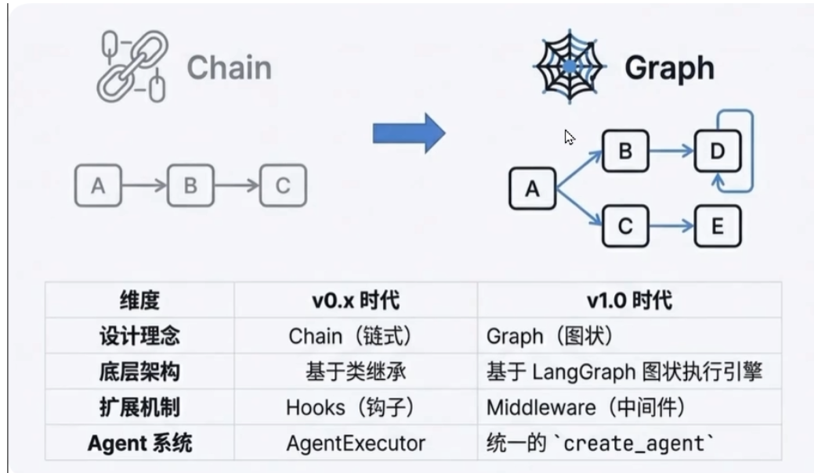
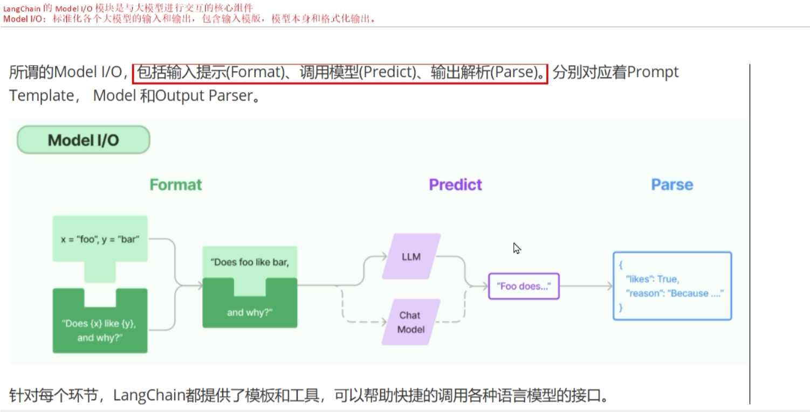
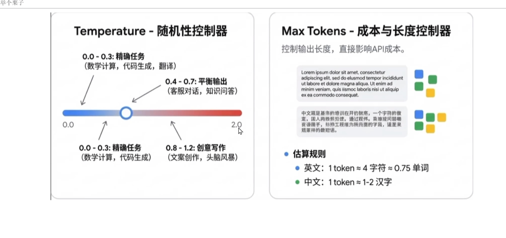

# LangChain 要点摘录：模型、消息与参数

## 一、LangChain 架构演进




| 维度 | v0.x 时代 | v1.0 时代 |
|-----|----------|----------|
| 设计理念 | Chain（链式） | Graph（图状） |
| 底层架构 | 基于类继承 | 基于 LangGraph 图状执行引擎 |
| 扩展机制 | Hooks（钩子） | Middleware（中间件） |
| Agent 系统 | AgentExecutor | 统一的 `create_agent` |

---

## 二、大语言模型分类

LangChain 将大语言模型分为以下三类：

### 2.1 LLM（基础文本生成模型）

| 特性 | 说明 |
|-----|------|
| 输入 | 纯文本字符串 |
| 输出 | 文本字符串 |
| 特点 | 无上下文记忆、高速轻量 |
| 场景 | 单轮问答、摘要生成、文本改写、指令执行 |

### 2.2 ChatModel（聊天对话模型）⭐ 重点使用

| 特性 | 说明 |
|-----|------|
| 输入 | 消息列表 `List[BaseMessage]` |
| 输出 | 聊天消息对象 `AIMessage` |
| 特点 | 支持多轮上下文、面向对话场景 |
| 场景 | 智能助手、客服机器人、多轮推理、Agent工具调用 |

**消息类型：**
- `HumanMessage` - 用户消息
- `SystemMessage` - 系统提示
- `AIMessage` - AI回复
- `ToolMessage` - 工具调用结果

### 2.3 Embeddings（文本向量模型）

| 特性 | 说明 |
|-----|------|
| 输入 | 字符串或列表 |
| 输出 | 向量（`List[float]` 或 `ndarray`） |
| 特点 | 不生成文本，转为语义向量 |
| 场景 | RAG检索增强、知识库问答、相似度搜索、聚类分类 |

---

## 三、Model I/O 核心模块



Model I/O 是 LangChain 与大模型交互的核心，包含三个环节：

```
┌─────────┐    ┌─────────┐    ┌─────────┐
│ Format  │ -> │ Predict │ -> │  Parse  │
│ 格式化   │    │  调用模型 │    │ 解析输出 │
└─────────┘    └─────────┘    └─────────┘
```

| 环节 | 组件 | 作用 |
|-----|------|------|
| Format | Prompt Template | 将用户输入格式化为模型可接受的提示模板 |
| Predict | Model（LLM/ChatModel） | 调用大语言模型生成响应 |
| Parse | Output Parser | 将模型输出解析为结构化数据 |

---

## 四、模型初始化参数

使用 `init_chat_model` 构建聊天模型时的标准化参数：

| 参数名 | 含义 |
|-------|------|
| `model` | 模型名称（如 "gpt-4"、"llama3.2"） |
| `temperature` | 温度，控制输出的随机性 |
| `timeout` | 请求超时时间 |
| `max_tokens` | 生成内容的最大 token 数 |
| `stop` | 停止词，遇到时立刻停止生成 |
| `max_retries` | 最大重试次数 |
| `api_key` | API 密钥 |
| `base_url` | API 请求地址 |

> ⚠️ **注意**：标准化参数仅对 LangChain 官方集成包（如 `langchain-openai`、`langchain-anthropic`）生效。`langchain-community` 中的第三方模型不强制遵守这些规则。

**动态切换模型示例：**
```python
def chat_with_model(model_name, prompt):
    # 根据模型名称动态调用不同的模型
    pass
```

---

## 五、核心参数详解



### 5.1 Temperature（随机性控制器）

| 取值范围 | 适用场景 |
|---------|---------|
| 0.0 - 0.3 | 精确任务：数学计算、代码生成、翻译 |
| 0.4 - 0.7 | 平衡输出：客服对话、知识问答 |
| 0.8 - 1.2 | 创意写作：文案创作、头脑风暴 |

### 5.2 Max Tokens（长度与成本控制器）

控制输出长度，直接影响 API 成本。

**Token 估算规则：**
| 语言 | 换算规则 |
|-----|---------|
| 英文 | 1 token ≈ 4 字符 ≈ 0.75 单词 |
| 中文 | 1 token ≈ 1-2 汉字 |

---

## 六、消息属性说明

| 属性名 | 作用 |
|-------|------|
| `type` | 消息类型：`user`、`ai`、`system`、`tool` |
| `content` | 消息内容（字符串或字典列表，用于多模态） |
| `name` | 区分同类型消息（非所有模型支持） |
| `response_metadata` | AI消息专属，包含 token 使用量等元数据 |
| `tool_calls` | AI消息专属，当模型决定调用工具时包含此属性 |

**tool_calls 结构：**
```python
# 每个 ToolCall 是一个字典，包含：
{
    "name": "工具名称",    # 要调用的工具名
    "args": {...},        # 调用参数
    "id": "唯一标识"       # 工具调用ID
}
```

---

## 七、快速上手示例

### 7.1 基础对话

```python
from langchain.chat_models import init_chat_model

# 初始化模型
model = init_chat_model(
    model="gpt-4",
    temperature=0.7,
    max_tokens=1000
)

# 发起对话
response = model.invoke("你好，请介绍一下自己")
print(response.content)
```

### 7.2 多轮对话

```python
from langchain.schema import HumanMessage, SystemMessage, AIMessage

messages = [
    SystemMessage(content="你是一个专业的编程助手"),
    HumanMessage(content="Python 中如何读取文件？"),
    AIMessage(content="可以使用 open() 函数..."),
    HumanMessage(content="能给我一个例子吗？")
]

response = model.invoke(messages)
```


