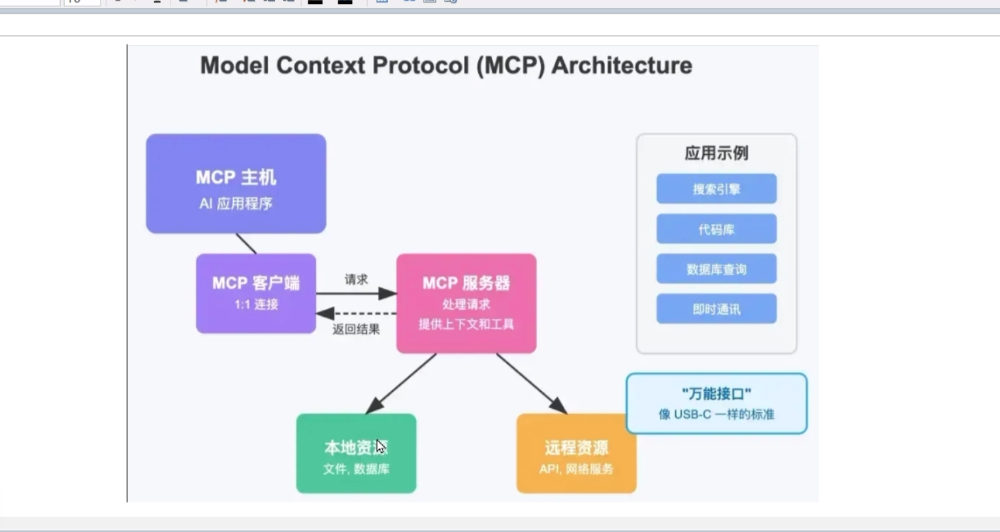

# Model Context Protocol (MCP) 知识文档


## 一、为什么需要 MCP？

### 现实痛点
目前 AI 应用很难同时做到：联网搜索 + 发送邮件 + 查数据库 + 发即时消息。每个功能单独实现不难，但集成到一个系统里就变得遥不可及。

### MCP 的解决方案
MCP 就像 **USB-C 接口**——无论什么设备，只要遵循这个标准，就能即插即用。AI 应用通过 MCP 连接各种数据源和工具，无需为每个服务单独开发适配器。

---

## 二、什么是 MCP？

### 官方定义
Model Context Protocol（模型上下文协议）是一个开放标准，定义了 AI 应用与外部数据源、工具之间的通信方式。

### 生活比喻
想象你有一个万能管家（AI 助手）。以前，你要自己打开 Excel、登录微信、编辑文档。现在，管家通过一套标准指令（MCP）直接操作这些工具，你只需要说出需求。

**例子**：你对 AI 说"查一下数学考试平均分，把不及格的同学整理到值日表，在微信群提醒补考"。AI 自动：
- 连接电脑读取 Excel 成绩
- 连接微信找到相关群
- 修改在线文档更新值日表

数据不离开你的设备，安全又高效。

---

## 三、核心架构




### 组件说明

| 组件 | 角色 | 例子 |
|------|------|------|
| **MCP 主机** | AI 应用程序 | Claude、IDE 中的 AI 助手 |
| **MCP 客户端** | 主机内置的通信模块 | 负责发送请求、接收结果 |
| **MCP 服务器** | 中介适配器 | 连接具体资源（数据库、API、文件） |
| **数据源** | 被访问的资源 | 本地文件、远程 API、GitHub |

### 工作流程
```
用户提问 → AI 主机 → MCP 客户端 → MCP 服务器 → 数据源
                                              ↓
用户得到回答 ← AI 主机 ← MCP 客户端 ← MCP 服务器 ← 返回结果
```

### 架构图（文字版）
```
┌─────────────┐
│  MCP 主机   │ (AI 应用程序)
│  ┌─────────┐│
│  │MCP客户端││
│  └────┬────┘│
└───────┼─────┘
        │ MCP 协议
   ┌────┴────┬─────────┐
   ↓         ↓         ↓
┌──────┐ ┌──────┐ ┌──────┐
│服务器A│ │服务器B│ │服务器C│
└──┬───┘ └──┬───┘ └──┬───┘
   ↓        ↓        ↓
本地文件   数据库    Web API
```

---

## 四、MCP 的两种通信模式

### STDIO（标准输入输出）

| 属性 | 说明 |
|------|------|
| 传输方式 | 操作系统级文件描述符（stdin/stdout） |
| 通信方向 | 双向流 |
| 适用场景 | 本地集成、命令行工具、同一台机器上的进程 |
| 连接特点 | 随进程生命周期，不保证长连接 |

**生活比喻**：像两个人用对讲机通话——按下说话，松手收听，但必须都在线。

### SSE（Server-Sent Events）

| 属性 | 说明 |
|------|------|
| 传输方式 | HTTP 长连接 |
| 通信方向 | 服务器→客户端（单向推送），客户端通过 HTTP POST 发请求 |
| 适用场景 | 需要服务器主动推送的场景、远程服务 |
| 连接特点 | 长连接（keep-alive），支持断线重连 |

**生活比喻**：像订阅公众号——你（客户端）订阅后，公众号（服务器）随时推送新消息给你。

### 对比表格

| 特性 | SSE | STDIO |
|------|-----|-------|
| 传输协议 | HTTP（长连接） | 操作系统级文件描述符 |
| 方向 | 服务器→客户端（单向推送） | 双向流 |
| 保持连接 | 长连接 | 取决于进程生命周期 |
| 数据格式 | 文本流（EventStream） | 原始字节流 |
| 异常处理 | HTTP 状态码 + 重连机制 | 进程退出或管道断裂 |

---

## 五、代码示例（Python 版）

### 5.1 STDIO 模式

```python
# mcp_stdio_server.py
import sys
import json

def handle_request(request):
    """处理来自 AI 客户端的请求"""
    method = request.get('method')
    params = request.get('params', {})
    
    if method == 'query_database':
        return {'data': [{'name': '张三', 'score': 45}, {'name': '李四', 'score': 78}]}
    elif method == 'send_email':
        return {'status': 'sent', 'to': params.get('to')}
    else:
        return {'error': f'unknown method: {method}'}

def main():
    """主循环：从 stdin 读取，向 stdout 输出"""
    for line in sys.stdin:
        line = line.strip()
        if not line:
            continue
        
        try:
            request = json.loads(line)
            result = handle_request(request)
            
            # 输出到 stdout（必须是 JSON 格式）
            response = json.dumps({'id': request.get('id'), 'result': result})
            print(response, flush=True)
            
        except json.JSONDecodeError as e:
            # 错误输出到 stderr，不影响 stdout 的数据流
            print(f'Parse error: {e}', file=sys.stderr)

if __name__ == '__main__':
    main()
```

```python
# mcp_stdio_client.py
import subprocess
import json

# 启动服务器子进程
server = subprocess.Popen(
    ['python', 'mcp_stdio_server.py'],
    stdin=subprocess.PIPE,
    stdout=subprocess.PIPE,
    stderr=subprocess.PIPE,
    text=True
)

# 发送请求
request = {'id': 1, 'method': 'query_database', 'params': {'table': 'students'}}
server.stdin.write(json.dumps(request) + '\n')
server.stdin.flush()

# 读取响应
response = server.stdout.readline()
print('Response:', json.loads(response))

server.terminate()
```

### 5.2 SSE 模式

```python
# mcp_sse_server.py
from flask import Flask, request, Response, jsonify
import time
import json

app = Flask(__name__)

# 存储所有 SSE 连接（实际应用需要维护连接池）
connections = []

@app.route('/sse')
def sse_stream():
    """客户端保持长连接，接收服务器推送"""
    def generate():
        while True:
            # 模拟服务器主动推送数据
            data = {'type': 'heartbeat', 'time': time.time()}
            yield f"data: {json.dumps(data)}\n\n"
            time.sleep(5)
    
    return Response(generate(), mimetype='text/event-stream')

@app.route('/request', methods=['POST'])
def handle_request():
    """客户端通过 POST 发送具体请求"""
    data = request.get_json()
    method = data.get('method')
    params = data.get('params', {})
    
    if method == 'query_database':
        result = {'data': [{'name': '王五', 'score': 92}]}
    else:
        result = {'error': 'unknown method'}
    
    return jsonify({'id': data.get('id'), 'result': result})

if __name__ == '__main__':
    app.run(port=3000)
```

```python
# mcp_sse_client.py
import requests
import sseclient  # 需要安装: pip install sseclient-py

# 1. 建立 SSE 连接（接收推送）
sse_url = 'http://localhost:3000/sse'
response = requests.get(sse_url, stream=True)
client = sseclient.SSEClient(response)

# 在后台线程接收推送（示例省略线程代码）
for event in client.events():
    print(f'Received: {event.data}')

# 2. 通过 POST 发送请求
def send_request(method, params):
    resp = requests.post('http://localhost:3000/request', json={
        'id': int(time.time()),
        'method': method,
        'params': params
    })
    return resp.json()

# 使用示例
result = send_request('query_database', {'table': 'products'})
print('Request result:', result)
```

---

## 六、STDIO vs SSE：核心区别

| 维度 | STDIO | SSE |
|------|-------|-----|
| **通信通道** | 一个通道双向通信 | 两个通道：SSE 接收 + POST 发送 |
| **连接方式** | 启动子进程，管道通信 | HTTP 长连接 |
| **适用场景** | 本地命令行工具、同机进程 | Web 应用、跨网络、远程服务 |
| **代码复杂度** | 简单，无需额外依赖 | 中等，需要 Flask 和 sseclient |
| **主动推送** | 不支持（只能请求-响应） | 支持（服务器随时推数据） |
| **断线处理** | 进程退出即断开 | 自动重连机制 |
| **典型用例** | IDE 插件、本地 CLI 工具 | 实时仪表盘、通知服务 |

### 一句话总结

- **STDIO**：像终端命令，一问一答，简单直接，适合本地
- **SSE**：像订阅推送，服务器能主动说话，适合跨网络场景

---

## 七、补充知识点

### 1. MCP 解决的核心问题

**上下文隔离**：AI 模型本身不存储你的数据。MCP 让 AI 能"安全地看到"你的本地文件、数据库、企业系统，而不需要你把数据上传到云端。

### 2. 与传统 API 的区别

| 维度 | 传统 API | MCP |
|------|----------|-----|
| 标准化程度 | 每个服务自定义 | 统一标准协议 |
| AI 友好度 | 需手动编写调用代码 | AI 原生理解 |
| 工具发现 | 硬编码 | 动态发现可用工具 |
| 上下文管理 | 无 | 内置上下文传递 |

### 3. 实际应用场景

- **代码开发**：AI 查询本地数据库 + 搜索 GitHub Issues + 发 Slack 做 Code Review
- **运维自动化**：AI 查询 AWS/Azure 配置并执行修改
- **个人助理**：AI 读取日历 + 发邮件 + 操作在线文档

### 4. 安全性特点

- 数据不离开本地（MCP 服务器运行在你的设备上）
- 用户可控制 AI 能访问哪些资源
- 每个操作可审计

---

## 八、总结

> **MCP 是 AI 世界的 USB-C 接口**——让 AI 应用能像插拔设备一样，即插即用地连接任何数据源和工具，安全又高效。

**选择建议**：
- 本地工具、IDE 插件 → 用 **STDIO**（简单、轻量）
- Web 应用、远程服务、需要推送 → 用 **SSE**（跨网络、主动推送）
