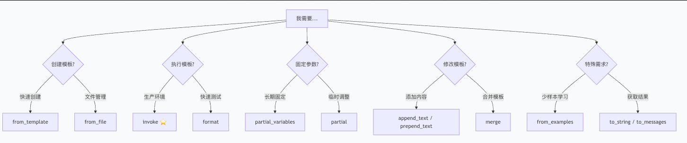

# promptTemplate使用指南

> 餐厅点餐比喻贯穿全文，帮助你快速理解每个方法的作用

## 快速决策：30秒找到你的方法




## 核心方法（必学，覆盖80%场景）

### 1. from_template() - 快速创建模板

**比喻**：口头告诉服务员你要什么，不用填表

```python
from langchain_core.prompts import PromptTemplate

# 最简单的方式
template = PromptTemplate.from_template("你好，{name}！今天{ feeling }吗？")

# 执行模板
result = template.invoke({"name": "张三", "feeling": "开心"})
print(result.to_string())  # 你好，张三！今天开心吗？
```

**何时用**：快速原型开发、简单模板、代码示例

---

### 2. invoke() - 生产环境执行（推荐）

**比喻**：使用餐厅电子点餐系统下单，自动解析、可追踪

```python
from langchain_core.prompts import PromptTemplate

template = PromptTemplate.from_template("请帮我{action}一份{food}")
result = template.invoke({"action": "推荐", "food": "招牌菜"})

# 返回 PromptValue 对象，可以：
print(result.to_string())        # 转为字符串
# messages = result.to_messages()  # 转为消息列表（用于聊天模型）
```

**为什么推荐 invoke() 而不是 format()？**

| 特性 | invoke() | format() |
|------|----------|----------|
| 返回值 | PromptValue对象 | 字符串 |
| LangChain兼容 | 完全兼容 | 有限 |
| 链式调用 | 支持 | 不支持 |
| 类型检查 | IDE友好 | 弱 |
| 适用场景 | 生产环境 | 快速测试 |

```python
# format() 仅用于快速验证
text = template.format(action="推荐", food="招牌菜")  # 直接返回字符串
```

---

### 3. to_string() / to_messages() - 获取结果

**比喻**：打印小票（字符串）或拆单分给不同厨师（消息列表）

```python
# to_string() - 转为纯文本
text_result = template.invoke({"name": "李四"}).to_string()

# to_messages() - 转为消息列表（用于Chat模型）
from langchain_core.prompts import ChatPromptTemplate

chat_template = ChatPromptTemplate.from_messages([
    ("system", "你是{role}"),
    ("human", "{question}")
])
messages = chat_template.invoke({"role": "助手", "question": "你好"}).to_messages()
# 返回 [SystemMessage, HumanMessage]
```

**何时用 to_messages()**：使用Chat模型（GPT、Claude等），需要区分系统/用户/助手消息

---

## 配置方法（常用，覆盖15%场景）

### 4. 固定参数：partial_variables vs partial()

**比喻**：
- `partial_variables`：餐厅给你的**个人套餐卡**（印好了固定项）
- `partial()`：点餐时贴的**便利贴**（临时备注）

```python
# partial_variables - 定义时固定（长期）
meal_card = PromptTemplate(
    template="在{restaurant}，点{main_course}，配{sauce}，{drink}",
    input_variables=["main_course"],  # 只有这个每次要填
    partial_variables={
        "restaurant": "老王餐馆",  # 卡上印好的
        "sauce": "黑椒汁",
        "drink": "可乐"
    }
)
order = meal_card.invoke({"main_course": "牛排"})
print(order.to_string())  # 在老王家，点牛排，配黑椒汁，可乐

# partial() - 调用前临时调整（单次）
today_order = meal_card.partial(drink="橙汁")  # 今天不想喝可乐
order2 = today_order.invoke({"main_course": "鸡排"})
print(order2.to_string())  # 在老王家，点鸡排，配黑椒汁，橙汁
```

| 方法 | 时机 | 作用范围 | 典型场景 |
|------|------|----------|----------|
| `partial_variables` | 定义模板时 | 所有调用 | 系统角色、固定上下文 |
| `partial()` | 调用模板前 | 单次调用 | 临时调整、用户偏好 |

---

### 5. append_text() / prepend_text() - 修改模板

**比喻**：点完餐后说"再加份薯条"或"先说明我是孕妇"

```python
template = PromptTemplate.from_template("推荐{cuisine}菜")

# 追加内容
with_note = template.append_text(" 不要辣！")

# 前置内容
final = with_note.prepend_text("注意：")

order = final.invoke({"cuisine": "川菜"})
print(order.to_string())  # 注意：推荐川菜 不要辣！
```

**注意**：这两个方法返回**新的模板对象**，原模板不变

---

## 高级方法（按需使用，覆盖5%场景）

### 6. merge() - 组合模板

**比喻**：把开胃菜套餐和主菜套餐合并成完整套餐

```python
starter = PromptTemplate.from_template("开胃菜：{starter}")
main = PromptTemplate.from_template("主菜：{main}")
dessert = PromptTemplate.from_template("甜点：{dessert}")

full_meal = starter.merge(main).merge(dessert)

order = full_meal.invoke({
    "starter": "沙拉",
    "main": "牛排", 
    "dessert": "冰淇淋"
})
print(order.to_string())  # 开胃菜：沙拉，主菜：牛排，甜点：冰淇淋
```

**何时用**：模块化构建复杂提示、复用模板片段

---

### 7. from_examples() - 少样本学习

**比喻**：给厨师看几张成品照片，说"按这样做"

```python
examples = [
    {"input": "开心的", "output": "微笑"},
    {"input": "伤心的", "output": "哭泣"},
    {"input": "惊讶的", "output": "惊叹"}
]

template = PromptTemplate.from_examples(
    examples=examples,
    suffix="输入：{word}\n输出：",
    input_variables=["word"]
)

result = template.invoke({"word": "困惑的"})
print(result.to_string())
# 输入：困惑的
# 输出：思考  (AI根据例子推理)
```

**何时用**：需要AI模仿格式、分类任务、格式化输出

---

### 8. from_file() - 模板文件管理

**比喻**：从菜谱书里选菜式

```python
# templates/greeting.txt 内容：
# 你好，{name}！
# 欢迎来到{store}，今天{feeling}吗？

template = PromptTemplate.from_file("templates/greeting.txt")

result = template.invoke({
    "name": "王小明",
    "store": "老王茶馆",
    "feeling": "心情如何"
})
print(result.to_string())
```

**何时用**：模板数量多、需要版本控制、模板与代码分离

---

## 实战案例

### 案例1：简单问答机器人（核心方法组合）

```python
from langchain_core.prompts import PromptTemplate

# 1. 创建模板
template = PromptTemplate.from_template(
    "用户问题：{question}\n请用{style}风格回答，不超过{max_words}字"
)

# 2. 执行（生产环境用invoke）
result = template.invoke({
    "question": "什么是人工智能？",
    "style": "通俗易懂",
    "max_words": 50
})

# 3. 获取结果
answer = result.to_string()
print(answer)
```

---

### 案例2：个性化客服系统（配置方法组合）

```python
# 1. 基础模板（固定公司信息）
base_template = PromptTemplate(
    template="【{company}客服】\n用户：{question}\n回复：{reply_style}",
    input_variables=["question"],
    partial_variables={
        "company": "XX科技",
        "reply_style": "专业友好"  # 默认风格
    }
)

# 2. 根据用户等级调整（临时partial）
vip_template = base_template.partial(reply_style="热情周到，优先处理")

# 3. 添加注意事项
final_template = vip_template.append_text("\n注意：请主动提供优惠信息")

# 4. 执行
response = final_template.invoke({"question": "我的订单什么时候到？"})
print(response.to_string())
```

---

### 案例3：少样本分类器（高级方法组合）

```python
# 1. 从文件加载基础模板
base = PromptTemplate.from_file("templates/classifier_base.txt")

# 2. 添加示例（少样本学习）
examples = [
    {"text": "今天天气真好", "label": "positive"},
    {"text": "太糟糕了", "label": "negative"},
]

template = PromptTemplate.from_examples(
    examples=examples,
    suffix="文本：{text}\n标签：",
    input_variables=["text"]
)

# 3. 追加输出格式要求
final = template.append_text("\n只输出标签，不要解释")

# 4. 执行
result = final.invoke({"text": "这个产品还不错"})
print(result.to_string())  # positive
```

---

## 常见问题 FAQ

### Q1: invoke() 和 format() 到底选哪个？

| 场景 | 推荐 | 原因 |
|------|------|------|
| 生产环境代码 | invoke() | 兼容LangChain生态、类型安全 |
| 快速测试/REPL | format() | 代码更短、无额外依赖 |
| Jupyter Notebook | 两者都可 | 看个人习惯 |

### Q2: partial() 和 partial_variables 有什么区别？

| 维度 | partial_variables | partial() |
|------|-------------------|-----------|
| 定义时机 | 创建模板时 | 使用模板前 |
| 作用范围 | 永久（所有调用） | 临时（单次链式调用） |
| 修改方式 | 需要重新创建模板 | 可连续多次partial |
| 性能 | 创建时一次处理 | 每次调用前处理 |

### Q3: 什么时候该用 to_messages()？

- 使用 ChatOpenAI、ChatAnthropic 等聊天模型
- 需要区分 system/human/ai 消息角色
- 构建多轮对话

- 使用普通 LLM（如 OpenAI的text-davinci）
- 只需要纯文本输出

### Q4: 性能优化建议？

```python
# 不好：重复创建相同模板
for user in users:
    template = PromptTemplate.from_template("你好{name}")
    result = template.invoke({"name": user})

# 好：复用模板对象
template = PromptTemplate.from_template("你好{name}")
for user in users:
    result = template.invoke({"name": user})

# 更好：预编译模板（大量重复调用时）
from langchain_core.prompts import PromptTemplate
template = PromptTemplate.from_template("你好{name}")
# LangChain内部会缓存编译结果，无需额外操作
```

### Q5: 参数缺失会怎样？

```python
template = PromptTemplate.from_template("{a} and {b}")

# 缺少参数
template.invoke({"a": "hello"})  
# KeyError: "Missing input variables: ['b']"

# 使用partial预先填充
template = PromptTemplate(
    template="{a} and {b}",
    input_variables=["a"],
    partial_variables={"b": "world"}
)
result = template.invoke({"a": "hello"})  # 正常：hello and world
```

---

## 方法速查表

| 方法 | 返回类型 | 何时用 | 优先级 |
|------|----------|--------|--------|
| `from_template()` | PromptTemplate | 快速创建 | 高 |
| `invoke()` | PromptValue | 生产环境执行 | 高 |
| `format()` | str | 快速测试 | 中 |
| `partial_variables` | PromptTemplate | 长期固定参数 | 高 |
| `partial()` | PromptTemplate | 临时调整 | 中 |
| `append_text()` | PromptTemplate | 添加后缀 | 中 |
| `prepend_text()` | PromptTemplate | 添加前缀 | 中 |
| `merge()` | PromptTemplate | 合并模板 | 低 |
| `from_examples()` | PromptTemplate | 少样本学习 | 低 |
| `from_file()` | PromptTemplate | 文件管理 | 中 |
| `to_string()` | str | 获取文本 | 高 |
| `to_messages()` | List[BaseMessage] | 聊天模型 | 中 |

---

## 核心要点总结

1. **创建**：大多数情况用 `from_template()`，大量模板用 `from_file()`
2. **执行**：生产环境**必须用 invoke()**，快速测试可用 format()
3. **固定参数**：长期固定用 `partial_variables`，临时调整用 `partial()`
4. **修改模板**：用 `append_text()` / `prepend_text()`，注意返回新对象
5. **获取结果**：普通LLM用 `to_string()`，Chat模型用 `to_messages()`
6. **性能**：复用模板对象，避免重复创建

---

**记住这个最佳实践流程**：

```python
# 1. 创建（或从文件加载）
template = PromptTemplate.from_template("...{变量}...")

# 2. 配置固定参数（如果需要）
template = PromptTemplate(
    template="...",
    partial_variables={"固定项": "值"}
)

# 3. 临时调整（如果需要）
template = template.partial(临时项="临时值")

# 4. 执行 - 总是用 invoke()
result = template.invoke({"变量": "值"})

# 5. 获取结果
output = result.to_string()  # 或 to_messages()
```
