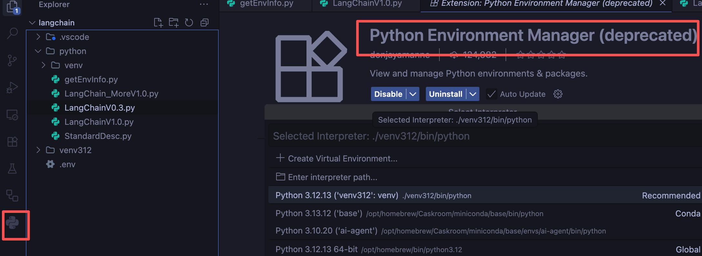
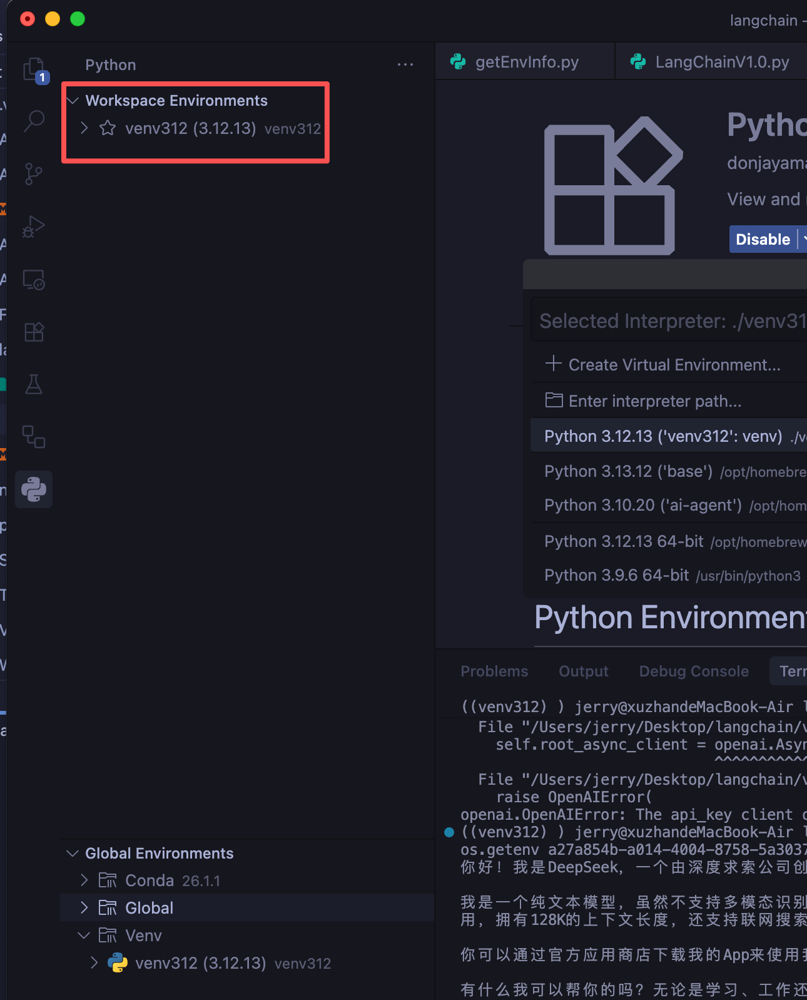
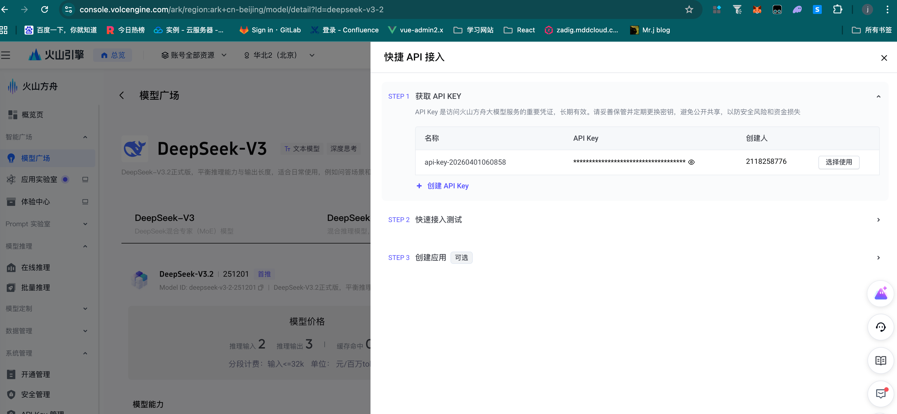
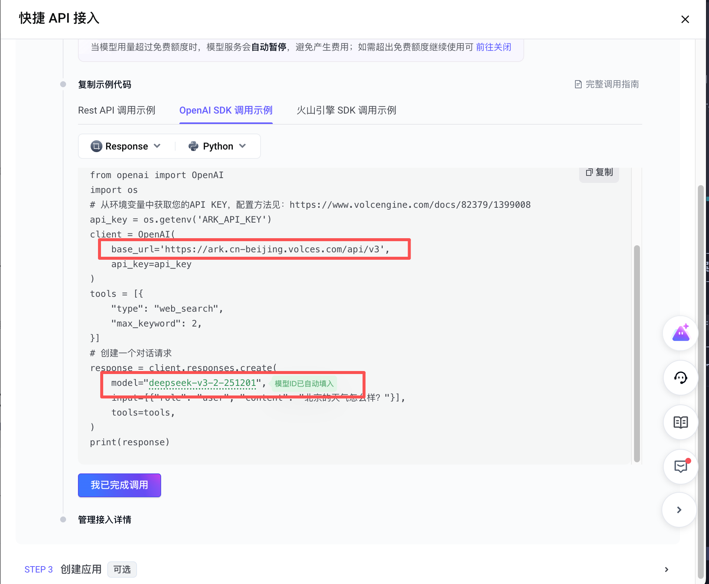
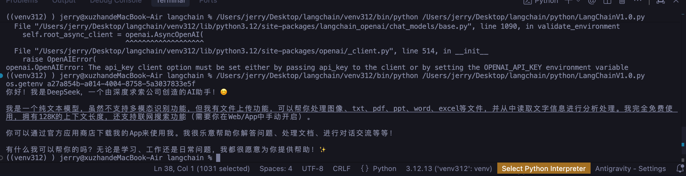
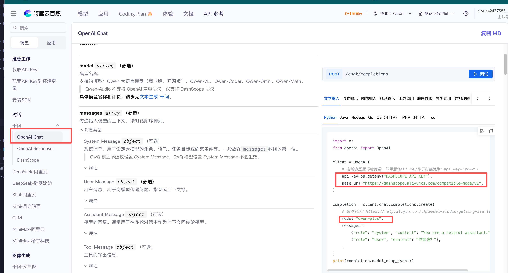

# LangChain 基础调用大模型API

## 1. 环境要求

- **Python 版本**：3.12.7 或以下 3.12.x 版本(3.10以上)

```bash
# 使用 Homebrew 安装 Python 3.12
brew install python@3.12
```

## 2. 设置清华源（加速下载）

```bash
pip config set global.index-url https://pypi.tuna.tsinghua.edu.cn/simple
```

## 3. 项目级虚拟环境配置（推荐）

为了避免 Python 版本冲突，建议在项目内创建并使用 Python 3.12 的虚拟环境。

### 3.1 创建虚拟环境

```bash
# 1. 进入项目目录
cd /Users/jerry/Desktop/langchain

# 2. 创建虚拟环境（指定 Python 3.12）
python3.12 -m venv venv
```

### 3.2 激活虚拟环境

```bash
# 3. 激活虚拟环境
source venv/bin/activate

# 激活成功后，终端提示符前会出现 (venv) 字样
```

### 3.3 在虚拟环境中安装依赖（重要：必须先激活虚拟环境）

```bash
# 分步安装（推荐，便于理解各包作用）
pip install langchain
pip install langchain-openai
pip install openai
pip install python-dotenv      # 注意包名是 python-dotenv，不是 dotenv
pip install langchain-core
pip install langchain-community

# 或一键安装所有包
pip install langchain langchain-openai openai python-dotenv langchain-core langchain-community
```

### 3.4 运行脚本示例

```bash
python /Users/jerry/Desktop/langchain/python/getEnvInfo.py
```

### 3.5 退出虚拟环境（可选）

```bash
deactivate
```

## 4. 使用 VS Code 管理虚拟环境

### 4.1 安装扩展（可选）

- 搜索并安装 `Python Environment Manager (deprecated)`  
  （虽然标注弃用，但仍可查看环境与包信息）



### 4.2 切换 Python 解释器

1. 按 `Cmd + Shift + P`（Mac）或 `Ctrl + Shift + P`（Windows）
2. 输入并选择 `Python: Select Interpreter`
3. 选择你的 Python 3.12 虚拟环境，路径类似：
   ```
   /Users/jerry/Desktop/langchain/venv/bin/python
   ```

### 4.3 查看环境信息

- 通过 `Python Environment Manager` 扩展查看当前环境及已安装的包
- 或使用命令行查看：



```bash
# 查看当前 Python 版本
python --version

# 查看已安装的包列表
pip list
```

## 5. 完整操作流程

```bash
# 1. 设置清华源（全局配置，只需一次）
pip config set global.index-url https://pypi.tuna.tsinghua.edu.cn/simple

# 2. 进入项目目录
cd /Users/jerry/Desktop/langchain

# 3. 创建虚拟环境
python3.12 -m venv venv

# 4. 激活虚拟环境
source venv/bin/activate

# 5. 安装依赖（此时已处于虚拟环境中）
pip install langchain langchain-openai openai python-dotenv langchain-core langchain-community

# 6. 运行脚本
python /Users/jerry/Desktop/langchain/python/getEnvInfo.py
```


## 6. 通过 LangChain 调用大模型 API

> 以下示例基于 **LangChain 1.0+** 版本，为当前主流使用方式。

### 6.1 导入依赖

```python
import os
from dotenv import load_dotenv
from langchain.chat_models import init_chat_model
```

### 6.2 环境变量配置（两种方式）

#### 方式一：系统环境变量

```bash
# 在终端中设置（临时生效）
export huoshan_api_key="your_api_key_here"

# 或写入 ~/.bashrc / ~/.zshrc（永久生效）
echo 'export huoshan_api_key="your_api_key_here"' >> ~/.zshrc
source ~/.zshrc
```

#### 方式二：项目 `.env` 文件（推荐）

在项目根目录创建 `.env` 文件：

```env
# .env 文件内容
huoshan_api_key=your_api_key_here
aliQwen_api=your_qwen_api_key_here
```

通过 `python-dotenv` 加载：

```python
# 加载 .env 文件中的环境变量
load_dotenv(encoding='utf-8')

# 获取环境变量的值
print("os.getenv: " + os.getenv("huoshan_api_key"))
```

### 6.3 `init_chat_model` 函数详解

#### 函数源码参数解读

```python
def init_chat_model(
    model: str,                    # 模型名称，如 "deepseek-v3-2-251201", "gpt-4", "qwen-plus"
    model_provider: Optional[str] = None,  # 模型提供商，如 "openai", "anthropic", "google"
    *,                             # 星号：后面的参数必须使用关键字参数传递
    api_key: Optional[str] = None, # API 密钥
    base_url: Optional[str] = None,# 自定义 API 地址
    temperature: Optional[float] = None,  # 温度参数（控制随机性）
    max_tokens: Optional[int] = None,     # 最大输出 token 数
    **kwargs: Any,                 # 其他任意关键字参数
) -> BaseChatModel:
```

#### 参数传递注意事项

| 特性 | 说明 |
|------|------|
| `*` 的作用 | 星号后面的参数（如 `api_key`, `base_url`）**必须**以关键字参数形式传递，不能使用位置参数 |
| `**kwargs` 的作用 | 接收其他任意关键字参数，传递给底层模型（如 `top_p`, `frequency_penalty` 等） |

#### 正确与错误示例

```python
# ✅ 正确：所有参数都使用关键字参数
model = init_chat_model(
    model="qwen-plus",
    model_provider="openai",
    api_key=os.getenv("aliQwen_api"),
    base_url="https://dashscope.aliyuncs.com/compatible-mode/v1"
)

# ❌ 错误：api_key 使用了位置参数（违反星号规则）
model = init_chat_model("qwen-plus", "openai", os.getenv("aliQwen_api"))

# ⚠️ 注意：如果不指定 model_provider，会报错
# ValueError: Unable to infer model provider for model='qwen-plus', 
# please specify model_provider directly.
```

### 6.4 调用示例（以火山方舟、阿里云百炼为例）

使用其余平台也是大同小异,这里以openai SDK兼容方式去调用


```python
import os
from dotenv import load_dotenv
from langchain.chat_models import init_chat_model

# 加载 .env 文件中的环境变量
load_dotenv(encoding='utf-8')

# 实例化模型（使用火山方舟）
model = init_chat_model(
    model="deepseek-v3-2-251201",           # 模型名称
    model_provider="openai",                # 使用 OpenAI 兼容接口
    api_key=os.getenv("huoshan_api_key"),   # 火山方舟 API Key
    base_url="https://ark.cn-beijing.volces.com/api/v3"  # 火山方舟 API 地址
)

# 调用模型
response = model.invoke("你是谁")
print(response.content)
```

> 当然你首先需要开通模型的使用以及创建一个API_key



> 然后根据快速接入文档找到openai SDK的兼容方式去接入

实际代码不太一样是因为我们使用了langChain去调用使用了langChain的内部函数,实际上方式还是利用了openai SDK,所有参数是相通的




调用成功



### 6.5 常见错误及解决

| 错误信息 | 原因 | 解决方案 |
|----------|------|----------|
| `ValueError: Unable to infer model provider` | 未指定 `model_provider` | 显式添加 `model_provider="openai"` |
| `AuthenticationError` | API Key 无效或未设置 | 检查环境变量是否正确加载 |
| `NotFoundError` | 模型名称或 base_url 错误 | 确认模型名称和 API 地址正确 |

### 6.6 完整代码示例

> 阿里云百炼



```python
import os
from dotenv import load_dotenv
from langchain.chat_models import init_chat_model

# 加载环境变量
load_dotenv(encoding='utf-8')

# 示例1：通义千问（阿里云）
model_qwen = init_chat_model(
    model="qwen-plus",
    model_provider="openai",
    api_key=os.getenv("aliQwen_api"),
    base_url="https://dashscope.aliyuncs.com/compatible-mode/v1"
)
print("通义千问：", model_qwen.invoke("你是谁").content)
print("*" * 50)

# 示例2：DeepSeek（火山方舟）
model_deepseek = init_chat_model(
    model="deepseek-v3-2-251201",
    model_provider="openai",
    api_key=os.getenv("huoshan_api_key"),
    base_url="https://ark.cn-beijing.volces.com/api/v3"
)
print("DeepSeek：", model_deepseek.invoke("你是谁").content)
```

### 6.7 关键概念补充

#### 什么是关键字参数（Keyword Arguments）

```python
# 位置参数：按顺序传递
def func(a, b, c):
    pass
func(1, 2, 3)  # a=1, b=2, c=3

# 关键字参数：指定参数名传递
func(a=1, c=3, b=2)  # 顺序无关紧要，a=1, b=2, c=3
```

#### `*` 和 `**` 的区别

| 符号 | 名称 | 作用 |
|------|------|------|
| `*args` | 可变位置参数 | 接收任意数量的位置参数，打包为元组 |
| `**kwargs` | 可变关键字参数 | 接收任意数量的关键字参数，打包为字典 |
| `*,` | 关键字分隔符 | 强制后面的参数必须使用关键字参数传递 |

### 6.8使用 其余供应商 原生集成（不依赖 OpenAI,这里以DeepSeek为例）

当使用 DeepSeek 大模型时，可以不使用 OpenAI 作为供应商，LangChain 提供了两种更原生的兼容方式。

#### 安装依赖

```bash
pip install langchain-deepseek
```

#### 方式一：使用 `init_chat_model` + `model_provider="deepseek"`

```python
import os
from dotenv import load_dotenv
from langchain.chat_models import init_chat_model

load_dotenv(encoding='utf-8')

# 直接使用 deepseek 作为 model_provider
model = init_chat_model(
    model="deepseek-chat",           # 或 "deepseek-reasoner"
    model_provider="deepseek",       # ✅ 直接指定为 deepseek，无需 openai
    api_key=os.getenv("DEEPSEEK_API_KEY"),
    # 无需指定 base_url，会自动使用官方地址
)

response = model.invoke("你是谁")
print(response.content)
```

#### 方式二：使用 `ChatDeepSeek` 类（更显式）

```python
import os
from dotenv import load_dotenv
from langchain_deepseek import ChatDeepSeek

load_dotenv(encoding='utf-8')

model = ChatDeepSeek(
    model="deepseek-chat",           # 模型名称
    api_key=os.getenv("DEEPSEEK_API_KEY"),
    temperature=0.7,
    max_tokens=1024
)

response = model.invoke("你是谁")
print(response.content)
```

#### 两种方式对比

| 特性(对比维度)  | `init_chat_model` + `provider="deepseek"` | `ChatDeepSeek` 类 |
|-------|-------------------------------------------|-------------------|
| 安装包   | `langchain-deepseek` | `langchain-deepseek` |
| 供应商指定 | `model_provider="deepseek"` | 无需指定，类已绑定 |
| 代码简洁度 | 较简洁 | 更显式 |
| 适用场景  | 需要在不同模型间切换时 | 确定只使用 DeepSeek 时 |

#### 环境变量配置

在项目根目录的 `.env` 文件中添加：

```env
DEEPSEEK_API_KEY=your_deepseek_api_key_here
```

#### DeepSeek 可用模型

| 模型名称 | 说明 |
|----------|------|
| `deepseek-chat` | DeepSeek-V3.1（非思考模式） |
| `deepseek-reasoner` | DeepSeek-R1（思考模式） |

> ⚠️ **注意**：`deepseek-reasoner` 不支持工具调用（Tool Calls）和结构化输出（Structured Outputs）。

#### 完整示例（含错误处理）

```python
import os
from dotenv import load_dotenv
from langchain_deepseek import ChatDeepSeek

# 加载环境变量
load_dotenv(encoding='utf-8')

# 检查环境变量是否设置
api_key = os.getenv("DEEPSEEK_API_KEY")
if not api_key:
    raise ValueError("请设置 DEEPSEEK_API_KEY 环境变量")

# 创建模型实例
model = ChatDeepSeek(
    model="deepseek-chat",
    api_key=api_key,
    temperature=0.7,
)

# 调用模型
try:
    response = model.invoke("请介绍一下自己")
    print(response.content)
except Exception as e:
    print(f"调用失败：{e}")
```

#### 与 OpenAI 兼容模式的对比

| 特性 | OpenAI 兼容模式        | DeepSeek 原生集成 |
|------|--------------------|-------------------|
| `model_provider` | `"openai"`         | `"deepseek"` |
| 需要指定 `base_url` | ✅ 需要               | ❌ 不需要（自动） |
| 安装包 | `langchain-openai` | `langchain-deepseek` |
| 类型提示与IDE支持 | 通用                 | 更精确 |
| 推荐程度 | **推荐(通用性更强)**      | 可用 |

