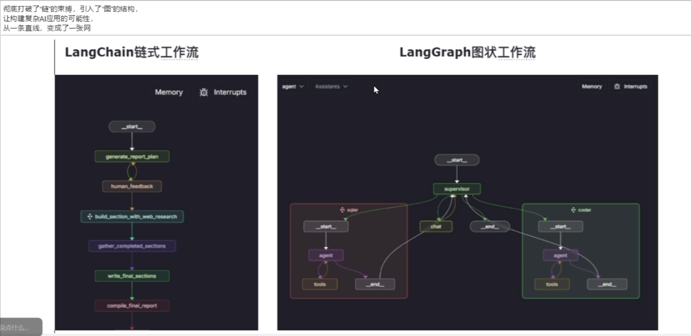
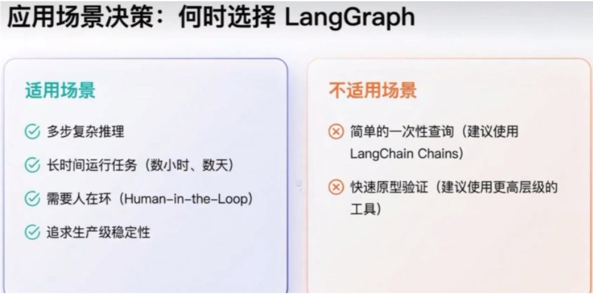

# LangGraph 基础概念

## 一、一句话理解 LangGraph

> **LangGraph = LangChain 的“图级编排器”**  
> 把线性流水线变成地铁网，支持分支、循环、等人、回退、模块化。




**生活比喻：**
- LangChain 像流水线：A→B→C，顺序固定
- LangGraph 像地铁图：可分支、循环、折返、换乘




---

## 二、核心四要素

| 概念 | 作用 | 代码对应 |
|------|------|----------|
| **State（状态）** | 节点间传递的数据 | `class StateObj(TypedDict)` |
| **Nodes（节点）** | 执行具体任务 | `graph.add_node("model", modelCb)` |
| **Edges（边）** | 定义执行顺序 | `graph.add_edge(START, "model")` |
| **Graph（图）** | 整体结构容器 | `StateGraph(StateObj)` |

---

## 三、基本连接llm代码

```python
from typing import TypedDict, Annotated, List
from langgraph.graph import StateGraph, START, END
from langgraph.graph.message import add_messages
from langchain.chat_models import init_chat_model
from dotenv import load_dotenv
import os

load_dotenv(encoding='utf-8')

# ========== 1. 定义状态（State）==========
# 关键：Annotated + add_messages 实现消息追加而非覆盖
class StateObj(TypedDict):
    messages: Annotated[List, add_messages]

# ========== 2. 初始化大模型 ==========
llm = init_chat_model(
    model="qwen-plus",
    model_provider="openai",
    api_key=os.getenv("aliQwen-api"),
    base_url="https://dashscope.aliyuncs.com/compatible-mode/v1"
)

# ========== 3. 定义节点函数 ==========
# 关键：每个节点接收当前状态，返回部分更新
def modelCb(state: StateObj) -> StateObj:
    reply = llm.invoke(state["messages"])
    return {"messages": [reply]}  # 只返回变化的部分，LangGraph 自动合并

# ========== 4. 构建图 ==========
graph = StateGraph(StateObj)           # 创建图，绑定状态类型
graph.add_node("model", modelCb)       # 添加节点
graph.add_edge(START, "model")         # 起点 → 模型节点
graph.add_edge("model", END)           # 模型节点 → 终点

# ========== 5. 编译运行 ==========
app = graph.compile()
result = app.invoke({"messages": "请简单说明一下LangGraph的运作流程"})
print(result["messages"][-1].content)

# ========== 6. 可视化图结构 ==========
#1. 打印图的ascii可视化结构
print(app.get_graph().print_ascii())
print("="*50)

#2. 打印图的Mermaid代码可视化结构并通过https://www.processon.com/mermaid编辑器查看
print(app.get_graph().draw_mermaid())

```

---

## 四、代码中的三个关键机制

### 1. `Annotated[List, add_messages]`
- **作用：** 告诉 LangGraph 新消息**追加**到列表末尾，而不是覆盖
- **不加的话：** 每次返回 `{"messages": [reply]}` 会丢掉之前的对话历史

### 2. 节点函数只返回**部分状态**
- LangGraph 自动将返回值**合并**到当前状态
- 不需要返回整个 StateObj，极大简化代码

### 3. `graph.compile()` 的作用
- 验证图结构（无孤立节点、无不可达节点、无非法循环）
- 生成可执行的 Runnable 对象
- 为后续扩展（checkpointer、interrupt 等）做准备

---

## 五、LangGraph 的重要特性

以下是 LangGraph 区别于普通 Chain 的核心能力：

### 1. 条件分支（Conditional Edges）
- **是什么：** 根据当前状态选择不同路径
- **代码示例：**
```python
def route(state):
    if state["need_human"]:
        return "human_node"
    return "model_node"

graph.add_conditional_edges("model", route, {"human_node": "human", "model_node": "model"})
```
- **生活比喻：** 地铁到站后，根据乘客目的地决定换乘哪条线

### 2. 循环（Cycles）
- **是什么：** 边可以指回之前的节点，形成循环
- **典型场景：** 信息不足时重复搜索，直到条件满足
- **生活比喻：** 坐错站了，坐回头车回到上一站

### 3. 持久化与断点续跑（Persistence & Interrupt）
- **是什么：** 使用 `checkpointer` 保存状态，程序重启后可恢复
- **代码示例：**
```python
from langgraph.checkpoint import MemorySaver
app = graph.compile(checkpointer=MemorySaver())
# 中断后可从保存点恢复执行
```
- **生活比喻：** 游戏存档，退出后能接着玩

### 4. 人机协作（Human-in-the-Loop）
- **是什么：** 图中插入人工节点，`interrupt` 暂停等待人工输入
- **典型场景：** AI 生成内容后人工审核、敏感操作前人工确认
- **生活比喻：** 自动驾驶遇到复杂路口，让司机接管一下

### 5. 子图（Subgraphs）
- **是什么：** 一个节点可以是另一个完整的 `StateGraph`
- **好处：** 模块化、可复用、独立测试
- **生活比喻：** 地铁环线本身是一个完整的图，可以被嵌入全市地铁网

### 6. 时间旅行（Time Travel）
- **是什么：** 回退到历史某个状态重新执行
- **生活比喻：** 游戏中的“读档”功能

### 7. 多智能体协作（Multi-Agent）
- **是什么：** 多个 Agent 节点在同一图中分工、协调、竞争
- **架构模式：** 网络式、层级式、监督式等

### 8. 可观测性（Observability）
- **是什么：** `get_graph().print_ascii()` 直接打印执行路径
- **好处：** 清晰看到 Agent 的决策路径，快速定位问题
- **生活比喻：** 地铁线路图贴在墙上，永远不会迷路

---

## 六、适用场景速查

| ✅ 适合 | ❌ 不适合 |
|--------|----------|
| 多步复杂推理 | 简单一次性问答 |
| 需要循环/分支的逻辑 | 线性链就够用的场景 |
| 长时间运行任务（需持久化） | 快速原型验证 |
| 需要人工介入 | |
| 多智能体协作 | |
| 追求生产级可观测性 | |

---

## 七、总结

> **State 是灵魂，Node 是手脚，Edge 是路线，Graph 是地图。**  
> LangGraph 的核心价值在于：把 AI 工作流从**线性锁链**变成**可控的网络**，让你能自由实现分支、循环、持久化、人机协作、模块化复用等复杂逻辑。
