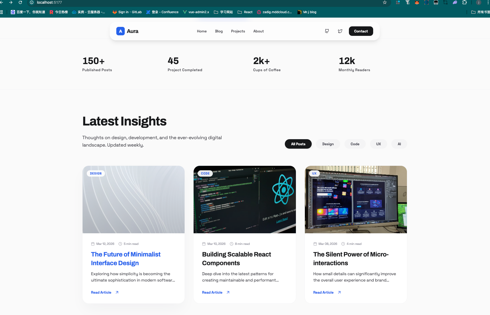

# 什么是 Agent Skills 

用一句话来概括skills就是把我的提示词得到系统的优化,更能让AI高效地理解执行并且完成高质量的产品

生活比喻:当我们没有Skills想要做一个菜你是没有具象化的描述的,但当有了Skills就相当于我们有了一份菜单,"番茄炒蛋"这一道菜直接我们就可以根据菜单直接下单,菜单上的"番茄炒蛋"是怎么样的,做出来就是怎么样的,很标准做出来的效果也跟菜单描述的一致


## Skills 和 MCP

如果说Skills是菜单的话,MCP就是开启权限的各个工具,想象我们利用AI作业的时候就像开餐厅一下,我们想做一个菜往往就需要利用各种厨具,譬如微波炉,譬如烤箱,这其实就是一个个外界工具,在现实当中对应地图的API,对应天气的API,我们从中获取权限获取元数据

## Skills的核心构成

一个典型的 Skill 文件夹结构如下：
```
my_skill/
├── skill.json      # 技能定义
├── skill.py        # 技能实现
├── README.md       # 说明文档
├── requirements.txt # 依赖库
└── config.yaml     # 配置文件
```

| 文件名 | 用途 | 核心内容/字段示例 | 是否必需 |
| :--- | :--- | :--- | :--- |
| **`skill.json`** | 技能的核心定义文件，描述技能的身份、功能、输入输出结构。 | `name`, `description`, `parameters` (定义输入参数), `returns` (定义输出结果)。 | 是 |
| **`skill.py`** | 技能的具体实现代码文件，包含实际的业务逻辑。 | 包含一个主执行函数（如 `execute`），实现调用API、数据处理等核心功能。 | 是 |
| **`README.md`** | 技能的详细使用说明文档，供开发者理解和调用。 | 技能简介、使用示例、参数详解、返回结果说明、注意事项。 | 否（但强烈推荐） |
| **`requirements.txt`** | 声明技能实现代码所依赖的第三方Python库。 | 每行列出一个库及其版本，例如：`requests>=2.28.0`。 | 否（仅在需要额外依赖时必需） |
| **`config.yaml` (或 `.json`)** | 存储技能的配置参数，实现配置与代码分离。 | 以键值对形式存储，如API密钥(`api_key`)、服务端点(`endpoint_url`)。 | 否（仅在需要动态配置时必需） |


## 快速上手

这里我们以ui-ux-pro-max-skill为例:

```
# Install CLI globally
npm install -g uipro-cli

# Go to your project
cd /path/to/your/project

# Install for your AI assistant
uipro init --ai claude      # Claude Code
uipro init --ai cursor      # Cursor
uipro init --ai windsurf    # Windsurf
uipro init --ai antigravity # Antigravity
uipro init --ai copilot     # GitHub Copilot
uipro init --ai kiro        # Kiro
uipro init --ai codex       # Codex CLI
uipro init --ai qoder       # Qoder
uipro init --ai roocode     # Roo Code
uipro init --ai gemini      # Gemini CLI
uipro init --ai trae        # Trae
uipro init --ai opencode    # OpenCode
uipro init --ai continue    # Continue
uipro init --ai codebuddy   # CodeBuddy
uipro init --ai droid       # Droid (Factory)
uipro init --ai all         # All assistants
```

### Usage

#### Skill Mode (Auto-activate)

**Supported:** Claude Code, Cursor, Windsurf, Antigravity, Codex CLI, Continue, Gemini CLI, OpenCode, Qoder, CodeBuddy, Droid (Factory)

The skill activates automatically when you request UI/UX work. Just chat naturally:

```
Build a landing page for my SaaS product
```

> **Trae**: Switch to **SOLO** mode first. The skill will activate for UI/UX requests.

#### Workflow Mode (Slash Command)

**Supported:** Kiro, GitHub Copilot, Roo Code

Use the slash command to invoke the skill:

```
/ui-ux-pro-max Build a landing page for my SaaS product
```

#### Example Prompts

```
Build a landing page for my SaaS product

Create a dashboard for healthcare analytics

Design a portfolio website with dark mode

Make a mobile app UI for e-commerce

Build a fintech banking app with dark theme
```
---

## 生成效果

安装该skill后我再下达指令:"现在给我创建一个个人博客网站"



生成了一个很典型的的外国UI风格文章网站

## 好用的skill资源


| 网站名称 | 网址 | 特点 | 推荐指数 |
| :--- | :--- | :--- | :--- |
| **SkillsMP** | [skillsmp.com](https://skillsmp.com) | **全球最大技能市场**，收录超 50 万条开源 Skills，支持智能搜索、质量评分和跨平台兼容（Claude/Cursor/Antigravity）。 | ⭐⭐⭐⭐⭐ |
| **Agent Skills (Vercel)** | [skills.sh](https://skills.sh) | **Vercel 生态官方入口**，拥有热门排行榜，支持 `npx skills add` 一键安装，工程化程度高。 | ⭐⭐⭐⭐⭐ |
| **Anthropic 官方仓库** | [github.com/anthropics/skills](https://github.com/anthropics/skills) | **官方出品**，生产级高质量技能，涵盖文档、开发、创意三大类，适合追求稳定性的用户。 | ⭐⭐⭐⭐⭐ |
| **Agent Skills 官方市场** | [agentskills.cc](https://agentskills.cc) | 收录 63,000+ 社区技能，覆盖前端、后端、DevOps 等开发场景，支持全局和项目级别安装。 | ⭐⭐⭐⭐ |
| **Awesome Claude Skills** | [github.com/ComposioHQ/awesome-claude-skills](https://github.com/ComposioHQ/awesome-claude-skills) | **GitHub 高星精选**（16.5k+），覆盖全场景的 300+ 高质量技能，质量有保障。 | ⭐⭐⭐⭐ |
| **SkillHub** | [skillhub.club](https://skillhub.club) | 收录 7000+ 经过 AI 评估的 Skills，提供五维评分体系（实用性、清晰度等），支持 Playground 即时试用。 | ⭐⭐⭐⭐ |
| **Smithery.ai** | [smithery.ai/skills](https://smithery.ai/skills) | **社区驱动**，显示“激活次数”和“GitHub Stars”，适合查找高活跃度技能，含技能创建工具。 | ⭐⭐⭐⭐ |
| **AI Templates** | [aitmpl.com/skills](https://aitmpl.com/skills) | **开发者导向**，提供 Stack Builder 和企业级配置模板，适合不想写提示词、直接复制模板的用户。 | ⭐⭐⭐ |


## Agent Skills 安装管理

| 名称                         | 网址/位置 | 核心功能与特点 |
|:---------------------------| :--- | :--- |
 | **Skills CLI (Vercel)**    | [skills.sh](https://skills.sh) 及 `npx skills add` 命令 | Vercel官方技能包管理器。核心功能：`find`搜索、`add`安装、`list`/`remove`/`update`管理。支持从`skills.sh`市场安装。 |
| **Everything-Claude-Code** | [GitHub](https://github.com/affaanmustafa/everything-claude-code) | 一个功能强大的技能集合包，其自身作为一个综合技能仓库，需要被安装和管理。通常通过克隆GitHub仓库并手动复制到指定目录来安装。|
 | **Skill Seeker**           | [GitHub](https://github.com/yusufkaraaslan/skill_seekers) | 一款自动化工具，用于**创建**技能。它能将任何文档/网站/PDF自动转化为Claude可用的技能包。用户安装此工具后，可以用它来快速生成新技能。 |

