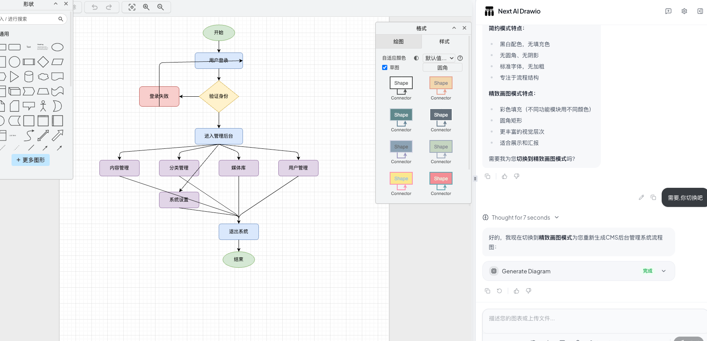
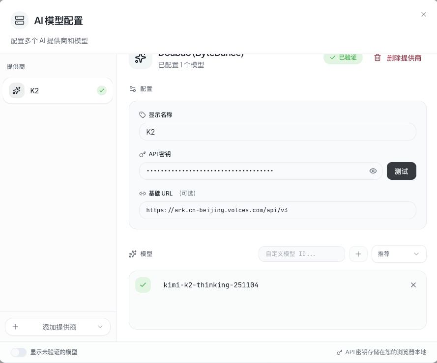
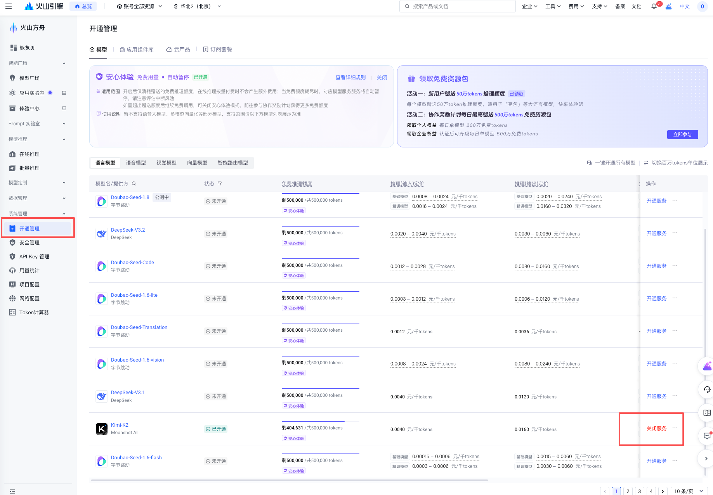
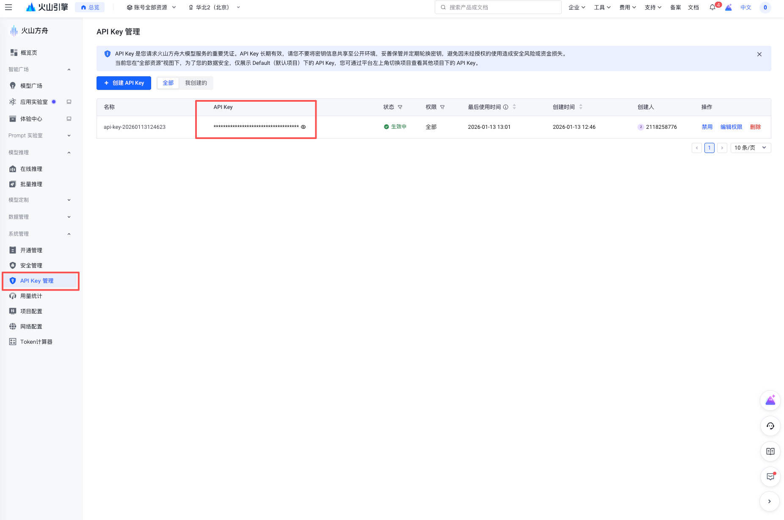

# AI Draw.io

通过和 AI 对话快速生成绘图。一个集成了 AI 功能的 Next.js 网页应用，与 draw.io 图表无缝结合。通过自然语言命令和 AI 辅助可视化来创建、修改和增强图表。

## 官方文档

[https://github.com/DayuanJiang/next-ai-draw-io/blob/main/docs/cn/README_CN.md](https://github.com/DayuanJiang/next-ai-draw-io/blob/main/docs/cn/README_CN.md)

## 在线使用
[https://next-ai-drawio.jiang.jp/zh](https://next-ai-drawio.jiang.jp/zh)

##  功能特性

* LLM驱动的图表创建：利用大语言模型通过自然语言命令直接创建和操作draw.io图表
* 基于图像的图表复制：上传现有图表或图像，让AI自动复制和增强
* 图表历史记录：全面的版本控制，跟踪所有更改，允许您查看和恢复AI编辑前的图表版本
* 交互式聊天界面：与AI实时对话来完善您的图表
* AWS架构图支持：专门支持生成AWS架构图
* 动画连接器：在图表元素之间创建动态动画连接器，实现更好的可视化效果

## 工作原理

本应用使用以下技术：

* Next.js：用于前端框架和路由
* Vercel AI SDK（ai + @ai-sdk/*）：用于流式AI响应和多提供商支持
* react-drawio：用于图表表示和操作
* 图表以XML格式表示，可在draw.io中渲染。AI处理您的命令并相应地生成或修改此XML。

## 添加模型方式
* 选择需要模型
* 输入模型API key
* 测试通过即可使用

## 获取API key
[供应商配置指南](https://github.com/DayuanJiang/next-ai-draw-io/blob/main/docs/cn/ai-providers.md)

这里我们主要使用豆包提供的免费Token:
* 注册
* 开通管理->开通我们需要使用的模型
* API Key管理获取key

