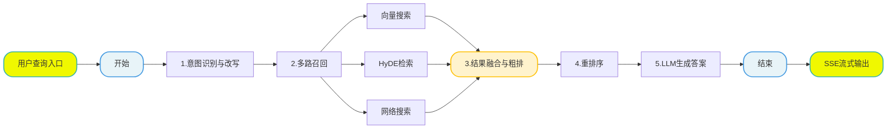
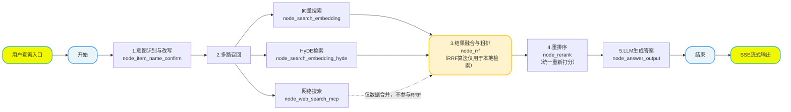

## 7. 检索数据图与状态定义

### 7.1 定义状态 (State)

所有节点共享同一个状态对象。我们需要定义它来存储处理过程中的数据（如 查询原始问题、改写问题、历史对话、不同方向切片结果等）。



**文件**: `app/query_process/agent/state.py`

```python
from typing_extensions import TypedDict
from typing import List
import copy

class QueryGraphState(TypedDict):
    """
    QueryGraphState 定义了整个查询流程中流转的数据结构。
    """
    session_id: str  # 会话唯一标识
    original_query: str  # 用户原始问题

    # 检索过程中的中间数据
    embedding_chunks: list  # 普通向量检索回来的切片
    hyde_embedding_chunks: list  # HyDE 检索回来的切片
    web_search_docs: list  # 网络搜索回来的文档

    # 排序过程中的数据
    rrf_chunks: list  # RRF 融合排序后的切片
    reranked_docs: list  # 重排序后的最终 Top-K 文档

    # 生成过程中的数据
    prompt: str  # 组装好的 Prompt
    answer: str  # 最终生成的答案

    # 辅助信息
    item_names: List[str]  # 提取出的商品名称
    rewritten_query: str  # 改写后的问题
    history: list  # 历史对话记录
    is_stream: bool  # 是否流式输出标记


# ========================
# 默认状态（全部为空）
# ========================
query_graph_default_state: QueryGraphState = {
    "session_id": "",
    "original_query": "",
    "embedding_chunks": [],
    "hyde_embedding_chunks": [],
    "web_search_docs": [],
    "rrf_chunks": [],
    "reranked_docs": [],
    "prompt": "",
    "answer": "",
    "item_names": [],
    "rewritten_query": "",
    "history": [],
    "is_stream": False
}


# ========================
# 创建默认状态（可覆盖）
# ========================
def create_query_default_state(**overrides) -> QueryGraphState:
    """
    创建查询流程的默认状态，支持覆盖字段
    """
    state = copy.deepcopy(query_graph_default_state)
    state.update(overrides)
    return state


# ========================
# 获取干净状态
# ========================
def get_query_default_state() -> QueryGraphState:
    return copy.deepcopy(query_graph_default_state)


# ========================
# ✅ 状态复制函数（你要的）
# ========================
def copy_query_state(state: QueryGraphState, **overrides) -> QueryGraphState:
    """
    复制现有状态并可覆盖字段，深拷贝，不污染原数据
    """
    new_state = copy.deepcopy(state)
    new_state.update(overrides)
    return new_state


if __name__ == "__main__":
    # 测试
    state = create_query_default_state(
        session_id="test_001",
        original_query="华为P60怎么样?",
        is_stream=False
    )
    print("初始化状态：", state)

    # 复制状态
    new_state = copy_query_state(
        state,
        original_query="修改后的问题"
    )
    print("复制后的状态：", new_state)
```

### 7.2 定义主图

为了确保整体流程设计的科学性与执行连贯性，我们采用 **"Top-Down"（自顶向下）** 的开发模式，以 "总指挥部" 的全局视角统筹推进，具体实施步骤如下：

1. **搭建节点骨架（Stubs）**：优先定义全流程所需的所有功能节点，仅保留核心日志打印能力（如节点进入 / 退出日志），暂不实现内部复杂业务逻辑，快速搭建起流程的 "骨架结构"；
2. **串联主图（Graph）**：基于预设的业务流转规则，编写主图逻辑将所有节点骨架按序串联，明确节点间的输入输出关系、分支判断条件（如文件格式分流逻辑），形成完整的流程链路；
3. **验证流程通畅性**：启动端到端测试，验证节点间的调用链路是否通顺、数据流转是否符合预期、分支跳转是否准确，确保流程无阻塞、无逻辑漏洞；
4. **填充节点核心逻辑**：在流程链路验证通过后，再逐一聚焦每个节点的内部实现，完成复杂业务逻辑的开发（如 查询重写、定向查询、结果重排处理等），实现 "骨架" 到 "完整系统" 的落地。

该模式的核心优势在于：先保障 "流程走得通"，再聚焦 "功能做得好"，避免因局部逻辑复杂导致整体流程设计偏差，大幅提升开发效率与流程稳定性。

#### 7.2.1 第一步：创建节点骨架

我们需要先创建以下 7 个文件，每个文件里只写一个最简单的"空函数"，确保主图能导入它们。
**请在 `app/query_process/agent/nodes` 目录下创建以下文件，并将对应代码复制进去。**

**(1) 意图确认: `node_item_name_confirm.py`**

这个节点主要干了 4 件事：

1. 提取与改写 ：结合历史对话提取商品名，并将模糊问题改写为完整独立的精准问题。
2. 向量化检索 ：将提取出的商品名在 Milvus 向量库中进行混合搜索。
3. 标准化对齐 ：根据评分高低自动对齐标准型号，或生成反问让用户手动确认。
4. 同步历史记录 ：将改写后的问题、确认的商品名和处理状态实时写入 MongoDB 数据库。

```python
import time
import sys

from app.utils.task_utils import add_running_task, add_done_task


def node_item_name_confirm(state):
    """
    节点功能：确认用户问题中的核心商品名称。
    输入：state['original_query']
    输出：更新 state['item_names']
    """
    print(f"---node_item_name_confirm---开始处理")
    # 记录任务开始
    add_running_task(state["session_id"], sys._getframe().f_code.co_name,state["is_stream"])

    # 后面会调用大模型，进行逻辑处理
    time.sleep(1)
    # 记录任务结束
    add_done_task(state["session_id"], sys._getframe().f_code.co_name,state["is_stream"])

    print(f"---node_item_name_confirm---处理结束")

    return {"item_names": ["示例商品"]}
```

**(2) 向量检索: `node_search_embedding.py`**

这个节点 node_search_embedding 负责根据 改写后的用户问题 ，在 限定的商品范围内 ，利用 BGEM3 混合检索（稠密+稀疏） 技术，从 Milvus 向量数据库中召回 Top5 最相关的知识切片。

```python
import time
import sys
from app.utils.task_utils import  add_done_task,add_running_task

def node_search_embedding(state):
    """
    节点功能：进行向量内容检索
    """
    print("---量内容检索 开始处理---")
    add_running_task(state["session_id"], sys._getframe().f_code.co_name, state.get("is_stream"))

    # 搜索假设性答案
    print("量内容检索答案！！")
    time.sleep(1)

    # ...
    add_done_task(state["session_id"], sys._getframe().f_code.co_name, state.get("is_stream"))

    print("---量内容检索 处理结束---")
    return state
```

**(3) HyDE 假设检索节点: `node_search_embedding_hyde.py`**

这个节点 node_search_embedding_hyde 实现了 HyDE (Hypothetical Document Embeddings) 策略，核心逻辑是 先让 LLM 虚构一个"理想答案"，再用这个答案去向量库检索真实的文档 。

一句话总结： 它通过"LLM 生成假设性答案"来增强原始问题的语义信息，再进行混合向量检索，从而大幅提升对"语义匹配但字面不匹配"问题的召回能力。

```python
import time
import sys
from app.utils.task_utils import  add_done_task,add_running_task

def node_search_embedding_hyde(state):
    """
    节点功能：HyDE (Hypothetical Document Embedding)
    先让 LLM 生成假设性答案，再对答案进行向量检索，提高召回率。
    """
    print("---HyDE 开始处理---")
    add_running_task(state["session_id"], sys._getframe().f_code.co_name, state.get("is_stream"))

    # 搜索假设性答案
    print("搜索架设性答案！！")
    time.sleep(1)

    # ...
    add_done_task(state["session_id"], sys._getframe().f_code.co_name, state.get("is_stream"))

    print("---HyDE 处理结束---")
    return state
```

**(4) 网络搜索节点: `node_web_search_mcp.py`**

这个节点 node_web_search_mcp 负责调用 百炼 MCP (Model Context Protocol) 联网搜索服务 ，获取互联网上的实时信息。

一句话总结： 它通过 MCP 协议异步调用百炼联网搜索接口，将用户的查询转化为实时的、结构化的网络搜索结果（包含标题、链接和摘要）。

```python
import time
import sys
from app.utils.task_utils import add_done_task,add_running_task

def node_web_search_mcp(state):
    """
    节点功能，调用外部搜索引擎补充信息
    :param state:
    :return:
    """
    add_running_task(state["session_id"], sys._getframe().f_code.co_name,state["is_stream"])
    print("---node-web-search-mcp处理---")

    add_done_task(state["session_id"],sys._getframe().f_code.co_name,state["is_stream"])
    time.sleep(1)
    # 调用mcp外部引擎
    print(f"调用外部mcp引擎")

    print("---node-web-search-mcp处理结束---")
    return state
```

**(5) 倒排融合排序节点: `node_rrf.py`**

这个节点 `node_rrf` 负责将来自不同检索源的结果进行统一处理和融合。

> **⚠️ 重要说明**：`node_rrf` 节点处理的数据分为两类：
> 1. **本地检索结果**（向量检索 + HyDE 检索）：参与 RRF 算法的排名融合计算。
> 2. **网络搜索结果**（`node_web_search_mcp`）：**不参与 RRF 算法**，仅在该节点进行数据格式统一，与本地结果合并后一并送入后续的 `node_rerank` 节点进行统一重排序。

这样设计的考虑是：
- 网络搜索返回的是网页标题、链接、摘要，其相关性判断标准与向量检索完全不同，强行参与 RRF 排名融合会引入噪声。
- 让所有来源的数据先在 `node_rrf` 完成格式对齐，再由重排序模型（Cross-Encoder）统一打分，更加科学合理。

---

**什么是 RRF（Reciprocal Rank Fusion，倒排排序融合）？**

当我们在前几步从"向量库"、"HyDE 假设答案"和"互联网"三个不同渠道找回了大量文档后，面临的第一个难题是：**这些文档来自不同的系统，它们的评分标准（分数）完全不一样，没法直接放在一起比谁更好。**

RRF 算法就是解决这个问题的"裁判委员会"。

**它的核心思想：不看分数，只看排名！**

我们可以把每个检索源（向量检索、HyDE）想象成一位独立的"选拔专家"。每位专家都根据自己的标准，把最相关的文档放在前面，不太相关的放在后面。

RRF 算法的任务，就是**综合所有专家的"推荐排名"，给每个文档重新计算一个"综合得分"**。

**一个生动的例子：校园歌手大赛**

假设我们有两组评委（向量检索和 HyDE）给选手投票，每组都选出了自己心中的前三名：

1. **向量检索评委（A组）**：第1名-小张，第2名-小李，第3名-小王
2. **HyDE检索评委（B组）**：第1名-小李，第2名-小王，第3名-小赵

现在，我们要选出最终的"综合实力王"。RRF 是怎么做的呢？

**第一步：给每个"名次"赋予一个基础分**

RRF 使用一个简单的公式来计算每个选手在每个评委那里的得分：

**得分 = 1 / (k + 名次)**

- `rank` 是你在某个评委那里的排名（第1名就是1，第2名就是2）
- `k` 是一个常数（通常取 60），用来防止排名靠前的差距过大

按照这个公式，我们可以算出每个"名次"对应的分数：

| 名次 | 计算公式 | 得分 |
| :--- | :--- | :--- |
| 第1名 | 1 / (60 + 1) | ≈ 0.0164 |
| 第2名 | 1 / (60 + 2) | ≈ 0.0161 |
| 第3名 | 1 / (60 + 3) | ≈ 0.0159 |
| 没上榜 | — | 0 |

**第二步：累加每个选手从所有评委那里得到的基础分**

现在，我们来算算每位选手的总分：

| 选手 | A组（向量）得分 | B组（HyDE）得分 | **综合总分** | **最终排名** |
| :--- | :--- | :--- | :--- | :--- |
| **小张** | 第1名 → **0.0164** | 未上榜 → 0 | **0.0164** | 🥈 第2名 |
| **小李** | 第2名 → 0.0161 | 第1名 → 0.0164 | **0.0325** | 🥇 第1名 |
| **小王** | 第3名 → 0.0159 | 第2名 → 0.0161 | **0.0320** | 🥇 第1名 |
| **小赵** | 未上榜 → 0 | 第3名 → 0.0159 | **0.0159** | 🥉 第3名 |

**第三步：得出最终结论**

你看，小李和小王在两个评委中都位列前三，表现稳定且优秀，总分最高！小张虽然在 A 组拿了第一，但 B 组没上榜，"偏科"严重，总分就落下来了。而只在 B 组出现的小赵，得分就更低了。

**RRF 的核心优势总结：**

- **公平公正**：它消除了不同评分体系的差异，让所有文档在同一起跑线上竞争。
- **奖励"全面手"**：它更青睐那些在**多个**检索源中排名都靠前的文档，因为它们被不同"专家"从不同角度验证过，信息更可靠。
- **简单高效**：它只需要知道排名，不需要复杂的分数计算，运算速度快。

---

**网络搜索数据的处理方式**

网络搜索的结果（`node_web_search_mcp` 返回的网页列表）**不参与上述 RRF 排名计算**，原因如下：

1. **评分体系不同**：网络搜索返回的是搜索引擎的相关性分数，与向量检索的余弦相似度不在同一个量纲上。
2. **数据结构不同**：网络搜索返回的是网页标题、URL、摘要，而本地检索返回的是知识库切片（chunk），两者格式差异大。

在 `node_rrf` 节点中，网络搜索结果的处理流程是：

```python
def node_rrf(state):
    """
    节点功能：
    1. 对本地检索结果（向量 + HyDE）执行 RRF 融合排序
    2. 将网络搜索结果进行格式统一（转换为与本地结果一致的数据结构）
    3. 合并两部分数据，统一送入重排序节点
    """
    # 1. 本地结果融合（RRF算法）
    local_chunks = state.get("embedding_chunks", [])
    hyde_chunks = state.get("hyde_embedding_chunks", [])
    rrf_result = reciprocal_rank_fusion(local_chunks, hyde_chunks)  # RRF融合
    
    # 2. 网络搜索结果格式化（不参与RRF）
    web_docs = state.get("web_search_docs", [])
    formatted_web_docs = format_web_docs(web_docs)  # 格式转换，不做排名融合
    
    # 3. 合并
    merged_result = rrf_result + formatted_web_docs
    
    return {"rrf_chunks": merged_result}
```

这样设计的好处是：
- 网络搜索结果作为**补充信息来源**，不干扰本地检索的排名逻辑。
- 所有数据在 `node_rerank` 阶段被统一的重排序模型（Cross-Encoder）重新打分，确保公平性。

---

**节点骨架代码**：

```python
import time
import sys
from app.utils.task_utils import add_running_task, add_done_task

def node_rrf(state):
    """
    节点功能：Reciprocal Rank Fusion
    将多路召回的结果（向量、HyDE）进行加权融合排序，
    并将网络搜索结果进行格式统一后合并。
    """
    print("---RRF---")
    add_running_task(state["session_id"], sys._getframe().f_code.co_name, state.get("is_stream"))
    time.sleep(1)
    # ...
    add_done_task(state['session_id'], sys._getframe().f_code.co_name, state.get("is_stream"))
    return state
```

**(6) 重排序节点: `node_rerank.py`**

这个节点 `node_rerank` 是知识库检索的"精修师"，它对之前所有步骤召回的文档进行**二次精细排序**。

核心流程分为三步：

1. **合并文档**：将来自 RRF（本地检索 + 网络搜索）合并后的文档统一处理。
2. **精确打分**：使用重排序模型计算每个文档与用户问题的相关性得分。
3. **动态截断**：根据得分的"断崖式下跌"点，智能截取 TopK（最多 10 条），只保留高质量结果，过滤凑数的低分文档。

该节点使用的是 BGE Reranker (BAAI/bge-reranker-large) 模型。

- **模型类型**：Cross-Encoder（交叉编码器）。
- **工作原理**：它不像向量检索那样分别计算向量再比对，而是直接把"问题"和"文档"拼接在一起扔给模型，让模型像阅读理解一样，深入分析两者的语义匹配度。
- **特点**：
    - **精度极高**：能识别微小的语义差异（如"苹果手机"和"苹果公司"的区别）。
    - **速度较慢**：因为计算量大，所以通常只用于对初筛后的少量文档（如 Top 20-50）进行精排，不适合全库检索。

```python
import time
import sys
from app.utils.task_utils import add_running_task, add_done_task

def node_rerank(state):
    """
    节点功能：使用 Cross-Encoder 模型对 RRF 后的结果进行精确打分重排。
    """
    print("---Rerank处理---")
    add_running_task(state["session_id"], sys._getframe().f_code.co_name, state.get("is_stream"))

    time.sleep(1)
    # ...
    add_done_task(state['session_id'], sys._getframe().f_code.co_name, state.get("is_stream"))
    return state
```

**(7) 答案生成: `node_answer_output.py`**

这个节点 `node_answer_output` 是知识库查询的"最后一公里"，负责**生成最终回答**并**交付给用户**。

它整合了之前所有步骤的成果，通过以下 5 个核心动作完成任务：

1. **检查前置答案**：如果之前步骤（如商品名确认节点）已经生成了追问或拒绝回答，直接输出，跳过 LLM 生成。
2. **构建 Prompt**：将用户问题、历史对话、以及 Rerank 后的 TopK 高质量文档片段（包含元数据）组装成一段严谨的提示词。
3. **LLM 生成与流式推送**：调用大模型生成最终答案。如果是流式模式，会**逐字推送（Delta）**给前端，实现打字机效果。
4. **图片提取与增强**：从引用文档中自动提取图片 URL（包括网页链接和本地 Markdown 图片），为纯文本答案补充视觉信息。
5. **收尾与存档**：将最终答案和提取的图片写入 MongoDB 历史记录，并向前端发送包含完整信息（答案+图片）的 FINAL 信号。

```python
import time
import sys
from app.core.logger import logger
from app.utils.sse_utils import push_to_session, SSEEvent
from app.utils.task_utils import add_running_task, add_done_task

def node_answer_output(state):
    """
    节点功能：进行过处理可以是流式输出可以整体输出！
    """
    print("---node_answer_output 节点处理开始---")
    add_running_task(state["session_id"], sys._getframe().f_code.co_name, state.get("is_stream"))

    session_id = state["session_id"]
    is_stream = state.get("is_stream", True)
    base_answer = state.get("answer") or f"这是关于「{state.get('original_query', '当前问题')}」的测试回答，正在演示打字机流式输出效果。"
    final_text = ""

    if is_stream:
        for ch in base_answer:
            final_text += ch
            push_to_session(session_id, SSEEvent.DELTA, {"delta": ch})
            time.sleep(0.03)

        image_urls = ["https://example.com/demo-1.png", "https://example.com/demo-2.png"]
        push_to_session(
            session_id,
            SSEEvent.FINAL,
            {
                "answer": final_text,
                "status": "completed",
                "image_urls": image_urls
            }
        )
        logger.info(f"流式输出完成，总长度: {len(final_text)}")
    else:
        final_text = base_answer

    add_done_task(state['session_id'], sys._getframe().f_code.co_name, state.get("is_stream"))
    print("---node_answer_output 节点处理结束---")
    return {"answer": final_text}
```

#### 7.2.2 第二步：编写主图代码

**修正后的流程图**（网络搜索结果在 `node_rrf` 节点仅做格式统一和合并，不参与 RRF 排序计算）：



> **图例说明**：
> - 实线箭头（→）：表示数据流转，参与完整处理流程
> - 虚线箭头（-．→）：表示网络搜索结果仅做数据合并，不参与 RRF 排序算法
> - 高亮节点 `node_rrf`：承担数据融合与格式统一的核心职责

**文件**: `app/query_process/agent/main_graph.py`

**1）初始化图与节点注册**

```python
from langgraph.graph import StateGraph, END

from app.query_process.agent.nodes.node_answer_output import node_answer_output
from app.query_process.agent.nodes.node_item_name_confirm import node_item_name_confirm
from app.query_process.agent.nodes.node_rerank import node_rerank
from app.query_process.agent.nodes.node_rrf import node_rrf
from app.query_process.agent.nodes.node_search_embedding import node_search_embedding
from app.query_process.agent.nodes.node_search_embedding_hyde import node_search_embedding_hyde
from app.query_process.agent.nodes.node_web_search_mcp import node_web_search_mcp
from app.query_process.agent.state import QueryGraphState

builder = StateGraph(QueryGraphState)

# 注册节点（已删除虚拟节点）
builder.add_node("node_item_name_confirm", node_item_name_confirm)
builder.add_node("node_search_embedding", node_search_embedding)
builder.add_node("node_search_embedding_hyde", node_search_embedding_hyde)
builder.add_node("node_web_search_mcp", node_web_search_mcp)
builder.add_node("node_rrf", node_rrf)
builder.add_node("node_rerank", node_rerank)
builder.add_node("node_answer_output", node_answer_output)

# 入口
builder.set_entry_point("node_item_name_confirm")

# 条件路由
def route_after_item_confirm(state: QueryGraphState):
    if state.get("answer"):
        """
        这主要发生在 node_item_name_confirm 节点无法直接确定唯一的商品型号，从而需要"反问用户"或"拒绝回答"的场景。
        具体来说，有以下两种情况会导致 state 中直接出现 answer ，从而跳过后续的检索流程，直接输出：
        1. 多选一（反问用户）：
        - 场景 ：用户问得太模糊（比如"华为P60"），系统发现数据库里有"华为P60 128G"和"华为P60 Art"两个型号，且置信度都不足以直接确认。
        - 处理 ：节点会生成一条反问句作为 answer ，例如："您是想问以下哪个产品：华为P60 128G、华为P60 Art？请明确一下型号。"
        - 结果 ：此时不需要再去检索文档了，直接把这句话发给用户让他选。
        2. 查无此人（拒绝回答）：
        - 场景 ：用户问了一个系统里压根没有的商品（比如"小米15"，但库里只有华为的数据），或者评分过低（<0.6）。
        - 处理 ：节点会生成一条拒绝句作为 answer ，例如："抱歉，未找到相关产品，请提供准确型号以便我为您查询。"
        - 结果 ：同样不需要后续检索，直接结束流程。
        """
        return "node_answer_output"
    # 直接进入并发搜索
    return "node_search_embedding", "node_search_embedding_hyde", "node_web_search_mcp"

builder.add_conditional_edges(
    "node_item_name_confirm",
    route_after_item_confirm,
    {
        "node_answer_output": "node_answer_output",
        "node_search_embedding": "node_search_embedding",
        "node_search_embedding_hyde": "node_search_embedding_hyde",
        "node_web_search_mcp": "node_web_search_mcp",
    }
)

# 三个搜索 → 直接汇合到 RRF
# 注意：网络搜索结果在 node_rrf 中仅做格式统一和合并，不参与 RRF 算法
builder.add_edge("node_search_embedding", "node_rrf")
builder.add_edge("node_search_embedding_hyde", "node_rrf")
builder.add_edge("node_web_search_mcp", "node_rrf")

# 正常流程
builder.add_edge("node_rrf", "node_rerank")
builder.add_edge("node_rerank", "node_answer_output")
builder.add_edge("node_answer_output", END)

query_app = builder.compile()
```

#### 7.2.3 第三步：验证图流程

在实现具体业务逻辑前，我们先跑一个测试脚本，看看图能不能跑通，路线对不对。

**创建测试文件**: `test_query_main_graph.py` (在项目根目录)

```python
import json

from app.query_process.agent.main_graph import query_app
from app.query_process.agent.state import create_query_default_state
from app.core.logger import logger

logger.info("===== 开始测试 =====")

initial_state = create_query_default_state(session_id="test_001",
        original_query="华为P60怎么样?")
final_state = None

# 只输出更最终的状态值（字典形式），不包含节点名称、执行日志、元数据等额外信息
for event in query_app.stream(initial_state):
    for key, value in event.items():
        logger.info(f"节点: {key}")
        final_state = value

# 格式化输出最终状态
logger.info(f"最终状态: {json.dumps(final_state, indent=4, ensure_ascii=False)}")

logger.info("图结构:")
# uv add grandalf
query_app.get_graph().print_ascii()

logger.info("===== 测试结束 =====")
```

**如果能看到这些日志，说明我们的图结构搭建成功！接下来就可以放心地去填充每个节点的具体代码了。**
