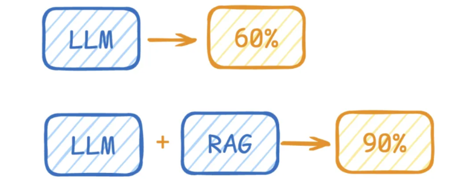
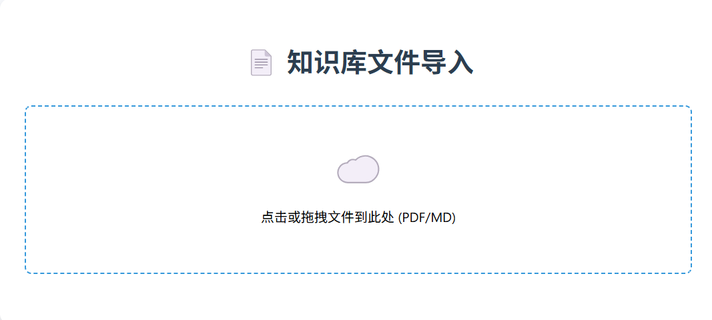
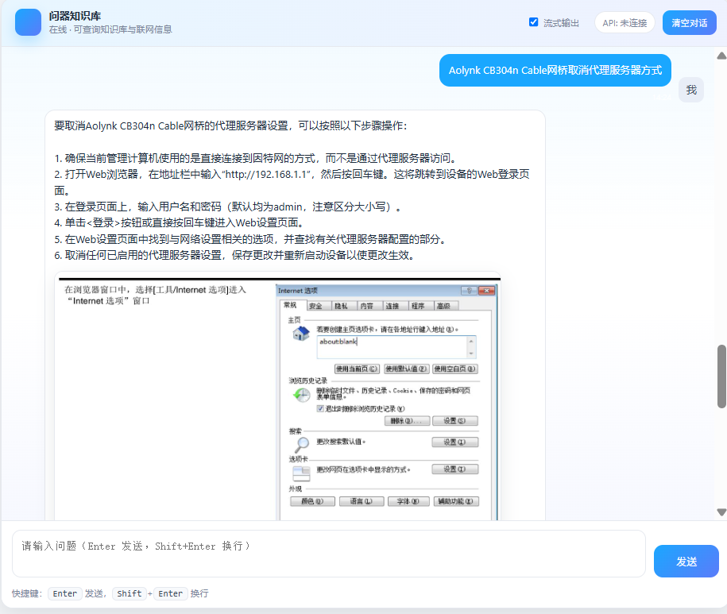
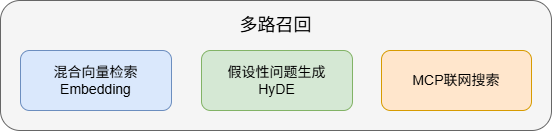

# 项目简介(标准Rag)

## 1. 项目简介

### 1.1 RAG检索增强生成 (Retrieval-Augmented Generation) 作用

> **LLM (大语言模型)** 在面对训练数据之外的陌生领域知识时，容易产生"幻觉" (Hallucination)，导致回答不准确。

**一个生活化的比喻**：RAG就像一个"遇到难题时会先查阅图书馆（知识库）再作答的专家"，而不是"仅凭记忆闭眼回答的专家"。前者有据可循，后者可能信口开河。RAG 技术通过外挂知识库的方式，在 LLM 生成回答前检索相关信息作为"提示" (Context)，引导 LLM 基于事实回答，从而显著提升回答的准确率和可信度。

**RAG核心定义**：通过检索外部知识库增强大语言模型的生成能力。




*上图展示了RAG的基本工作原理：用户问题先经过检索系统从知识库中召回相关文档，再连同问题一起交给LLM生成答案。*

**RAG 核心流程：**


**大模型在 RAG 中的关键应用：**

*   **Embedding (向量化)**：使用 `Embedding 模型`将文本转化为向量（支持稠密和稀疏向量），用于后续的相似度检索。
*   **Rerank (重排序)**：使用 `Rerank 模型`对初步召回的切片 (如 Top 50) 进行精细排序，过滤无关信息，提升上下文的相关性。
*   **LLM (生成)**：使用`大语言模型`基于检索到的上下文和用户问题生成最终答案。

**RAG 核心场景**：企业知识库问答、智能客服、法律/金融/政务专业咨询、文档助手、教育答疑、搜索增强

### 1.2 项目介绍

> 掌柜智库 (RAG) 是一款基于 **检索增强生成 (Retrieval-Augmented Generation)** 技术的企业级智能问答系统。本项目致力于构建一套集"私有知识库精准问答、实时联网信息补充、多维度结果优化"于一体的全流程智能客服解决方案，旨在实现核心知识的私有化管理、问答结果的高精准度以及业务场景的灵活适配。代码总行数：5507

系统架构包含两大核心模块：

1. **数据处理流水线（准备）**：支持 PDF/Markdown 等多格式文档导入，执行文档结构化解析、智能切片、元数据提取及向量化存储的全链路预处理。（为智能客服提供数据支撑）




2. **智能检索系统（查询）**：集成混合检索（稠密向量 + 稀疏向量）、假设性问题生成 (HyDE)、MCP 联网搜索及结果重排序 (Rerank) 等高级策略，确保回答的准确性与时效性。

   


---

### 1.2 项目核心技术&流程

#### 1.2.1 项目标准流程总览

下图展示了RAG系统从知识库构建到智能检索的完整链路，读者可先建立全局视野，再进入各环节的细节解读。

*   **知识库构建 (Indexing)**：原始数据 → 文本解析 → 文本切片 (Chunking) → 向量化 (Embedding) → 存入向量数据库。

  ```mermaid
  flowchart LR
      A[START]
      B[1.任务分发]
      C[2.PDF结构化解析]
      D[3.多模态图片理解]
      E[4.智能文档切片]
      F[5.主体识别与标签提取]
      G[6.混合向量化]
      H[7.数据持久化]
      I[END]
      
      A-->B
      B-->|PDF|C
      B-->|Markdown|D
      C-->D
      D-->E
      E-->F
      F-->G
      G-->H
      H-->I
      
      %% 核心样式设置：圆角 + 配色区分
      style A fill:#e8f4f8,stroke:#4299e1,stroke-width:2px,rx:20,ry:20
      style I fill:#f0f8fb,stroke:#38b2ac,stroke-width:2px,rx:20,ry:20
  ```

*   **知识库检索 (Retrieval & Generation)**：用户提问 → 问题向量化 → 多路检索相关切片 → 重排序 (RRF + Rerank) → 提示词增强 (Prompt Engineering) → LLM 生成答案。


  ```mermaid
  flowchart LR
      
      A[用户查询入口] --> STAR[开始]
      STAR --> B[1.意图识别与改写]
      B --> C[2.多路召回]
      C --> D[向量搜索]
      C --> E[HyDE检索]
      C --> F[网络搜索]
      D --> G[3.结果融合与粗排]
      E --> G
      F --> H
      G --> H[4.重排序]
      H --> I[5.LLM生成答案]
      I --> END[结束]
      END --> J[SSE流式输出]
      
      
      %% 核心样式设置：圆角 + 配色区分
      style STAR fill:#e8f4f8,stroke:#4299e1,stroke-width:2px,rx:20,ry:20
      style END fill:#e8f4f8,stroke:#4299e1,stroke-width:2px,rx:20,ry:20
      style A fill:#f0f800,stroke:#38b2ac,stroke-width:2px,rx:20,ry:20
      style J fill:#f0f800,stroke:#38b2ac,stroke-width:2px,rx:20,ry:20
  ```

#### 1.2.2 项目（RAG）确保准确率核心点

> RAG 的准确率问题可拆解为六个可工程化能力层：数据结构化 → 语义切片 → 多路召回 → 混合检索 → 假设增强 → 精排裁决。每一层都对应明确的误差来源与治理策略，形成端到端闭环。

##### 1.2.2.1 非结构化文档语义重建 (PDF) & 图片识别

**核心痛点**：PDF 是排版格式，不是语义格式。直接抽取文本会出现结构坍塌、图文割裂、上下文断链。

**生活化比喻**：这就像将一堆零散的乐高积木（PDF 排版）按照说明书（语义结构）重新拼装成一个完整的城堡模型——如果忽略说明书直接堆砌，得到的只是一堆碎片，而非有意义的建筑。

**专家级治理方案**

- **版面语义重建**：基于 MinerU 等引擎恢复标题层级、段落边界、表格与公式结构，输出语义化 Markdown。
- **图文联合解析**：对图片/图表执行 OCR + VLM（视觉语言模型，Visual Language Model）双通路理解，将视觉知识转化为可检索文本与向量。
- **结构一致性校验**：对标题树、段落归属、图文引用关系进行规则化校验，降低语义漂移。

**技术价值**：将"展示型文档"升级为"可计算知识资产"，从源头提升召回上限与答案可解释性。

##### 1.2.2.2 语义自治切片

**核心痛点**：固定长度切片会打断论证链路，导致"召回命中但证据不完整"。

**生活化比喻**：这就像吃牛肉干时，不是胡乱咬一口，而是顺着肉的纹理（语义边界）切成刚好入口的小块（Chunk）。这样既不会噎着（信息过长导致LLM无法处理），也不会咬到碎渣（信息断裂导致上下文丢失）。

**切片级治理方案**

- **按语义边界切分**：优先使用章节、段落、主题变化等自然边界。
- **动态长短控制**：长块二次切分、短块同域合并，避免信息稀释与碎片噪声。
- **上下文连续性增强**：引入适度 overlap（重叠10~20%）与父标题继承，保持证据链完整。

**技术价值**：让每个 Chunk 成为"最小可解释知识单元"，显著提升检索相关性与生成连贯度。

##### 1.2.2.3 多路召回引擎

> **RAG 多路召回（Multi-Path Retrieval）** 是当前检索增强生成（RAG）系统中提升检索准确率（Recall）和鲁棒性的核心策略。

它的核心思想是：不依赖单一的检索方式，而是并行使用多种不同的检索策略，最后将结果合并。

单纯依靠向量检索（Dense Retrieval）已被证明存在盲区，因此"多路召回 + 融合重排序"已成为标准架构。

**补充说明——HyDE（假设性文档嵌入，Hypothetical Document Embeddings）**：让LLM根据用户问题先生成一个假设性答案，再用这个答案去检索知识库，从而弥补"用户问题表述"与"文档原文表述"之间的语义鸿沟，提升召回效果。

**补充说明——网络搜索（MCP）**：用于解决知识库时效性不足的问题，通过 MCP 协议实时补充最新资讯，使 RAG 系统具备"私域知识 + 公网信息"的双重能力。



##### 1.2.2.4 混合向量检索

**核心痛点**：语义相关 ≠ 词项命中，关键词命中 ≠ 语义正确，单一检索无法兼顾。

**生活化比喻**：这就像找餐厅——稠密向量（语义）是"懂你的口味偏好"，稀疏向量（关键词）是"记住店名招牌"，混合检索则是"既懂你口味又记招牌名"，找得又准又全。

**专家级治理方案**

- **Dense Vector（稠密向量，语义向量）**：负责语义理解、同义泛化、隐含关联。
- **Sparse Vector（稀疏向量，统计向量）**：负责术语命中、实体精确、关键字段约束。
- **统一评分空间融合**：通过归一化与权重机制消除量纲偏差，避免单路分数"劫持"结果。

**技术价值**：实现"语义广覆盖 + 关键词高精度"的双重最优。

---

**向量基础知识补充**

向量是**既有大小、又有方向**的一组数字，可用来**量化描述事物特征**。文本、图片、语音、用户行为等信息，都可以被转换成向量。在向量空间中，**两个向量越接近，代表它们对应的内容越相似**。

> 注意：数学领域表示向量常用小括号，编程领域常用中括号。


**稠密向量（语义向量）**

- **作用**：用于表示**语义、含义、内容特征**，侧重"懂意思"。
- **特点**：
    - 向量中几乎没有 0，数值分布**稠密、饱满**。
    - 维度通常在几十到几千维（例如，常见的 Embedding 模型输出维度为 768 或 1024 维；维度越高，表达能力的"分辨率"越强，但计算开销也越大）。
- **典型场景**：大模型生成的 Embedding（词嵌入/句嵌入）、语义搜索、智能推荐、相似度计算、内容理解。

**稀疏向量（统计向量）**

- **作用**：用于表示**词频、计数、关键词是否出现**，侧重"查字面"。
- **特点**：
    - 向量中**绝大多数是 0**，只保留少数非 0 数值。
    - 维度可以非常大（几万、几十万甚至更高）。
- **典型场景**：关键词匹配、精确检索、词袋模型（Bag-of-Words）、TF-IDF、传统搜索召回。

**混合向量检索 = 稀疏 + 稠密协同使用**

- **稀疏向量**：负责**快速、精准召回**，保证关键词匹配不遗漏。
- **稠密向量**：负责**语义理解与泛化匹配**，能识别同义、近义、相关内容。
- **结合优势**：既保留关键词搜索的准确性，又具备语义搜索的全面性，让搜索结果又准、又全、更懂用户意图。

##### 1.2.2.5 重排序裁决层

**核心价值**：将"可用候选"升级为"高置信证据"，直接决定最终答案质量上限。

**什么是重排序（Rerank）？**

在 RAG 系统中，结果重排序是指对初步检索到的候选文档（或文本片段）进行第二次、更精细的相关性排序，以选出最相关、最有用的内容输入给大语言模型。


**为什么需要重排序？**

RAG 的基本流程是：

1. 用户提问。
2. 系统从知识库（如向量数据库）中**快速检索**一批可能相关的文档（比如 Top-50）。
3. 将这些文档拼接成上下文，交给 LLM 生成答案。

但问题在于：第一步的"快速检索"通常**不够精准**。原因包括：

- 初步检索追求高召回率（Recall），宁可多召回一些也不漏掉，但会混入低相关性的噪声。
- LLM 的上下文窗口有限，不能把所有召回结果都塞进去，必须优中选优。

因此，需要对初步结果重新打分、排序——这就是 **重排序**。

**生活化比喻**：这就像海选面试（初步检索）选出 50 份简历，然后进入二面（重排序），由资深专家（Rerank 模型）从专业能力、项目匹配度等精细维度打分，最终只推荐最优秀的 5 份给老板（LLM）决策。

**重排序的技术价值**：重排序的质量直接决定了 LLM 能"看到"什么证据——错误排序会将噪声喂给模型，导致答案偏移；正确排序则能为生成提供坚实的事实基础，是连接"召回"与"生成"之间的关键桥梁。

