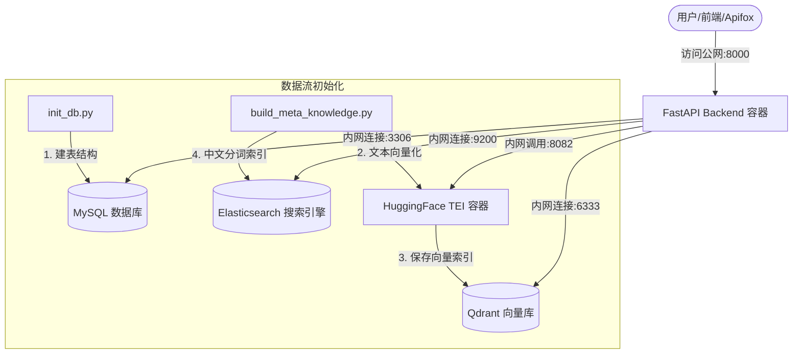

# RentAgent 云端生产部署与避坑实战指南

> 本文档是针对 **RentAgent (Rental Data Agent)** 系统从本地开发环境迁移至 **2核4G (含4G Swap)** 云服务器部署的完整复盘。
>
> 文档沉淀了部署过程中涉及的所有技术细节与底层原理，可作为未来同类项目部署的通用“避坑指南”。

---


## 1. 项目整体架构与数据流向

**官方描述**：RentAgent 是一个基于 RAG（检索增强生成）架构的智能租房查询系统。它将用户自然语言问题解析为结构化查询，通过向量检索与全文搜索结合的方式从多源数据中召回相关信息，最终由大模型生成答案。

**生活比喻**：就像一个房产中介的超级大脑。你问“悉尼CBD 500-600澳元的公寓”，它先理解你的需求（意图识别），然后同时翻自己的笔记本（向量库查相似案例）和查电脑系统（ES查房源表），最后汇总信息回答你。

### 1.1 架构图



### 1.2 服务器配置

| 配置项 | 值 | 说明 |
|--------|-----|------|
| 实例类型 | 腾讯云/阿里云轻量应用服务器 | 入门级生产环境 |
| 规格 | 2核 4G 内存 + 4G Swap | 内存紧张型配置 |
| 操作系统 | Ubuntu 22.04/24.04 LTS | 推荐 LTS 版本 |
| 网络模式 | `network_mode: "host"`（后端） | 其余组件端口映射 |
| 内网通信 | 通过 `localhost` 互通 | 所有容器在同一主机 |

---

## 2. 核心技术知识点深度剖析

### 2.1 虚拟内存 (Swap) 与 JVM 内存优化

**官方描述**：Swap 是 Linux 内核提供的一种内存扩展机制，将磁盘空间作为内存的"溢出区"。当物理内存不足时，内核会将不常用的内存页交换到磁盘上，从而避免 OOM（Out Of Memory）导致的进程被杀。

**生活比喻**：内存就像办公桌桌面，Swap 就是旁边的文件柜抽屉。桌子（4G内存）太小放不下五个大件时，系统自动把不常用的资料放进抽屉（Swap），腾出桌面空间给正在用的程序。虽然翻抽屉慢一些，但至少不会因为桌子满了把正在写的重要文件扔掉（OOM Killer）。

**为什么需要 Swap**：
- Elasticsearch (JVM架构) 启动需要 1.5-2G 内存
- HuggingFace TEI 加载 BGE 模型需要约 800M-1G 内存
- MySQL + Qdrant + FastAPI 合计约 500M
- **总计常驻内存需求超过 2.5G**，接近 4G 物理内存上限

**代价说明**：
- 硬盘读写速度比物理内存慢 **100-1000 倍**
- 系统启动、首次加载时会出现 **CPU 100%** 的情况（正常现象）
- 待所有容器初始化稳定后，CPU 占用会自动降下来

**配置示例**（Ubuntu）：
```bash
# 创建 4G Swap 文件
sudo fallocate -l 4G /swapfile
sudo chmod 600 /swapfile
sudo mkswap /swapfile
sudo swapon /swapfile

# 永久生效（写入 /etc/fstab）
echo '/swapfile none swap sw 0 0' | sudo tee -a /etc/fstab

# 调整 swappiness（0-100，值越小越少用 Swap）
sudo sysctl vm.swappiness=60  # 建议 60-80
```

---

### 2.2 Docker Compose 相对路径解析机制

**官方描述**：在 Docker Compose 配置文件中，以 `./` 或 `../` 开头的路径是**相对于该配置文件所在目录**解析的，而不是相对于执行 `docker compose` 命令的当前工作目录。

**生活比喻**：你在公司会议室里说“去隔壁”，这个“隔壁”是相对于会议室的位置（Compose文件所在目录），而不是相对于大门口（命令执行目录）。会议室在 3 楼，“隔壁”就是 3 楼的隔壁房间；而如果你站在大门口想找“隔壁”，可能就跑到 1 楼的保安室去了。

**避坑场景**：
```
项目结构：
/opt/rent-agent/                      # 项目根目录
├── docker/
│   └── docker-compose.prod.yaml      # Compose 文件在这里
├── model_cache/                      # 模型下载到这里
└── ...

❌ 错误写法（在 docker-compose.prod.yaml 中）：
volumes:
  - ./model_cache:/data   # 被解析为 /opt/rent-agent/docker/model_cache

✅ 正确写法：
volumes:
  - ../model_cache:/data   # 被解析为 /opt/rent-agent/model_cache
```

---

### 2.3 MySQL 容器初始化挂载脚本限制

**官方描述**：MySQL 官方镜像的 `/docker-entrypoint-initdb.d` 目录中的 `.sql`、`.sh` 文件**仅在数据目录为空时首次启动执行一次**。一旦数据卷中已有 MySQL 系统文件，这些脚本就会被完全忽略。

**生活比喻**：这就像精装房的"交房标准"。你第一次收房（数据卷为空），开发商会按标准把水电、墙面都弄好（执行初始化脚本）。但你住进去两年后（数据卷已存在），哪怕你再往标准文件夹里放新的装修需求，也不会有人帮你改了——因为你已经住进去了，乱改会破坏现有装修。

**验证方法**：
```bash
# 检查数据卷是否已存在
docker volume ls | grep mysql_data

# 删除数据卷强制重新初始化（谨慎操作！）
docker compose down -v
docker volume rm rent-agent_mysql_data
```

**替代方案**（推荐）：
```bash
# 使用管道直接执行 SQL，无视数据卷状态
docker exec -i mysql mysql -uroot -pAtguigu.123 < docker/mysql/rent_meta.sql
docker exec -i mysql mysql -uroot -pAtguigu.123 < docker/mysql/dw.sql
```

---

### 2.4 Elasticsearch 插件安装与自定义镜像构建

**官方描述**：Elasticsearch 官方镜像默认不包含中文分词插件。IK 插件需要下载并安装到 `plugins/` 目录，必须通过自定义 Dockerfile 构建包含插件的镜像。

**生活比喻**：官方原版 ES 就像一个只会说英语的数据库管理员。你要他处理中文搜索（如“悉尼CBD价格在500-600的公寓”），他完全不知道怎么切词。IK 插件就像给他配了一个中文翻译，现在他能正确地把“悉尼”、“CBD”、“价格”、“500-600”切成有意义的词了。

**Dockerfile 示例**（`docker/elasticsearch/Dockerfile`）：
```dockerfile
FROM elasticsearch:8.19.3

# 下载并安装 IK 分词器插件
RUN elasticsearch-plugin install \
    https://github.com/medcl/elasticsearch-analysis-ik/releases/download/v8.19.3/elasticsearch-analysis-ik-8.19.3.zip

# 可选：设置 JVM 堆内存限制（4G 服务器建议）
ENV ES_JAVA_OPTS="-Xms1g -Xmx1g"
```

**docker-compose 配置**：
```yaml
elasticsearch:
  build:
    context: ./elasticsearch    # 指向包含 Dockerfile 的目录
    dockerfile: Dockerfile
  container_name: elasticsearch
  # ... 其他配置
```

**构建命令**：
```bash
docker compose -f docker/docker-compose.prod.yaml up -d --build
```

> **📚 深入学习：IK 插件版本对应**
> IK 插件的版本必须与 ES 版本严格对应。例如 ES 8.19.3 必须使用 IK 8.19.3，否则启动时会报错。下载地址：
> [https://github.com/medcl/elasticsearch-analysis-ik/releases](https://github.com/medcl/elasticsearch-analysis-ik/releases)

---

### 2.5 利用 Dockerfile 实现 Python 项目的容器化隔离与编译

**官方描述**：Docker 容器化技术通过镜像分层构建，将应用代码与其运行时环境（Python 解释器、依赖库）打包在一起，实现与宿主机环境的完全隔离。编译型依赖（如 `asyncmy`、`uvloop`）在容器构建时完成编译，生成与容器底层 ABI 兼容的二进制文件。

**生活比喻**：我们上传到云服务器的代码只是一个纯文本的"毛坯源码"。服务器本身并没有安装 Python 3.12 环境，也没有对应的依赖库。Dockerfile 就像是一个全自动生产车间，当场为我们的源码量身定制一套配套环境（安装 Python、编译 C 扩展），把它们封装成一个可以直接运行的"集装箱"（镜像）。这个集装箱在任何装了 Docker 的服务器上都能跑，不管宿主机原来是什么环境。

**核心优势**：

| 优势 | 说明 |
|------|------|
| 环境隔离 | 宿主机无需安装 Python 及开发依赖，保持系统纯净 |
| 依赖编译 | 在容器内完成 C 扩展编译（如 `asyncmy`、`uvloop`），生成与容器 ABI 兼容的二进制 |
| 一次构建，到处运行 | 镜像推送到仓库后，任何服务器都能直接运行 |
| 版本锁定 | 通过 `requirements.txt` 锁定所有依赖版本，杜绝"在我电脑上能跑"问题 |

---

## 3. 部署实战踩坑与终极解决方案

### 坑一：TEI 容器下载模型报错 `Header content-range is missing`

**现象描述**：
```bash
docker logs tei-container
# 输出：Download failed: Header content-range is missing
```
容器一直处于 `Waiting` 或 `Restarting` 状态，无法启动。

**原因分析**：
TEI（Text Embeddings Inference）是用 Rust 编写的推理服务器。它的 HTTP 下载客户端**强制要求服务器支持 Range 请求**（断点续传）。国内的 HuggingFace 镜像站（如 `hf-mirror.com`）在某些版本中会过滤掉 `Content-Range` 响应头，导致 Rust 客户端检测不到，直接报错中断。

**解决方案**：使用 Python 的 `modelscope` 或 `huggingface_hub` 手动下载模型到宿主机目录，再挂载给 TEI 容器。

```bash
# 方法一：使用 ModelScope（推荐，国内下载快）
docker run -it --rm -v /opt/rent-agent/model_cache:/data python:3.12-slim sh -c \
  "pip install modelscope -i https://pypi.tuna.tsinghua.edu.cn/simple && \
   python -c \"from modelscope import snapshot_download; snapshot_download('BAAI/bge-large-zh-v1.5', local_dir='/data')\""

# 方法二：使用 HuggingFace Hub（可能需要代理）
docker run -it --rm -v /opt/rent-agent/model_cache:/data python:3.12-slim sh -c \
  "pip install huggingface_hub -i https://pypi.tuna.tsinghua.edu.cn/simple && \
   huggingface-cli download BAAI/bge-large-zh-v1.5 --local-dir /data"
```

**验证下载成功**：
```bash
# 检查模型文件是否存在
ls -la /opt/rent-agent/model_cache/
# 应包含：config.json, pytorch_model.bin, tokenizer.json 等
```

---

### 坑二：TEI 启动报错 `config.json not found (os error 2)`

**现象描述**：
模型已下载成功（`/opt/rent-agent/model_cache` 目录有文件），但 TEI 容器启动时秒退，日志提示找不到 `config.json`。

**原因分析**：
Docker Compose 配置文件中使用了错误的相对路径。Compose 文件位于 `docker/` 子目录下，而模型下载到了项目根目录。

```yaml
# ❌ 错误配置（位于 docker/docker-compose.prod.yaml）
volumes:
  - ./model_cache:/data   # Docker 解析为 /opt/rent-agent/docker/model_cache（空目录）

# ✅ 正确配置
volumes:
  - ../model_cache:/data  # Docker 解析为 /opt/rent-agent/model_cache（有模型）
```

**避坑解法**：
修改 `docker/docker-compose.prod.yaml` 中的挂载路径，使用 `../` 回退到项目根目录。

```yaml
services:
  tei:
    image: ghcr.io/huggingface/text-embeddings-inference:86-0.3.0
    volumes:
      - ../model_cache:/data   # 关键修改
    command: --model-id /data --port 8082
    # ... 其他配置
```

---

### 坑三：`init_db.py` 报错 `Access denied for user 'atguigu'@'%' to database 'rent_meta'`

**现象描述**：
执行 `init_db.py` 或 `build_meta_knowledge.py` 时报错：
```
pymysql.err.OperationalError: (1044, "Access denied for user 'atguigu'@'%' to database 'rent_meta'")
```

**原因分析**：
服务器上之前存在旧的 MySQL 数据卷（`mysql_data`），导致挂载到 `/docker-entrypoint-initdb.d/rent_meta.sql` 的 SQL 脚本（包含 `CREATE DATABASE` 和 `GRANT` 语句）**根本没有执行**。MySQL 容器认为自己已经初始化过了，不会再执行。

**解决方案**：不依赖自动初始化，使用管道手动执行 SQL。

```bash
# 确认 SQL 文件存在且内容正确
cat docker/mysql/rent_meta.sql | head -5

# 直接通过管道执行（推荐）
docker exec -i mysql mysql -uroot -pAtguigu.123 < docker/mysql/rent_meta.sql
docker exec -i mysql mysql -uroot -pAtguigu.123 < docker/mysql/dw.sql

# 验证数据库是否创建成功
docker exec -it mysql mysql -uroot -pAtguigu.123 -e "SHOW DATABASES;"
```

**可选方案**（如果愿意重置数据）：
```bash
# 完全重置 MySQL（会丢失所有数据！）
docker compose down -v
docker volume rm rent-agent_mysql_data
docker compose up -d
# 此时初始化脚本会自动执行
```

---

### 坑四：Git Push 报错 `error: RPC failed; HTTP 400 curl 56`

**现象描述**：
```bash
git push origin main
# error: RPC failed; HTTP 400 curl 56 The requested URL returned error: 400
# fatal: the remote end hung up unexpectedly
```

**原因分析**：
在放开 `docker/` 子目录限制时，误将 IK 分词器 ZIP 包（约 4.38MB）添加到了 Git 暂存区。Git 使用 HTTPS 推送大二进制文件时，缓冲区大小不足导致 HTTP 400 错误。

**避坑解法**：

1. **严格在 `.gitignore` 中屏蔽所有大型二进制包**：
```gitignore
# 大型二进制文件
*.zip
*.tar.gz
*.bin
*.pkl
*.pt
*.pth

# Elasticsearch 插件目录
docker/elasticsearch/plugins/
```

2. **回滚错误的 Commit**：
```bash
# 撤销最后一次 commit（保留修改）
git reset HEAD~1

# 或撤销所有未提交的修改（谨慎！）
git reset --hard HEAD~1
```


---

### 坑五：ES 报错 `analyzer [ik_max_word] has not been configured`

**现象描述**：
执行 `build_meta_knowledge.py` 时崩溃，ES 返回 400 错误：
```json
{
  "error": {
    "type": "mapper_parsing_exception",
    "reason": "analyzer [ik_max_word] has not been configured"
  }
}
```

**原因分析**：
`docker-compose.prod.yaml` 中直接使用了官方原版 `elasticsearch:8.19.3` 镜像，该镜像**没有安装 IK 分词器插件**。当 Python 脚本尝试创建使用 `ik_max_word` 分析器的索引时，ES 无法识别。

**解决方案**：使用自定义镜像构建。

**步骤 1**：创建 `docker/elasticsearch/Dockerfile`：
```dockerfile
FROM elasticsearch:8.19.3

# 下载并安装 IK 插件
RUN elasticsearch-plugin install \
    https://github.com/medcl/elasticsearch-analysis-ik/releases/download/v8.19.3/elasticsearch-analysis-ik-8.19.3.zip

# 可选：启用自动创建索引（开发环境）
RUN echo "action.auto_create_index: true" >> /usr/share/elasticsearch/config/elasticsearch.yml
```

**步骤 2**：修改 `docker-compose.prod.yaml`：
```yaml
services:
  elasticsearch:
    build:
      context: ./elasticsearch
      dockerfile: Dockerfile
    container_name: elasticsearch
    # ... 其他配置保持不变
```

**步骤 3**：重新构建并启动：
```bash
# 停止并删除旧容器
docker compose -f docker/docker-compose.prod.yaml down

# 强制重建镜像并启动
docker compose -f docker/docker-compose.prod.yaml up -d --build

# 验证插件是否安装成功
docker exec elasticsearch elasticsearch-plugin list
# 输出应包含：analysis-ik
```

---

## 4. 生产环境数据初始化与验证标准动作

当所有容器成功启动后，按以下步骤完成数据初始化。

### 步骤一：验证容器状态

```bash
# 检查所有容器是否正常运行
docker ps

# 期望输出（示例）
CONTAINER ID   IMAGE                              STATUS          PORTS
abc123...      rent-agent-backend                 Up 2 minutes    8000/tcp
def456...      mysql:8.0                          Up 2 minutes    3306/tcp
ghi789...      elasticsearch-custom               Up 2 minutes    9200/tcp
jkl012...      qdrant/qdrant                      Up 2 minutes    6333/tcp
mno345...      text-embeddings-inference          Up 2 minutes    8082/tcp
```

### 步骤二：同步 MySQL 表结构

```bash
# 执行数据库迁移脚本（自动同步所有表，包括新增的 token_audit_log）
docker exec -it data-agent-backend python app/scripts/init_db.py
```

**期望输出**：
```
正在连接 MySQL 并同步表结构...
数据库表结构同步完成！
已创建表: rent_meta, dw, token_audit_log
```

### 步骤三：构建向量与分词元数据

```bash
# 构建知识库索引（向量库 Qdrant + 搜索引擎 ES）
docker exec -it data-agent-backend python app/scripts/build_meta_knowledge.py -c conf/meta_config.yaml
```

**期望输出**：
```
[INFO] 开始加载配置文件...
[INFO] 成功读取房源数据: 1250 条
[INFO] 正在向量化描述字段...
[INFO] 写入 Qdrant: 1250 条向量
[INFO] 写入 Elasticsearch: 1250 条文档
[INFO] Building done
```

### 步骤四：接口连通性验证

**测试 1**：健康检查
```bash
curl http://localhost:8000/health
# 期望：{"status":"ok"}
```

**测试 2**：获取所有房源（GET）
```bash
curl http://localhost:8000/api/products | jq '.'
# 期望：返回房源 JSON 数组
```

**测试 3**：智能体问答（POST，流式输出）
```bash
curl -N -X POST http://localhost:8000/api/query \
     -H "Content-Type: application/json" \
     -d '{"query": "帮我找一下价格在500-600的房子"}'
```

**期望输出**（SSE 流）：
```
data: {"type": "start", "message": "开始处理查询..."}

data: {"type": "progress", "step": "意图识别", "result": "价格范围: 500-600"}

data: {"type": "progress", "step": "SQL生成", "result": "SELECT * FROM rental WHERE price BETWEEN 500 AND 600"}

data: {"type": "result", "data": [{"id": 1, "address": "...", "price": 550}]}

data: {"type": "complete", "message": "查询完成"}
```

---

## 5. 安全防护一页纸规约

| 端口 | 服务 | 安全组策略 | 原因说明 |
|:-----|:-----|:-----------|:---------|
| **8000** | FastAPI 后端 | ✅ 开放 (0.0.0.0/0) | 允许公网前端调用 API |
| **3306** | MySQL 数据库 | ❌ 关闭外网访问 | 防止数据库弱口令被扫描、数据被勒索 |
| **9200** | Elasticsearch | ❌ 关闭外网访问 | ES 默认无密码认证，暴露后索引可被任意删改 |
| **6333** | Qdrant 向量库 | ❌ 关闭外网访问 | 保护知识库向量不被窃取或注入垃圾向量 |
| **8082** | TEI 向量服务 | ❌ 关闭外网访问 | 防止向量计算服务被恶意盗刷 |

### 安全组配置示例（腾讯云/阿里云）

```bash
# 只开放 8000 端口
# 其他端口只允许内网访问（或安全组中不配置入方向规则）

入方向规则：
- 协议: TCP, 端口: 8000, 源: 0.0.0.0/0  # 公网访问
- 协议: TCP, 端口: 22, 源: 你的办公IP    # SSH 登录（限制来源）
```

### 额外安全建议

| 建议 | 说明 |
|------|------|
| 修改默认密码 | 生产环境务必修改 MySQL、ES 的默认密码 |
| 启用 ES 安全特性 | ES 8.x 默认开启安全特性，需配置证书和用户密码 |
| 使用反向代理 | 在 Nginx 层面添加限流、IP 白名单、HTTPS |
| 定期备份 | 备份 MySQL 数据卷和 Qdrant 快照 |

---

## 6. 常见问题排查表

| 问题 | 可能原因 | 解决方案 |
|------|---------|---------|
| TEI 容器反复重启 | 模型下载失败或挂载路径错误 | 检查 `model_cache` 目录是否存在 `config.json`，检查 Compose 挂载路径 |
| ES 容器启动后退出 | JVM 内存不足 | 添加 `ES_JAVA_OPTS="-Xms1g -Xmx1g"` 环境变量，确保有 Swap |
| MySQL 连接拒绝 | 容器未完全启动 | 等待 10-20 秒再重试，MySQL 首次初始化需要时间 |
| `build_meta_knowledge.py` 报 ES 连接超时 | ES 容器还在启动中 | 使用 `docker logs elasticsearch` 查看日志，等待状态变绿 |
| 后端容器日志显示 `Cannot connect to host localhost:8082` | TEI 容器未就绪 | TEI 加载模型需要 2-5 分钟，等待后再启动后端 |
| 服务器 CPU 100% | 启动阶段大量换页（Swapping） | 正常现象，等待 5-10 分钟稳定 |
| Git push 失败 | 误提交了大型二进制文件 | 使用 `git reset HEAD~1` 回滚，更新 `.gitignore` |

---

## 7. 快速部署命令清单

```bash
# 1. 配置 Swap（4G 内存服务器必须）
sudo fallocate -l 4G /swapfile && sudo chmod 600 /swapfile && \
sudo mkswap /swapfile && sudo swapon /swapfile && \
echo '/swapfile none swap sw 0 0' | sudo tee -a /etc/fstab

# 2. 克隆代码
git clone https://github.com/your-org/rent-agent.git /opt/rent-agent
cd /opt/rent-agent

# 3. 手动下载模型（避开 TEI 下载 bug）
docker run -it --rm -v /opt/rent-agent/model_cache:/data python:3.12-slim sh -c \
  "pip install modelscope -i https://pypi.tuna.tsinghua.edu.cn/simple && \
   python -c \"from modelscope import snapshot_download; snapshot_download('BAAI/bge-large-zh-v1.5', local_dir='/data')\""

# 4. 构建并启动所有容器
docker compose -f docker/docker-compose.prod.yaml up -d --build

# 5. 等待服务就绪（2-3 分钟）
sleep 120

# 6. 初始化数据库表结构
docker exec -it data-agent-backend python app/scripts/init_db.py

# 7. 手动执行 SQL（如果上一步报权限错误）
docker exec -i mysql mysql -uroot -pAtguigu.123 < docker/mysql/rent_meta.sql
docker exec -i mysql mysql -uroot -pAtguigu.123 < docker/mysql/dw.sql

# 8. 构建知识库索引
docker exec -it data-agent-backend python app/scripts/build_meta_knowledge.py -c conf/meta_config.yaml

# 9. 测试接口
curl http://localhost:8000/health
```
---


