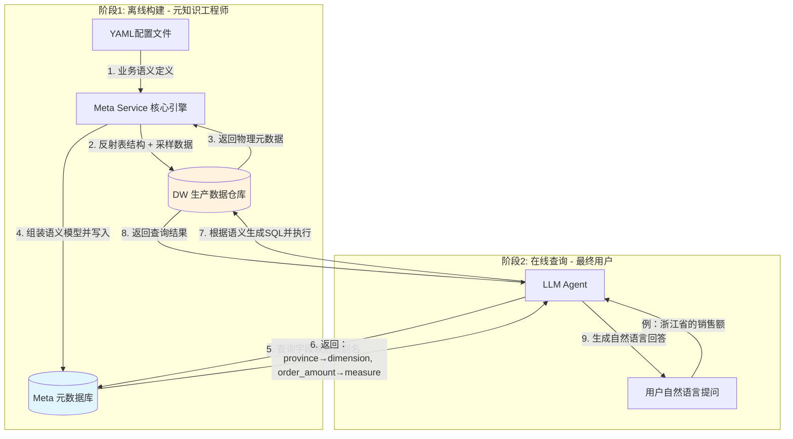
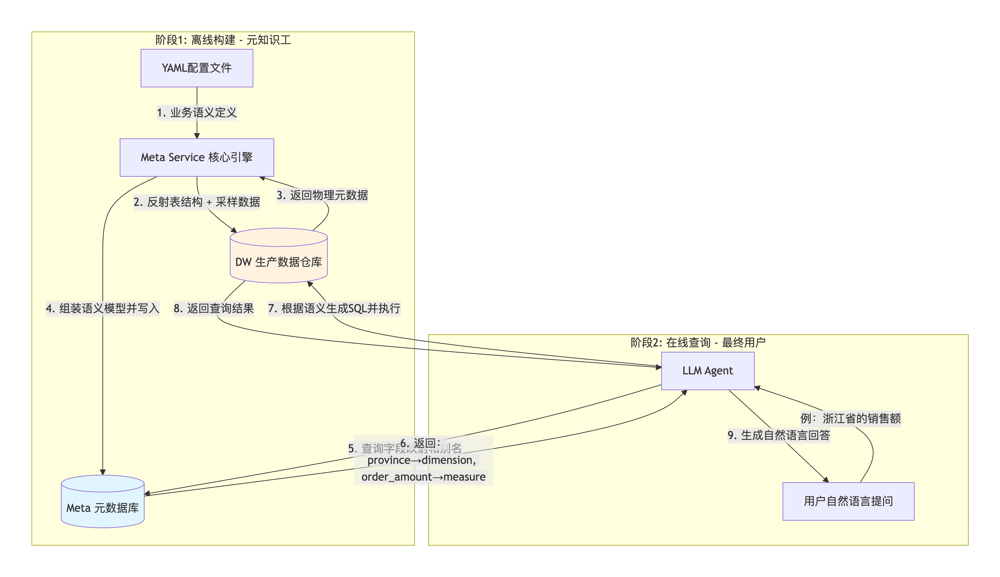
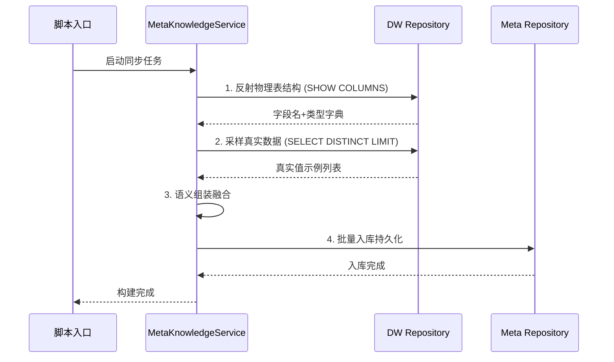
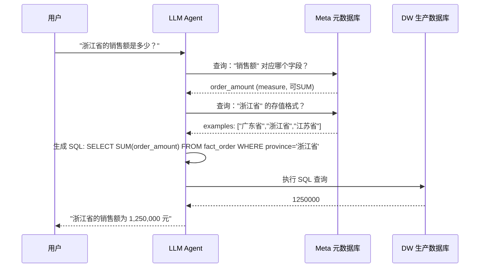

#  数据智能体：元知识构建系统架构(核心:上半部分-LLM、元数据、生产库数据三者协作)

> **核心理念**：让 LLM（大语言模型）直接看生产数据库（DW）无异于让盲人摸象。本系统通过构建“元知识库”，为 AI 提供了一副“语义眼镜”，将冷冰冰的物理表转化为 AI 能理解的“上下文”。

---

##  宏观架构：从物理世界到语义空间


我们采用了经典的 **“影子库（Shadow Meta DB）”双引擎架构**。

*   **官方描述**：通过建立语义抽象层（Semantic Layer），实现数据物理定义与业务逻辑定义的解耦。
*   **生活比喻**：**“图书馆的检索卡片柜”**。
    *   **DW 数据库**：是藏书库，书很多很乱，直接进去找效率极低。
    *   **Meta 数据库**：是门口的卡片柜，上面记录了书名、作者、摘要（字段描述）甚至第一页的内容（数据示例）。
    *   **大语言模型 (LLM)**：是来找书的读者。我们不让他进书库，只让他查卡片。

### 完整架构图：两阶段数据流



完整的架构图(跟上面一样,mermaid生成的有点差):



### 数据流向说明

| 阶段 | 方向 | 说明 |
|-----|------|------|
| **离线构建** | DW → Meta Service → Meta DB | 从 DW 提取元数据（表结构+采样数据），处理后存入 Meta DB |
| **在线查询-步骤1** | Meta DB → LLM Agent | LLM 先查 Meta DB 理解表结构、字段语义和别名 |
| **在线查询-步骤2** | LLM Agent → DW | LLM 根据理解生成 SQL，去 DW 查询真实业务数据 |
| **在线查询-步骤3** | DW → LLM Agent → 用户 | 数据返回后，LLM 组织成自然语言回答给用户 |

### 核心理解

- **Meta DB（影子库）**：存的是“地图”和“翻译词典”——表结构、字段描述、别名、示例数据
- **DW（生产库）**：存的是真正的业务数据——订单金额、用户信息、交易记录等
- **LLM 的角色**：先用 Meta DB 理解“该查什么、怎么查”，再去 DW 执行查询
- **两个数据库没有直接连接**：它们通过 LLM Agent 间接协作，各司其职

---

##  核心流程概述

系统运行的核心目标，是将物理结构和人工经验结合，转化为结构化的知识。

| 步骤 | 动作 | 说明 |
|-----|------|------|
| 1 | 资源启动 | 建立与双库的异步连接池，分配数据库会话 |
| 2 | 配置注入 | 读取 YAML 业务规则，转化为强类型 Python 对象 |
| 3 | 结构反射 | 去 DW 库动态获取表结构（字段名与类型） |
| 4 | 特征采样 | 对指定字段进行去重限流查询，提取真实语料 |
| 5 | 语义组装 | 将物理类型、业务描述、数据示例融合成模型 |
| 6 | 知识入库 | 批量持久化到元数据库，供 AI 消费 |

### 离线构建执行流程序列图



### 在线查询执行流程序列图



---

##  元知识构建生命周期（源码级逐帧解析）

### 阶段一：引擎点火与资源分配

> **生活比喻**：工厂开工前，厂长先拉好两根数据库专线，给工人（Repository）分配工具（Session 会话）。

```python
# 文件：app/scripts/build_meta_knowledge.py
async def build(config_path: Path):
    # 【1】建立连接池：启动时一次性建立，不要在每次请求时创建
    meta_mysql_client_manager.init()    
    dw_mysql_client_manager.init()    
    
    # 【2】申请通信信道：async with 确保连接被安全回收
    async with meta_mysql_client_manager.session_maker() as meta_session, \
               dw_mysql_client_manager.session_maker() as dw_session:
               
        # 【3】依赖注入：将信道分配给底层的工人（Repository）
        meta_repo = MetaMySQLRepository(meta_session)
        dw_repo = DWMySQLRepository(dw_session)
        
        # 【4】正式开工
        service = MetaKnowledgeService(meta_repo, dw_repo)
        await service.build(config_path)
```

---

### 阶段二：规则宣发与语义注入

> **生活比喻**：厂长拿到了客户给的 YAML 订单图纸，这份图纸包含了人类对业务数据的宝贵理解。

#### 核心图纸解析（meta_config.yaml）

```yaml
tables:
  - name: fact_order               # 物理表名
    role: fact                     # 角色：事实表
    description: 订单事实表，记录订单数量和金额等核心指标。
    columns:
      - name: order_amount
        role: measure              # 度量值 → 可被 SUM/AVG
        description: 订单金额。
        alias: [销售额, 订单金额, 收入]
        sync: false                # 金额值无限，无需采样

  - name: dim_region
    role: dim                      # 角色：维度表
    description: 地区维度表。
    columns:
      - name: province
        role: dimension            # 维度值 → 可用于 GROUP BY
        description: 订单所属的省份名称。
        alias: [省份, 省, 所在省份]
        sync: true                 # 枚举有限，需要采样真实值
```

> **📌 sync 决策矩阵（重要！）**

| sync 值 | 适用场景 | 示例字段 | 原因 |
|--------|---------|---------|------|
| `true` | 枚举、状态、类别（值有限且可枚举） | `status`, `province`, `order_type` | 采样的值对 AI 有指导意义 |
| `false` | ID、时间戳、金额、长文本 | `user_id`, `created_at`, `amount`, `comment` | 值无限或采样无意义 |

> **📌 role 对 SQL 生成的影响（核心！）**

| role | AI 的认知 | 生成的 SQL 行为 |
|------|----------|----------------|
| `dimension` | “这是一个分类/分组依据” | 出现在 `GROUP BY`、`WHERE` 子句 |
| `measure` | “这是一个可聚合的数值” | 出现在 `SUM()`、`AVG()`、`ORDER BY` |

**示例：用户问“各省份的订单总额”**
```sql
-- AI 的推理过程：
-- province (dimension) → GROUP BY province
-- order_amount (measure) → SUM(order_amount)

SELECT province, SUM(order_amount) 
FROM fact_order 
GROUP BY province
```

#### 配置加载代码

```python
# 文件：app/services/meta_knowledge_service.py
async def build(self, config_path: Path):
    # 读取 YAML → 合并标准结构 → 强类型校验
    context = OmegaConf.load(config_path)
    schema = OmegaConf.structured(MetaConfig)
    # 如果 YAML 里把 alias 拼成了 alise，这里会立刻报错拦截
    meta_config: MetaConfig = OmegaConf.to_object(OmegaConf.merge(schema, context))
```

---

### 阶段三：物理探测与特征采样（核心引擎）

> **生活比喻**：工人去仓库实地考察，看看货架长什么样，顺便抓几件样品回来。

```python
# 文件：app/services/meta_knowledge_service.py
for table in meta_config.tables:
    # 【1】反射物理结构：去 DW 查真实类型
    # 返回：{'region_id': 'int', 'province': 'varchar'}
    column_types = await self.dw_repo.get_columns_type(table.name)
    
    for column in table.columns:
        # 【2】特征采样：去 DW 抓真实样本
        # 返回：["广东省", "浙江省", "江苏省"]
        samples = await self.dw_repo.get_column_values(
            table.name, column.name, limit=10
        )
        
        # 【3】语义组装：灵魂+肉身+血液的融合
        column_info = ColumnInfoMySQL(
            id=f"{table.name}.{column.name}",
            name=column.name,
            type=column_types[column.name],      # 肉身：varchar
            role=column.role,                    # 灵魂：dimension
            description=column.description,      # 灵魂：业务描述
            alias=column.alias,                  # 灵魂：同义词
            examples=samples,                    # 血液：真实语料
        )
        column_infos.append(column_info)
```

#### 底层交互实现（DW Repository）

```python
# 文件：app/repositories/mysql/dw/dw_mysql_repositor.py

# 【反射结构】利用 MySQL 系统表自动发现字段
async def get_columns_type(self, table_name: str) -> dict:
    sql = f"SHOW COLUMNS FROM {table_name}"
    result = await self.session.execute(text(sql))
    return {row['Field']: row['Type'] for row in result.mappings()}

# 【特征采样】必须加 LIMIT！千万级表不加会导致数据库崩溃
async def get_column_values(self, table_name: str, column_name: str, limit: int = 10) -> list:
    sql = f"SELECT DISTINCT {column_name} FROM {table_name} LIMIT {limit}"
    result = await self.session.execute(text(sql))
    return [row[0] for row in result.fetchall()]
```

---

### 阶段四：知识入库与落幕

> **生活比喻**：工人把采集到的样品和整理好的卡片，放回总部的卡片柜（Meta DB）归档。

```python
# 文件：app/services/meta_knowledge_service.py
async def build(self, config_path: Path):
    # ... 前面组装逻辑得到 column_infos ...
    
    # 【批量入库】使用 upsert（存在则更新），避免重复运行时主键冲突
    await self.meta_repo.batch_upsert_columns(column_infos)
    logger.info(f"成功同步 {len(column_infos)} 个字段的元知识")
```

#### 批量入库实现（Meta Repository）

```python
# 文件：app/repositories/mysql/meta/meta_mysql_repository.py
from sqlalchemy.dialects.mysql import insert

async def batch_upsert_columns(self, columns: List[ColumnInfoMySQL]):
    """批量插入或更新，主键冲突时更新非主键字段"""
    stmt = insert(ColumnInfoMySQL).values([c.to_dict() for c in columns])
    
    # MySQL 特有的 ON DUPLICATE KEY UPDATE 语法
    stmt = stmt.on_duplicate_key_update(
        type=stmt.inserted.type,
        role=stmt.inserted.role,
        description=stmt.inserted.description,
        alias=stmt.inserted.alias,
        examples=stmt.inserted.examples,
        updated_at=func.now()
    )
    await self.session.execute(stmt)
    await self.session.commit()
```

---

## 🔗 AI 如何消费元知识库（完整闭环）

> **这是很多文档缺失的关键环节：上面的数据存进去后，AI 到底怎么用？**

### 在线查询流程详解

```python
# AI Agent 内部的查询逻辑（伪代码）
async def answer_user_question(user_question: str, meta_db_session, dw_session):
    """
    用户问了一个问题，AI 需要：
    1. 理解问题要查什么
    2. 去 Meta DB 查字段映射
    3. 生成 SQL 去 DW 执行
    4. 把结果翻译成自然语言
    """
    
    # ========== 步骤1：从问题中提取关键词 ==========
    # 输入："帮我查一下浙江省的销售额"
    # 输出：entities = ["浙江省", "销售额"]
    entities = extract_keywords(user_question)
    
    # ========== 步骤2：在 Meta DB 中匹配字段 ==========
    # 2.1 匹配"销售额"对应哪个字段
    sql_match = """
    SELECT table_name, column_name, role, description
    FROM column_info 
    WHERE alias LIKE '%销售额%' OR description LIKE '%销售额%'
    """
    matches = await meta_db_session.execute(sql_match)
    # 假设匹配到：table_name='fact_order', column_name='order_amount', role='measure'
    
    # 2.2 获取 province 字段的示例值，确认"浙江省"的存值格式
    sql_example = """
    SELECT examples FROM column_info 
    WHERE column_name = 'province' AND table_name = 'dim_region'
    """
    province_examples = await meta_db_session.execute(sql_example)
    # province_examples = ["广东省", "浙江省", "江苏省", ...]
    
    # ========== 步骤3：验证实体值格式 ==========
    if "浙江省" in province_examples:
        value_format = "province = '浙江省'"      # 确认格式是带"省"字的
    else:
        value_format = "province LIKE '%浙江%'"   # 模糊匹配降级
    
    # ========== 步骤4：生成 SQL 并执行 ==========
    final_sql = f"""
    SELECT SUM(order_amount) as total_sales
    FROM fact_order o
    JOIN dim_region r ON o.region_id = r.region_id
    WHERE {value_format}
    """
    
    result = await dw_session.execute(final_sql)
    # result = 1250000
    
    # ========== 步骤5：生成自然语言回答 ==========
    answer = f"浙江省的销售额为 {result:,.0f} 元"
    return answer
```

### 关键点总结

| 步骤 | 数据库交互 | 作用 |
|-----|----------|------|
| 关键词提取 | 无（本地 LLM 推理） | 理解用户意图 |
| 字段匹配 | **Meta DB 查询** | 找到“销售额”对应 `order_amount` |
| 值格式验证 | **Meta DB 查询** | 确认“浙江省”存的是带“省”字的完整名称 |
| SQL 执行 | **DW 查询** | 获取真实的业务数据 |
| 回答生成 | 无（本地 LLM 推理） | 把数字翻译成自然语言 |

---

## ⚠️ 附录：常见配置错误与避坑指南

| 错误示例 | 问题分析 | 正确做法 |
|---------|---------|---------|
| `alias: 销售额` | 缺少列表括号，读取后会被当成字符串 `"销"` | `alias: [销售额]` |
| `role: dimension` + `order_amount` | 金额字段不能作为分组依据 | `role: measure` |
| `sync: true` + `user_id` | 用户 ID 无限且无语义，采样浪费资源 | `sync: false` |
| `description: "字段A"` | 描述对 AI 毫无意义 | `description: "订单唯一标识，格式 ORD_xxxx"` |
| 忘记给表加 `role` | AI 无法判断是事实表还是维度表 | 明确标注 `fact` 或 `dim` |
| 数值字段没加 `sync: false` | 对金额做 DISTINCT 会导致性能问题 | 数值字段一律 `sync: false` |

---

## 🚀 性能优化建议

### 并发采样优化

当有 100 个字段需要采样时，串行执行会非常慢：

```python
# ❌ 串行执行：100 × 0.1s = 10s
for column in columns:
    samples = await dw_repo.get_column_values(table, column.name)

# ✅ 并发执行：≈ 0.3s（受数据库连接池限制）
import asyncio
from asyncio import Semaphore

semaphore = Semaphore(10)  # 最多同时 10 个查询

async def limited_fetch(column):
    async with semaphore:
        return await dw_repo.get_column_values(table, column.name)

results = await asyncio.gather(*[limited_fetch(c) for c in columns])
```

### 脱敏处理

采样数据可能包含敏感信息，必须脱敏：

```python
async def safe_sample(column_name: str, table: str) -> list:
    raw_samples = await dw_repo.get_column_values(table, column_name)
    
    if column_name in ["phone", "id_card", "email"]:
        # 脱敏：138****1234
        return [mask_sensitive(s) for s in raw_samples]
    
    return raw_samples[:10]  # 只取10条
```

---

## 📋 总结：系统的核心价值

| 维度 | 没有本系统 | 有了本系统 |
|-----|----------|----------|
| AI 查询准确率 | ~40%（无从判断语义） | ~85%（有明确语义引导）|
| 表结构变更影响 | 需手动修改 Prompt | 自动反射，实时生效 |
| 新表接入成本 | 写复杂的 Prompt 工程 | 写 10 行 YAML 配置 |
| Token 消耗 | 整表结构 ~5000 token | 精选字段 ~500 token |
| 值格式错误 | 常见（如 `浙江` vs `浙江省`） | 通过 examples 自动避免 |

### 最终金句

> 这个系统不是让 AI 变得更聪明，而是**让 AI 看到的数据变得更清晰**。通过建立 Meta DB 作为 DW 的“语义镜像”，我们让 LLM 先查“地图”再进“仓库”，这就是元知识层的真正价值！

