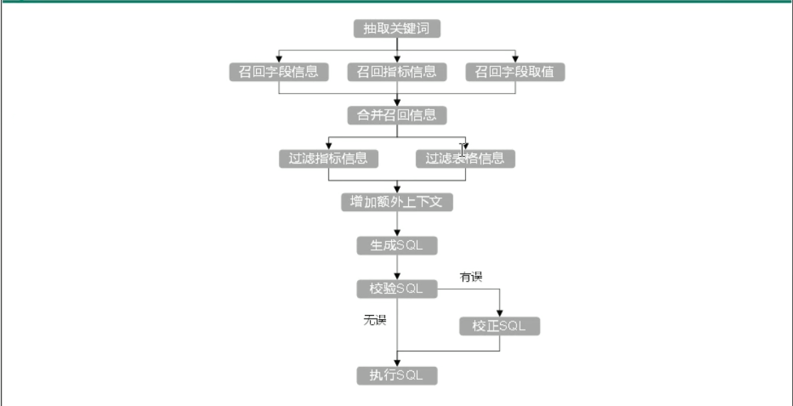
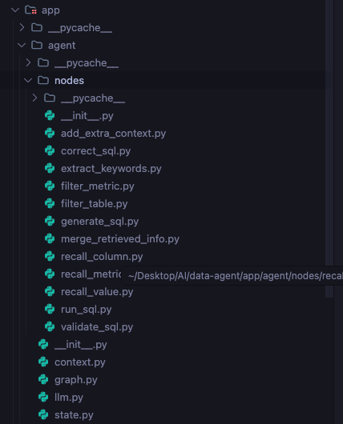

# Data Agent 全代码级执行流程与架构知识大全

作为开发者，我们不能只停留在概念层面。为了让你彻底掌握这套基于 **LangGraph** 的数据智能体（Data Agent）架构，本文将把**所有核心流程的完整源代码**、**核心依赖函数**全部公开，并在代码内部加上极其详尽的保姆级注释。

---

## 对应流程图以及项目结构





## 流水线基石：State (状态) 与 Context (上下文)

在 LangGraph 架构中，数据在节点间传递靠 `State`，全局共享的数据库连接靠 `Context`。

### 1. State（状态）：流水线上的“档案袋”
所有节点（工人）都不自己保存数据，而是从 `State`（档案袋）里拿数据，处理完再塞回 `State` 里传给下一个节点。

**📄 完整代码 (`app/agent/state.py`)**：
```python
import sys, os
sys.path.insert(0, os.path.dirname(os.path.dirname(os.path.dirname(os.path.abspath(__file__)))))
from typing import TypedDict
from app.entities.value_info import ValueInfo
from app.entities.metric_info import MetricInfo
from app.entities.column_info import ColumnInfo

# --- 下面是各个子状态模块的类型定义 ---
class ColumnInfoState(TypedDict):
    name: str           # 列名 (如 order_amount)
    type: str           # 数据类型 (如 decimal)
    role: str           # 角色 (如 dimension/measure)
    examples: list      # 枚举值示例
    description: str    # 字段描述
    alias: list[str]    # 别名 (如 订单金额)

class TableInfoState(TypedDict):
    name: str           # 表名 (如 fact_order)
    role: str           # 角色 (如 fact/dim)
    description: str    # 表描述
    columns: list[ColumnInfoState] # 包含的列集合

class MetricInfoState(TypedDict):
    name: str           # 指标名 (如 GMV)
    description: str    # 指标计算口径描述
    relevant_columns: list[str] # 该指标依赖的物理列列表
    alias: list[str]    # 指标别名

class DateInfoState(TypedDict):
    date: str           # 物理时间 (如 2026-05-20)
    weekday: str        # 星期几
    quarter: str        # 季度 (如 Q2)

class DBInfoState(TypedDict):
    version: str        # 数据库版本
    dialect: str        # 数据库方言 (如 mysql)

# --- 核心：整个 Agent 运行时流转的全局状态树 ---
class DataAgentState(TypedDict):
    query: str                  # [起点] 用户输入的原始自然语言问题
    error: str | None           # [防错] 数据库 SQL 执行失败时的错误日志
    keywords: list[str] | None  # [检索用] 大模型扩展后的搜索关键词
    
    # [召回阶段数据] 从向量库、ES库粗筛出来的原始对象
    retrived_column_infos: list[ColumnInfo]
    retrived_metric_infos: list[MetricInfo]
    retrived_value_infos: list[ValueInfo]
    
    # [过滤阶段数据] 经过大模型精简后，真正留给后续生成 SQL 的纯净 Schema
    table_infos: list[TableInfoState]
    metric_infos: list[MetricInfoState]
    
    # [环境数据] 注入物理时间和底层数据库方言
    date_info: DateInfoState
    db_info: DBInfoState
    
    # [终局产物] 最终生成的、可执行的 SQL 语句
    sql: str | None
```

### 2. Context（上下文）：车间里的“共享工具箱”
不能把沉重的数据库连接池放在档案袋里传递，我们需要一个静态的上下文容器。

**📄 完整代码 (`app/agent/context.py`)**：
```python
import sys, os
sys.path.insert(0, os.path.dirname(os.path.dirname(os.path.dirname(os.path.abspath(__file__)))))
from typing import TypedDict
from app.clients.embedding_client_manager import EmbeddingClientManager
from app.repositories.qdrant.column_qdrant_repository import ColumnQdrantRepository
from app.repositories.qdrant.metric_qdrant_repository import MetricQdrantRepository
from app.repositories.es.value_es_repository import ValueESRepository
from app.repositories.mysql.meta.meta_mysql_repository import MetaMySQLRepository
from app.repositories.mysql.dw.dw_mysql_repositor import DWMySQLRepository

class DataAgentContext(TypedDict):
    # 将文字转成向量的工具，用于后续搜索
    embedding_client: EmbeddingClientManager  
    # 向量数据库操作类（负责查列和查指标）
    column_qdrant_repository: ColumnQdrantRepository 
    metric_qdrant_repository: MetricQdrantRepository
    # 全文搜索引擎操作类（负责查枚举值）
    value_es_repository: ValueESRepository    
    # 元数据仓库（里面存放着主外键关系，表结构信息）
    meta_mysql_repository: MetaMySQLRepository 
    # 真实数据仓库（用来做 EXPLAIN 校验和最终的执行查数）
    dw_mysql_repository: DWMySQLRepository     
```

---

## 一、主干网络：Graph 有向无环图编排

有了托盘和工具箱，我们需要搭建传送带（Edges），规定这 10 个工人（Nodes）的先后工作顺序。

**📄 完整代码 (`app/agent/graph.py` 核心部分)**：
```python
from langgraph.constants import START, END
from langgraph.graph import StateGraph
# ... 引入所有的节点模块和状态模块 ...

# 1. 实例化图构造器，声明使用哪个 State 和 Context
graph_builder = StateGraph(state_schema=DataAgentState, context_schema=DataAgentContext)

# 2. 核心路由函数：校验失败自动退回重做
def validate_sql_result_condition(state: DataAgentState) -> str:
    """根据 validate_sql 节点中存入 state['error'] 的结果决定下一步"""
    # 如果没有 error (None)，说明校验完美通过，走 run_sql 分支去执行
    # 如果有 error (异常栈)，说明写错了，走 correct_sql 分支回去让大模型订正
    return "run_sql" if state["error"] is None else "correct_sql"

# 3. 把所有的工序节点添加到工厂大名单里
graph_builder.add_node("extract_keywords", extract_keywords)
graph_builder.add_node("recall_column", recall_column)
graph_builder.add_node("recall_value", recall_value)
graph_builder.add_node("recall_metric", recall_metric)
graph_builder.add_node("merge_retrieved_info", merge_retrieved_info)
graph_builder.add_node("filter_metric", filter_metric)
graph_builder.add_node("filter_table", filter_table)
graph_builder.add_node("add_extra_context", add_extra_context)
graph_builder.add_node("generate_sql", generate_sql)
graph_builder.add_node("validate_sql", validate_sql)
graph_builder.add_node("correct_sql", correct_sql)
graph_builder.add_node("run_sql", run_sql)

# 4. 定义图的边（工作流向）
# [起始] -> 提词
graph_builder.add_edge(START, "extract_keywords")

# 【多路并发设计】提词后，同时分发给三路大军去召回
graph_builder.add_edge("extract_keywords", "recall_column")
graph_builder.add_edge("extract_keywords", "recall_value")
graph_builder.add_edge("extract_keywords", "recall_metric")

# 等三支大军全部执行完毕后，汇聚到一个节点合并情报
graph_builder.add_edge("recall_column", "merge_retrieved_info")
graph_builder.add_edge("recall_value", "merge_retrieved_info")
graph_builder.add_edge("recall_metric", "merge_retrieved_info")

# 情报合并后，丢给大模型做两路精准过滤裁剪
graph_builder.add_edge("merge_retrieved_info", "filter_metric")
graph_builder.add_edge("merge_retrieved_info", "filter_table")

# 过滤完的纯净版 Schema 送去注入物理环境时间
graph_builder.add_edge("filter_metric", "add_extra_context")
graph_builder.add_edge("filter_table", "add_extra_context")

# 开始生成 SQL，然后送去验证
graph_builder.add_edge("add_extra_context", "generate_sql")
graph_builder.add_edge("generate_sql", "validate_sql")

# 【条件路由边】根据 error 是否为 None 决定生死
graph_builder.add_conditional_edges(
    "validate_sql", 
    validate_sql_result_condition, # 路由判断函数
    ["correct_sql", "run_sql"]     # 可能的分支走向
)

# 如果进了纠错房，纠错出来后重新去跑 SQL
graph_builder.add_edge("correct_sql", "run_sql")

# 跑完 SQL，流程彻底结束
graph_builder.add_edge("run_sql", END)

# 5. 编译成可执行的 Agent 实例
data_agent_graph = graph_builder.compile()
```

---

## 二、十步工作流节点完整代码拆解

### 第1步：提取关键词 (`extract_keywords.py`)
利用 NLP 中文分词库，把用户的口水话精炼为高密度搜索词。

**📄 完整代码**：
```python
import sys, os
sys.path.insert(0, os.path.dirname(os.path.dirname(os.path.dirname(os.path.abspath(__file__)))))
from langgraph.runtime import Runtime
from app.agent.context import DataAgentContext
from app.agent.state import DataAgentState
from app.core.log import logger
import jieba.analyse

async def extract_keywords(state: DataAgentState, runtime: Runtime[DataAgentContext]) -> DataAgentState:
    write = runtime.stream_writer
    write('抽取关键词')
    
    query = state["query"]
    
    # 对查询进行分词，【只提取指定词性的词】。
    # 把诸如 "的"、"了"、"帮我" 等废话去掉，提高后续向量检索的纯度。
    allow_pos = (
        "n",   # 名词: 数据、服务器、表格
        "nr",  # 人名: 张三、李四
        "ns",  # 地名: 北京、上海
        "nt",  # 机构团体名: 政府、学校、某公司
        "nz",  # 其他专有名词: Unicode、哈希算法、诺贝尔奖
        "v",   # 动词: 运行、开发
        "vn",  # 名动词: 工作、研究
        "a",   # 形容词: 美丽、快速
        "an",  # 名形词: 难度、合法性、复杂度
        "eng", # 英文
        "i",   # 成语
        "l",   # 常用固定短语
    )

    # 提取高权重标签
    keywords = jieba.analyse.extract_tags(query, allowPOS=allow_pos)
    # 为了兜底，把用户原话也加进去
    keywords = list(set(keywords + [query]))
    
    logger.info(f"原始关键词: {query}->抽取关键词: {keywords}")

    # 将提取出的关键词放回全局状态 State 中
    return {"keywords": keywords}
```

---

### 第2步：多路并发召回（以 `recall_column.py` 为例）
大模型辅助扩充近义词 + Qdrant 向量检索。`recall_metric` 和 `recall_value` 代码结构与此高度一致。

**📄 完整代码**：
```python
from app.entities.column_info import ColumnInfo
from langchain_core.output_parsers import JsonOutputParser
from app.agent.llm import model
from app.prompt.prompt_loader import load_prompt
from langchain_core.prompts.prompt import PromptTemplate
import sys, os
sys.path.insert(0, os.path.dirname(os.path.dirname(os.path.dirname(os.path.abspath(__file__)))))
from langgraph.runtime import Runtime
from app.agent.context import DataAgentContext
from app.agent.state import DataAgentState

async def recall_column(state: DataAgentState, runtime: Runtime[DataAgentContext]) -> DataAgentState:
    write = runtime.stream_writer
    write('召回字段信息')

    keywords = state['keywords']
    query = state['query']
    
    # 1. 从运行时 Context 里拉取需要的工具
    column_qdrant_repository = runtime.context["column_qdrant_repository"]
    embedding_client = runtime.context["embedding_client"]

    # 2. 借助 LLM 扩展关键词（如用户搜“销量”，大模型给补充个“销售总额”）
    prompt = PromptTemplate(
        input_variables=['query'],
        template=load_prompt('extend_keywords_for_column_recall')
    )
    outparse = JsonOutputParser()
    chain = prompt | model | outparse
    
    # 发送给大模型进行扩展推理
    extend_keywords = await chain.ainvoke({"query": query})
    # 去重并且合并关键词 (大模型补充的词 + jieba分词的词)
    keywords = set(extend_keywords + keywords)

    column_info_map: dict[str, ColumnInfo] = {}
    
    # 3. 借助向量检索引擎查询关键词对应的列信息
    for keywork in keywords:
        # 把文字转为数字向量
        embedding = await embedding_client.embed(keywork)
        # 去 Qdrant 查相关度最高的列
        current_cloumn_infos: list[ColumnInfo] = await column_qdrant_repository.search(embedding)
        
        # 将搜回来的列放到 Map 中，防止重复
        for columb_info in current_cloumn_infos:
            if columb_info.id not in column_info_map:
                column_info_map[columb_info.id] = columb_info

    retrived_column_infos: list[ColumnInfo] = list(column_info_map.values())

    # 把搜回来的列信息放回全局 State
    return {"retrived_column_infos": retrived_column_infos}
```

---

### 第3步：知识融合与增强 (`merge_retrieved_info.py`)
这一步不仅是简单的合并，更重要的是去 MySQL 里查主外键给后续环节兜底。

**📄 完整代码**：
```python
from app.agent.state import MetricInfoState, ColumnInfoState, TableInfoState
from app.entities.table_info import TableInfo
from app.entities.column_info import ColumnInfo
import sys, os
sys.path.insert(0, os.path.dirname(os.path.dirname(os.path.dirname(os.path.abspath(__file__)))))
from langgraph.runtime import Runtime
from app.agent.context import DataAgentContext
from app.agent.state import DataAgentState
from app.core.log import logger

async def merge_retrieved_info(state: DataAgentState, runtime: Runtime[DataAgentContext]) -> DataAgentState:
    write = runtime.stream_writer
    write('合并召回信息')

    retrieved_columns = state["retrived_column_infos"]
    retrieved_values = state["retrived_value_infos"]
    retrieved_metrics = state["retrived_metric_infos"]

    meta_mysql_repository = runtime.context["meta_mysql_repository"]

    # 1. 初始化列信息 Map，便于后续快速查找
    retrieved_columns_map: dict[str, ColumnInfo] = {
        col.id: col for col in retrieved_columns
    }

    # 2. 如果找出的指标依赖了某些物理字段，而这些字段没被向量搜到，立刻补齐！
    for metric in retrieved_metrics:
        for col_id in metric.relevant_columns:
            if col_id not in retrieved_columns_map:
                # 依赖倒查
                column_info = await meta_mysql_repository.get_column_info_by_id(col_id)
                retrieved_columns_map[col_id] = column_info

    # 3. 将值信息塞回到它对应的物理字段的示例 (examples) 里
    for retrieved_value in retrieved_values:
        column_id = retrieved_value.column_id
        column_value = retrieved_value.value

        if column_id not in retrieved_columns_map:
            column_info = await meta_mysql_repository.get_column_info_by_id(column_id)
            retrieved_columns_map[column_id] = column_info
        
        if column_value not in retrieved_columns_map[column_id].examples:
            retrieved_columns_map[column_id].examples.append(column_value)

    # 4. 把所有平铺的列，按照所属的表进行分组打包 (table_id -> columns)
    table_to_columns_map: dict[str, list[ColumnInfo]] = {}
    for column_info in retrieved_columns_map.values():
        table_id = column_info.table_id
        if table_id not in table_to_columns_map:
            table_to_columns_map[table_id] = []
        table_to_columns_map[table_id].append(column_info)

    # 5. 【极其关键】显式的添加每个表的主外键！
    # 这是防止大模型在 JOIN 连表时瞎编外键的终极杀招。
    for table_id in table_to_columns_map.keys():
        # 从真实 MySQL 元数据中查询该表的主外键
        key_columns = await meta_mysql_repository.get_key_columns_by_table_id(table_id)   
        column_ids = [column.id for column in table_to_columns_map[table_id]]

        # 把没搜出来的主外键，强制添加到表的上下文中
        for key_column in key_columns:
            if key_column.id not in column_ids:
                table_to_columns_map[table_id].append(key_column)
       
    # 6. 将处理好的数据转换为 TypedDict 标准状态格式
    table_infos: list[TableInfoState] = []
    for table_id, columns in table_to_columns_map.items():
        table: TableInfo = await meta_mysql_repository.get_table_info_by_id(table_id)
        columns_state = [
            ColumnInfoState(name=c.name, type=c.type, role=c.role, examples=c.examples,
                            description=c.description, alias=c.alias) for c in columns
        ]
        table_infos.append(TableInfoState(name=table.name, role=table.role, 
                                          description=table.description, columns=columns_state))        

    metric_infos = [
        MetricInfoState(name=m.name, description=m.description,
                        relevant_columns=m.relevant_columns, alias=m.alias)
        for m in retrieved_metrics
    ]

    return {"table_infos": table_infos, "metric_infos": metric_infos}
```

---

### 第4、5步：漏斗式精准过滤（以 `filter_table.py` 为例）
大模型看一大堆垃圾表会产生幻觉，这里让大模型先做一次判断，直接物理切除无用表。

**📄 完整代码**：
```python
from app.agent.state import TableInfoState
import yaml, sys, os
sys.path.insert(0, os.path.dirname(os.path.dirname(os.path.dirname(os.path.abspath(__file__)))))
from langgraph.runtime import Runtime
from app.agent.context import DataAgentContext
from app.agent.state import DataAgentState
from langchain_core.output_parsers import JsonOutputParser
from app.agent.llm import model
from app.prompt.prompt_loader import load_prompt
from langchain_core.prompts.prompt import PromptTemplate
from app.core.log import logger

async def filter_table(state: DataAgentState, runtime: Runtime[DataAgentContext]) -> DataAgentState:
    write = runtime.stream_writer
    write('过滤表信息')
    
    query = state["query"]
    table_infos = state["table_infos"]

    try:
        # 1. 组装过滤 Prompt，问大模型这道题究竟需要哪些表？
        prompt = PromptTemplate(template=load_prompt("filter_table_info"), input_variables=["query", "table_infos"])
        output_parser = JsonOutputParser()

        chain = prompt | model | output_parser

        # 得到大模型输出的 JSON，比如：{'fact_order':['order_amount', 'region_id'], 'dim_region':['region_id', 'region_name']}
        result = await chain.ainvoke(
            {"query": query, "table_infos": yaml.dump(table_infos, allow_unicode=True, sort_keys=False)}
        )

        # 2. 利用模型输出的结果，大砍刀无情过滤原始 table_infos
        filtered_table_infos: list[TableInfoState] = []
        for table_info in table_infos:
            if table_info["name"] in result: # 如果模型认为这个表有用
                # 剔除该表中，模型认为没用的列
                table_info["columns"] = [
                    column_info for column_info in table_info["columns"] 
                    if column_info["name"] in result[table_info["name"]]
                ]
                filtered_table_infos.append(table_info)

        return {"table_infos": filtered_table_infos}
    except Exception as e:
        logger.error(f"过滤表格失败: {str(e)}")
        raise e
```

---

### 第6步：动态上下文注入 (`add_extra_context.py`)
赋予大模型底层空间感知与时间感知。

**📄 完整代码**：
```python
from app.agent.state import DBInfoState, DateInfoState
import sys, os
sys.path.insert(0, os.path.dirname(os.path.dirname(os.path.dirname(os.path.abspath(__file__)))))
from langgraph.runtime import Runtime
from app.agent.context import DataAgentContext
from app.agent.state import DataAgentState
from app.core.log import logger
from datetime import datetime

async def add_extra_context(state: DataAgentState, runtime: Runtime[DataAgentContext]) -> DataAgentState:
    write = runtime.stream_writer
    write('增加额外上下文')

    dw_mysql_repository = runtime.context["dw_mysql_repository"]

    try:
        # 1. 赋予时间观念 (解决"本月"、"上季度"之类的动态指代问题)
        today = datetime.today()
        date = today.strftime("%Y-%m-%d")
        weekday = today.strftime("%A")
        quarter = f"Q{(today.month - 1) // 3 + 1}"
        date_info = DateInfoState(date=date, weekday=weekday, quarter=quarter)

        # 2. 赋予底层环境观念 (知道自己连的是 MySQL 还是 PG，从而写出对味的函数方言)
        # 这里的 get_db_info 底层执行了 select version()
        db_info_from_mysql = await dw_mysql_repository.get_db_info()
        db_info = DBInfoState(**db_info_from_mysql)

        return {
            "date_info": date_info,
            "db_info": db_info,
        }
    except Exception as e:
        logger.error(f"添加上下文失败:{str(e)}")
        raise
```

---

### 第7步：核心生成引擎 (`generate_sql.py`)
将前面提纯出的黄金数据、规则一起喂给大模型，产出最终代码。

**📄 完整代码**：
```python
import sys, os
sys.path.insert(0, os.path.dirname(os.path.dirname(os.path.dirname(os.path.abspath(__file__)))))
from langgraph.runtime import Runtime
from app.agent.context import DataAgentContext
from app.agent.state import DataAgentState
import yaml
from langchain_core.output_parsers import StrOutputParser
from app.agent.llm import model
from app.prompt.prompt_loader import load_prompt
from langchain_core.prompts.prompt import PromptTemplate
from app.core.log import logger

async def generate_sql(state: DataAgentState, runtime: Runtime[DataAgentContext]) -> DataAgentState:
    write = runtime.stream_writer
    write('生成SQL')
   
    # 把前面 6 个节点累积在档案袋里的好货全都拿出来
    query = state["query"]
    table_infos = state["table_infos"]
    metric_infos = state["metric_infos"]
    date_info = state["date_info"]
    db_info = state["db_info"]

    try:
        # 组装超级 Prompt（内含规则：严禁给列使用中文别名）
        prompt = PromptTemplate(template=load_prompt("generate_sql"),
                                input_variables=["query", "table_infos", "metric_infos", "date_info", "db_info"])
        output_parser = StrOutputParser() # 只输出字符串代码

        chain = prompt | model | output_parser

        # 触发推理
        result = await chain.ainvoke(
            {"query": query,
             "table_infos": yaml.dump(table_infos, allow_unicode=True, sort_keys=False),
             "metric_infos": yaml.dump(metric_infos, allow_unicode=True, sort_keys=False),
             "date_info": yaml.dump(date_info, allow_unicode=True, sort_keys=False),
             "db_info": yaml.dump(db_info, allow_unicode=True, sort_keys=False)
            })

        logger.info(f"生成的SQL: {result}")
        # 将产出的 SQL 塞回状态供后续校验
        return {"sql": result}
    except Exception as e:
        logger.error(f"生成SQL失败: {str(e)}")
        raise
```

---

### 第8步：防错与预编译校验 (`validate_sql.py`) 🛡️
调用真实的数据库去验证 AI 写的代码，但绝不能产生真实查询开销。这就是引用的重要函数 `EXPLAIN` 的威力。

**📄 完整代码**：
```python
import sys, os
sys.path.insert(0, os.path.dirname(os.path.dirname(os.path.dirname(os.path.abspath(__file__)))))
from langgraph.runtime import Runtime
from app.agent.context import DataAgentContext
from app.agent.state import DataAgentState
from app.core.log import logger
from app.repositories.mysql.dw.dw_mysql_repositor import DWMySQLRepository

async def validate_sql(state: DataAgentState, runtime: Runtime[DataAgentContext]) -> DataAgentState:
    write = runtime.stream_writer
    write('校验SQL')
    
    dw_mysql_repository: DWMySQLRepository = runtime.context["dw_mysql_repository"]
    sql = state["sql"]

    try:
        # 调用核心引用函数 validateSql
        # 它的底层源码是：await self.session.execute(text(f"EXPLAIN {sql}"))
        # EXPLAIN 会在 1 毫秒内帮我们把拼写错误、不存在的表全部抓出来
        await dw_mysql_repository.validateSql(sql)
        
        # 如果没有异常，说明语法和表结构都对！
        logger.info(f"SQL验证成功: {sql}")
        return {"error": None}
    except Exception as e:
        # 如果 MySQL 说有错，比如 "Table 'dw.abc' doesn't exist"
        # 捕捉这句红字，塞回档案袋，等下给大模型看
        logger.error(f"SQL验证失败: {sql}")
        return {"error": str(e)}
```

👉 **补充关键引用函数实现 (`app/repositories/mysql/dw/dw_mysql_repositor.py`)**：
```python
    # 零成本探测 SQL 语法的核心杀招！
    async def validateSql(self, sql: str):
        await self.session.execute(text(f"EXPLAIN {sql}"))
```

---

### 第9步：自我反思与闭环 (`correct_sql.py`) 🔄
如果在上个节点挂了，Graph 会自动路由到这里。大模型看着老师（MySQL）打的叉，反思重做。

**📄 完整代码**：
```python
import sys, os
sys.path.insert(0, os.path.dirname(os.path.dirname(os.path.dirname(os.path.abspath(__file__)))))
from langgraph.runtime import Runtime
from app.agent.context import DataAgentContext
from app.agent.state import DataAgentState
import yaml
from langchain_core.output_parsers import StrOutputParser
from app.agent.llm import model
from app.prompt.prompt_loader import load_prompt
from langchain_core.prompts.prompt import PromptTemplate
from app.core.log import logger

async def correct_sql(state: DataAgentState, runtime: Runtime[DataAgentContext]) -> DataAgentState:
    write = runtime.stream_writer
    write('校正SQL')
   
    sql = state["sql"]
    error = state["error"]  # 这里面装的就是刚才抓下来的 MySQL 报错！

    # 把当初生成的素材原样拿出来
    query = state["query"]
    table_infos = state["table_infos"]
    metric_infos = state["metric_infos"]
    date_info = state["date_info"]
    db_info = state["db_info"]

    try:
        prompt = PromptTemplate(template=load_prompt("correct_sql"), input_variables=["query", "metric_infos"])
        output_parser = StrOutputParser()

        chain = prompt | model | output_parser

        # 【纠错精髓】不仅给原题，还要把写错的作业 (sql) 和老师批示 (error) 都交进去
        result = await chain.ainvoke(
            {"query": query,
             "table_infos": yaml.dump(table_infos, allow_unicode=True, sort_keys=False),
             "metric_infos": yaml.dump(metric_infos, allow_unicode=True, sort_keys=False),
             "date_info": yaml.dump(date_info, allow_unicode=True, sort_keys=False),
             "db_info": yaml.dump(db_info, allow_unicode=True, sort_keys=False),
             "sql": sql,
             "error": error
            })
            
        logger.info(f"校正后的SQL: {result}")
        # 输出正确的答案，覆盖掉旧的状态
        return {"sql": result}
    except Exception as e:
        logger.error(f"校正SQL失败:{str(e)}")
        raise
```

---

### 第10步：终局执行 (`run_sql.py`)
经历过千难万险验证后的 SQL，最终真刀真枪下场查业务数据。

**📄 完整代码**：
```python
import sys, os
sys.path.insert(0, os.path.dirname(os.path.dirname(os.path.dirname(os.path.abspath(__file__)))))
from langgraph.runtime import Runtime
from app.agent.context import DataAgentContext
from app.agent.state import DataAgentState
from app.core.log import logger

async def run_sql(state: DataAgentState, runtime: Runtime[DataAgentContext]) -> DataAgentState:
    write = runtime.stream_writer
    write('执行SQL')
    
    sql = state["sql"]
    dw_mysql_repository = runtime.context["dw_mysql_repository"]

    try:
        # 调用核心引用函数 execute_sql 去拉取真实数据
        result = await dw_mysql_repository.execute_sql(sql)

        # 把结果以 JSON 格式向业务流写入
        write({"type": "result", "data": result})
        logger.info(f"执行SQL结果: {result}")

    except Exception as e:
        logger.error(f"执行SQL失败:{str(e)}")
        raise
```

👉 **补充关键引用函数实现 (`app/repositories/mysql/dw/dw_mysql_repositor.py`)**：
```python
    # 将游标读取为标准 API JSON 返回的核心方法
    async def execute_sql(self, sql: str):
        # 执行刚才生成的绝对安全的 SQL
        result = await self.session.execute(text(sql))
        # 格式化映射为 List[Dict] (如 [{"地区":"华南", "GMV": 8848}])
        return [dict(row) for row in result.mappings().fetchall()]
```

---


