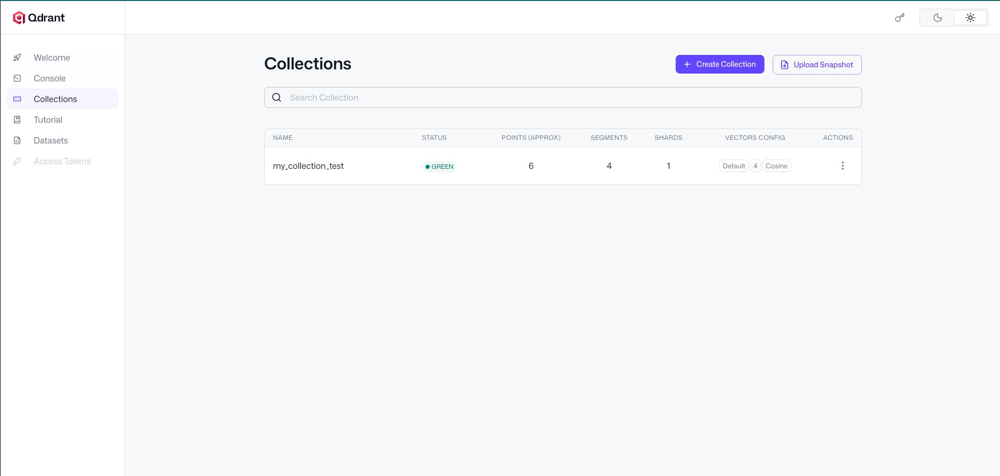

# Qdrant 向量数据库学习文档


## 访问方式


启动 Qdrant 服务后，打开浏览器访问
```text
http://localhost:6333/dashboard
```



## 一、完整代码注释版(异步)

```python
"""
Qdrant 向量数据库异步操作完整示例
核心知识点都已标注在代码注释中
"""

import sys
import os

# ========== 知识点1: Python路径管理 ==========
# 将项目根目录添加到Python搜索路径，解决模块导入问题
# __file__: 当前文件路径
# os.path.abspath: 获取绝对路径
# os.path.dirname: 获取父目录（调用3次回到项目根目录）
sys.path.insert(0, os.path.dirname(os.path.dirname(os.path.dirname(os.path.abspath(__file__)))))

from qdrant_client import AsyncQdrantClient, models
import asyncio
import numpy as np
from app.conf.app_config import QdrantConfig, app_config


# ========== 知识点2: 客户端管理器设计模式 ==========
class QdrantClientManager:
    """
    客户端管理器 - 单例模式思想
    作用: 避免重复创建连接，统一管理生命周期
    """
    def __init__(self, config: QdrantConfig):
        self.client: AsyncQdrantClient | None = None  # Python 3.10+ 类型注解
        self.config: QdrantConfig = config

    def _get_url(self):
        """构造连接URL"""
        return f"http://{self.config.host}:{self.config.port}"

    def init(self):
        """初始化异步客户端 - 注意这里是同步方法"""
        self.client = AsyncQdrantClient(url=self._get_url())

    async def close(self):
        """异步关闭连接 - 必须调用，否则资源泄漏"""
        await self.client.close()


# 全局单例实例
qdrant_client_manager = QdrantClientManager(app_config.qdrant)


# ========== 知识点3: 向量数据库核心操作 ==========
async def main():
    """
    演示 Qdrant 的三大核心操作:
    1. 创建集合 (Collection) - 类似传统数据库的"表"
    2. 插入数据 (Upsert) - Update + Insert 的合并操作
    3. 相似度查询 (Query) - 向量数据库的核心价值
    """

    # 步骤1: 初始化连接
    qdrant_client_manager.init()
    print("✅ 已连接到 Qdrant 服务器")

    # ========== 知识点4: Collection 管理 ==========
    # collection_exists: 检查集合是否存在（幂等性设计）
    if not await qdrant_client_manager.client.collection_exists("my_collection_test"):
        # create_collection: 创建集合时必须指定向量配置
        await qdrant_client_manager.client.create_collection(
            collection_name="my_collection_test",
            vectors_config=models.VectorParams(
                size=4,                          # 向量维度 - 必须与数据匹配
                distance=models.Distance.COSINE  # 相似度算法 - 影响搜索结果
            ),
        )
        print("📁 已创建新集合")

    # ========== 知识点5: Upsert 操作详解 ==========
    # upsert = update + insert
    # - 如果 point id 不存在: 插入新数据
    # - 如果 point id 已存在: 覆盖更新（不是追加！）
    await qdrant_client_manager.client.upsert(
        collection_name="my_collection_test",
        points=[
            # PointStruct 结构: id(唯一标识) + vector(向量数据) + payload(元数据)
            models.PointStruct(id=1, vector=[0.05, 0.61, 0.76, 0.74], payload={"city": "Berlin"}),
            models.PointStruct(id=2, vector=[0.19, 0.81, 0.75, 0.11], payload={"city": "London"}),
            models.PointStruct(id=3, vector=[0.36, 0.55, 0.47, 0.94], payload={"city": "Moscow"}),
            models.PointStruct(id=4, vector=[0.18, 0.01, 0.85, 0.80], payload={"city": "New York"}),
            models.PointStruct(id=5, vector=[0.24, 0.18, 0.22, 0.44], payload={"city": "Beijing"}),
            models.PointStruct(id=6, vector=[0.35, 0.08, 0.11, 0.44], payload={"city": "Mumbai"}),
        ],
    )
    print("📝 已插入/更新 6 个城市数据")

    # ========== 知识点6: 相似度查询 ==========
    # query_points: 根据向量找最相似的数据
    # 工作原理: 计算查询向量与集合中所有向量的"距离"，返回最近的N个
    res = await qdrant_client_manager.client.query_points(
        collection_name="my_collection_test",
        query=[0.1, 0.2, 0.3, 0.4],  # 查询向量 - 代表我们想要找的"特征"
        limit=3,                       # 返回最相似的3个结果
        # with_payload=True,           # 可选: 是否返回元数据
    )

    # 打印结果
    print("\n🔍 查询结果（最相似的3个城市）:")
    for idx, point in enumerate(res.points, 1):
        # point.score: 相似度分数，越高越相似
        # point.payload: 元数据（因为我们没设置with_payload，这里可能为空）
        # point.id: 数据唯一标识
        print(f"  {idx}. ID={point.id}, 相似度={point.score:.4f}")

    # 步骤4: 关闭连接
    await qdrant_client_manager.close()
    print("\n🔌 已关闭连接")


if __name__ == "__main__":
    # asyncio.run(): Python异步入口，负责管理事件循环
    asyncio.run(main())
```

---

## 二、重要知识点深度解析

### 📌 知识点1: Upsert 的行为细节

**官方描述**: Upsert 操作会检查每个点的ID，如果ID存在则更新该点的向量和payload，如果不存在则插入新点。

**生活比喻** 🎯: Upsert 就像用便签纸记笔记:
- 新的标题(ID): 贴一张新便签(插入)
- 已有的标题: 撕掉旧的，贴上新的(覆盖更新)
- **不是**: 在旧内容后面追加(这是很多人的误解!)

```python
# 示例演示 Upsert 行为
async def demo_upsert_behavior():
    # 第一次运行: 插入 id=1 的数据
    await client.upsert(
        collection_name="test",
        points=[models.PointStruct(id=1, vector=[1, 2, 3], payload={"value": "A"})]
    )
    # 结果: 集合中有 1 条数据
    
    # 第二次运行: 同样的 id=1，不同内容
    await client.upsert(
        collection_name="test",
        points=[models.PointStruct(id=1, vector=[9, 9, 9], payload={"value": "B"})]
    )
    # 结果: 仍然是 1 条数据，内容被替换为 B
    # ⚠️ 不会变成 2 条数据！
```

### 📌 知识点2: 向量维度的匹配

**官方描述**: 创建集合时指定的 `size` 必须与后续插入的所有向量的长度完全一致，否则会抛出维度不匹配错误。

**生活比喻**: 向量维度就像停车位的尺寸:
- 你画了 4 米长的车位(size=4)
- 就必须停 4 米长的车(向量长度=4)
- 3 米或 5 米的车都停不进去 ❌

```python
# 错误示例
await client.create_collection(
    "my_collection",
    vectors_config=models.VectorParams(size=4, ...)  # 声明4维
)
# 插入5维向量 → 报错！
await client.upsert(
    "my_collection",
    points=[models.PointStruct(id=1, vector=[0.1, 0.2, 0.3, 0.4, 0.5])]  # 5维
)
# ❌ 错误: Wrong input: Vector dimension error: expected 4, got 5
```

### 📌 知识点3: 相似度算法的选择

```python
# Qdrant 支持的三种距离算法
models.Distance.COSINE    # 余弦相似度 - 推荐入门使用
models.Distance.EUCLID    # 欧氏距离
models.Distance.DOT       # 点积

# 选择指南
"""
场景              推荐算法        原因
文本相似度        COSINE        关注向量方向，不关心长度
图像特征          EUCLID        关注绝对位置差异
推荐系统          DOT           适合已归一化的向量
快速验证          COSINE        最通用，效果稳定
"""
```

### 📌 知识点4: 异步客户端的正确使用

```python
# ✅ 正确使用方式
async def correct_usage():
    client = AsyncQdrantClient(url="http://localhost:6333")
    try:
        result = await client.query_points(...)
    finally:
        await client.close()  # 必须关闭！

# ❌ 常见错误1: 忘记 await
async def wrong1():
    client = AsyncQdrantClient(url="...")
    result = client.query_points(...)  # 缺少 await，拿到的是协程对象，不是结果

# ❌ 常见错误2: 忘记关闭连接
async def wrong2():
    client = AsyncQdrantClient(url="...")
    result = await client.query_points(...)
    # 没有 client.close() → 连接泄漏

# ❌ 常见错误3: 在同步函数中使用 await
def wrong3():
    client = AsyncQdrantClient(url="...")
    result = await client.query_points(...)  # SyntaxError!
```

---

## 三、Qdrant 简介与文档指引

### 什么是 Qdrant？

**官方定位**: Qdrant 是一个用 Rust 编写的开源向量数据库，专注于高性能和高可靠性的向量相似度搜索。

**核心特点**:
| 特性 | 说明 |
|------|------|
| 🚀 高性能 | Rust 编写，内存高效 |
| 🔍 丰富的过滤 | 支持多种数据类型的过滤条件 |
| 🐍 原生 Python 支持 | 提供同步/异步两种客户端 |
| ☁️ 云原生 | 支持 Docker、K8s 部署 |
| 📊 分布式 | 支持水平扩展 |

### 本次使用的异步连接说明

```python
# 异步 vs 同步客户端的区别
from qdrant_client import QdrantClient           # 同步版本
from qdrant_client import AsyncQdrantClient      # 异步版本

# 同步版本 - 简单直接，会阻塞等待
client = QdrantClient(url="http://localhost:6333")
result = client.query_points(...)  # 代码会停在这里等结果

# 异步版本 - 不阻塞，适合高并发
client = AsyncQdrantClient(url="http://localhost:6333")
result = await client.query_points(...)  # 等待期间可以干别的事
```

**什么时候用异步？**
- Web 应用 (FastAPI、Sanic 等)
- 需要同时处理多个请求
- 微服务架构

**什么时候用同步？**
- 数据处理的脚本
- Jupyter Notebook
- 学习/原型验证

### 📚 官方文档导航

| 需求 | 链接 |
|------|------|
| 快速开始 | https://qdrant.tech/documentation/quick-start/ |
| Python SDK 文档 | https://qdrant.tech/documentation/sdk/python/ |
| API 参考 | https://api.qdrant.tech/ |
| 异步客户端 | https://qdrant.tech/documentation/sdk/python/#async-client |
| 距离算法详解 | https://qdrant.tech/documentation/concepts/indexing/#vector-similarity |

### 本地启动 Qdrant 服务器

```bash
# 方式1: Docker 运行（推荐）
docker run -p 6333:6333 qdrant/qdrant

# 方式2: 本地安装运行
qdrant

# 验证是否启动成功
curl http://localhost:6333
# 返回 {"title":"qdrant - vector search engine","version":"xxx"}
```

---

## 四、快速参考卡片

```yaml
核心概念:
  Collection: 表
  Point: 行（id + vector + payload）
  Vector: 特征数据（浮点数列表）
  Payload: 元数据（JSON格式）

关键操作:
  create_collection: 建表（需指定维度和距离算法）
  upsert: 插入或更新（覆盖策略）
  query_points: 相似度搜索（返回按相似度排序）

常见错误:
  - 维度不匹配
  - 忘记 await
  - 忘记关闭连接
  - asyncio.run() 嵌套调用

设计模式:
  - 客户端管理器（连接复用）
  - 单例模式（全局唯一实例）
```

---
