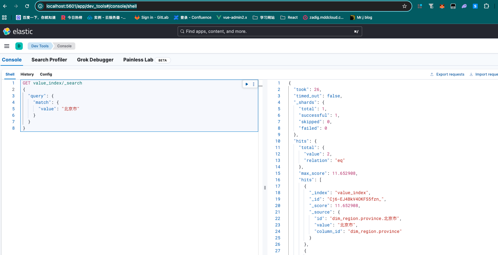

# 全文索引构建(核心)

## 一、什么是全文索引？

**官方描述**：全文索引是一种将文本拆分为单词（分词），并建立“词项-文档”倒排索引的技术。通过倒排索引，系统可以极快地根据关键词定位到原始数据。

**生活比喻**：想象你有一本巨厚的中药百科全书。向量索引像是按“功效”分类（如：补气类、清热类），而全文索引就像是书后的**药名索引表**。如果你想找包含“枸杞”的所有方子，你直接查索引表就能看到它出现在第10、58、120页，而不需要从头读完整本书。

---

## 二、为什么需要全文索引？

在 Text-to-SQL 场景中，用户经常会输入具体的**业务取值**（如“帮我查一下**周杰伦**的订单”）。

| 需求场景 | 向量索引 (Qdrant) | 全文索引 (Elasticsearch) |
|------|-------------------|-------------------------|
| **搜索目标** | 字段的含义（Schema） | 字段里的具体值（Data） |
| **匹配方式** | 语义相近（如“金额”匹配“amount”） | 关键词匹配（如“北京”匹配“北京市”） |
| **核心作用** | 找到正确的**表和列** | 确定 SQL 语句中 `WHERE` 后的**过滤值** |

---

## 三、整体架构设计

### 3.1 架构图

```
┌─────────────────────────────────────────────────────┐
│                   MetaKnowledgeService              │
│                     (知识构建服务)                    │
└─────────────────────────────────────────────────────┘
                          │
        ┌─────────────────┼─────────────────┐
        ▼                 ▼                 ▼
┌──────────────┐  ┌──────────────┐  ┌──────────────┐
│DwMySQL       │  │ValueInfo     │  │ValueES       │
│Repository    │  │Entity        │  │Repository    │
│(数据源)       │  │(内存实体)     │  │(全文存储)     │
└──────────────┘  └──────────────┘  └──────────────┘
                                              │
                                              ▼
                                    ┌──────────────┐
                                    │ES Server     │
                                    │(IK分词插件)   │
                                    └──────────────┘
```

---

## 四、同步全流程

### 4.1 流程图

```
步骤1                   步骤2                   步骤3                  步骤4
DW查询 ──────────→ 实体组装 ──────────→ 索引检查 ──────────→ 批量入库
(数据提取)             (ValueInfo)            (Mappings)             (Bulk Upsert)
```

### 4.2 步骤详解

#### 1. DW数据提取
根据配置（`column.sync=true`），从业务库中提取维度字段的唯一值（Distinct）。
```sql
SELECT DISTINCT customer_name FROM dim_customer LIMIT 100000;
```

#### 2. 实体组装
将每一条取值封装为 `ValueInfo` 对象，建立“值”到“列ID”的映射关系。
```python
value_info = ValueInfo(
    id="dim_customer.customer_name.周杰伦",
    value="周杰伦",
    column_id="dim_customer.customer_name"
)
```

#### 3. 索引检查与 Mapping 配置
这是最关键的一步，必须配置 **中文分词器 (IK)**，否则“搜索‘北京’无法匹配‘北京市’”。
```json
{
  "properties": {
    "value": {
      "type": "text",
      "analyzer": "ik_max_word",       // 存储时最细粒度切分
      "search_analyzer": "ik_smart"    // 搜索时智能切分
    }
  }
}
```

#### 4. 批量入库 (Bulk)
为了保证效率，不使用逐条插入，而是使用 ES 的 `_bulk` 接口进行分批处理。

---

## 五、核心代码实现

### 5.1 ValueESRepository (全文存储层)

```python
class ValueESRepository:
    index_name = "value_index"
    
    # 核心：定义 IK 分词器 Mapping
    index_mappings = {
        "properties": {
            "id": {"type": "keyword"},
            "value": {"type": "text", "analyzer": "ik_max_word"},
            "column_id": {"type": "keyword"}
        }
    }

    async def ensure_index(self):
        """初始化索引，确保 IK 分词器配置生效"""
        if not await self.client.indices.exists(index=self.index_name):
            await self.client.indices.create(
                index=self.index_name,
                mappings=self.index_mappings
            )
            
    async def upsert(self, points: list[ValueInfo], batch_size: int = 500):
        """高效批量写入"""
        for i in range(0, len(points), batch_size):
            batch = points[i:i+batch_size]
            operations = []
            for p in batch:
                operations.append({"index": {"_index": self.index_name}})
                operations.append(asdict(p))
            await self.client.bulk(operations=operations)
```

### 5.2 业务构建逻辑 (Service层)

```python
# 遍历所有配置的表和字段
for table in meta_config.tables:
    for column in table.columns:
        if column.sync:  # 仅同步标记为需要同步的字段
            print(f"🔍 正在提取字段取值: {table.name}.{column.name}")
            values = await self.dw_mysql_repository.get_column_values(
                table.name, column.name, limit=100000
            )
            # 组装入库实体...
```

---

## 六、检索验证 (闭环应用)

全文索引建立后，Text-to-SQL 引擎如何使用它？

1. **用户提问**：“帮我统计**杭州**分公司的业绩。”
2. **提取关键词**：系统提取出“杭州”。
3. **ES 搜索**：
   ```json
   GET /value_index/_search
   { "query": { "match": { "value": "杭州" } } }
   ```
4. **结果召回**：
    - 匹配值：`"杭州"`
    - 所属列：`"dim_shop.city_name"`
5. **SQL 生成**：系统得知该值属于 `city_name` 列，生成的 SQL 自动包含：`WHERE city_name = '杭州'`。


### 6.1 存储结构 (Mapping)

关键在于配置 ik_max_word 分词器，使中文检索具备模糊匹配和分词能力。

```json
{
  "properties": {
    "id": { "type": "keyword" },
    "value": { 
      "type": "text", 
      "analyzer": "ik_max_word", 
      "search_analyzer": "ik_smart" 
    },
    "column_id": { "type": "keyword" }
  }
}
```

### 6.2 数据实体 (ValueInfo)

```python
@dataclass
class ValueInfo:
    id: str         # 唯一标识 (table.column.value)
    value: str      # 真实的维度取值
    column_id: str  # 所属字段 ID
```


数据同步完成后，可以通过以下几种方式验证索引是否正确构建。

### 6.3 基础统计 (验证数据是否入库)

检查索引中的文档总数。

```bash
# 终端执行
curl -X GET "localhost:9200/_cat/indices/value_index?v"
```

指标：docs.count 应该等于你同步的维度取值总数。

### 6.4 关键词检索测试 (Kibana / Dev Tools)

本地服务工具后台: http://localhost:5601/app/dev_tools#/console/shell




这是最常用的检索测试方法。注意：查询字段名必须是 value。

```json
# 在 Kibana Dev Tools 执行
GET value_index/_search
{
  "query": {
    "match": {
      "value": "北京市"
    }
  }
}
```

### 6.5 模糊匹配测试

验证 IK 分词器是否生效。搜索"北京"应该能召回"北京市"。

```json
GET value_index/_search
{
  "query": {
    "match": {
      "value": "北京"
    }
  }
}
```

### 6.6 分词效果分析

直接查看 ES 是如何拆分你的文本的。

```json
POST value_index/_analyze
{
  "analyzer": "ik_max_word",
  "text": "杭州马云"
}
```

### 6.7 常见问题排查 (Troubleshooting)

| 现象 | 可能原因 | 解决方法 |
|------|---------|----------|
| docs.count 为 0 | 同步脚本未成功运行或 sync: true 未配置 | 检查 meta_config.yaml 确认字段已开启同步 |
| 搜索结果为空 | 查询字段写错（如写成了 name） | 确保查询 value 字段 |
| 搜索"北京"搜不到"北京市" | IK 插件未安装或索引创建时未指定 analyzer | 1. 检查插件：_cat/plugins；2. 重建索引并指定 Mapping |
| 写入速度极慢 | batch_size 过小 | 建议将 batch_size 设置为 500-1000 之间 |


---

## 七、最佳实践与避坑指南

| 常见问题 | 解决方案 |
|------|------|
| **搜不到数据** | 检查 ES 是否安装了 `analysis-ik` 插件，Mapping 是否正确应用。 |
| **同步速度慢** | 1. 调大 `batch_size` (推荐 500-1000)；2. 只同步高频过滤的维度字段。 |
| **内存溢出** | `get_column_values` 必须加 `LIMIT`，避免一次性加载数百万行数据。 |
| **数据重复** | 使用 `SELECT DISTINCT` 保证入库数据的唯一性，减小索引体积。 |

---

## 八、总结对比

| 维度 | 向量索引 (Qdrant) | 全文索引 (Elasticsearch) |
|------|-------------------|-------------------------|
| **技术本质** | 高维向量空间距离计算 | 倒排索引关键词匹配 |
| **优势** | 理解语义（同义词、意图） | 精确匹配、模糊短语搜索 |
| **在本系统地位** | 决定 SQL 的 **结构** (SELECT/JOIN) | 决定 SQL 的 **条件** (WHERE) |

两者结合，构成了 Data-Agent 的“语义理解层”，让模型既懂数据库的“表”，又懂数据库里的“数”。
