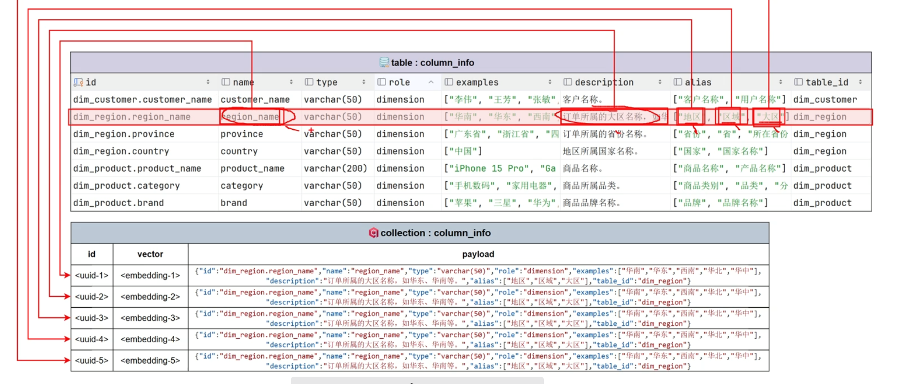
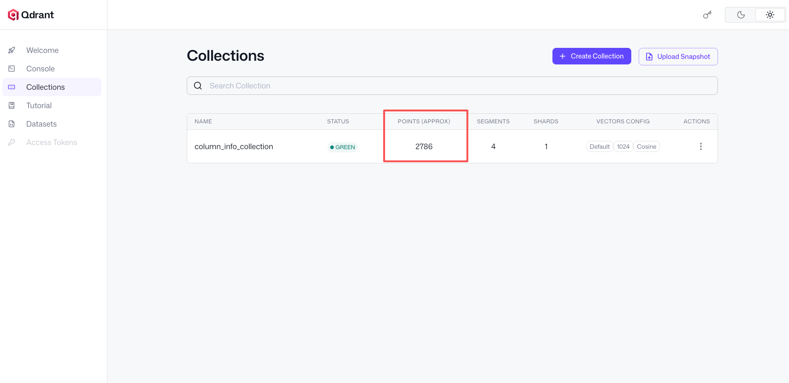

# 向量索引构建(核心)

## 一、什么是向量索引？

**官方描述**：向量索引是将非结构化数据（文本、图像等）通过嵌入模型转换为高维空间中的向量，并建立高效检索结构的技术。

**生活比喻**：想象你在整理一个巨大的图书馆。传统索引像是按书名首字母排序，而向量索引就像是根据书的“含义”把它们放在一个多维空间中——相似主题的书会彼此靠近。当你问“讲友谊的书”时，系统能找到所有内容相近的书，哪怕它们的书名完全不同。

---

## 二、为什么需要向量索引？

| 场景 | 传统方法 | 向量索引方法 |
|------|----------|--------------|
| 搜索“红色的车” | 只能匹配包含这些词的内容 | 能找到“红色汽车”“红轿车”等语义相近的结果 |
| 字段描述模糊 | 精确匹配失败 | 基于语义相似度找到相关字段 |

---

## 三、整体架构设计

### 3.1 架构图

```
┌─────────────────────────────────────────────────────┐
│                   MetaKnowledgeService              │
│                     (知识构建服务)                    │
└─────────────────────────────────────────────────────┘
                          │
        ┌─────────────────┼─────────────────┐
        ▼                 ▼                 ▼
┌──────────────┐  ┌──────────────┐  ┌──────────────┐
│MetaMySQL     │  │DwMySQL       │  │ColumnQdrant  │
│Repository    │  │Repository    │  │Repository    │
│(元数据源)     │  │(数据仓库源)   │  │(向量存储)     │
└──────────────┘  └──────────────┘  └──────────────┘
                                              │
                                              ▼
                                    ┌──────────────┐
                                    │Embedding     │
                                    │Client        │
                                    │(向量化服务)   │
                                    └──────────────┘
```

### 3.2 数据源说明

| 数据源 | 存储内容 | 在本流程中的作用 |
|--------|----------|------------------|
| **MetaMySQL** | 字段元数据（字段名、描述、别名等） | 向量索引的**核心数据源** |
| **DwMySQL** | 数据仓库业务数据 | 可选的补充数据源 |

---

## 四、转换全流程（5个节点详解）

```
节点1                     节点2                     节点3                    节点4                   节点5
MetaMySQL ──────────→ Points构建 ──────────→ 文本提取 ──────────→ 向量化 ──────────→ Qdrant存储
(column_info)         (数据增强)              (待向量化文本)        (浮点数向量)         (可检索索引)
```

### 4.1 节点1：MetaMySQL原始数据

转换目标:



**表结构**：
```sql
CREATE TABLE column_info (
    id VARCHAR(64) PRIMARY KEY,
    name VARCHAR(100),           -- 字段名
    type VARCHAR(50),            -- 数据类型
    role VARCHAR(20),            -- primary_key/foreign_key/dimension/measure
    examples JSON,               -- 示例数据
    description TEXT,            -- 字段描述
    alias JSON,                  -- 别名列表
    table_id VARCHAR(64)         -- 所属表
);
```

**示例数据**：
```json
[
  {
    "id": "col_001",
    "name": "customer_id",
    "type": "varchar(20)",
    "role": "primary_key",
    "examples": ["C001", "C002", "C003"],
    "description": "客户唯一标识",
    "alias": ["客户编号", "客户ID", "会员卡号"],
    "table_id": "dim_customer"
  },
  {
    "id": "col_002", 
    "name": "order_amount",
    "type": "float",
    "role": "measure",
    "examples": [8999.0, 6999.0, 125.0],
    "description": "订单金额",
    "alias": ["金额", "销售金额", "交易额"],
    "table_id": "fact_order"
  }
]
```

### 4.2 节点2：Points构建（数据增强）

**核心逻辑**：1条 column_info → (1 + 1 + len(alias)) 个Points

```python
points = []

# 处理 customer_id (3个别名 → 5个points)
points.append({
    "id": "point_001",
    "embedding_text": "customer_id",      # 入口1：字段名
    "payload": {"name": "customer_id", "type": "varchar(20)", "description": "客户唯一标识", "table_id": "dim_customer"}
})
points.append({
    "id": "point_002",
    "embedding_text": "客户唯一标识",      # 入口2：字段描述
    "payload": {"name": "customer_id", "type": "varchar(20)", "description": "客户唯一标识", "table_id": "dim_customer"}
})
points.append({
    "id": "point_003",
    "embedding_text": "客户编号",          # 入口3：别名1
    "payload": {"name": "customer_id", "type": "varchar(20)", "description": "客户唯一标识", "table_id": "dim_customer"}
})
points.append({
    "id": "point_004",
    "embedding_text": "客户ID",           # 入口4：别名2
    "payload": {"name": "customer_id", "type": "varchar(20)", "description": "客户唯一标识", "table_id": "dim_customer"}
})
points.append({
    "id": "point_005",
    "embedding_text": "会员卡号",          # 入口5：别名3
    "payload": {"name": "customer_id", "type": "varchar(20)", "description": "客户唯一标识", "table_id": "dim_customer"}
})

# 处理 order_amount (3个别名 → 5个points)
points.append({
    "id": "point_006",
    "embedding_text": "order_amount",
    "payload": {"name": "order_amount", "type": "float", "description": "订单金额", "table_id": "fact_order"}
})
# ... 省略其余4个points
```

**设计原理**：一个业务字段（如`customer_id`）可能被不同用户用不同方式描述（“用户ID”“账户编号”“会员卡号”）。通过为每个描述方式建立独立向量入口，系统能从多个角度检索到同一个字段。

### 4.3 节点3：文本提取

```python
embedding_texts = [p["embedding_text"] for p in points]
```

**输出**：
```python
[
    "customer_id", "客户唯一标识", "客户编号", "客户ID", "会员卡号",
    "order_amount", "订单金额", "金额", "销售金额", "交易额"
]
```

### 4.4 节点4：向量化（文本 → 向量）

**生活比喻**：每个文本被映射到一个高维空间中的坐标点。语义相似的文本（如"客户ID"和"会员卡号"）会落在彼此附近的位置。

```python
embeddings = await embedding_client.aembed_documents(embedding_texts)
```

**向量化输出**（简化为4维演示，实际为1536维）：

```python
[
    # customer_id 语义簇（向量距离相近）
    [0.123, -0.456, 0.789, -0.234],  # "customer_id"
    [0.118, -0.451, 0.785, -0.229],  # "客户唯一标识"
    [0.121, -0.453, 0.787, -0.231],  # "客户编号"
    [0.120, -0.454, 0.786, -0.230],  # "客户ID"
    [0.119, -0.455, 0.788, -0.232],  # "会员卡号"
    
    # order_amount 语义簇（向量距离相近）
    [0.876, 0.234, -0.123, 0.567],   # "order_amount"
    [0.879, 0.231, -0.120, 0.564],   # "订单金额"
    [0.877, 0.233, -0.122, 0.566],   # "金额"
    [0.878, 0.232, -0.121, 0.565],   # "销售金额"
    [0.880, 0.230, -0.119, 0.568]    # "交易额"
]
```

### 4.5 节点5：Qdrant存储

```python
await column_qdrant_repository.upsert(
    ids=[p["id"] for p in points],
    embeddings=embeddings,
    payloads=[p["payload"] for p in points]
)
```

**Qdrant内部存储结构**：
```json
{
  "collection_name": "column_embeddings",
  "points": [
    {
      "id": "point_001",
      "vector": [0.123, -0.456, 0.789, -0.234, ...],
      "payload": {
        "name": "customer_id",
        "type": "varchar(20)",
        "description": "客户唯一标识",
        "table_id": "dim_customer"
      }
    },
    {
      "id": "point_005", 
      "vector": [0.119, -0.455, 0.788, -0.232, ...],
      "payload": {
        "name": "customer_id",
        "type": "varchar(20)",
        "description": "客户唯一标识",
        "table_id": "dim_customer"
      }
    }
  ]
}
```

---

## 五、转换前后对照表

| 节点 | 数据位置 | 数据形态 | 数量变化 | 关键操作 |
|------|----------|----------|----------|----------|
| **节点1** | MetaMySQL | 结构化表记录 | 2条 | SELECT查询 |
| **节点2** | 内存 | Points字典列表 | 2→10条 | 1对N数据增强 |
| **节点3** | 内存 | 文本列表 | 10条 | 字段提取 |
| **节点4** | Embedding API | 1536维浮点数列表 | 10个向量 | HTTP调用 |
| **节点5** | Qdrant | Point对象 | 10个 | Upsert操作 |

---

## 六、核心组件代码实现

### 6.1 ColumnQdrantRepository（向量存储层）

```python
class ColumnQdrantRepository:
    """Qdrant向量数据库操作封装"""
    
    def __init__(self, client):
        self.client = client
        self.collection_name = "column_embeddings"
    
    async def ensure_collection(self):
        """确保集合存在（自动建表）"""
        if not await self.client.collection_exists(self.collection_name):
            await self.client.create_collection(
                collection_name=self.collection_name,
                vectors_config=models.VectorParams(
                    size=app_config.qdrant.embedding_size,  # 向量维度
                    distance=models.Distance.COSINE,        # 余弦相似度
                )
            )
    
    async def upsert(self, ids: List[str], embeddings: List[List[float]], 
                     payloads: List[dict], batch_size: int = 10):
        """批量插入或更新向量数据"""
        points = [models.PointStruct(id=id, vector=emb, payload=payload) 
                  for id, emb, payload in zip(ids, embeddings, payloads)]
        
        for i in range(0, len(points), batch_size):
            await self.client.upsert(
                collection_name=self.collection_name,
                points=points[i:i+batch_size],
                wait=True
            )
            logger.info(f"Successfully upserted {len(points)} points")
```

**关键点**：
- `COSINE`距离适合文本相似度计算
- 批量操作（`batch_size`）避免单次请求过大

### 6.2 完整构建流程

```python
async def build(config_path: Path):
    """构建向量索引的主流程"""
    # 1. 初始化所有连接
    meta_mysql_client_manager.init()
    dw_mysql_client_manager.init()
    qdrant_client_manager.init()
    emb_client_manager.init()
    
    async with meta_mysql_client_manager.session_maker() as meta_session:
        async with dw_mysql_client_manager.session_maker() as dw_session:
            # 2. 初始化各个Repository
            meta_repo = MetaMySQLRepository(meta_session)
            dw_repo = DwMySQLRepository(dw_session)
            qdrant_repo = ColumnQdrantRepository(qdrant_client_manager.client)
            emb_client = emb_client_manager.client
            
            # 3. 执行构建
            service = MetaKnowledgeService(
                meta_mysql_repository=meta_repo,
                dw_mysql_repository=dw_repo,
                column_qdrant_repository=qdrant_repo,
                embedding_client=emb_client
            )
            await service.build(config_path)
    
    # 4. 清理资源
    await meta_mysql_client_manager.close()
    await dw_mysql_client_manager.close()
    await qdrant_client_manager.close()
    logger.info('Building done')
```

### 6.3 批量向量化处理

```python
# 分批调用embedding API，避免超时或限流
embeddings: List[List[float]] = []
embedding_texts = [point['embedding_text'] for point in points]
embedding_batch_size = 20

for i in range(0, len(embedding_texts), embedding_batch_size):
    batch_texts = embedding_texts[i:i + embedding_batch_size]
    try:
        batch_embeddings = await self.embedding_client.aembed_documents(batch_texts)
        embeddings.extend(batch_embeddings)
        logger.debug(f"Processed batch {i//embedding_batch_size + 1}")
    except Exception as e:
        logger.error(f"Failed to embed batch {i//embedding_batch_size + 1}: {e}")
        raise  # 单批失败应整体中断
```

---

## 七、检索验证（完整闭环）

查看Qdrant是否有写入

Qdrant服务后台:http://localhost:6333/dashboard#/collections




```python
async def search_columns(query: str, top_k: int = 10):
    """根据自然语言查询检索相关字段"""
    # 1. 将查询向量化
    query_embedding = await embedding_client.aembed_query(query)
    
    # 2. 在Qdrant中搜索
    results = await qdrant_repo.client.search(
        collection_name="column_embeddings",
        query_vector=query_embedding,
        limit=top_k,
    )
    
    # 3. 返回结果（包含payload中的原始字段信息）
    return [hit.payload for hit in results]

# 使用示例
query = "我想找客户的唯一标识字段"
results = await search_columns(query)

# 预期输出
# 相似度: 0.9876, 字段: customer_id, 描述: 客户唯一标识
# 相似度: 0.9213, 字段: customer_id, 描述: 客户唯一标识  # 同字段的不同入口
```

---

## 八、最佳实践总结

| 要点 | 建议 |
|------|------|
| 向量维度 | 根据模型选择（如OpenAI text-embedding-3-small为1536维） |
| 相似度算法 | 文本场景优先用`COSINE` |
| 批量大小 | embedding API：10-50；Qdrant upsert：50-200 |
| 错误处理 | 单批失败应整体中断（避免数据不完整） |
| 资源管理 | 使用`async with`确保连接正确关闭 |
| 数据增强 | 字段名+描述+别名，每个入口独立建向量 |

---

## 九、常见问题

**Q1：为什么要从MetaMySQL读取，而不是DwMySQL？**

A：MetaMySQL存储的是**字段元数据**（字段名、类型、描述、别名），这才是构建语义索引需要的“文本描述”。DwMySQL存储的是**实际业务数据**（如具体金额、日期值），不适合直接作为文本来源。

**Q2：一个字段建多个向量入口，会不会浪费存储？**

A：这是典型的**存储换召回率**策略。虽然存储量增加（每个字段3-5倍），但检索时能从多个语义角度命中同一字段，显著提升召回率。

**Q3：为什么用COSINE距离而不是欧氏距离？**

A：文本语义相似度本质上是**方向相似性**而非绝对距离。两个向量即使长度不同，只要方向一致（如"客户ID"和"customer_id"的缩放版本），COSINE距离依然接近1，更适合文本场景。
