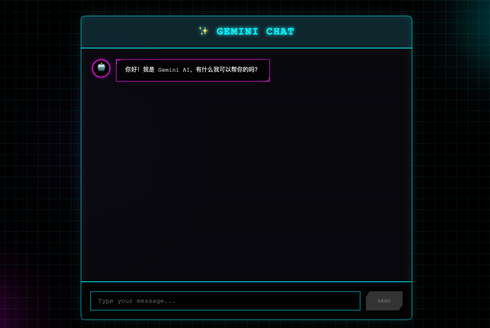

#  用AI做一个AI(AI Chat App)

## 前言
前些天在跟朋友聊天的时候说了调用Ai这个问题,其实发现很简单,其实就是调用一个AI的SDK,对前端来说就是调用一个接口的问题,那为什么我不尝试做一个呢,所以就有了这个项目

## 项目成果
[项目访问地址](https://ai-chat-seven-inky.vercel.app/) 访问不成功的话你可能需要🪜

[github仓库](https://github.com/jerryq1/ai_chat) 



## 1. 项目结构与技术栈

### 技术栈 (Tech Stack)
* **核心框架**: [Next.js 16.1.3](https://nextjs.org/) (极速响应与服务端渲染能力)
* **前端库**: React 19 (Hooks 驱动的状态管理)
* **样式方案**: Vanilla CSS (自定义 Sci-Fi/Cyberpunk 设计系统)
* **AI 引擎**: Google Gemini 2.5 Flash (通过 `@google/generative-ai` SDK)
* **基础设施**:
    * **版本控制**: Git / GitHub
    * **自动化流水线**: GitHub Actions (构建测试)
    * **部署平台**: Vercel (Serverless 云环境)

```text
PS:为什么不用直接把AIKey放在前端,这样就可以不需要使用Serverless了,主要是一个安全问题,本来我是想过直接通过wasm保存起来
```

### 项目目录结构
```text
ai_chat_app/
├── .github/workflows/   # CI/CD 自动化流水线配置
├── src/
│   ├── pages/
│   │   ├── api/
│   │   │   └── chat.js  # 后端接口：负责与 Gemini 通信
│   │   └── index.js      # 前端 UI：对话框、科幻视觉效果
│   └── styles/
│       └── globals.css  # 全局样式：定义科幻色调与网格动画
├── .env.local           # 环境变量（存放 API Key）
├── package.json         # 项目依赖与引擎版本配置
└── README.md            # 项目基础说明
```

---

## 2. 整个项目的运行链路

整个系统遵循标准的 **"前端 -> 服务器 (Serverless) -> 第三方 AI 服务"** 链路：

1.  **用户交互**: 用户在 `index.js` 的终端界面输入消息并点击 "EXECUTE"。
2.  **API 请求**: 前端通过 `fetch` 调用本地路径 `/api/chat`。
3.  **身份验证与调用**:
    *   `chat.js` (Serverless Function) 运行在 Vercel 侧。
    *   它从服务器环境变量中读取 `GEMINI_API_KEY`。
    *   使用 SDK 将消息发送给 Google Gemini 服务器。
4.  **回复解析**: `chat.js` 接收到 AI 生成的文本后，将其重新封装为 JSON 返回给前端。
5.  **UI 更新**: 前端 React 组件收到回复，更新 `messages` 状态数组，并触发自动滚动及科幻打字效果。

### chat.js代码 (Serverless边缘函数)
```javascript

import { GoogleGenerativeAI } from "@google/generative-ai";

export default async function handler(req, res) {
  if (req.method !== 'POST') {
    return res.status(405).json({ message: 'Method not allowed' });
  }

  const { message } = req.body;

  if (!message) {
    return res.status(400).json({ message: 'Message is required' });
  }

  const apiKey = process.env.GEMINI_API_KEY;

  if (!apiKey) {
    return res.status(500).json({
      error: 'API Key not configured',
      message: 'Please set GEMINI_API_KEY in environment variables.'
    });
  }

  try {
    const genAI = new GoogleGenerativeAI(apiKey);
    const model = genAI.getGenerativeModel({ model: "gemini-2.5-flash" });

    const result = await model.generateContent(message);
    const response = await result.response;
    const text = response.text();

    res.status(200).json({ reply: text });
  } catch (error) {
    console.error('Error calling Gemini API:', error);
    res.status(500).json({ message: 'Error generating response', error: error.message });
  }
}

```
---

## 3. 难点与容易出问题的地方

在开发过程中，我们遇到了几个典型的技术挑战，值得在后续项目中关注：

### 1) 环境版本兼容性 (Node.js Version)
*   **问题**: Next.js 16 及以上版本强制要求 **Node.js 20.x**。
*   **坑点**: 默认的 GitHub Actions 或旧版 Vercel 配置可能会使用 Node 18，导致 `npm run build` 报错。
*   **对策**: 在 `package.json` 中配置 `"engines": { "node": ">=20.0.0" }` 以及更新 `.github/workflows/ci.yml`。

### 2) 自动化部署同步 (Vercel & Git)
*   **问题**: 当我们在本地删除了 `.git` 文件夹并重新初始化（为了修复权限或清理历史）后，GitHub 仓库的 ID 会变化。
*   **坑点**: Vercel 的 Webhook 是基于旧仓库链接的。这会导致“GitHub 显示推送成功，但 Vercel 网站不更新”。
*   **对策**: 需要去 Vercel 的项目设置中 **Disconnect** 之后再重新 **Connect** Git 仓库，或者直接删除项目重新导入。

### 3) Serverless 环境变量安全
*   **问题**: API Key 不能写在代码里。
*   **坑点**: 很多初学者会在本地 `.env.local` 设置好，但部署到 Vercel 后忘了在 Dashboard 的 **Settings -> Environment Variables** 重新配置。
*   **对策**: 必须在云端面板手动补充 Secret。


### 4) Git 邮箱配置不匹配 (Git Email Configuration)
*   **问题**: 本地 Git 设置的 `user.email` 与 GitHub 账号绑定的邮箱不一致。
*   **坑点**: 这可能导致提交记录无法正确关联到你的 GitHub 用户。虽然代码能推送成功，但在某些权限配置下，这会干扰到 Vercel 的 Webhook 检测，导致构建无法自动触发。
*   **对策**: 使用 `git config user.email "your-email@example.com"` 确保本地配置与 GitHub 侧一致。

---

