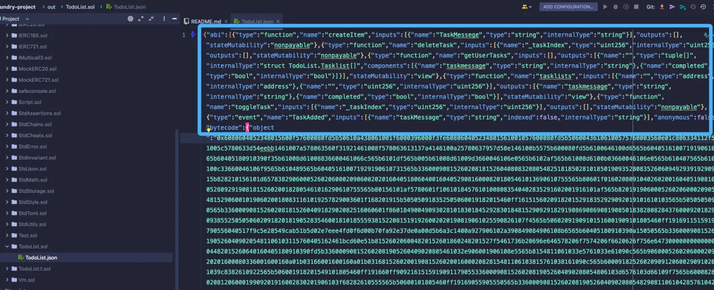

# ForgeScript：使用脚本部署与验证

## 概述
通过 `forge create` 命令进行合约的部署&验证需要输入的参数较多，更推荐的做法是使用 **solidity-scripting**（一种使用 Solidity 以声明方式部署合约的方法，而非 Javascript）。

---

## 项目配置
我们准备将上节的 `MyToken` 合约部署到 Sepolia 测试网，需对 Foundry 项目进行以下配置：

### 1. 创建 .env 文件
保存隐私信息（格式要求）：
```ini
// 区块链 RPC 节点地址
SEPOLIA_RPC_URL=xxxx
// 钱包私钥
PRIVATE_KEY=xxxx
// 区块链浏览器的 API KEY TOKEN
ETHERSCAN_API_KEY=xxxx
```

### 2. 编辑 foundry.toml 文件
在文件末尾添加：
```toml
[rpc_endpoints]
sepolia = "${SEPOLIA_RPC_URL}"

[etherscan]
sepolia = { key = "${ETHERSCAN_API_KEY}" }
```

### 3. 创建测试脚本
在项目根目录创建 `script/MyToken.s.sol` 文件：
```solidity
// SPDX-License-Identifier: UNLICENSED
pragma solidity ^0.8.25;

import {Script} from "forge-std/Script.sol";
import "../src/MyToken.sol";

contract MyTokenScript is Script {

    function run() external {
        uint256 deployer = vm.envUint("PRIVATE_KEY");

        vm.startBroadcast(deployer);
                
        MyToken myToken = new MyToken("MyToken", "MT", 18, 1000000000000000000);
        
        vm.stopBroadcast();
    }
}
```

---

## 执行部署及验证
### 执行命令
```bash
# 部署并验证合约
forge script script/MyToken.s.sol:MyTokenScript --rpc-url $SEPOLIA_RPC_URL --broadcast --verify -vvvv
```

Forge 将运行我们的脚本并为我们广播交易——这可能需要一些时间，因为 Forge 还将等待交易收据。 大约一分钟后，您应该会看到类似这样的内容，包含了合约的部署地址、gas 消耗、交易 hash 以及验证结果等：

### 输出示例
```text
1> forge script script/MyToken.s.sol:MyTokenScript --rpc-url $SEPOLIA_RPC_URL --broadcast --verify -vvvv
2
3// ...
4
5== Logs ==
6  MyToken deployed on 0xA4d3C606ad7731e5Aa0CE6D79060E7A74D7DAba0
7
8
9==========================
10
11Chain 11155111
12
13Estimated gas price: 3.000231466 gwei
14
15Estimated total gas used for script: 968059
16
17Estimated amount required: 0.002904401072744494 ETH
18
19==========================
20##
21Sending transactions [0 - 0].
22⠁ [00:00:00] [########################################################################################################################] 1/1 txes (0.0s)##
23Waiting for receipts.
24⠉ [00:00:13] [####################################################################################################################] 1/1 receipts (0.0s)
25##### sepolia
26✅  [Success]Hash: 0x3d6150e746d44665ceb845a530222c215c6cdab5ff728c352bd9d3845d73feb0
27Contract Address: 0xA4d3C606ad7731e5Aa0CE6D79060E7A74D7DAba0
28Block: 5525173
29Paid: 0.00223486014132905 ETH (744923 gas * 3.00012235 gwei)
30
31
32
33==========================
34
35ONCHAIN EXECUTION COMPLETE & SUCCESSFUL.
36Total Paid: 0.00223486014132905 ETH (744923 gas * avg 3.00012235 gwei)
37##
38Start verification for (1) contracts
39Start verifying contract `0xA4d3C606ad7731e5Aa0CE6D79060E7A74D7DAba0` deployed on sepolia
40
41Submitting verification for [src/MyToken.sol:MyToken] 0xA4d3C606ad7731e5Aa0CE6D79060E7A74D7DAba0.
42Submitted contract for verification:
43        Response: `OK`
44        GUID: `br211fmqfsf5fn7u5c1qj3pbjvsvh6i84zkhr7nru8s39kyuif`
45        URL: https://sepolia.etherscan.io/address/0xa4d3c606ad7731e5aa0ce6d79060e7a74d7daba0
46Contract verification status:
47Response: `NOTOK`
48Details: `Pending in queue`
49Contract verification status:
50Response: `OK`
51Details: `Pass - Verified`
52Contract successfully verified
53All (1) contracts were verified!
```

---

## 常见问题
### 验证失败处理
```text
Error: 
error decoding response body

Context:
- Error #0: request or response body error
- Error #1: operation timed out
```

> 注：通常验证都不成功，可以手动检测合约情况

### 生成ABI
可以在对应的.sol文件中提取


---

> **部署提示**：确保测试网账户有足够 测试币 支付 Gas 费！
