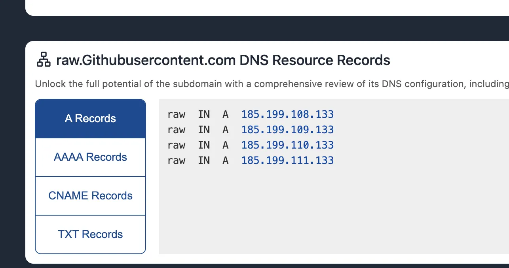
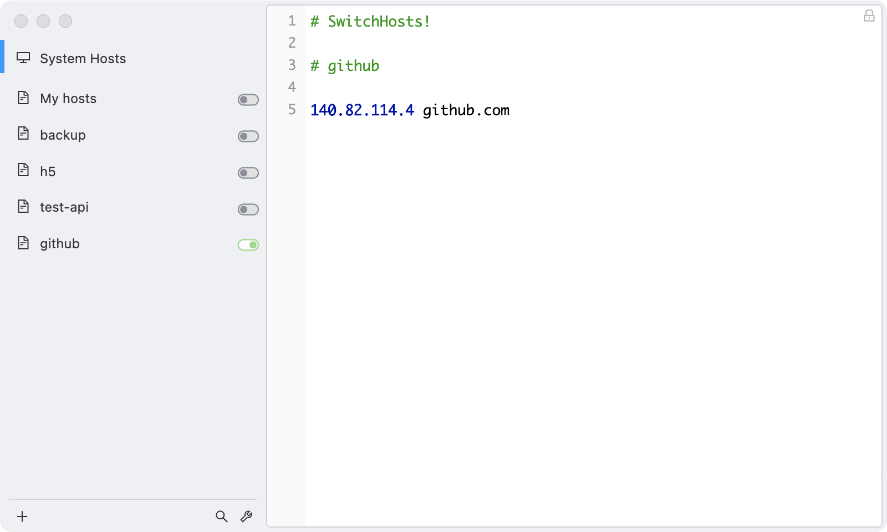

# Foundry安装及使用


Foundry 是一个 Solidity 框架，用于构建、测试、模糊、调试和部署 Solidity 智能合约。Foundry 的优势在于它将 Solidity 作为第一公民，完全使用 Solidity 进行开发与测试。如果你不太熟悉 JavaScript，使用 Foundry 是一个非常好的选择。而且，Foundry 构建、测试的执行速度非常快。

Foundry 用 Rust 语言编写，包含了一系列与 Ethereum 网络交互的工具，主要有：

- **Forge**：用于合约测试。
- **Cast**：方便与合约交互，发交易，查询链上数据。
- **Anvil**：可以模拟一个私有节点。
- **Chisel**：在命令行中快速、有效、实时地编写和测试合约。

## 使用 Foundryup 安装

Foundryup 是 Foundry 工具包的安装器，通过它我们可以安装 Foundry。首先，在终端执行以下命令：

```bash
curl -L https://foundry.paradigm.xyz | bash
```

这将下载 `foundryup`，按照提示设置环境变量或新开窗口，并通过运行它来安装 Foundry：

```bash
foundryup
```

如果遇到以下问题：`dyld: Library not loaded`，可以使用以下命令安装 `libusb`：

```bash
brew install libusb
```

安装完成后，`foundryup` 会自动安装 `forge`、`cast`、`anvil`、`chisel` 等工具。可以通过如下命令验证是否安装成功：

```bash
forge --version
```

这会显示 Forge 的版本号，确认 Forge 是否已成功安装。

## 可能遇到的问题

### 1. 无法访问地址 `raw.githubusercontent.com/`

如果遇到无法访问 `raw.githubusercontent.com/` 的问题，可以尝试更改节点，修改 hosts 文件。 



#### 方法一：

```js
1.打开网站: `https://www.ipaddress.com/`
查询一下 `raw.githubusercontent.com`对应的IP 地址

2.修改host文件
运行 sudo vim /etc/hosts 后,你可能会看到如下内容:
127.0.0.1   localhost
127.0.1.1   your-hostname

添加下面地址
185.199.111.133 raw.githubusercontent.com
```

然后重新加载配置文件：

```bash
    source ~/.bashrc
```

#### 方法二:使用SwitchHosts



