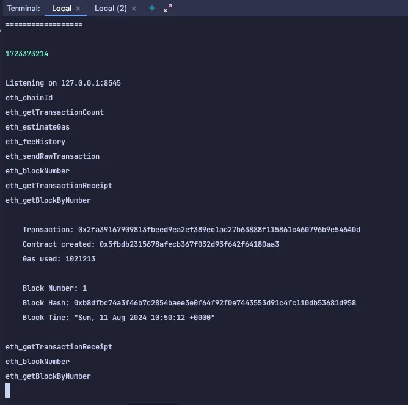

# 实战4:使用forge编译部署合约

## 4.1 编译合约

### 编译合约

上节课我们已经完成 NFT 合约的编写。这节课我们要开始学习编译 NFT 合约，请直接运行：

```bash
forge build
```

由于测试文件没有正确配置，我们可能会遇到类似下面的错误提示：

```
[⠢] Compiling...
[⠒] Compiling 26 files with 0.8.20
[⠘] Solc 0.8.20 finished in 2.38s
Compiler run successful with warnings:
Warning (3420): Source file does not specify required compiler version! Consider adding "pragma solidity ^0.8.20;"
--> test/Counter.t.sol
```

遇到这个问题，我们只需要暂时把 `test/Counter.t.sol` 文件的所有代码注释，再重新运行 `forge build` 即可。

如果提示如下信息，那恭喜你，项目已经编译成功：

```
[⠆] Compiling...
No files changed, compilation skipped
```

下节课，我们将一起学习如何部署合约。

## 4.2 部署合约

### 部署合约

上节课我们已经完成 NFT 合约的编译。这节课开始，我们要学习部署 NFT 合约到链上，请先运行前面课程讲过的 `anvil` 工具，它用来启动我们的测试环境：

```bash
anvil
```

如果运行成功，我们将得到测试环境下的 `Available Accounts`、`Private Keys` 和测试环境 URL `127.0.0.1:8545`。

```
Available Accounts
==================

(0) 0xf39Fd6e51aad88F6F4ce6aB8827279cffFb92266 (10000.000000000000000000 ETH)
(1) 0x70997970C51812dc3A010C7d01b50e0d17dc79C8 (10000.000000000000000000 ETH)
(2) 0x3C44CdDdB6a900fa2b585dd299e03d12FA4293BC (10000.000000000000000000 ETH)
(3) 0x90F79bf6EB2c4f870365E785982E1f101E93b906 (10000.000000000000000000 ETH)
(4) 0x15d34AAf54267DB7D7c367839AAf71A00a2C6A65 (10000.000000000000000000 ETH)
(5) 0x9965507D1a55bcC2695C58ba16FB37d819B0A4dc (10000.000000000000000000 ETH)
(6) 0x976EA74026E726554dB657fA54763abd0C3a0aa9 (10000.000000000000000000 ETH)
(7) 0x14dC79964da2C08b23698B3D3cc7Ca32193d9955 (10000.000000000000000000 ETH)
(8) 0x23618e81E3f5cdF7f54C3d65f7FBc0aBf5B21E8f (10000.000000000000000000 ETH)
(9) 0xa0Ee7A142d267C1f36714E4a8F75612F20a79720 (10000.000000000000000000 ETH)

Private Keys
==================

(0) 0xac0974bec39a17e36ba4a6b4d238ff944bacb478cbed5efcae784d7bf4f2ff80
(1) 0x59c6995e998f97a5a0044966f0945389dc9e86dae88c7a8412f4603b6b78690d
(2) 0x5de4111afa1a4b94908f83103eb1f1706367c2e68ca870fc3fb9a804cdab365a
(3) 0x7c852118294e51e653712a81e05800f419141751be58f605c371e15141b007a6
(4) 0x47e179ec197488593b187f80a00eb0da91f1b9d0b13f8733639f19c30a34926a
(5) 0x8b3a350cf5c34c9194ca85829a2df0ec3153be0318b5e2d3348e872092edffba
(6) 0x92db14e403b83dfe3df233f83dfa3a0d7096f21ca9b0d6d6b8d88b2b4ec1564e
(7) 0x4bbbf85ce3377467afe5d46f804f221813b2bb87f24d81f60f1fcdbf7cbf4356
(8) 0xdbda1821b80551c9d65939329250298aa3472ba22feea921c0cf5d620ea67b97
(9) 0x2a871d0798f97d79848a013d4936a73bf4cc922c825d33c1cf7073dff6d409c6

Wallet
==================
Mnemonic:          test test test test test test test test test test test junk
Derivation path:   m/44'/60'/0'/0/


Chain ID
==================

31337

Base Fee
==================

1000000000

Gas Limit
==================

30000000

Genesis Timestamp
==================

1723368943

Listening on 127.0.0.1:8545
```

### 配置环境变量

要使用 Forge 部署我们编译好的合约，我们必须为 RPC 端点和我们要用于部署的私钥设置环境变量（钱包私钥从 `anvil` 提供的 `Private Keys` 选择一个即可）。

在项目根目录添加 `.env` 文件，添加环境变量：

```
RPC_URL=http://127.0.0.1:8545/
PRIVATE_KEY=0xac0974bec39a17e36ba4a6b4d238ff944bacb478cbed5efcae784d7bf4f2ff80
```

加载 `.env` 文件中的变量（非常重要否则无法识别 URL）：

```bash
source .env
```

### 部署合约

开启另外一个终端执行：
- 第一个终端用于开启 `anvil` 本地服务
- 第二个终端执行指令

设置完成后，我们就可以通过运行以下命令，同时将相关构造函数参数添加到 NFT 合约来使用 Forge 部署您的 NFT：

```bash
forge create NFT --rpc-url=$RPC_URL --private-key=$PRIVATE_KEY --constructor-args <name> <symbol>
```

需要手动输入 `name` 和 `symbol` 的值。

如果部署成功，您将看到部署钱包的地址、合约地址以及交易哈希打印到第二个终端：

```
Deployer: 0xf39Fd6e51aad88F6F4ce6aB8827279cffFb92266
Deployed to: 0x5FbDB2315678afecb367f032d93F642f64180aa3
Transaction hash: 0xbba9893ebc85693c9a8d9071413fc5aae5d386788c60a6114237ac4a8eb01317
```

恭喜你，项目已经部署成功，下节课，我们将一起学习如何铸造 NFT。同时你会在第一个终端看到以下信息：


