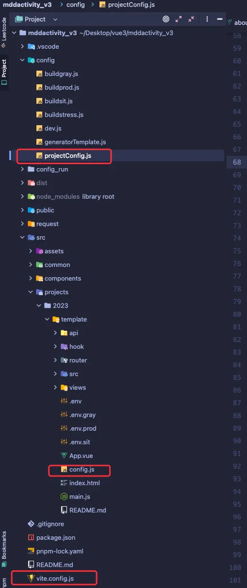
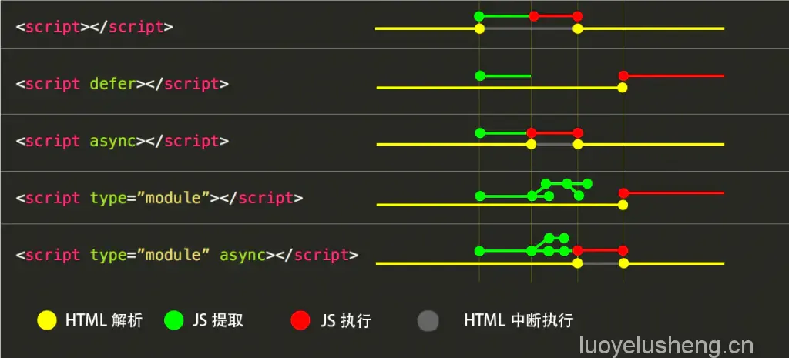
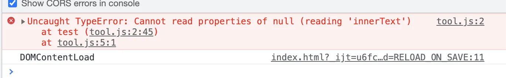
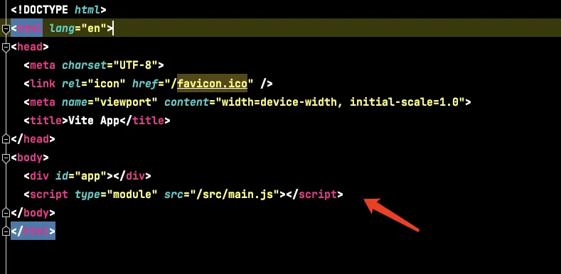
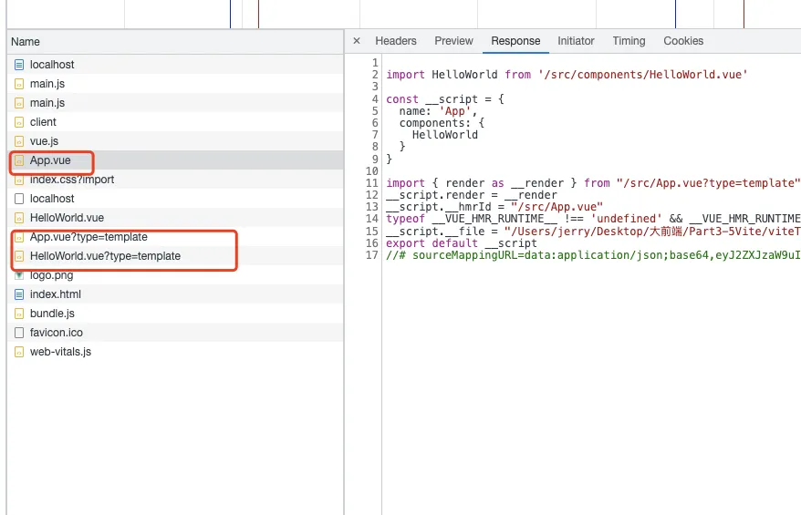

# 项目说明

此项目对标的是此前埋堆堆 H5VUE2 生态的一个项目，基于 Vue3 生态 + Vite 重新构建，并且具备原本 Vue2 生态的大部分功能。

### 主要功能
- 子项目独立运行
- 子项目独立打包
- 公共部分封装

## 项目目录树

```
mddactivity_v3
├── README.md
├── config                   // 追踪配置文件，主要作用与 node.js 主线程以及子线程，用于开启/打包子项目
│   ├── buildgray.js
│   ├── buildprod.js
│   ├── buildsit.js
│   ├── buildstress.js
│   ├── dev.js
│   ├── generatorTemplate.js
│   └── projectConfig.js
├── config_run               // 辅助追踪配置文件
│   └── project.js
├── dist                     // 打包输出目录  
│   ├── assets
│   └── index.html
├── package.json
├── pnpm-lock.yaml
├── public
│   └── vite.svg
├── request                  // 封装的请求文件  
│   ├── api.js
│   └── http.js
├── src
│   ├── assets               // 静态资源文件
│   ├── common               // 公共的 JS
│   ├── components           // 公共组件
│   └── projects             // 子项目
└── vite.config.js
```

为了方便上手使用，构建时尽量保持与此前 H5 项目（Vue2）的目录结构一致。

## 技术栈

| 核心技术       | 链接                                                        | 补充                                                        |
|----------------|-------------------------------------------------------------|-------------------------------------------------------------|
| vue3           | [Vue.js 官方](https://cn.vuejs.org/guide/introduction.html)  | Vue2 -> Vue3 底层发生了质的改变，性能提升，API 语法改变很多，Composition API 有助于更好地管理和解耦代码 |
| router4        | [Vue Router](https://router.vuejs.org/)                      | 升级版本，API 有改变                                          |
| axios          | [Axios](http://www.axios-js.com/)                            | 基本一致                                                     |
| vite           | [Vite](https://vitejs.cn/)                                  | 基于 Rollup 的构建工具，对比 Webpack 更轻更快               |
| vant-ui 4.6.6  | [Vant UI](https://vant-ui.github.io/vant/#/zh-CN/home)       | 新的版本，适配 Vue3 生态                                      |
| pinia          | [Pinia](https://pinia.web3doc.top/)                          | 新一代的状态管理库，替代 Vuex，API 更符合人性化            |
| pnpm           | [pnpm](https://www.pnpm.cn/)                                 | 新一代的包管理工具                                           |

## 快速上手开发/构建（与原有 H5 基本一致）

### 1. 开发
新建项目直接复制 `template` 文件夹，执行以下命令启动开发：
```bash
npm run dev <project name>
```

### 2. 部署
使用 Jenkins 进行部署。

## 环境与域名（与原有 H5 一致，所在目录改变 `vodactivity -> vodactivity_v3`）

### 例子：
- Vue2: [https://yxgray.mddcloud.com.cn/vodactivity/template#/](https://yxgray.mddcloud.com.cn/vodactivity/template#/)
- Vue3: [https://yxgray.mddcloud.com.cn/vodactivity_v3/template#/](https://yxgray.mddcloud.com.cn/vodactivity_v3/template#/)

### 环境与域名配置

| 环境        | 域名                                |
|-------------|-------------------------------------|
| 测试环境    | [http://test.api.mddcloud.com.cn](http://test.api.mddcloud.com.cn) |
| 灰度环境    | [https://yxgray.mddcloud.com.cn](https://yxgray.mddcloud.com.cn) |
| 生产环境    | [https://yx.mddcloud.com.cn](https://yx.mddcloud.com.cn) |

## 注意事项

- 配置
- API 的改变
- 很多插件与 Webpack 的生态不一致，已经尽量使用了可以替代的插件，如 `postcss-px-to-rem` -> `postcss-px-to-viewport` 等。
- 升级说明

### 配置




# 子项目配置

一个子项目的配置由以下三个配置项合并而成：
- `projectConfig.js` 核心基本配置
- `vite.config.js` 暴露出来的可以添加的公共配置
- `config.js` 子项目自定义配置

### 配置说明
- `projectConfig.js`：核心基本配置保持不变。
- `vite.config.js`：添加公共配置和插件。
- `config.js`：子项目的自定义配置。

## API 的改变

- Vue3 与 Vue2 之间的 API 改变需要注意。
- 在 Vue3 中，我们要使用 `hooks` 来书写业务代码。尽量一个 `hook` 写一个业务逻辑，最大程度的解耦代码，方便日后维护。

## 升级说明

- Vue3
- Vite

## Vue3 部分

### 性能提升

- **响应式系统升级**
- **编译优化**
- **源码体积的优化**

### 响应式系统升级

- **Vue2.x 中**：响应式系统的核心是 `defineProperty`。
- **Vue3.0 中**：使用 `Proxy` 对象重写响应式系统。
  - 可以监听动态新增/删除的属性。
  - 可以监听数组的索引和 `length` 属性。

### 编译优化

- **Vue2.x 中**：通过标记静态根节点，优化 `diff` 的过程。
  - Vue2.x 的优化只是跳过的根节点不做 `diff`，其余节点全部 `diff`，是全量 `diff`。
- **Vue3.0 中**：标记和提升所有的静态节点，`diff` 的时候只需要对比动态节点的内容。
  - **Fragments（片段特性）**：模板中不需要创建一个唯一的根节点，模板里可以直接放文本内容或多个同级标签。
  - **静态提升**：静态节点只创建一次，然后复用。
  - **Patch flag（静态标记）**：用于优化性能。
  - **缓存事件处理函数**：事件处理函数会被缓存，避免重复创建。
  - **子节点对比优化**：`patchKeyedChildren`（Vue2.x 用的是 `updateChildren`）。

#### 总结

- **Vue2.x**：全量 `diff`。
- **Vue3**：静态标记 + 非全量 `diff`（仅对比动态节点）。

### 静态提升

静态节点只创建一次，然后复用。以 Vue2 和 Vue3 中的 `diff` 优化为例，在 Vue2 中，每次触发更新时，无论元素是否参与更新，每次都会重新创建所有节点。相比之下，Vue3 会将不参与更新的元素保存起来，只创建一次，之后在每次渲染时复用。

**Vue2 示例：**
```javascript
with(this){
    return _c(
      'div',
      {attrs:{"id":"app"}},
      [ 
        _c('div',[_v("二狗")]),
        _c('p',[_v(_s(age))])
      ]
    )
}
```

**Vue3 示例：**
```javascript
const _hoisted_1 = { id: "app" }
const _hoisted_2 = /*#__PURE__*/_createElementVNode("div", null, "二狗", -1 /* HOISTED */)

export function render(_ctx, _cache, $props, $setup, $data, $options) {
  return (_openBlock(), _createElementBlock("div", _hoisted_1, [
    _hoisted_2,
    _createElementVNode("p", null, _toDisplayString(_ctx.age), 1 /* TEXT */)
  ]))
}
```

### 静态标记

静态标记用于优化 `diff` 性能，在 Vue3 中，会根据节点类型标记它们，以便只对比动态节点。

**静态标记常量：**
```javascript
export const enum PatchFlags {
  TEXT = 1,  // 动态文本节点
  CLASS = 1 << 1,  // 2 动态class
  STYLE = 1 << 2,  // 4 动态style
  PROPS = 1 << 3,  // 8 除去class/style以外的动态属性
  FULL_PROPS = 1 << 4,  // 16 有动态key属性的节点，当key改变时，需进行完整的diff比较
  HYDRATE_EVENTS = 1 << 5,  // 32 有监听事件的节点
  STABLE_FRAGMENT = 1 << 6,  // 64 一个不会改变子节点顺序的fragment (多个根元素)
  KEYED_FRAGMENT = 1 << 7,  // 128 带有key属性的fragment或部分子节点有key
  UNKEYED_FRAGMENT = 1 << 8, // 256 子节点没有key的fragment
  NEED_PATCH = 1 << 9,  // 512 一个节点只会进行非props比较
  DYNAMIC_SLOTS = 1 << 10,  // 1024 动态slot
  HOISTED = -1,  // 静态节点
  BAIL = -2  // 表示 Diff 过程中不需要优化
}
```

### 事件缓存

在 Vue3 中，事件处理函数会被缓存。在每次渲染时，`onClick` 事件会先读取缓存，如果缓存中没有该事件处理函数，则将其存入缓存。

**Vue3 编译后的结果：**
```javascript
export function render(_ctx, _cache, $props, $setup, $data, $options) {
  return (_openBlock(), _createElementBlock("button", {
    onClick: _cache[0] || (_cache[0] = (...args) => (_ctx.handleClick && _ctx.handleClick(...args)))
  }, "按钮"))
}
```

### PatchKeyedChildren

在 Vue2 中，`updateChildren` 会进行以下对比：
- 头和头比
- 尾和尾比
- 头和尾比
- 尾和头比
- 都没有命中的对比

在 Vue3 中，`patchKeyedChildren` 优化了对子节点的对比：
- 头和头比
- 尾和尾比
- 基于最长递增子序列进行移动/添加/删除

**示例：**
- 老的 `children`：`[ a, b, c, d, e, f, g ]`
- 新的 `children`：`[ a, b, f, c, d, e, h, g ]`

1. 先进行头和头比，得到 `[ a, b ]`。
2. 再进行尾和尾比，得到 `[ g ]`。
3. 再保存未比较的节点 `[ f, c, d, e, h ]`，并基于 `newIndexToOldIndexMap` 生成对应下标的数组 `[ 5, 2, 3, 4, -1 ]`，-1 表示新增节点。
4. 提取最长递增子序列 `[ 2, 3, 4 ]` 对应节点 `[ c, d, e ]`。
5. 最后只需在 `[ c, d, e ]` 的位置进行节点的移动/新增/删除。

使用最长递增子序列可以最大程度地减少 DOM 操作，减少页面的重排。

有兴趣的话可以去 [LeetCode 第30题](https://leetcode.com/problems/longest-increasing-subsequence/) 体验最长递增子序列问题。


## 源码体积的优化

### Vue3 中的优化

- **移除不常用的 API**：
  - 例如：`inline-template`、`filter` 等，移除这些不常用的 API 可以让最终代码的体积变小。

- **Tree-shaking 支持更好**：
  - **Tree-shaking** 是一种优化技术，依赖于 ES Module（即 `export` 和 `import`）。通过编辑阶段的静态分析，找到没有引入的模块，在打包时直接过滤掉，从而减小打包后的体积。

### 更好的 Tree-shaking

- 对于一些组件（如 `keep-alive` 和 `transition`）都会走 Tree-shaking。
- 对于一些指令（如 `v-model`）也会被优化。
- 对于一些 API 也会通过 Tree-shaking 进行优化。

## 构建工具 Vite 部分

### Vite 介绍

- **Vite** 是一个面向现代浏览器的更轻、更快的 Web 应用开发工具。
- 它基于 ECMAScript 标准元素模块系统（ES Modules）实现。

### 项目依赖

- Vite（只支持 3.0 版本）
- `@vue/compiler-sfc`

### ES Module

- 现代浏览器都支持 ES Module（IE 不支持）。
- 通过以下方式加载模块：
  ```html
  <script type="module" src="..."></script>
  ```
- **支持模块的 `script` 标签默认延迟加载**：
  - 类似于 `script` 标签设置 `defer` 属性。
  - 在文档解析完成后，触发 `DOMContentLoaded` 事件前执行。




从上面的图可以看出，主要有以下几点区别：

- **`async`**：会在加载完 JavaScript 后立即执行，最迟也会在 `load` 事件前执行完。
- **`defer`**：会在 HTML 解析完成后执行，最迟也会在 `DOMContentLoaded` 事件前执行完。

### 使用建议

- 如果你的脚本依赖于 DOM 构建完成后执行，则可以使用 `defer`。
- 如果你的脚本无需等待 DOM 构建完成，可以放心使用 `async`。

### 例子

```html
<!DOCTYPE html>
<html lang="en">
<head>
	<meta charset="UTF-8">
	<title>Title</title>
</head>
<script type="module" src="./tool.js"></script>

<script>
	window.addEventListener('DOMContentLoaded',()=>{
    console.log('DOMContentLoaded');
  })
</script>

<body>
<div id="app">测试app</div>
</body>
</html>
```

- **`script` 加上 `type="module"`**：可以获取 `id="app"` 的节点。
- **`DOMContentLoaded` 事件触发之前**：若不加 `type="module"`，则会报错；若加了 `type="module"`，则可以正常输出。




上图1：不加 `type="module"` 的情况  
上图2：加了 `type="module"` 后的输出效果

## Vite vs Vue-CLI

### Vite 优势

- **开发模式下无需打包，直接运行**：
  - 利用浏览器对 ES Module 的原生支持：`<script type="module" src="xxx"></script>`。
  - 因此，在开发模式下启动非常快速，几乎是秒开。

- **生产环境使用 Rollup 打包**：
  - 基于 ES Module 的方式打包，避免了使用 Babel 转换 `import` 为 `require`，以及一些相应的辅助函数。
  - 这种方式使得打包后的体积更小。

### Vue-CLI 缺点

- **开发模式下必须打包才能运行**，需要通过 Webpack 进行处理。
- **使用 Webpack 进行打包**，而 Webpack 相对于 Rollup 来说，可能会导致更大的打包体积和启动速度较慢。

### 图示对比

- **Vite serve**：图示说明 Vite 如何提供快速的开发环境，避免了传统打包流程。


- **vue-cli-service serve**


## Vite 的特点

- **快速冷启动**：
  - 不需要打包，直接运行。

- **按需编译**：
  - 只有被请求的模块才会被编译，提升效率。

- **模块热更新 (HMR)**：
  - 模块热更新与模块数量无关，更新速度非常快。

- **开箱即用**：
  - 无需特地安装各种 loader 和插件，很多功能开箱即用。
  - **TS**：内置支持 TypeScript。
  - **Less/Sass/Stylus/PostCSS**：内置支持，部分需要额外安装。
  - **JSX**：原生支持 JSX。
  - **Web Assembly**：内置支持 WebAssembly。

## Vite 创建项目

### 使用 Vite 创建模板项目

```bash
npm init vite-app <project-name>
cd <project-name>
npm install
npm run dev
```

### 基于模板创建项目

```bash
npm init vite-app --template react
npm init vite-app --template preact
```

## 项目主要模块

- **index.html**：Vite 项目的入口 HTML 文件，包含对主 JavaScript 文件的引入。



## 重点: 使用 `<script type="module" src="xxx"></script>` 加载模块

Vite 利用了浏览器对 ES Modules 的支持，可以通过 `<script type="module" src="xxx"></script>` 直接加载模块，避免了传统构建工具需要先打包的过程。

## Vite 是如何编译 Vue 文件的

- **劫持 Vue 文件**：Vite 会劫持 `.vue` 文件，服务器将其编译为 JavaScript 代码。
- **修改 Content-Type**：Vite 会将 `.vue` 文件的 `Content-Type` 改为 `application/javascript`，使得浏览器能够理解并正确处理这些文件。




