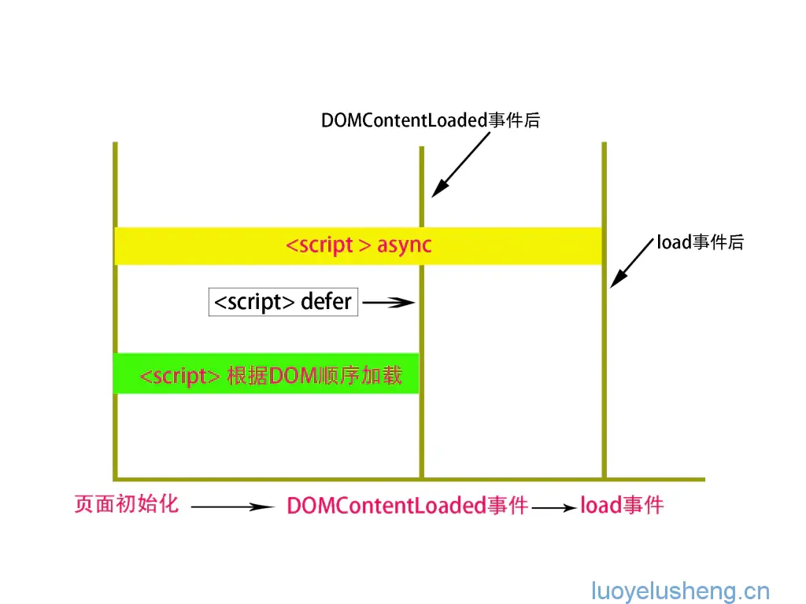
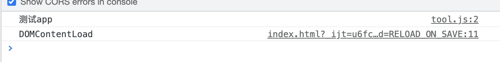
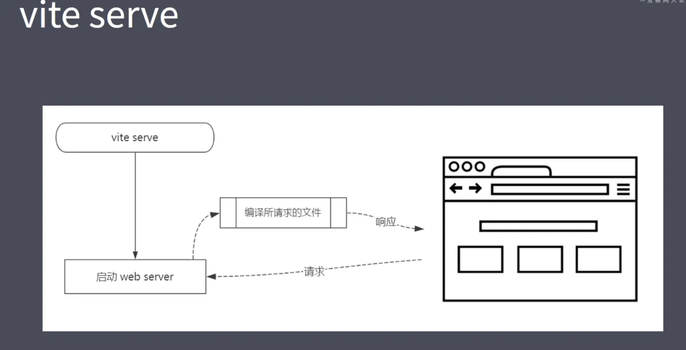
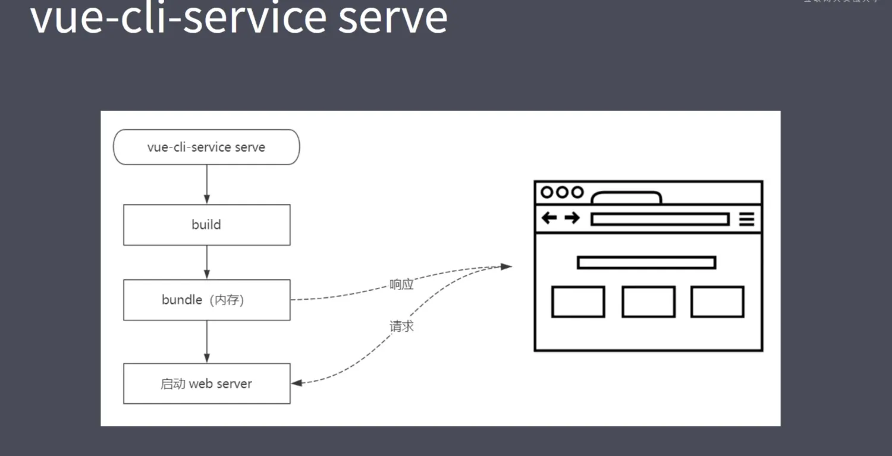
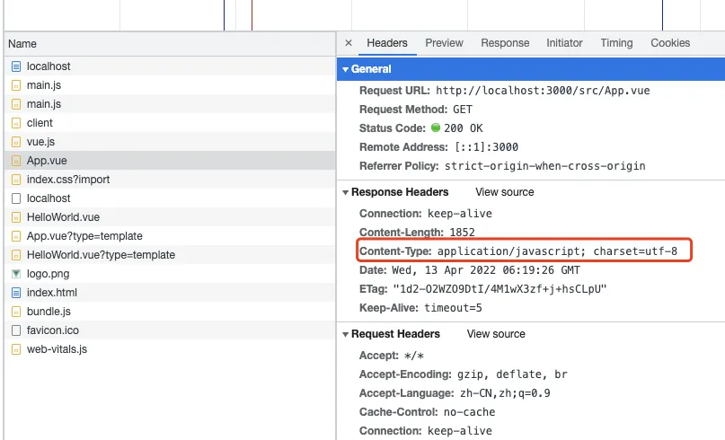

# 重点2:Vite

Vite 是一个面向现代浏览器的更轻、更快的 Web 应用开发工具。它基于 ECMAScript 标准元素模块系统（ES Modules）实现。

## 项目依赖
- Vite（只支持 3.0 版本）
- @vue/compiler-sfc

## ES Module
- 现代浏览器都支持 ES Module（IE 不支持）
- 通过下面的方式加载模块：
  ```html
  <script type="module" src="..."></script>
  ```
- 支持模块的 script 默认延迟加载
    - 类似于 script 标签设置 `defer`
    - 在文档解析完成后，触发 `DOMContentLoaded` 事件前执行




## 载入方式比较

从下面的描述可以看出：

- **async** 会在加载完 JS 后立即执行，最迟也会在 `load` 事件前执行完。
- **defer** 会在 HTML 解析完成后执行，最迟也会在 `DOMContentLoaded` 事件前执行完。

根据上面的内容，如果你的脚本依赖于 DOM 构建完成与否，则可以使用 `defer`；如果不依赖 DOM 构建，则可以使用 `async`。

## 示例

```html
<!DOCTYPE html>
<html lang="en">
<head>
  <meta charset="UTF-8">
  <title>Title</title>
</head>
  <script type="module" src="./tool.js"></script>
  <script>
    window.addEventListener('DOMContentLoaded', () => {
      console.log('DOMContentLoaded');
    })
  </script>

<body>
  <div id="app">测试app</div>
</body>
</html>
```

- `script` 标签加上 `type="module"` 可以获取 `id="app"` 的节点。
- 在 `DOMContentLoaded` 之前，如果不加 `type="module"` 会报错。




## Vite vs Vue-CLI

### Vite
- 在开发模式下不需要打包可以直接运行
    - 利用浏览器支持 ES Module 的原理：`<script type="module" src="xxx"></script>`
    - 因此，在开发模式下是秒开的
- 在生产环境下使用 Rollup 打包
    - 基于 ES Module 的方式打包（不需要使用 Babel 将 `import` 转换为 `require`，以及其他相应的辅助函数）
    - 因此打包后的体积更小

### Vue-CLI
- 开发模式下必须对项目进行打包才可以运行
- 使用 Webpack 进行打包

## 图示对比

- **Vite serve**：开发模式直接启动，无需打包。



- **vue-cli-service serve**：开发模式必须先打包才能运行。



## Vite 的特点

- **快速冷启动**
    - 不需要打包，启动速度极快
- **按需编译**
- **模块热更新**
    - 与模块数量无关，更新速度快
- **开箱即用**
    - 不需要特地安装各种 loader
    - 支持 TypeScript 内置支持
    - 支持 Less/Sass/Stylus/PostCSS（需要单独安装）
    - 支持 JSX
    - 支持 Web Assembly

## Vite 创建项目

### 使用 Vite 创建模板
```bash
npm init vite-app <project-name>
cd <project-name>
npm install
npm run dev
```

### 基于模板创建项目
```bash
npm init vite-app --template react
npm init vite-app --template preact
```

## 项目主要模块

### `index.html`


重点：使用 `<script type="module" src="xxx"></script>` 加载模块。

### Vite 如何编译 Vue 文件
- Vite 劫持 `.vue` 文件，服务器会把它编译成 JS。
- 将 `.vue` 文件的 `content-type` 改为 `javascript`。



