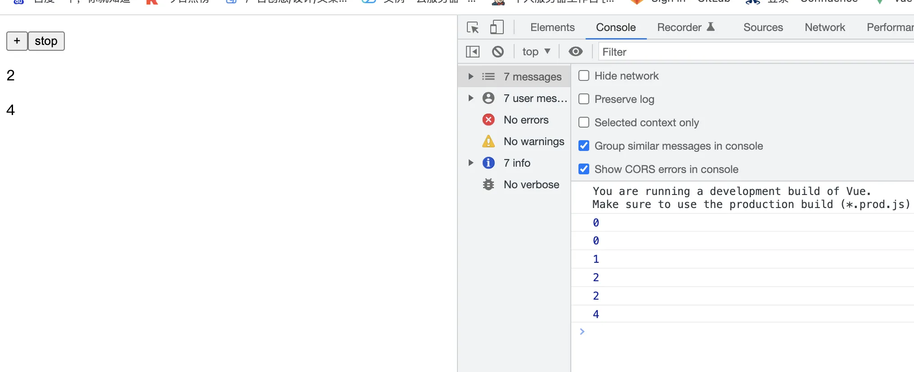

# 重点3:compisitonAPI

## reactive
`reactive` 将引用数据转化为响应式数据。

```javascript
// obj 被 reactive 转换为响应式对象
const obj = reactive({
  x: 0,
  y: 0
})
```

## toRefs
`toRefs` 将引用数据的属性转化为响应式数据。

```javascript
// 这里 x, y 并不是响应式数据，需要使用 toRefs 处理 obj
const { x, y } = obj

// 如下: x, y 为响应式对象
const { x, y } = toRefs(obj)
```

## ref
`ref` 用于将基础类型的数据转换为响应式数据。

```javascript
// x 为一个 Number 类型的响应式数据
const x = ref(0)
```

## computed
`computed` 用于计算属性，分为两种使用方式：

### 第一种用法

```javascript
computed(() => count.value + 1)
```

### 第二种用法

```javascript
const count = ref(1)
const plusOne = computed({
  get: () => count.value + 1,
  set: val => {
    count.value = val - 1
  }
})
```

### 示例：使用 `computed` 和 `ref`

```html
<!DOCTYPE html>
<html lang="en">
<head>
  <meta charset="UTF-8">
  <link rel="icon" href="/favicon.ico"/>
  <meta name="viewport" content="width=device-width, initial-scale=1.0">
  <title>test</title>
</head>
<body>
<div id="app">
  <button @click="plus">
    点击加1
    {{ comCount }}
  </button>
</div>

<script type="module">
import { createApp, reactive, onMounted, onUnmounted, computed, ref } from "./node_modules/vue/dist/vue.esm-browser.js";

const getCount = () => {
  const count = ref(0)

  // computed 使用
  const comCount = computed(() => {
      return count.value + 1
    }
  )
  return {
    comCount,
    plus() {
      count.value++
    }
  }
}

const app = createApp({
  setup() {
    return {
      ...getCount() // 解构
    }
  }
})

app.mount('#app')
</script>
</body>
</html>
```

## watch
`watch` 用来监听响应式数据的变化，它有三个参数：
1. **第一个参数**：要监听的数据（ref/reactive，响应式数据）。
2. **第二个参数**：监听到数据变化后执行的函数，这个函数有两个参数分别是新值和旧值。
3. **第三个参数**：选项对象，`deep` 和 `immediate`。

### 示例：使用 `watch`

```html
<!DOCTYPE html>
<html lang="en">
<head>
  <meta charset="UTF-8">
  <title>Title</title>
</head>
<body>
<div id="app">
  <p>
    请问一个 yes/no 的问题:
    <input type="text" v-model="question">
  </p>
  <p>{{ answer }}</p>
</div>

<script type="module">
import {
  createApp,
  watch,
  reactive,
  onMounted,
  onUnmounted,
  computed,
  ref
} from "./node_modules/vue/dist/vue.esm-browser.js";

let time;
createApp({
  setup() {
    const question = ref('')
    const answer = ref('')

    watch(question, () => {
      clearTimeout(time)
      time = setTimeout(async (newVale, oldValue) => {
        const res = await fetch('https://www.yesno.wtf/api')
        const data = await res.json()
        answer.value = data.answer
      }, 500)
    })
    return {
      question,
      answer
    }
  }
}).mount('#app')
</script>

</body>
</html>
```

## watchEffect
`watchEffect` 是 `watch` 函数的简化版本，也用来监视数据的变化。它接收一个函数作为参数，监听函数内响应式数据的变化。

### 示例：使用 `watchEffect`

```html
<!DOCTYPE html>
<html lang="en">
<head>
  <meta charset="UTF-8">
  <title>Title</title>
</head>
<body>
<div id="app">
  <p>
    <button @click="plus">+</button>
    <button @click="stop">stop</button>
  </p>
  <p>{{ count }}</p>
  <p>{{ count1 }}</p>
</div>

<script type="module">
import {
  createApp,
  watchEffect,
  ref
} from "./node_modules/vue/dist/vue.esm-browser.js";

createApp({
  setup() {
    const count = ref(0)
    const count1 = ref(0)

    const stop = watchEffect(() => { // watchEffect 可以监视多个响应式数据
      console.log(count.value);
      console.log(count1.value);
    })
    return {
      stop,
      plus() {
        count.value++
        count1.value += 2
      },
      count,
      count1
    }
  }
}).mount('#app')
</script>

</body>
</html>
```



## 总结
- `reactive` 用于将对象或数组等引用类型数据转化为响应式数据。
- `toRefs` 用于将对象的属性转化为响应式的引用。
- `ref` 用于将基本类型的数据转化为响应式数据。
- `computed` 用于创建计算属性，可以是只读的，也可以是双向绑定的。
- `watch` 用于监听响应式数据的变化。
- `watchEffect` 是 `watch` 的简化版本，可以自动收集依赖。


