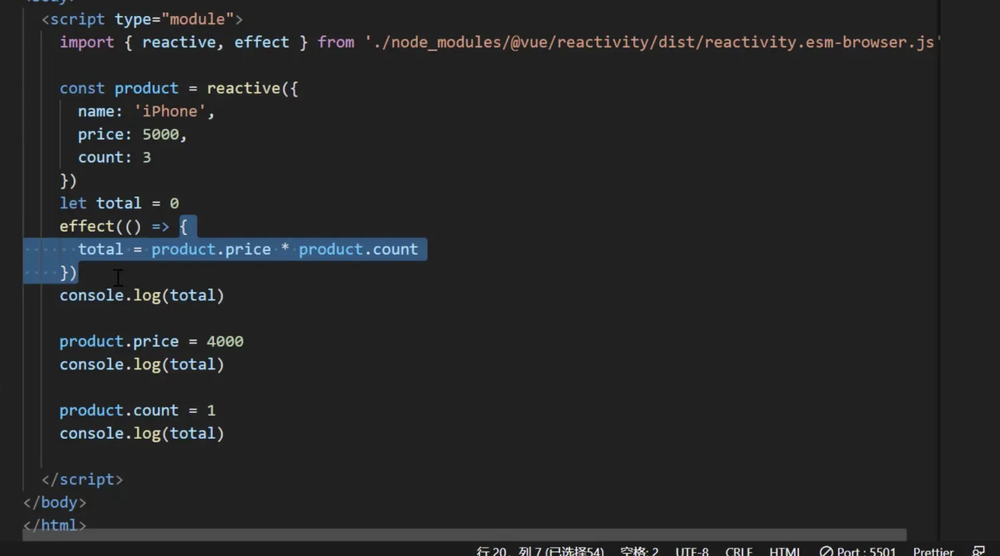
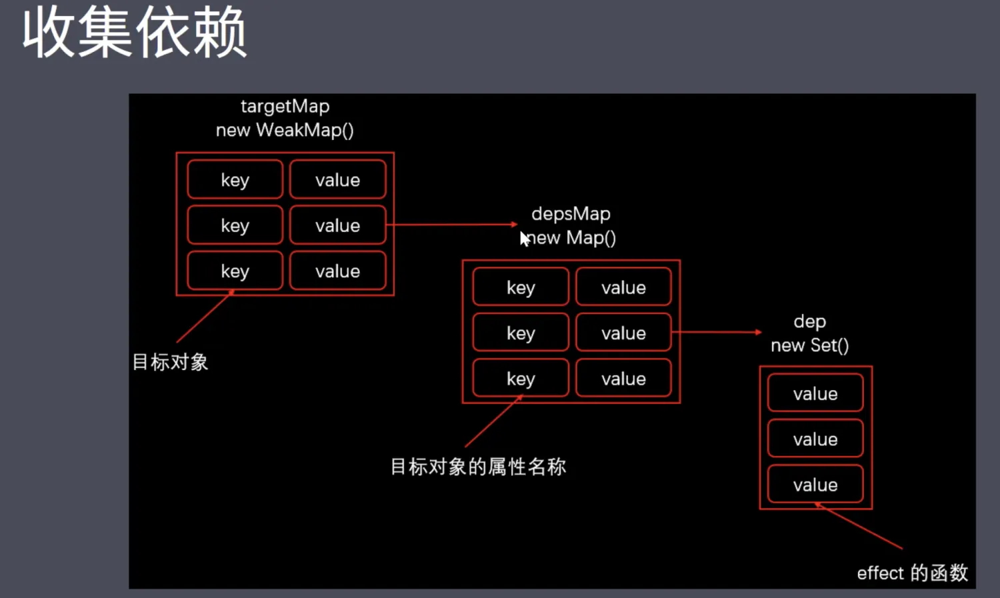

# 重点4-3:Vue3响应式回顾-收集依赖

## 示例图1:



## 示例图2:



---

## effect && track && trigger

### effect(追踪属性变化-用于触发收集依赖)

- 相当于vue2当中watch实例化的时候把回调添加到`Dep.target`，然后被收集

```js
//effect 追踪属性变化(用于触发收集依赖,相当于vue2中Dep.target)
let activeEffect = null

export function effect(callback) {
  activeEffect = callback
  callback() // 触发访问响应式对象属性,收集依赖
  activeEffect = null
}
```

### track(收集依赖函数)

- 收集的方式更加集中,清晰
- `targetMap(weakMap) -> depsMap(Map) -> dep(Set)`
- 对应的就是示例图2,
    - 一个 `weakMap` 弱引用对象, key 为 `proxy` 代理对象, value 为一个 `map` 对象 (`targetMap`)
    - 这个 `map` 对象的 key 为 target 的 key, value 就是这个 key 的回调函数集合 `new Set()` (`depsMap`)
    - 这个 `set` 对象就是用于去重回调函数的一个集合 (`dep`)

```js
//target -> depsMap -> dep(new Set(...callbacks))
let targetMap = new WeakMap()
```

```js
//收集依赖函数
export function track(target, key) {

  //没有回调则return
  if (!activeEffect) return
  //没有depsMap则创建depsMap
  let depsMap = targetMap.get(target)
  if (!depsMap) {
    targetMap.set(target, depsMap = new Map())
  }
  //没有dep则创建dep
  let dep = depsMap.get(key)
  if (!dep) {
    depsMap.set(key, dep = new Set())
  }
  //把回调添加到dep当中
  dep.add(activeEffect)
}
```

### trigger(触发依赖函数)

```js
export function trigger(target, key) {

  //执行target[key]的回调事件
  const depsMap = targetMap.get(target)
  if (!depsMap) return
  const dep = depsMap.get(key)
  if (!dep) return
  dep.forEach(cb => {
    cb()
  })
}
```
