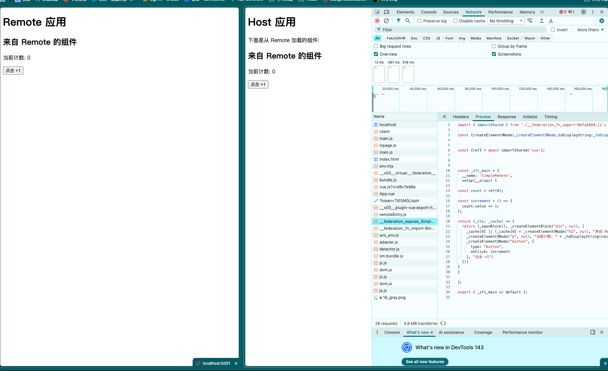
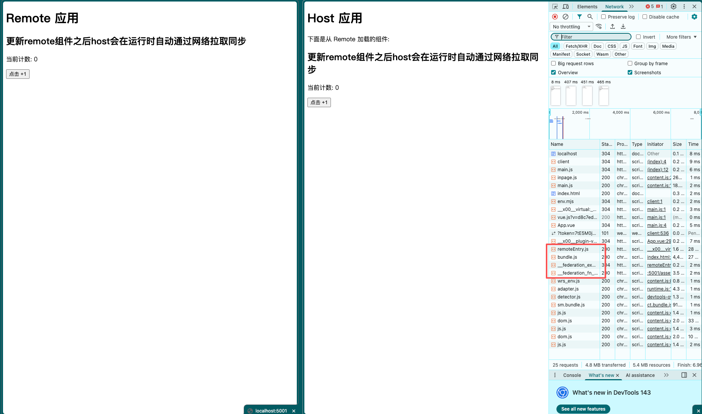

# Module Federation 微前端架构

## 什么是 Module Federation？


---

### 1. 概念的出处与本质 🧬

模块联邦最早由 **Zack Jackson** 提出，并随 **Webpack 5**（2020年发布）正式进入开发者视野。

* **定义**：它允许一个 JavaScript 应用在运行时动态地加载并运行另一个应用的代码。
* **核心哲学**：打破了传统的“构建时”依赖。在联邦模式下，没有绝对的“主”或“从”之分，每个应用都可以既是**生产者（Remote）**也是**消费者（Host）**。

### 2. 应用范围与解决的痛点 🎯

在视频网站或大型企业应用中，它主要用于解决以下问题：

* **微前端架构**：不同团队独立开发、部署不同的业务模块（如登录组件、播放器模块、评论模块），但在用户端无缝集成。
* **资源共享**：多个项目共享同一份 Vue/React 运行时，避免重复加载，减少首屏体积。
* **热更新组件**：无需重新部署整个系统，只需更新“生产者”模块，所有引用的地方自动同步。


### 3.支持生态
| 构建工具 | 支持方式 | 官方链接 |
|---------|---------|---------|
| Webpack 5+ | 原生支持 | [官方文档](https://webpack.js.org/concepts/module-federation/) |
| Vite | 通过插件 | [vite-plugin-federation](https://github.com/originjs/vite-plugin-federation) |
| Rollup | 通过插件 | 社区插件支持 |

### 4.核心作者的blob

[官方文档](https://module-federation.io/zh/index.html/)


###  重要注意事项
**生产环境必须关注以下约束：**
- **版本锁定**：远程模块URL必须包含完整版本号，避免不可控更新
- **依赖对齐**：共享库（Vue/React等）的版本必须严格一致
- **网络依赖**：需设计加载失败降级方案
- **性能监控**：远程加载需要性能监控和错误收集

---

##  核心配置详解

### 配置参数说明
| 参数 | 类型 | 说明 | 在消费端的用法 | 重要提示 |
|------|------|------|---------------|----------|
| **`name`** | `string` | 模块唯一标识 | `import('user_center/UserAuth')` 中的 `user_center` | 必须全局唯一 |
| **`filename`** | `string` | 远程入口文件 | 自动加载，无需直接引用 | 通常为 `remoteEntry.js` |
| **`exposes`** | `object` | 导出组件清单 | `import('模块名/导出键')` | 键名为消费端引用路径 |
| **`remotes`** | `object` | 远程模块映射 | 配置后可直接动态导入 | 支持完整URL和路径变量 |
| **`shared`** | `object` | 依赖共享配置 | 自动处理版本协商 | **必须设置** `singleton: true` |


---
## 代码示例：简易组件
remote更新前:

remote更新后:

###  生产者remote配置 

**Vite 配置：**

```typescript
import { defineConfig } from "vite";
import vue from "@vitejs/plugin-vue";
import federation from "@originjs/vite-plugin-federation";

export default defineConfig({
  plugins: [
    vue(),
    federation({
      name: "remote_app",
      filename: "remoteEntry.js",
      exposes: {
        "./SimpleRemote": "./src/components/SimpleRemote.vue"
      },
      shared: ["vue"]
    })
  ],
  server: {
    port: 5174
  },
  preview: {
    port: 5001
  },
  build: {
    target: "esnext",
    minify: false
  }
});
```

**main 配置：**
```typescript
import { createApp } from "vue";
import App from "./App.vue";

createApp(App).mount("#app");

```
###  消费者host配置 

**Vite 配置：**
```typescript
import { defineConfig } from "vite";
import vue from "@vitejs/plugin-vue";
import federation from "@originjs/vite-plugin-federation";

export default defineConfig({
  plugins: [
    vue(),
    federation({
      name: "host_app",
      remotes: {
        remote_app: "http://localhost:5001/assets/remoteEntry.js"
      },
      shared: ["vue"]
    })
  ],
  server: {
    port: 5000
  },
  build: {
    target: "esnext",
    minify: false
  }
});
```

**main 配置：**
```typescript
import { createApp, defineAsyncComponent } from "vue";
import App from "./App.vue";

const app = createApp(App);

const RemoteFromFederation = defineAsyncComponent(
  () => import("remote_app/SimpleRemote")
);

app.component("RemoteFromFederation", RemoteFromFederation);

app.mount("#app");

```

**消费端组件使用示例：**
```vue
<template>
  <div>
    <h1>Host 应用</h1>
    <p>下面是从 Remote 加载的组件:</p>
    <RemoteFromFederation />
  </div>
</template>

<script setup>
</script>

```


##  代码示例：登录组件

###  生产者remote配置 (UserCenter - 提供登录组件)

**Vite 配置：**
```typescript
// vite.config.ts
import federation from '@originjs/vite-plugin-federation';

export default {
  plugins: [
    federation({
      name: 'user_center',
      filename: 'remoteEntry.js',
      exposes: {
        // 导出组件
        './UserAuth': './src/components/UserAuth.vue',
        // 导出状态管理
        './AuthStore': './src/stores/auth.ts',
        // 导出工具函数
        './AuthUtils': './src/utils/auth.ts'
      },
      shared: {
        // 关键：确保全局单例
        vue: { 
          singleton: true,
          requiredVersion: '^3.3.0'
        },
        pinia: { 
          singleton: true,
          requiredVersion: '^2.1.0'
        },
        // 可选共享
        'vue-router': { singleton: true }
      }
    }),
  ],
  // 生产构建配置
  build: {
    target: 'esnext',
    minify: false, // 调试时可关闭，生产环境开启
    cssCodeSplit: false, // 确保CSS完整打包
  }
};
```

**认证状态管理 (含SSO同步)：**
```typescript
// src/stores/auth.ts
import { defineStore } from 'pinia';
import { ssoLogin, ssoLogout, checkToken } from '../api/auth';

export const useAuthStore = defineStore('auth', {
  state: () => ({
    token: localStorage.getItem('sso_token') || '',
    user: JSON.parse(localStorage.getItem('user_info') || 'null'),
    permissions: JSON.parse(localStorage.getItem('user_permissions') || '[]')
  }),

  getters: {
    isAuthenticated: (state) => !!state.token,
    hasPermission: (state) => (perm: string) => state.permissions.includes(perm)
  },

  actions: {
    async login(credentials: { username: string; password: string }) {
      try {
        const { token, user, permissions } = await ssoLogin(credentials);
        
        // 更新本地状态
        this.token = token;
        this.user = user;
        this.permissions = permissions;
        
        // 持久化到 localStorage
        this.persistToStorage();
        
        // 触发存储事件，同步其他标签页
        this.triggerStorageSync();
        
        return { success: true, user };
      } catch (error) {
        return { success: false, error: error.message };
      }
    },

    logout() {
      ssoLogout(this.token);
      this.clearAuth();
      // 清空后刷新页面，确保所有子应用感知到登出
      setTimeout(() => location.reload(), 100);
    },

    clearAuth() {
      this.token = '';
      this.user = null;
      this.permissions = [];
      localStorage.removeItem('sso_token');
      localStorage.removeItem('user_info');
      localStorage.removeItem('user_permissions');
      this.triggerStorageSync();
    },

    persistToStorage() {
      localStorage.setItem('sso_token', this.token);
      localStorage.setItem('user_info', JSON.stringify(this.user));
      localStorage.setItem('user_permissions', JSON.stringify(this.permissions));
    },

    triggerStorageSync() {
      // 创建存储事件，通知其他标签页
      window.dispatchEvent(new StorageEvent('storage', {
        key: 'sso_token',
        newValue: this.token,
        oldValue: localStorage.getItem('sso_token'),
        storageArea: localStorage
      }));
    },

    // 初始化多标签页同步监听
    initCrossTabSync() {
      window.addEventListener('storage', (event: StorageEvent) => {
        if (event.key === 'sso_token') {
          if (!event.newValue) {
            // Token 被清空，其他标签页已登出
            this.clearAuth();
            alert('您已在其他标签页退出登录');
            location.reload();
          } else if (event.newValue !== this.token) {
            // Token 更新，重新获取用户信息
            this.token = event.newValue;
            this.refreshUserInfo();
          }
        }
      });
    },

    async refreshUserInfo() {
      if (!this.token) return;
      try {
        const userInfo = await checkToken(this.token);
        this.user = userInfo;
        this.persistToStorage();
      } catch (error) {
        this.clearAuth();
      }
    }
  }
});

// 在应用启动时初始化
export const initAuthStore = () => {
  const store = useAuthStore();
  store.initCrossTabSync();
  store.refreshUserInfo(); // 初始化时验证token有效性
  return store;
};
```

###  消费者host配置 (业务子应用)

**环境感知配置：**
```typescript
// vite.config.ts
import { defineConfig, loadEnv } from 'vite';
import federation from '@originjs/vite-plugin-federation';

export default defineConfig(({ mode }) => {
  const env = loadEnv(mode, process.cwd(), '');
  
  // 🏷️ 环境特定的远程地址映射
  const REMOTE_CONFIG = {
    development: {
      user_center: 'http://localhost:5001',
      component_lib: 'http://localhost:5002'
    },
    test: {
      user_center: 'https://test-cdn.example.com/user-center/v1.0.0',
      component_lib: 'https://test-cdn.example.com/ui-lib/v2.1.0'
    },
    production: {
      user_center: 'https://cdn.example.com/user-center/v1.2.3',
      component_lib: 'https://cdn.example.com/ui-lib/v2.2.0'
    }
  };

  const remotes = Object.entries(REMOTE_CONFIG[mode] || REMOTE_CONFIG.production)
    .reduce((acc, [key, url]) => ({
      ...acc,
      [key]: `${url}/assets/remoteEntry.js`
    }), {});

  return {
    plugins: [
      federation({
        name: 'product_app',
        remotes,
        shared: {
          vue: { 
            singleton: true,
            requiredVersion: '^3.3.0'
          },
          pinia: { 
            singleton: true,
            requiredVersion: '^2.1.0'
          }
        }
      })
    ],
    // 开发服务器配置
    server: {
      port: 3000,
      cors: true,
      proxy: mode === 'development' ? {
        // 本地开发代理，解决跨域
        '/user-center': {
          target: 'http://localhost:5001',
          changeOrigin: true,
          rewrite: (path) => path.replace(/^\/user-center/, '')
        }
      } : undefined
    }
  };
});
```

**消费端组件使用示例：**
```vue
<!-- ProductApp.vue -->
<script setup lang="ts">
import { ref, shallowRef, onMounted, computed, defineAsyncComponent } from 'vue';
import { useAuthStore } from 'user_center/AuthStore';

// 异步加载远程组件（带错误处理）
const loadRemoteComponent = async () => {
  try {
    const module = await Promise.race([
      import('user_center/UserAuth'),
      new Promise((_, reject) => 
        setTimeout(() => reject(new Error('组件加载超时')), 8000)
      )
    ]);
    return module.default;
  } catch (error) {
    console.error('远程组件加载失败:', error);
    // 返回降级组件
    return defineAsyncComponent(() => import('./components/FallbackAuth.vue'));
  }
};

// 响应式组件引用
const RemoteAuth = shallowRef<any>(null);
const isLoading = ref(true);
const loadError = ref<string | null>(null);

// 使用远程Store（全局单例）
const authStore = useAuthStore();
const userInfo = computed(() => authStore.user);
const isLoggedIn = computed(() => authStore.isAuthenticated);

onMounted(async () => {
  try {
    RemoteAuth.value = await loadRemoteComponent();
  } catch (err: any) {
    loadError.value = err.message;
    // 上报错误到监控系统
    window.__monitor__?.captureException(err);
  } finally {
    isLoading.value = false;
  }
});

// 登录处理函数
const handleLogin = async (credentials) => {
  const result = await authStore.login(credentials);
  if (result.success) {
    // 登录成功，跳转到目标页面
    router.push('/dashboard');
  } else {
    // 显示错误提示
    message.error(`登录失败: ${result.error}`);
  }
};
</script>

<template>
  <div class="app-container">
    <!-- 顶部导航 -->
    <header class="app-header">
      <div class="user-info" v-if="isLoggedIn">
        欢迎，{{ userInfo.name }}
        <button @click="authStore.logout">退出</button>
      </div>
    </header>

    <!-- 远程组件加载区域 -->
    <div class="auth-container">
      <div v-if="isLoading" class="loading-state">
        <Spin size="large" tip="加载认证组件中..." />
      </div>
      
      <div v-else-if="loadError" class="error-state">
        <Alert type="error" :message="`组件加载失败: ${loadError}`" />
        <FallbackAuth @login="handleLogin" />
      </div>
      
      <Suspense v-else>
        <template #default>
          <component 
            :is="RemoteAuth" 
            v-if="RemoteAuth && !isLoggedIn"
            @login="handleLogin"
          />
        </template>
        <template #fallback>
          <Spin tip="渲染组件中..." />
        </template>
      </Suspense>
      
      <!-- 已登录状态显示 -->
      <div v-if="isLoggedIn" class="logged-in-view">
        <p>您已登录，正在跳转...</p>
      </div>
    </div>

    <!-- 权限控制示例 -->
    <div v-if="authStore.hasPermission('product_view')">
      <ProductList />
    </div>
  </div>
</template>

<style scoped>
.app-container {
  max-width: 1200px;
  margin: 0 auto;
  padding: 20px;
}

.loading-state,
.error-state {
  padding: 40px;
  text-align: center;
}

.auth-container {
  margin: 40px 0;
  border: 1px solid #f0f0f0;
  border-radius: 8px;
  padding: 30px;
}
</style>
```


## 🛡️ 容错与降级策略

### 多层级降级方案
```typescript
// 远程模块加载管理器
class RemoteModuleManager {
  private cache = new Map<string, any>();
  private fallbacks = new Map<string, () => Promise<any>>();
  
  constructor() {
    // 注册备用模块
    this.registerFallback('user_center/UserAuth', () => 
      import('@/components/fallback/AuthFallback.vue')
    );
    this.registerFallback('user_center/AuthStore', () => 
      import('@/stores/localAuthStore')
    );
  }
  
  async loadModule(remotePath: string, timeout = 10000) {
    // 1. 检查缓存
    if (this.cache.has(remotePath)) {
      return this.cache.get(remotePath);
    }
    
    // 2. 尝试加载
    try {
      const module = await this.loadWithRetry(remotePath, timeout);
      this.cache.set(remotePath, module);
      return module;
    } catch (error) {
      // 3. 加载失败，使用备用
      console.warn(`远程模块 ${remotePath} 加载失败，使用备用:`, error);
      return this.loadFallback(remotePath);
    }
  }
  
  private async loadWithRetry(path: string, timeout: number, retries = 2) {
    for (let i = 0; i <= retries; i++) {
      try {
        const controller = new AbortController();
        const timeoutId = setTimeout(() => controller.abort(), timeout);
        
        const promise = import(/* @vite-ignore */ path);
        const result = await Promise.race([
          promise,
          new Promise((_, reject) => 
            setTimeout(() => reject(new Error(`加载超时 (${timeout}ms)`)), timeout)
          )
        ]);
        
        clearTimeout(timeoutId);
        return result;
      } catch (error) {
        if (i === retries) throw error;
        await this.delay(1000 * (i + 1)); // 指数退避
      }
    }
  }
  
  private async loadFallback(path: string) {
    const fallback = this.fallbacks.get(path);
    if (fallback) {
      return fallback();
    }
    // 全局默认备用
    return this.getGlobalFallback();
  }
}

// 使用示例
const moduleManager = new RemoteModuleManager();

// 安全加载远程组件
const UserAuth = await moduleManager.loadModule('user_center/UserAuth');
```

### 监控与告警
```typescript
// 远程加载性能监控
const monitorRemoteLoading = () => {
  const metrics = {
    loadStartTime: 0,
    loadEndTime: 0,
    successCount: 0,
    failureCount: 0,
    retryCount: 0
  };
  
  return {
    start: () => {
      metrics.loadStartTime = performance.now();
      performance.mark('remote-load-start');
    },
    
    end: (success: boolean) => {
      metrics.loadEndTime = performance.now();
      performance.mark('remote-load-end');
      performance.measure('remote-module-load', 
        'remote-load-start', 
        'remote-load-end'
      );
      
      const duration = metrics.loadEndTime - metrics.loadStartTime;
      
      // 上报指标
      if (window.__monitor__) {
        window.__monitor__.send({
          type: 'remote_module_load',
          success,
          duration,
          metrics
        });
      }
      
      // 性能警告（超过3秒）
      if (duration > 3000) {
        console.warn(`远程模块加载耗时 ${duration.toFixed(0)}ms，考虑优化`);
      }
    },
    
    incrementRetry: () => {
      metrics.retryCount++;
    }
  };
};
```


