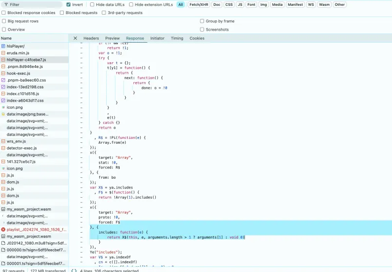
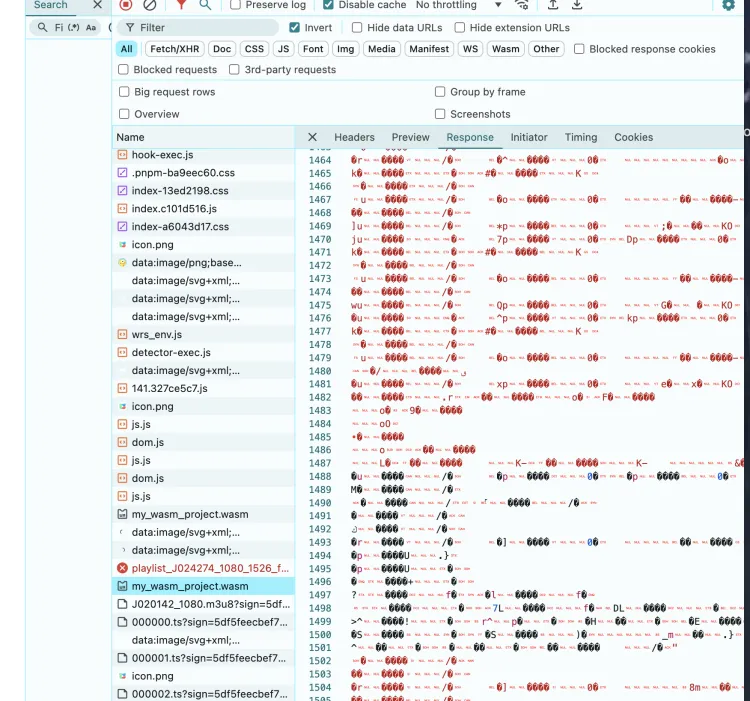

# 解密播放密钥加密方式

要保护密钥不被直接从源码中获取，并且防止被反编译或调试时轻易获取，可使用 WebAssembly (WASM) 加密处理密钥。将密钥相关的处理逻辑放入 WebAssembly 模块中。通过这种方式，密钥将被隐藏在编译后的 WASM 二进制文件中，难以直接从源码中提取。

## 步骤

### a. 将你的加密密钥和解密逻辑写入 C 或 Rust 代码中。
以下是一个简单的 Rust 代码示例，它将加密和解密逻辑封装到 WebAssembly 中（`src/lib.rs`）：
```rust
#[no_mangle]
pub extern "C" fn decrypt_key() -> *mut u8 {
    let key = "fa48d4ff850b9fc5308844dbab6f9797";
    let key_bytes = key.as_bytes();
    key_bytes.as_ptr() as *mut u8
}

#[no_mangle]
pub extern "C" fn xor_decrypt(data: *mut u8, key: *const u8, length: usize) -> *mut u8 {
    let mut decrypted_data = Vec::with_capacity(length);
    unsafe {
        for i in 0..length {
            let decrypted_byte = *data.add(i) ^ *key.add(i % 32); // 假设 key 长度为 32 字节
            decrypted_data.push(decrypted_byte);
        }
    }
    decrypted_data.as_mut_ptr()
}
```

### b. 将其编译为 WebAssembly。
使用 Rust 的 wasm-pack 工具将代码编译为 `.wasm` 文件：
```bash
wasm-pack build --target web
```
生成的 `.wasm` 文件可以放入 Vue 3 项目的 `public` 文件夹中。

### c. 在 JavaScript 中调用 WebAssembly 来执行解密操作。
```javascript
const wasmModule = await WebAssembly.instantiateStreaming(fetch('your-wasm-file.wasm'));
const decryptedKey = wasmModule.instance.exports.decryptKey();
```

## 实际实现

在 Vue 3 中使用 WebAssembly (WASM) 进行加密处理密钥的流程包括以下步骤：

### 1. 编写 WebAssembly 模块
你可以使用 C/C++ 或 Rust 编写 WebAssembly 模块，处理密钥的加密和解密。

### 2. 将模块编译为 WebAssembly
使用工具将你的 C/C++ 或 Rust 代码编译为 `.wasm` 文件。

### 3. 在 Vue 3 项目中加载和调用 WebAssembly
在 Vue 3 项目中，通过 Vue 的生命周期函数和 JavaScript 的 WebAssembly API，加载 `.wasm` 文件并调用其中的函数。
```vue
<template>
  <div>
    <p>Decrypted Key: {{ decryptedKey }}</p>
  </div>
</template>

<script setup>
import { ref, onMounted } from 'vue';

const decryptedKey = ref('');

onMounted(async () => {
  // 加载 WebAssembly 模块
  const wasmModule = await WebAssembly.instantiateStreaming(fetch('/path-to-your-wasm-file/yourfile.wasm'));

  // 调用解密函数
  const decryptKeyPtr = wasmModule.instance.exports.decrypt_key();

  // 获取解密后的密钥
  const memoryBuffer = new Uint8Array(wasmModule.instance.exports.memory.buffer);
  const keyLength = 32;  // 假设密钥长度是 32
  const keyBytes = memoryBuffer.slice(decryptKeyPtr, decryptKeyPtr + keyLength);

  decryptedKey.value = new TextDecoder().decode(keyBytes);  // 转换为字符串
});
</script>

<style scoped>
</style>
```

## 详细说明

### 1. 加载 WASM
通过 `WebAssembly.instantiateStreaming` 从服务器加载 `.wasm` 文件。

### 2. 调用 WASM 函数
通过 `wasmModule.instance.exports.decrypt_key()` 调用 WebAssembly 中的解密密钥函数。

### 3. 读取内存数据
WebAssembly 使用线性内存模型，你可以通过 `memory.buffer` 读取加密或解密后的数据。

### 4. 在 Vue 中展示密钥
将解密后的密钥赋值给 Vue 的 `ref` 变量，并在模板中展示。


## 项目产出
[http://test.api.mddcloud.com.cn/vodactivity_v3/hlsPlayer/](http://test.api.mddcloud.com.cn/vodactivity_v3/hlsPlayer/)


### 1. 代码混淆
加密逻辑代码在 Vue 3 的 `terserOptions` 插件进行分块混淆压缩，代码变短且难以理解，除专业破译机械性手段不能阅读。



### 2. 密钥加密
加密 m3u8 地址（放在播放栏播放即可）：
`http://apkqn.itv.video/otts/test/J020142/J020142_1080.m3u8?sign=5df5feecbef72849d42be8c3ea621a04&t=66f26009&rlimit=5`
加密内容在 `.wasm` 文件中，在 HTML 中呈现不可读状态。


