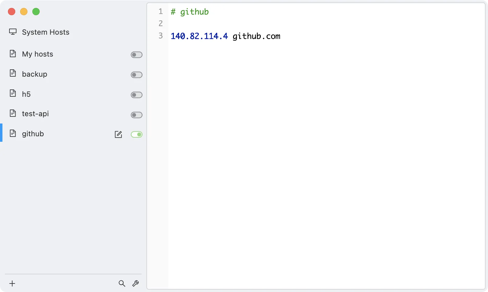

# 解决提交 GitHub 超时问题（使用 http 时大概率出现）
- **可能原因**：ping github.com，有时候可能是本地 DNS 解析不了 IP 地址。
- **解决办法**：
    - 查询 github.com IP 地址：https://www.ipaddress.com/。
    - 使用 swtchHosts 添加本地 DNS 解析即可。
    - 


## 禁用 HTTP2（有时候使用 HTTP2 连接不到 GitHub）
- **设置 git 使用 http1.1**：
```bash
git config --global http.version HTTP/1.1
```
- **设置 git 使用 http2（用于对比查看等情况）**：
```bash
git config --global http.version HTTP/2
```
- **查看 git 使用的 http 版本**：
```bash
git config --global --get http.version
```

## 增加缓冲区大小
```bash
git config --global http.postBuffer 524288000
```

## npm 版本切换
- **工作常用版本**：
```bash
sudo npm install -g npm@6.14.18
```
- **web3 开发版本（对应 nodev18.19.1）**：
```bash
sudo npm install -g npm@10.8.2
``` 
