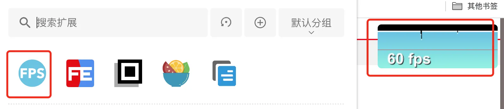
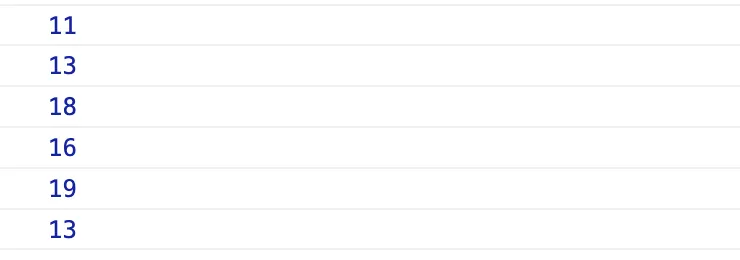

# 前端性能指标:页面流畅度度量

除了页面加载速度，**页面流畅度**是另一个直接影响用户体验的指标。随着前端应用复杂度的提升，一些原本只在桌面平台运行的专业软件如今也可能直接运行在浏览器标签页中。此外，随着移动设备成为使用最广泛的 Web 平台，其性能受限于散热、续航和体积的限制，远不如桌面平台的性能。因此，用户对移动设备的体验要求通常更加苛刻。

## 用户体验的指标
- **页面流畅度** 是用户体验的关键指标之一（另一个重要指标是页面加载时间）。
- 移动设备的性能没有桌面平台的极致，因此用户对移动设备的流畅度体验要求更高。

## 度量流畅度的指标

一般来说，**FPS**（Frames Per Second，每秒传输帧数）是用来度量页面流畅度的标准。FPS（也称为帧率）表示每秒渲染的帧数。对于一个网页来说，当 FPS 达到 **60fps** 时，用户会感到非常流畅。如果 FPS 显著低于 60，用户可能会感到页面卡顿。

### 为什么页面可能无法达到 60fps？
浏览器的 **JavaScript 执行** 和 **页面渲染**（包括 Layout）是阻塞进行的。在页面执行 JavaScript 时，渲染将暂停，因此页面每隔 **16.7ms** 需要渲染一次，否则就会出现丢帧现象。也就是说，当页面中执行了非常复杂的任务时，可能会导致丢帧。

虽然大多数页面很难全程保持 **60fps**，但如果长时间处于过低的 FPS，用户会明显感受到卡顿。尤其是当执行一个耗时极长的任务（如 10 秒）时，过长时间的丢帧会让用户认为页面失去响应。

### FPS 帧率
- 页面执行大量的 JavaScript 会阻塞页面渲染，导致页面无法每 **16.7ms** 渲染一次，容易出现丢帧现象。

## 可视化工具
- **Chrome DevTools** 的 **Performance** 面板提供 FPS 概览。
- Chrome 扩展，如 **FPS extension**，可以帮助实时监控页面 FPS。



## 用户端度量（如何上报）

### `requestAnimationFrame` API

`requestAnimationFrame` 是一个浏览器 API，通知浏览器在下次绘制前调用传入的回调函数。这样可以确保每帧前都执行一次 `requestAnimationFrame`。在 **60fps** 的情况下，每次执行的间隔大约为 **16.7ms**。

```javascript
(function() {
  let lastTime = 0;
  const measure = () => {
    console.log(Date.now() - lastTime);
    lastTime = Date.now();
    requestAnimationFrame(measure);
  };

  measure();
})();
```
控制台输出的时间波动会在 **16ms** 左右。



假设过去渲染每帧所用的时间为 `t`，那么 **1s** 内大约可以渲染 **1000/t** 帧。尽管这个值不完全准确，但统计 FPS 的均值是比较可靠的。

另一种思路是，认为超过固定时间间隔（如大于 100ms）的帧为“卡顿帧”，并统计这些卡顿帧占整体统计帧的比例。

由于统计流畅度需要频繁地进行，统计代码本身对性能的影响也需要注意，因此在必要的情况下可以针对少部分用户做抽样上报。

### 需要考虑的情况
- **边缘情况**：设备自动降帧，`requestAnimationFrame` 自行暂停。
- **收集数据时间**：尽量收集 1 秒内的数据。
- **抽样上报**：可以通过随机数仅抽样 30% 的用户。
- **抽样数据模型**：
    - 大于 100ms 的数据占所有数据的比例。
    - 均值是否接近 16-17ms 之间。

```javascript
(function() {
  let postFPS = Math.floor(Math.random() * 10) < 3; // 抽样 30% 的用户上报数据
  if (!postFPS) return;

  let lastTime = 0; // 记录上一次的时间
  let initTime = Date.now(); // 初始时间
  let initRAF; // requestAnimationFrame 函数
  let timeNum = 0; // 1秒内收集的渲染时间，60FPS的标准时间为16.7ms
  let timeTotal = 0; // 收集 1 秒内所有的渲染时间和，用于计算平均渲染时间
  let time100Num = 0; // 1 秒内收集到超过 100ms 的渲染时间，这些代表画面渲染卡顿
  let timeThan100Percent; // 1 秒内渲染超过 100ms 占收集数据的百分比，超过 20% 算是不及格
  let timeAverage; // 1 秒内收集到的渲染时间数的平均数

  const measure = () => {
    if (Date.now() - initTime < 1000) { // 仅收集 1s = 1000ms
      const time = (Date.now() - lastTime);
      if (lastTime) {
        timeNum++;
        timeTotal += time;
        if (time > 100) {
          time100Num++;
        }
      }
      lastTime = Date.now();
      initRAF = requestAnimationFrame(measure);
    } else {
      cancelAnimationFrame(initRAF);
      // 1 秒内渲染超过 100ms 占收集数据的百分比，超过 20% 算是不及格
      timeThan100Percent = time100Num / timeNum;
      // 1 秒内收集到的渲染时间数的平均数
      console.log(timeNum, time100Num, timeThan100Percent);
      console.log(timeTotal / timeNum);
      // 上报函数...
    }
  };

  measure();
})();
```

## Long Tasks API (兼容性差，仅作为辅助查看原因)

上面的方法在大多数浏览器上都可以实现，但是每帧执行一次的测算逻辑会对页面性能产生影响，并且浏览器出于节约性能的目的会限制 `requestAnimationFrame` 的运行。为了克服这些问题，Performance API 提供了一个辅助度量手段：**Long Tasks API**。

### 流畅度降低的原因
流畅度（或者说 FPS）降低的根本原因是 UI 线程被阻塞，而这种阻塞通常是由于长时间未完成的任务（如长时间的 JavaScript 执行、代价高昂的浏览器重绘或回流）导致的。使用 Long Tasks API 可以定位这些阻塞 UI 线程的长任务。

```javascript
var observer = new PerformanceObserver(function(list) {
    var perfEntries = list.getEntries();
    for (var i = 0; i < perfEntries.length; i++) {
        // 处理长任务通知：
        // 上报分析和监控
        // ...
        // 处理 PerformanceLongTaskTiming 对象
    }
});
// 注册观察者以接收长任务通知
observer.observe({entryTypes: ["longtask"]});
```

### PerformanceLongTaskTiming 对象
**Long Tasks API** 可以提供有关长任务的详细信息，以下是 **PerformanceLongTaskTiming** 对象的基本信息：
- **startTime**：长任务开始的时间（从 `navigationStart` 开始计算，单位是毫秒）。
- **duration**：长任务占用的时间（单位是毫秒）。
- **name**：目前总是 `self`，按照标准定义未来可能会有其他值。
- **attribution[0].name**：目前只有 `script`，未来可能会有 `layout` 等值。

目前（截至 Chrome 93），Long Tasks API 在大多数浏览器中的实现还不完全，只能通过 Long Tasks API 获取由 JavaScript 执行导致的长任务（通常大于 50ms）。但在大多数场景下，这已经足够实用。

## Core Web Vitals

**Core Web Vitals** 是衡量网页体验的关键指标，包括：
- **LCP**（Largest Contentful Paint）：最大元素加载时间。
- **FID**（First Input Delay）：首次交互延迟。
- **CLS**（Cumulative Layout Shift）：布局偏移。

## 总结

- 使用 `requestAnimationFrame` 来测量流畅度。
- **Web Vitals** 和 **Long Tasks API** 可以作为辅助指标来帮助分析流畅度问题。

