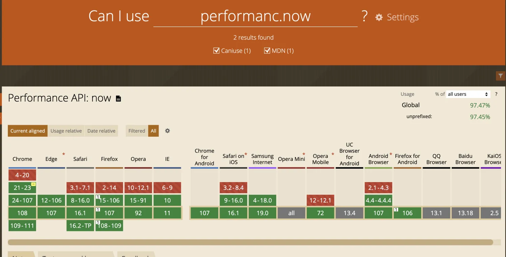

# 一、Performance API

## 1. `Date.now()` 方法

为了测量一个任务的耗时，最简单的方法是调用 `Date.now()` 两次，然后计算差值来衡量过程中的时间消耗：

```javascript
const startTime = Date.now();
// 做具体的任务 doTask()
// 最终耗时
const taskCostTime = Date.now() - startTime;
```

这种方式存在两个问题：
- **精度不够**：只能精确到毫秒（ms）。
- **依赖系统操作时间**：如果系统时间被修改，就会出现异常（虽然这种情况很少见）。

## 2. 重点使用：`performance.now()` 方法

相比 `Date.now()`，`performance.now()` 提供了更高精度的时间度量：

- **精度**：精确到微秒（us）。
- **获取的时间**：是以页面打开时间点为基准的相对时间，不依赖操作系统的时间（第一个 `performance.now()` 可以视为首屏时间）。
- **兼容性**：大多数现代浏览器支持此方法，兼容性问题较少。



如果浏览器不支持 `performance.now()`，可以使用以下方式来兼容：

```javascript
performance.now = () => {
  return typeof performance.now === 'function' ? performance.now :
    // `performance.timing.navigationStart` 表示页面打开时的时间戳，非高精度时间
    Date.now() - performance.timing.navigationStart;
}
```

### 白屏时间：页面 `head` 完成到 `body` 渲染的时间

可以通过以下案例计算白屏时间：

```html
<!DOCTYPE html>
<html lang="en">
<head>
	<meta charset="UTF-8">
	<link rel="preload" as="image" href="https://p1.music.126.net/aolHExjd1O1D-1MZcAEPyQ==/109951166361167293.jpg?param=170y170">
	<title>Title</title>
	<script>
    window.LOAD_DATA = (data) => {
      const {title, url} = data;
      document.body.innerHTML = `<h1>${title}</h1></img>`;
    }

    const tag = document.createElement('script');
    tag.src = 'https://cdn.jsdelivr.net/gh/xcodebuild/perfdemo@master/hello-world/api.jsonp.js';
    document.head.appendChild(tag);
	</script>
	<script>
    // 兼容 `performance.now` 部分浏览器无法使用，如 IE9
    if (typeof performance.now !== 'function') {
      performance.now = () => {
        // `performance.timing.navigationStart` 表示页面打开时的时间戳，非高精度时间
        return Date.now() - performance.timing.navigationStart;
      }
    }
    // 白屏时间
    console.log(performance.now());
	</script>
</head>
<body>
	<h1>Loading...</h1>
</body>
</html>
```

## 3. 常用指标

常用的指标有 `FP`、`FCP`、`DOMContentLoaded`、`TTFB`、`Load` 等，这些可以通过 Performance API 直接获取或推算：

```javascript
// `performance.getEntriesByType('navigation')[0]` 为 NavigationTiming LV2，`performance.timing` 为 LV1
// 优先使用 `performance.getEntriesByType('navigation')[0]` 为 NavigationTiming LV2
const navigationTime = typeof performance.getEntriesByType === 'function' ?
  performance.getEntriesByType('navigation')[0] : performance.timing;

// `First Paint` 和 `First Contentful Paint` 可以通过 Resource Timing 直接获取
const FP = performance.getEntriesByName('first-paint')[0].startTime;
const FCP = performance.getEntriesByName('first-contentful-paint')[0].startTime;

// `DOMContentLoaded` 和 `onload` 可以通过 Navigation Timing 直接获取
const DOMContentLoadTime = navigationTime['domContentLoadedEventStart'];
const onloadTime = navigationTime['loadEventStart'];

// TTFB 其实是 responseStart - fetchStart
const TTFB = navigationTime.responseStart - navigationTime.fetchStart;
```

- 主要用到的是 `TTFB`（Time To First Byte）。

---

# 二、均值、分位数和秒开率

常见的三个集中统计指标：
- **均值**
- **分位数**
- **秒开率**

## 1. 均值

均值是大部分人想到的统计指标，它理解起来非常简单。如果想要查看用户端整体的首屏性能，可以将多个用户的首屏指标求均值。

但存在两个问题需要注意：
- **均值会受到极值的影响**。因此，我们需要排除极值。
    - 例如，当某个值超过既定阈值时，可以将其排除。
- **均值难以反映部分群体的问题**。例如，平均收入不能代表低收入群体的情况，因此需要结合分位数一起分析。


## 2. 分位数

**中位数**（50%分位数）可以很好地解决均值面临的极值问题和可解释性问题。假设一群人的收入的中位数为 1 万元，那么可以说这群人中不少于一半的人收入在 1 万元或以上。

- 在实际应用中，常用 **四分位数**：
    - **第一四分位数 (Q1)**：样本中所有数值从小到大排列后第 25% 的数字。
    - **第二四分位数 (Q2)**：即中位数，样本中所有数值从小到大排列后第 50% 的数字。
    - **第三四分位数 (Q3)**：样本中所有数值从小到大排列后第 75% 的数字。
    - **四分位距 (IQR)**：第三四分位数与第一四分位数的差距。

首先确定四分位数的位置：
- **Q1**的位置 = `(n+1) × 0.25`
- **Q2**的位置 = `(n+1) × 0.5`
- **Q3**的位置 = `(n+1) × 0.75`
    - `n` 表示项数。

### Core Web Vitals 时使用 **75 分位数** 来确保大多数用户的体验：
- **25%** 为性能较好用户体验，
- **50%** 为大部分用户体验，
- **75%** 为性能较差用户体验。

**高分位数（75%）** 可以暴露低性能用户的问题，可以针对这些用户群体进行优化。

## 3. 秒开率

**秒开率** 关注的是有多少用户能够达到非常高的性能水平。秒开只是一个惯用的说法，实际上我们关心的可能是 **n 秒内打开的用户比例**。

- **提高性能下限水平** 就是提高 **分位数（75%）** 的指标。
    - 比如，首屏时间期望为 1 秒的情况下，如果 **75% 分位数** 达到 3 秒，说明需要考虑针对低端设备或网络优化。

- **优化秒开率** 是指提高大部分性能较好的用户体验，使条件较好的用户都能享受更好的体验。

## 4. 总结

结合 **分位数** 和 **秒开率** 来统计用户性能状况，舍弃 **均值**：
- **四分位数（25%，50%，75%）**：
    - 其中 **75%** 代表低端性能用户，优化该分数即可提高低端性能用户的体验。
- **秒开率**：
    - 提高大部分性能较好的用户体验，使他们享受到更好的页面加载体验。

