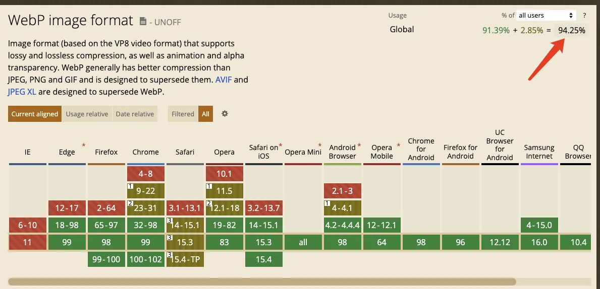
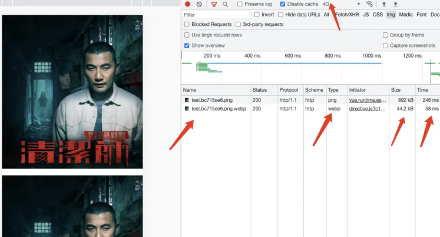
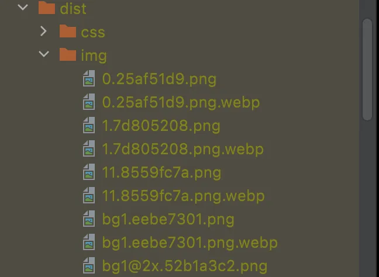

# 图片webp格式升降级方案

* 使用webp格式图片的初衷
* 效果图示
* 支持基础介绍

## 使用webp格式图片的初衷

* 支持率达到95%,技术成熟,大势所趋
* 压缩比高,减少体积,加快资源加载

## 效果图示

### 实例1:
png经过webp有损压缩75%,谷歌腾讯推荐,自测70%-75%效果最为显著

<Xgplayer url="../public/mp4/webp.mp4"  id="mse" />



* 压缩体积
  * 原png892kb
  * 压缩过后的webp只有44kb吗,压缩体积仅为原图的1/20,减少95%

* 加载速度(4G环境下)
  * 原png需要246ms
  * webp仅需58ms,加载速度减少75%以上

### 实例2

* 压缩体积
    * 原png8205kb
    * 压缩过后的webp只有6.7kb吗,压缩体积仅为原图的1/30,减少95%以上

* 加载速度(4G环境下)
    * 原png需要112ms
    * webp仅需49ms,加载速度减少50%以上

## 支持基础

### ImageminWebpWebpackPlugin(webpack插件)
这个插件的作用就是使项目构建的时候把指定的图片资源按照设置转化为webP并且进行压缩

#### 效果图示



#### config.js代码

```js
  chainWebpack: (config) => {
    //移除 prefetch 插件（<link rel="prefetch">会在页面加载完成后，利用空闲时间提前加载获取用户未来可能会访问的内容）
    config.plugins.delete('prefetch-index')
    config
    .plugin('ImageminWebpWebpackPlugin')
    .use(ImageminWebpWebpackPlugin)
    .tap(args => {
      args[0] = {
        config: [
          {
            test: /\.(jpe?g|png)/,
            options: {
              quality: 75
            }
          }
        ],
        overrideExtension: false,//是否覆盖源文件,用于保留源文件,方便渐进增强/优雅降级
        detailedLogs: false,//是否打印相关信息,每次devServer构建可见其压缩信息
      }
      return args
    })
```

### vue自定义指令v-webp,v-webp-bg

#### 在html5加载webp图片的方式不方便,并且也不利于对其标签样式控制

```html
<picture class="picture">
  <source type="image/webp" srcset="image.webp">
  
</picture>
```

#### v-webp(加载一般图片)
* **支持本地渐进增强**,当浏览器支持webp会自动加载webp图片,若不支持则加载png/jpeg
* **支持网络资源渐进增强**,可选网络资源来源规则(后面预加载会提到)
* 当资源被默认转换为base则不会加载对应的webp图片
* 该标签会被添加类名webp
* 仅支持img标签
* 使用方式

```html
姿势一:在img添加指令v-webp,src添加资源路径
//仅需添加v-webp即可
//路径为原图片路径

//路径为webp资源路径也可,若支持会优雅降级


姿势二:在img添加指令v-webp="require('路径')",不使用src

//路径为webp资源路径也可,若支持会优雅降级

```

* **推荐使用姿势一**,理由是仅需要添加v-webp指令即可,其它操作跟我们原本书写习惯一致 

* 源码
  * directive.js
  * webp.js
  * https://blog.csdn.net/u014718296/article/details/126424413 注意,使用 canvas 的 toDataURL 进行判断
      就刚刚去查caniuse，发现了个大秘密。如下，就2022年8月19日的今天，大部分浏览器的新版本已经支持webp格式了，然而，toDataURL 出现了滞后，也就是说该方法不能准确的判断浏览器是否支持 webp

```js
// directive.js

import Vue from "vue";
import {canUseWebP, isWebp} from "./webp";

Vue.directive('webp', (el, binding) => {
  if (el.tagName.toLowerCase() === 'img' && canUseWebP()) {
    //若图片具备webpImg则执行逻辑
    if (el.classList.contains('webpImg')) return false
    if (!el.getAttribute('data-default-src')) el.dataset.defaultSrc = el.src
    el.dataset.type = 'webp'
    let reg = new RegExp('//activity')
    if (binding.value && !el.src) { //当v-webp="xxx/xxx"情况时
      let isWebSource = reg.test(binding.value) //判断是否是网络资源
      if (isWebp(binding.value)) {
        el.src = binding.value
      } else {
        // el.src = isWebSource ? binding.value.replace(/png|jp?g/g, 'webp') : `${binding.value}.webp`
        el.src = binding.value.replace(/.(png|jpg|jpeg)$/, '.webp')
      }
    } else if (el.src && !isWebp(el.src) && el.src.indexOf('data:image') === -1) { //当v-webp src="xxx/xxx"情况时
      let isWebSource = reg.test(el.src) //判断是否是网络资源
      // el.src = isWebSource ? el.src.replace(/png|jp?g/g, 'webp') : `${el.src}.webp`
      el.src = el.src.replace(/.(png|jpg|jpeg)$/, '.webp')
      console.log(el.src, '是否转换了');
    }
    el.onerror = () => {
      // WebP加载失败则回退至源文件
      console.log("WebP加载失败则回退至源文件");
      if (el.getAttribute('data-type') === 'webp') {
        el.dataset.type = 'default'//webp图片加载错误标识
        el.src = el.getAttribute('data-default-src')
      } else if (el.getAttribute('data-type') === 'default') {
        el.dataset.type = 'defaultError'//源图加载错误标识
        el.src = ''
        el.classList.add('webpImg')
      }
    }
    el.onload = () => {
      el.classList.add('webpImg')
    }
  }
  if (!canUseWebP()) {
    return false
  }
})
```


```js
// webp.js 判断是否支持webp

function canvasCheckWebP() { //用于兼容其余浏览器(火狐)
  console.log('前置判断');
  let elem = document.createElement('canvas')
  if (elem.getContext && elem.getContext('2d')) {
    // was able or not to get WebP representation
    return elem.toDataURL('image/webp').indexOf('data:image/webp') === 0
    // return false
  } else {
    // very old browser like IE 8, canvas not supported
    return false
  }
}

//缓存方法
const memorize = function (fn) {
  const cache = {}
  return function () {
    console.log(cache['supportWebp'], 'cache');
    return cache['supportWebp'] === undefined ? cache['supportWebp'] = fn() : cache['supportWebp']// 如果已经缓存过，直接取值。否则重新计算并且缓存
  }
}


/**
 * @Description 获取url字段值
 * @param {String} variable:参数
 * @return {String} 参数值
 * @author Jerry
 * @date 2023/3/13
 */
const getQueryVariable = (variable) => {
  let query = window.location.search.substring(1);
  let vars = query.split("&");
  for (let i = 0; i < vars.length; i++) {
    let pair = vars[i].split("=");
    if (pair[0] === variable) {
      return pair[1];
    }
  }
  return '';
}


/*
* 判断是否支持webP
* */
function result() {
  if(getQueryVariable('spWebp')==='false'){
    return false
  }
  //因为该函数涉及到创建节点以及使用到会造成回流的JSAPI:offsetWidth,所以要使用memorize只调用该函数一次并缓存结果
  let supportWebp;
  let canvasCheckWebPResult = canvasCheckWebP()
  if (canvasCheckWebPResult) {
    supportWebp = canvasCheckWebPResult
    return supportWebp
  }
  try {
    let ele = document.createElement('object');
    ele.type = 'image/webp';
    ele.innerHTML = '!';
    document.body.appendChild(ele);
    //奇妙所在,如果浏览器支持webp,那么这个object是不可见的(offsetWidth为0),
    //否则就会显示出来,有可视宽度.
    supportWebp = !ele.offsetWidth;
    console.log('赋值true');
    document.body.removeChild(ele);
  } catch (err) {
    supportWebp = false;
    console.log('赋值false');
  }
  return supportWebp
}

/**
 * 是否支持webP导出,带缓存
 * @returns supportWebP: boolean
 */
export const canUseWebP = memorize(result)

/**
 * 是否是webP路径
 * @returns supportWebP: boolean
 */
export function isWebp(src) {
  return src.substr(src.length - 4) === 'webp'
}
```

### squoosh-谷歌图片资源转换工具(可用于存储在cdn上的远程资源图片先行转换)
* 可以批量操作
* 支持 Windows、macOS、Linux
* 可以同时实现转换跟压缩
* 可以通过命令行操作
* 主要用于网络图片资源预加载
  * 把图片资源进行批量转换成webp并且压缩
  * 上传到CDN/腾讯云空间
* 介绍/体验网址:https://squoosh.app/
* 命令行使用
  * 安装 Squoosh-CLI：npm i -g @squoosh/cli （需要再终端，或者命令提示符中使用）
  * 直接在网址中复制其指令即可
  * 在需要全局转换的文件夹打开终端黏贴指令,最后加上*或者./(当前目录上所有图片资源)
* 预览

<Xgplayer url="../public/mp4/squoosh.mp4"  id="mse1" />
