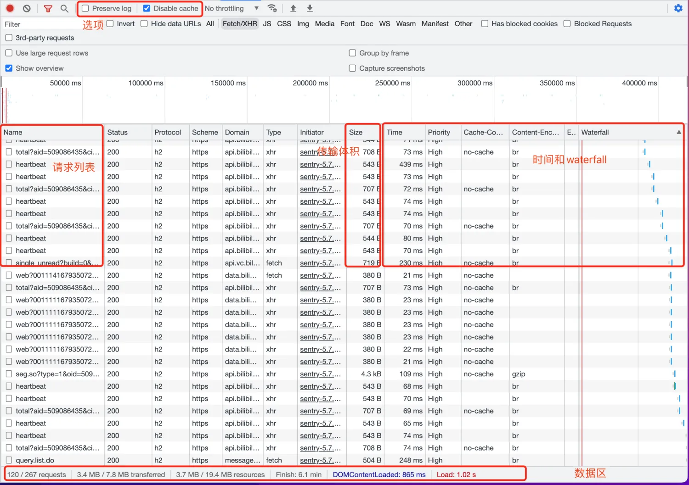
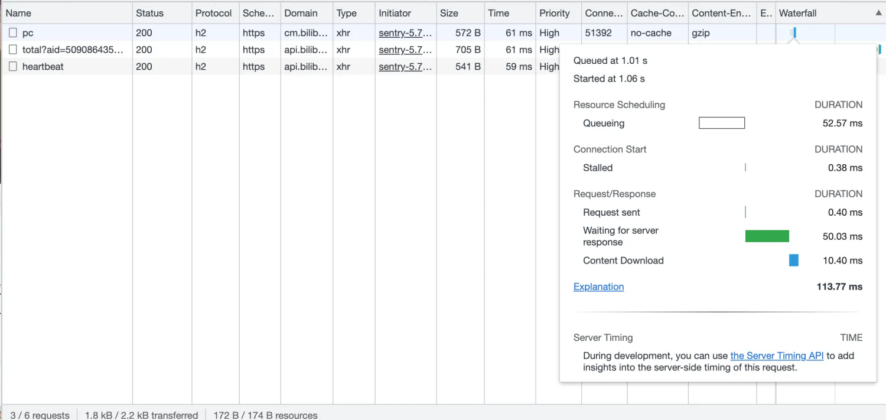
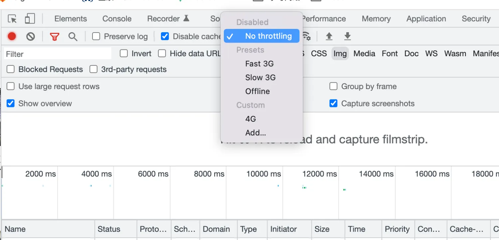

# Chrome的DevTools、Performance和WebPageTest工具概述

## Performance
Performance面板可以提供更加专业的性能信息。由于这些工具(如Profiler)往往会造成额外的性能负担 ,因此Performance面板的大部分功能并不会像Network面板一样默认记录信息,而是需要在操作区手动开始录制

## DevTools

Chrome的DevTools直接集成在浏览器中，是最常用到的开发者工具。Network面板是DevTools最常用的面板之一，用于网络请求和性能分析。

### Network面板
Network面板提供了与网络请求相关的调试能力，可以帮助开发者分析请求的性能。主要功能区域包括：

- **选项**：
    - `Preserve log`：主要是为了在页面导航后保留上一个页面留下的网络请求。在调试页面跳转时非常有用。
    - `Disable cache`：用于暂时屏蔽浏览器的HTTP缓存机制。

- **请求列表**：
  网络请求的列表，点击后可以查看单个请求的详情。

- **传输体积**：
  显示资源的传输体积。需要注意的是，这里的体积默认展示的是传输体积（通常是gzip或br压缩后的体积），而非解码后的体积。

- **时间和Waterfall**：
  显示资源加载的整体耗时。将鼠标指针移到Waterfall上可以看到更完整的时间信息展示。

- **数据区**：
  展示一些常见的总结性数据，如请求数量、整体的传输体积、DOMContentLoaded的时间和Load的时间等。
- 

### 时间信息

- **Queued at**：开始进入队列的时间。通过这个时间点可以判断请求的发起时间是否符合预期。例如，通过JavaScript执行请求一张图片时，执行到`new Image()`的时间就是Queued at的时间点，这时浏览器还没有真正发起请求。

- **Started at**：相较于Queued at，这个时间点是指请求真正从浏览器发出的时间，通常晚于Queued at。

- **Queuing**：`Queued at`和`Started at`的时间差表示请求在队列中等待的时间。等待的原因可能有以下几种：
    - 资源的优先级较低，浏览器需要等待其他高优先级的资源加载完成再加载（例如，低优先级的图片等待CSS先加载完成）。
    - 等待可用TCP请求复用的时间。例如，HTTP/1中等待上一个请求完成复用TCP连接。
    - 浏览器的并发请求过多，进入等待状态。例如，HTTP/1中的同域名最多只能发起6个并发请求。
    - 从磁盘读取缓存的时间。
    - 部分版本的Chrome中可能会隐藏CORS的preflight请求（OPTIONS），而触发preflight请求时，这段时间也会被计入等待时间。

- **Stalled**：也叫`Blocking`，即被阻塞的时间。这个时间包括`Queuing`的任何原因，以及其他如代理协商等时间。

### 更多命令

- **Protocol**：显示请求的具体协议，帮助确认是否开启HTTP/2（或者可能是QUIC中的HTTP/3）。
- **Priority**：显示资源的优先级，这会影响请求的排队顺序。如果资源的加载优先级不明确，可以在这里查看。
- **Connection ID**：显示TCP连接ID，可以查看不同请求使用的TCP连接，帮助确认连接复用或多路复用是否符合预期。

### 模拟网速

- **Offline模式**：用于测试用户在离线环境下的表现，特别是在测试PWA（Progressive Web App）页面的离线可用性时非常有用。

## WebPageTest
线上性能分析工具,大多用于排除本地因素(TCP连接复用,资源缓存等)
