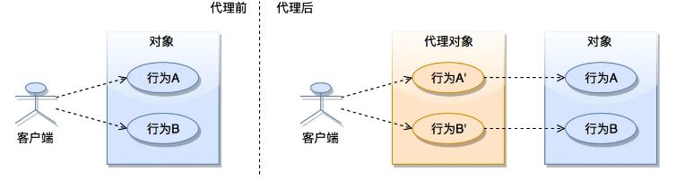
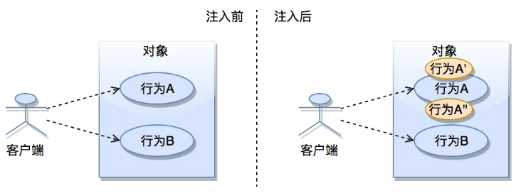
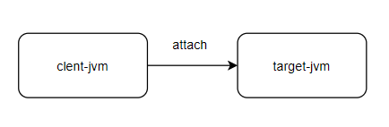
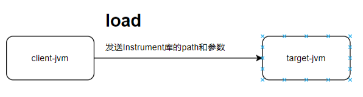
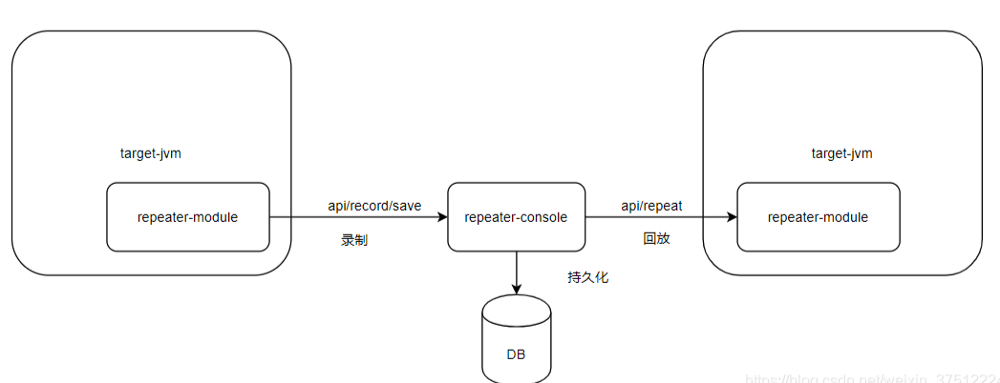
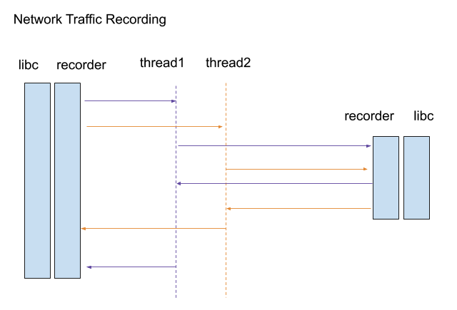
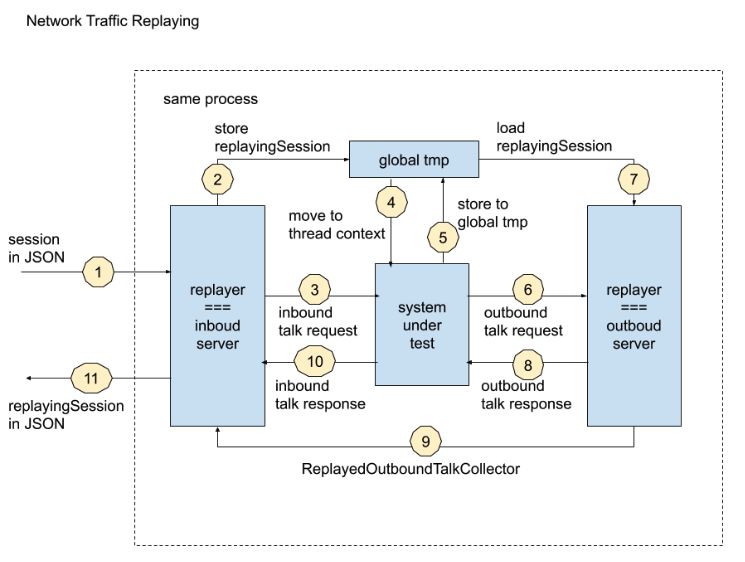

 ### **原理**

通过AOP请求和响应的拦截，并且进行请求和响应的记录，在开发环境通过解析结果进行回放。

-   什么是AOP

   面向切面编程，spring的AOP就是一种实现。当然还可以很多其他实现，例如基于jvm的AOP，可以通过在通过装饰jvm中的class实现；例如其他语言也有对应的实现

-   AOP 的2种实现方式

   不同的语言、不同的框架AOP的实现可能不同，但是从思想上都是基于以下2种

1. 通过代理实现对目标访问的行为装饰
   
2. 通过对目标行为进行修改实现
   

### 开源方案调研

sandbox-jvm-repeater
想要理解该方案，我们需要先理解sandbox-jvm

sandbox-jvm
我们先简单了解下sandbox-jvm的原理

- 原理

  1.通过与目标jvm建立连接实现通信

​    

​     2.向目标jvm发送load命令，让目标jvm加载Instrument动态库

​    

​     3.目标jvm在监听到load命令后，进行Instrument库的加载，Instrument实现了jvm类加载事件的回调，重新加载包装的类，实现代理

​     4.细心的人可能会问了，对于已经加载过的类怎么办呢？Instrument会触发类重新加载事件，然后重复步骤3中的类加载事件回调
sandbox-jvm-repeater
在大致理解sandbox-jvm的原理后，我们再看repeater

- 原理

​     通过记录目标jvm的请求与响应数据，发送控制台进行存储，然后在控制台进行回放

​       

​     具体原理我们后续再单独分析

### RDebug

一块滴滴开源的流量回放工具， RDebug是在线上录制流量，在非线上环境进行回放的整体方案框架，这里介绍下其核心模块，流量的回放与录制。

#### 录制

Koala： 是RDebug的流量录制引擎，采用go编写，其中依赖了部分c++代码（Koala-libc.so模块），通过拦截tcp request和response来进行流量的记录，通过将线程的id作为session的标识进行跟踪

​        

#### 回放

koala：也是回放的引擎，通过inbound-server回放请求流量，通过outbound-server对应用对外部的调用进行mock。

​    

该系统的文档不是很全面，没找到原理的更细致的描述。

 

### 分析

如果语言栈是java，考虑采用repeater，文档更加细致原理也很明确，开发更容易做维护；
如果语言栈不是java，那么repeater基于jvm实现，是无法满足的， 可以考虑采用后者。
由于我们的语言栈是java，后面我们仔细分析下repeater。

 

### 参考

sandbox-jvm https://www.infoq.cn/article/TSY4lGjvSfwEuXEBW*Gp
sandbox-jvm-repeater https://gitcode.net/mirrors/alibaba/jvm-sandbox-repeater?utm_source=csdn_github_accelerator
sandbox-jvm-repeater入门 https://testerhome.com/topics/20869
rdebug-koala https://github.com/didi/rdebug/blob/master/koala/README.md

 